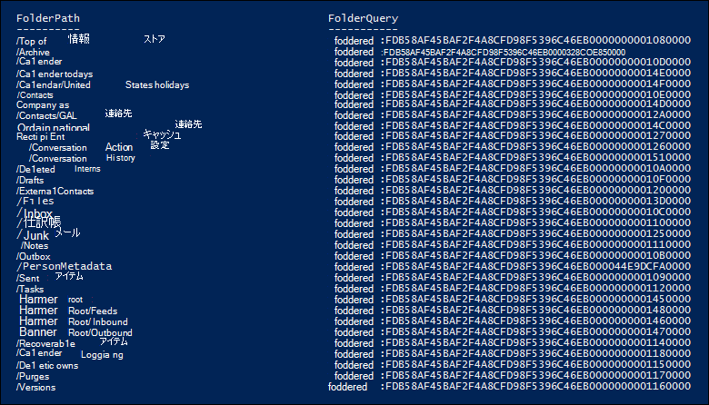
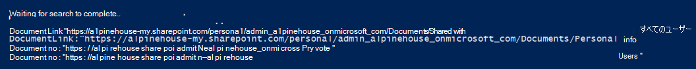

# <a name="use-content-search-for-targeted-collections"></a>対象のコレクションにコンテンツ検索を使用する

[!include[Purview banner](../includes/purview-rebrand-banner.md)]

Microsoft Purview コンプライアンス ポータルのコンテンツ検索ツールでは、EXCHANGE メールボックスまたはSharePoint サイトやOneDrive for Business サイト内の特定のフォルダーを検索するための直接の方法が UI に用意されていません。 ただし、実際の検索クエリ構文でサイトの電子メールまたはパス (DocumentLink) プロパティのフォルダー ID プロパティを指定することで、特定のフォルダー ( *ターゲット コレクション* と呼ばれる) を検索できます。 コンテンツ検索を使用して対象のコレクションを実行すると、ケースアイテムや特権アイテムに対応するアイテムが特定のメールボックスまたはサイト フォルダーに配置されていると確信できる場合に便利です。 この記事のスクリプトを使用して、メールボックス フォルダーのフォルダー ID、またはSharePointおよびOneDrive for Business サイト上のフォルダーのパス (DocumentLink) を取得できます。 次に、検索クエリのフォルダー ID またはパスを使用して、フォルダー内にあるアイテムを返すことができます。

> [!NOTE]
> SharePointサイトまたはOneDrive for Business サイト内のフォルダーにあるコンテンツを返すために、このトピックのスクリプトでは、Path プロパティの代わりに DocumentLink 管理プロパティを使用します。 DocumentLink プロパティは、フォルダー内のすべてのコンテンツを返すのに対し、Path プロパティは一部のメディア ファイルを返さないため、Path プロパティよりも堅牢です。

## <a name="before-you-run-a-targeted-collection"></a>ターゲット コレクションを実行する前に

- 手順 1 でスクリプトを実行するには、コンプライアンス ポータルの電子情報開示マネージャー役割グループのメンバーである必要があります。 詳細については、「[電子情報開示のアクセス許可を割り当てる](assign-ediscovery-permissions.md)」を参照してください。電子情報開示のアクセス許可を割り当てる」を参照してください。

- また、Exchange Online組織でメール受信者ロールを割り当てる必要もあります。 これは、スクリプトに含まれる **Get-MailboxFolderStatistics** コマンドレットを実行するために必要です。 既定では、メール受信者ロールは、Exchange Onlineの組織管理および受信者管理の役割グループに割り当てられます。 Exchange Onlineでのアクセス許可の割り当ての詳細については、「[ロール グループ メンバーの管理](/exchange/manage-role-group-members-exchange-2013-help)」を参照してください。 カスタム ロール グループを作成し、メール受信者ロールを割り当て、手順 1 でスクリプトを実行する必要があるメンバーを追加することもできます。 詳細については、「 [ロール グループの管理](/Exchange/permissions-exo/role-groups)」を参照してください。

- この記事のスクリプトでは、先進認証がサポートされています。 Microsoft 365またはMicrosoft 365 GCC組織の場合は、スクリプトをそのまま使用できます。 ドイツのOffice 365組織、Microsoft 365 GCC High 組織、または Microsoft 365 DoD 組織の場合は、スクリプトを編集して正常に実行する必要があります。 具体的には、行`Connect-ExchangeOnline`を編集し、*ExchangeEnvironmentName* パラメーター (および組織の種類に適した値) を使用して powerShell Exchange Online接続する必要があります。  また、行 `Connect-IPPSSession` を編集し、 *ConnectionUri* および *AzureADAuthorizationEndpointUri* パラメーター (および組織の種類に適した値) を使用して、Security & Compliance PowerShell に接続する必要があります。 詳細については、[PowerShell をExchange Onlineし](/powershell/exchange/connect-to-exchange-online-powershell#connect-to-exchange-online-powershell-without-using-mfa)、セキュリティ & [コンプライアンス PowerShell にConnectするConnectの例を参照](/powershell/exchange/connect-to-scc-powershell#connect-to-security--compliance-center-powershell-without-using-mfa)してください。

- スクリプトを実行するたびに、新しいリモート PowerShell セッションが作成されます。 つまり、使用可能なすべてのリモート PowerShell セッションを使用できます。 これを回避するには、次のコマンドを実行して、アクティブなリモート PowerShell セッションを切断します。

  ```powershell
  Get-PSSession | Remove-PSSession; Disconnect-ExchangeOnline
  ```

    詳細については、「[Exchange Online PowerShell への接続](/powershell/exchange/connect-to-exchange-online-powershell)」を参照してください。

- このスクリプトには、最小限のエラー処理が含まれています。 スクリプトの主な目的は、コンテンツ検索の検索クエリ構文でターゲット コレクションを実行するために使用できるメールボックス フォルダー ID またはサイト パスの一覧をすばやく表示することです。

- このトピックで提供されているサンプル スクリプトは、Microsoft 標準サポート プログラムまたはサービスではサポートされていません。 サンプル スクリプトは現状のまま提供され、いかなる保証も伴いません。 さらに、Microsoft は、商品性、特定目的への適合性の黙示の保証を含む、一切の黙示の保証をいたしかねます。 本サンプル スクリプトおよびドキュメントの使用または性能に起因するすべてのリスクは、お客様が負うものとします。 サンプル スクリプトおよびドキュメントを使用したこと、または使用できなかったことに伴って生じるいかなる損害 (業務利益の損失、業務の中断、業務情報の損失、金銭上の損失、その他一切の損害) についても、Microsoft、Microsoft に帰属する作者、スクリプトの作成、製造、または納入に関与したその他のすべての人員は、いかなる場合も責めを負わないものとします。

## <a name="step-1-run-the-script-to-get-a-list-of-folders-for-a-mailbox-or-site"></a>手順 1: スクリプトを実行して、メールボックスまたはサイトのフォルダーの一覧を取得する

この最初の手順で実行するスクリプトは、メールボックス フォルダー、SharePointフォルダー、OneDrive for Business フォルダーの一覧、および各フォルダーの対応するフォルダー ID またはパスを返します。 このスクリプトを実行すると、次の情報を求めるメッセージが表示されます。

- **電子メール アドレスまたはサイト URL**: Exchangeメールボックス フォルダーとフォルダー ID の一覧を返す保管担当者の電子メール アドレスを入力します。 または、指定したサイトのパスの一覧を返すSharePoint サイトまたはOneDrive for Business サイトの URL を入力します。 次に、いくつかの例を示します:

  - **Exchange**:`stacig@contoso.onmicrosoft.com`

  - **SharePoint**:`https://contoso.sharepoint.com/sites/marketing`

  - **OneDrive for Business**:`https://contoso-my.sharepoint.com/personal/stacig_contoso_onmicrosoft_com`

- **ユーザー資格情報**: スクリプトでは、資格情報を使用して、先進認証を使用して PowerShell またはセキュリティ & コンプライアンス PowerShell Exchange Onlineに接続します。 前述のように、このスクリプトを正常に実行するには、適切なアクセス許可を割り当てる必要があります。

メールボックス フォルダーまたはサイト ドキュメントリンク (パス) 名の一覧を表示するには:

1. 次のテキストをWindows PowerShell スクリプト ファイルに保存するには、.ps1 のファイル名サフィックスを使用します。たとえば、 `GetFolderSearchParameters.ps1`.

   ```powershell
   #########################################################################################################
   # This PowerShell script will prompt you for:                                #
   #    * Admin credentials for a user who can run the Get-MailboxFolderStatistics cmdlet in Exchange    #
   #      Online and who is an eDiscovery Manager in the compliance portal.            #
   # The script will then:                                            #
   #    * If an email address is supplied: list the folders for the target mailbox.            #
   #    * If a SharePoint or OneDrive for Business site is supplied: list the documentlinks (folder paths) #
   #    * for the site.                                                                                    #
   #    * In both cases, the script supplies the correct search properties (folderid: or documentlink:)    #
   #      appended to the folder ID or documentlink to use in a Content Search.                #
   # Notes:                                                #
   #    * For SharePoint and OneDrive for Business, the paths are searched recursively; this means the     #
   #      the current folder and all sub-folders are searched.                        #
   #    * For Exchange, only the specified folder will be searched; this means sub-folders in the folder    #
   #      will not be searched.  To search sub-folders, you need to use the specify the folder ID for    #
   #      each sub-folder that you want to search.                                #
   #    * For Exchange, only folders in the user's primary mailbox will be returned by the script.        #
   #########################################################################################################
   # Collect the target email address or SharePoint Url
   $addressOrSite = Read-Host "Enter an email address or a URL for a SharePoint or OneDrive for Business site"
   # Authenticate with Exchange Online and the compliance portal (Exchange Online Protection - EOP)
   if ($addressOrSite.IndexOf("@") -ige 0)
   {
      # List the folder Ids for the target mailbox
      $emailAddress = $addressOrSite
      # Connect to Exchange Online PowerShell
      if (!$ExoSession)
      {
          Import-Module ExchangeOnlineManagement
          Connect-ExchangeOnline -ShowBanner:$false -CommandName Get-MailboxFolderStatistics
      }
      $folderQueries = @()
      $folderStatistics = Get-MailboxFolderStatistics $emailAddress
      foreach ($folderStatistic in $folderStatistics)
      {
          $folderId = $folderStatistic.FolderId;
          $folderPath = $folderStatistic.FolderPath;
          $encoding= [System.Text.Encoding]::GetEncoding("us-ascii")
          $nibbler= $encoding.GetBytes("0123456789ABCDEF");
          $folderIdBytes = [Convert]::FromBase64String($folderId);
          $indexIdBytes = New-Object byte[] 48;
          $indexIdIdx=0;
          $folderIdBytes | select -skip 23 -First 24 | %{$indexIdBytes[$indexIdIdx++]=$nibbler[$_ -shr 4];$indexIdBytes[$indexIdIdx++]=$nibbler[$_ -band 0xF]}
          $folderQuery = "folderid:$($encoding.GetString($indexIdBytes))";
          $folderStat = New-Object PSObject
          Add-Member -InputObject $folderStat -MemberType NoteProperty -Name FolderPath -Value $folderPath
          Add-Member -InputObject $folderStat -MemberType NoteProperty -Name FolderQuery -Value $folderQuery
          $folderQueries += $folderStat
      }
      Write-Host "-----Exchange Folders-----"
      $folderQueries |ft
   }
   elseif ($addressOrSite.IndexOf("http") -ige 0)
   {
      $searchName = "SPFoldersSearch"
      $searchActionName = "SPFoldersSearch_Preview"
      # List the folders for the SharePoint or OneDrive for Business Site
      $siteUrl = $addressOrSite
      # Connect to Security & Compliance PowerShell
      if (!$SccSession)
      {
          Import-Module ExchangeOnlineManagement
          Connect-IPPSSession
      }
      # Clean-up, if the script was aborted, the search we created might not have been deleted.  Try to do so now.
      Remove-ComplianceSearch $searchName -Confirm:$false -ErrorAction 'SilentlyContinue'
      # Create a Content Search against the SharePoint Site or OneDrive for Business site and only search for folders; wait for the search to complete
      $complianceSearch = New-ComplianceSearch -Name $searchName -ContentMatchQuery "contenttype:folder" -SharePointLocation $siteUrl
      Start-ComplianceSearch $searchName
      do{
          Write-host "Waiting for search to complete..."
          Start-Sleep -s 5
          $complianceSearch = Get-ComplianceSearch $searchName
      }while ($complianceSearch.Status -ne 'Completed')
      if ($complianceSearch.Items -gt 0)
      {
          # Create a Compliance Search Action and wait for it to complete. The folders will be listed in the .Results parameter
          $complianceSearchAction = New-ComplianceSearchAction -SearchName $searchName -Preview
          do
          {
              Write-host "Waiting for search action to complete..."
              Start-Sleep -s 5
              $complianceSearchAction = Get-ComplianceSearchAction $searchActionName
          }while ($complianceSearchAction.Status -ne 'Completed')
          # Get the results and print out the folders
          $results = $complianceSearchAction.Results
          $matches = Select-String "Data Link:.+[,}]" -Input $results -AllMatches
          foreach ($match in $matches.Matches)
          {
              $rawUrl = $match.Value
              $rawUrl = $rawUrl -replace "Data Link: " -replace "," -replace "}"
              Write-Host "DocumentLink:""$rawUrl"""
          }
      }
      else
      {
          Write-Host "No folders were found for $siteUrl"
      }
      Remove-ComplianceSearch $searchName -Confirm:$false -ErrorAction 'SilentlyContinue'
   }
   else
   {
      Write-Error "Couldn't recognize $addressOrSite as an email address or a site URL"
   }
   ```

2. ローカル コンピューターでWindows PowerShellを開き、スクリプトを保存したフォルダーに移動します。

3. スクリプトを実行します。例えば：

   ```powershell
   .\GetFolderSearchParameters.ps1
   ```

4. スクリプトの入力を求める情報を入力します。

    このスクリプトには、指定したユーザーのメールボックス フォルダーまたはサイト フォルダーの一覧が表示されます。 フォルダー ID またはドキュメントリンク名をコピーし、手順 2. の検索クエリに貼り付けることができるように、このウィンドウを開いたままにします。

    > [!TIP]
    > コンピューター画面にフォルダーの一覧を表示する代わりに、スクリプトの出力をテキスト ファイルに再送できます。 このファイルは、スクリプトが配置されているフォルダーに保存されます。 たとえば、スクリプト出力をテキスト ファイルにリダイレクトするには、手順 3 で次のコマンドを実行します。  `.\GetFolderSearchParameters.ps1 > StacigFolderIds.txt` 次に、フォルダー ID またはドキュメントリンクをファイルからコピーして検索クエリで使用できます。

### <a name="script-output-for-mailbox-folders"></a>メールボックス フォルダーのスクリプト出力

メールボックス フォルダー ID を取得する場合、スクリプトは powerShell Exchange Online接続し、**Get-MailboxFolderStatisics** コマンドレットを実行して、指定したメールボックスのフォルダーの一覧を表示します。 メールボックス内のすべてのフォルダーについて、スクリプトは **FolderPath** 列のフォルダー名と **FolderQuery** 列のフォルダー ID を表示します。 さらに、スクリプトは **folderId** のプレフィックス (メールボックス プロパティの名前) をフォルダー ID に追加します。 **folderid** プロパティは検索可能なプロパティであるため、手順 2 の検索クエリで使用`folderid:<folderid>`してそのフォルダーを検索します。 

> [!IMPORTANT]
> この記事のスクリプトには、 **Get-MailboxFolderStatistics** によって返される 64 文字のフォルダー ID 値を、検索用にインデックス付けされた同じ 48 文字の形式に変換するエンコード ロジックが含まれています。 PowerShell で **Get-MailboxFolderStatistics** コマンドレットを実行して (この記事のスクリプトを実行する代わりに) フォルダー ID を取得した場合、そのフォルダー ID 値を使用する検索クエリは失敗します。 コンテンツ検索で使用できる正しく書式設定されたフォルダー ID を取得するには、スクリプトを実行する必要があります。

メールボックス フォルダーのスクリプトによって返される出力の例を次に示します。



手順 2 の例は、ユーザーの回復可能なアイテム フォルダー内の Purges サブフォルダーを検索するために使用されるクエリを示しています。

### <a name="script-output-for-site-folders"></a>サイト フォルダーのスクリプト出力

SharePointサイトまたはOneDrive for Business サイトから **documentlink** プロパティのパスを取得する場合、スクリプトは Security & Compliance PowerShell に接続し、サイトでフォルダーを検索する新しいコンテンツ検索を作成し、指定したサイトにあるフォルダーの一覧を表示します。 スクリプトには各フォルダーの名前が表示され、 **documentlink** のプレフィックスがフォルダー URL に追加されます。 **documentlink** プロパティは検索可能なプロパティであるため、手順 2. の検索クエリで property:value ペアを使用`documentlink:<path>`してそのフォルダーを検索します。 このスクリプトには、最大 100 個のサイト フォルダーが表示されます。 100 を超えるサイト フォルダーがある場合は、最新のフォルダーが表示されます。

サイト フォルダーのスクリプトによって返される出力の例を次に示します。



## <a name="step-2-use-a-folder-id-or-documentlink-to-perform-a-targeted-collection"></a>手順 2: フォルダー ID または documentlink を使用してターゲット コレクションを実行する

スクリプトを実行して特定のユーザーのフォルダー ID またはドキュメント リンクの一覧を収集したら、次の手順でコンプライアンス ポータルに移動し、新しいコンテンツ検索を作成して特定のフォルダーを検索します。 検索クエリで、コンテンツ検索キーワード ボックスで構成する (`documentlink:<path>`**または、New-ComplianceSearch** コマンドレットを使用する場合は *ContentMatchQuery* パラメーターの値として) プロパティ:値のペアを使用`folderid:<folderid>`します。 または`documentlink`プロパティを他の`folderid`検索パラメーターまたは検索条件と組み合わせることができます。 クエリに  `folderid` or  `documentlink` プロパティのみを含める場合は、指定したフォルダー内にあるすべてのアイテムが検索によって返されます。

1. <https://compliance.microsoft.com>手順 1. のスクリプトの実行に使用したアカウントと資格情報を使用してサインインします。

2. コンプライアンス センターの左側のウィンドウで、[ **すべての** > **コンテンツ検索** を表示] をクリックし、[ **新しい検索**] をクリックします。

3. [ **キーワード** ] ボックスに `folderid:<folderid>` 、手順 1. のスクリプトによって返された値を  `documentlink:<path>/*` 貼り付けます。

    たとえば、次のスクリーンショットのクエリでは、ユーザーの回復可能なアイテム フォルダーの Purges サブフォルダー内のアイテムが検索されます (Purges サブフォルダーのプロパティの `folderid` 値は、手順 1 のスクリーンショットに示されています)。

    
    > [!IMPORTANT]
    > documentlink 検索では、末尾を使用する必要があります  `asterisk '/*'`。  

4. [ **場所]** で [ **特定の場所** ] を選択し、[ **変更**] をクリックします。

5. メールボックス フォルダーとサイト フォルダーのどちらを検索しているかに基づいて、次のいずれかの操作を行います。

    - **Exchangeメール** の横にある **[ユーザー、グループ、またはチームの選択**] をクリックし、手順 1 でスクリプトを実行したときに指定したメールボックスを追加します。

      または

    - **SharePoint サイト** の横にある [**サイトの選択**] をクリックし、手順 1 でスクリプトを実行したときに指定したのと同じサイト URL を追加します。

6. 検索するコンテンツの場所を保存したら、[ **保存&実行**] をクリックし、コンテンツ検索の名前を入力し、[ **保存]** をクリックして対象のコレクション検索を開始します。

### <a name="examples-of-search-queries-for-targeted-collections"></a>ターゲット コレクションの検索クエリの例

検索クエリでプロパティを`documentlink`使用して`folderid`ターゲット コレクションを実行する例をいくつか示します。 プレースホルダーは、領域を  `folderid:<folderid>` 節約するために使用されます  `documentlink:<path>` 。

- この例では、3 つの異なるメールボックス フォルダーを検索します。 同様のクエリ構文を使用して、ユーザーの回復可能なアイテム フォルダー内の非表示フォルダーを検索できます。

  ```powershell
  folderid:<folderid> OR folderid:<folderid> OR folderid:<folderid>
  ```

- 次の使用例は、正確な語句を含むアイテムをメールボックス フォルダーで検索します。

  ```powershell
  folderid:<folderid> AND "Contoso financial results"
  ```

- 次の使用例は、サイト フォルダー (およびサブフォルダー) で、タイトルに "NDA" という文字が含まれているドキュメントを検索します。

  ```powershell
  documentlink:"<path>/*" AND filename:nda
  ```

- 次の使用例は、サイト フォルダー (および任意のサブフォルダー) で、日付範囲内で変更されたドキュメントを検索します。

  ```powershell
  documentlink:"<path>/*" AND (lastmodifiedtime>=01/01/2017 AND lastmodifiedtime<=01/21/2017)
  ```

## <a name="more-information"></a>詳細情報

この記事のスクリプトを使用してターゲット コレクションを実行する場合は、次の点に注意してください。

- スクリプトは結果からフォルダーを削除しません。 そのため、結果に一覧表示されるフォルダーの中には、システムによって生成されたコンテンツが含まれているか、メールボックス アイテムではなくサブフォルダーのみを含んでいるため、検索できない (または 0 個のアイテムを返す) 場合があります。

- このスクリプトは、ユーザーのプライマリ メールボックスのフォルダー情報のみを返します。 ユーザーのアーカイブ メールボックス内のフォルダーに関する情報は返されません。 ユーザーのアーカイブ メールボックス内のフォルダーに関する情報を返すには、スクリプトを編集できます。 これを行うには、行`$folderStatistics = Get-MailboxFolderStatistics $emailAddress``$folderStatistics = Get-MailboxFolderStatistics $emailAddress -Archive`を変更し、編集したスクリプトを保存して実行します。 この変更により、ユーザーのアーカイブ メールボックス内のフォルダーとサブフォルダーのフォルダー ID が返されます。 アーカイブ メールボックス全体を検索するには、すべてのフォルダー ID プロパティ:値のペアを検索クエリの演算子に `OR` 接続できます。

- メールボックス フォルダーを検索する場合、指定したフォルダー (プロパティ `folderid` によって識別) のみが検索されます。サブフォルダーは検索されません。 サブフォルダーを検索するには、検索するサブフォルダーのフォルダー ID を使用する必要があります。

- サイト フォルダーを検索すると、フォルダー (その `documentlink` プロパティによって識別されます) とすべてのサブフォルダーが検索されます。

- 検索クエリでプロパティのみを指定した `folderid` 検索の結果をエクスポートする場合は、最初のエクスポート オプション (認識されない形式のアイテムを除くすべてのアイテムが暗号化されているか、他の理由でインデックスが作成されていない) を選択できます。 フォルダー ID は常にインデックスが作成されるため、フォルダー内のすべてのアイテムは、インデックス作成の状態に関係なく常にエクスポートされます。
