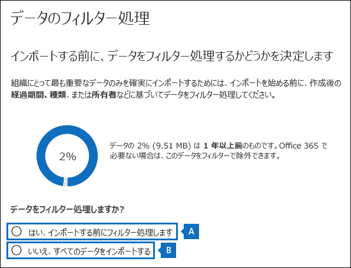
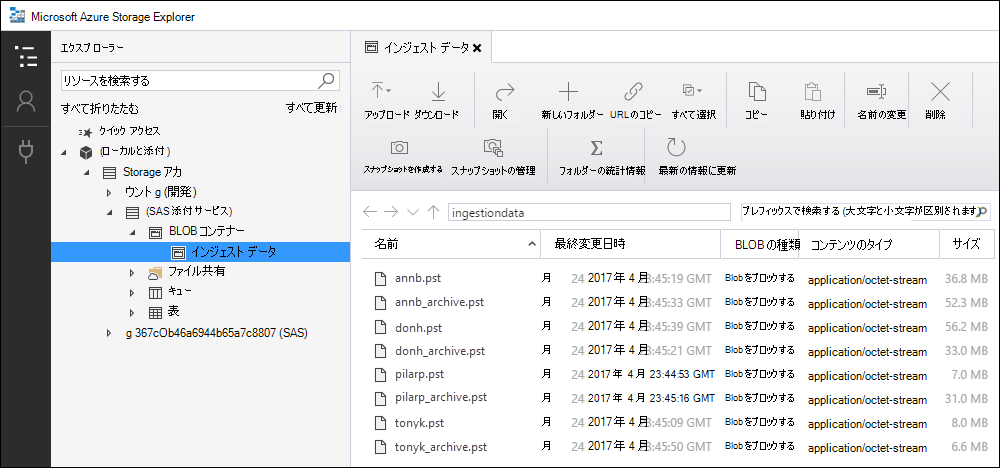

# <a name="use-drive-shipping-to-import-your-organizations-pst-files"></a>ドライブの発送を使用して組織の PST ファイルをインポートする

**この記事は管理者向けです。PST ファイルを自分のメールボックスにインポートしようとしていますか?[Outlook .pst ファイルから電子メール、連絡先、予定表をインポートする方法に関するページを](https://go.microsoft.com/fwlink/p/?LinkID=785075)参照してください**
   
Office 365 インポート サービスを使用して、PST ファイルをユーザーメールボックスに一括インポートします。 ドライブ送付とは、PST ファイルをハード ディスク ドライブにコピーし、Microsoft にドライブを物理的に送付することを意味します。 Microsoft がハード ドライブを受け取ると、データ センターの担当者は、データをハード ドライブから Microsoft クラウドのストレージ領域にコピーします。 次に、インポートするデータを制御するフィルターを設定することで、ターゲット メールボックスにインポートされた PST データをトリミングできます。 インポート ジョブを開始すると、Import サービスによって、ストレージ領域からユーザー メールボックスに PST データがインポートされます。 ドライブ配布を使用して PST ファイルをユーザーメールボックスにインポートすることは、組織の電子メールをOffice 365に移行する 1 つの方法です。
  
ドライブ配布を使用して PST ファイルを Microsoft 365 メールボックスにインポートするために必要な手順を次に示します。
  
[手順 1: PST インポート ツールをダウンロードする](#step-1-download-the-pst-import-tool)

[手順 2: PST ファイルをハード ドライブにコピーする](#step-2-copy-the-pst-files-to-the-hard-drive)

[手順 3: PST インポート マッピング ファイルを作成する](#step-3-create-the-pst-import-mapping-file)

[手順 4:Office 365 で PST インポート ジョブを作成する](#step-4-create-a-pst-import-job-in-office-365)

[手順 5:Microsoft にハード ドライブを送付する](#step-5-ship-the-hard-drive-to-microsoft)

[手順 6: データをフィルター処理して、PST インポート ジョブを開始する](#step-6-filter-data-and-start-the-pst-import-job)
  
> [!IMPORTANT]
> インポート ツールをダウンロードするには、手順 1 を 1 回実行する必要があります。 これらの手順を実行したら、Microsoft にハード ドライブを発送するたびに、手順 2 ~ 手順 6 に従います。 
  
ドライブ配送を使用して PST ファイルをOffice 365にインポートする方法についてよく寄せられる質問については、「[ドライブ配送を使用して PST ファイルをインポートする方法に関する FAQ」を](./faqimporting-pst-files-to-office-365.yml#using-drive-shipping-to-import-pst-files)参照してください。 
  
## <a name="before-you-import-pst-files"></a>PST ファイルをインポートする前に

- Microsoft Purview コンプライアンス ポータルでインポート ジョブを作成し、ユーザー メールボックスに PST ファイルをインポートするには、Exchange Online で Mailbox Import Export 役割が割り当てられている必要があります。既定では、Exchange Online では、この役割はいずれの役割グループにも割り当てられていません。Mailbox Import Export 役割は Organization Management 役割グループに追加できます。または、役割グループを作成し、Mailbox Import Export 役割を割り当て、自分をメンバーとして追加できます。詳細については、「[役割グループの管理](/Exchange/permissions-exo/role-groups)」の「役割グループに役割を追加する」または「役割グループを作成する」のセクションを参照してください。

    メールボックスのインポートとエクスポートの役割に加えて、Exchange Online でメールの受信者の役割も割り当てる必要があります。 既定では、この役割は Exchange Online の Organization Management 役割グループと Recipient Management 役割グループに割り当てられます。

    > [!TIP]
    > PST ファイルを Office 365 にインポートするための新しい役割グループを Exchange Online で作成することを検討してください。PST ファイルのインポートに必要な最小限の特権レベルについては、メールボックスのインポート エクスポートとメール受信者の役割を新しい役割グループに割り当ててから、メンバーを追加します。
  
- ハード ドライブにコピーする PST ファイルは、組織内のファイル サーバーまたは共有フォルダーに保存する必要があります。 手順 2 では、このファイル サーバーまたは共有フォルダーに保存されている PST ファイルをハード ドライブにコピーする Azure Import Export ツール (WAImportExport.exe) を実行します。

- PST ファイルが大きい場合、PST のインポート プロセスのパフォーマンスに影響を与える場合があります。 そのため、手順 2 でハード ドライブにコピーする各 PST ファイルは 20 GB 以下にすることをお勧めします。

- Office 365 インポート サービスで使用できるのは、2.5 インチのソリッド ステート ドライブ (SSD) または 2.5 インチまたは 3.5 インチの SATA II/III 内部ハード ドライブのみです。 最大で 10 TB のハード ドライブを使用できます。 インポート ジョブでは、ハード ドライブの最初のデータ ボリュームのみが処理されます。 このデータ ボリュームは、NTFS でフォーマットする必要があります。 データをハード ドライブにコピーする場合は、2.5 インチ SSD または 2.5 インチまたは 3.5 インチ SATA II/III コネクタを使用して直接接続するか、外部の 2.5 インチ SSD または 2.5 インチまたは 3.5 インチ SATA II/III USB アダプターを使用して外部に接続できます。
    
    > [!IMPORTANT]
    > Office 365 インポート サービスでは、USB アダプターが内蔵されている外付けハード ドライブはサポートされていません。 また、外部ハード ドライブのケース内にあるディスクは使用できません Please don't ship external hard drives. 
  
- PST ファイルをコピーするハード ドライブは、BitLocker で暗号化する必要があります。 手順 2 で実行する WAImportExport.exe ツールを使用すると、BitLocker をセットアップできます。 また、Microsoft データ センターの担当者がドライブにアクセスして PST ファイルを Microsoft クラウドの Azure Storage 領域にアップロードするために使用する BitLocker 暗号化キーも生成されます。
    
- ドライブの発送は、Microsoft Enterprise Agreement (EA) から入手できます。 Microsoft Products and Services Agreement (MPSA) では、ドライブ送付はご利用いただけません。
    
- ドライブ送付で PST ファイルを Microsoft 365 メールボックスにインポートする費用は、データ 1 GB 当たり $2 USD です。 たとえば、1,000 GB (1 TB) の PST ファイルを含むハード ディスク ドライブを発送する場合のコストは、2,000 米ドルです。 インポート手数料は、パートナーと分担して支払うことができます。 パートナーを探す方法については、「[Microsoft パートナーまたは販売店を探す](../admin/manage/find-your-partner-or-reseller.md)」を参照してください。
    
- お客様またはお客様の組織は、FedEx または DHL のアカウントを持っている必要があります。 
    
  - 米国、ブラジル、ヨーロッパの組織には FedEx アカウントが必要です。
    
  - 東アジア、東南アジア、日本、韓国、オーストラリアの組織には、DHL アカウントが必要です。
    
    Microsoft では、このアカウントを使用 (および課金) して、ハード ドライブを返送します。
    
- Microsoft に出荷するハード ドライブは、国際境界を越える可能性があります。 この場合、お客様は、該当する法律に従って、ハード ドライブとそれに含まれるデータがインポートまたはエクスポートされることを保証する責任があります。 ハード ドライブを送付する前に、指定された Microsoft データ センターにハード ドライブとデータを合法的に送付できるか法律顧問と一緒に確認してください。 これにより、タイムリーに Microsoft に届きます。
    
- この手順では、BitLocker 暗号化キーをコピーして保存します。 パスワードやその他のセキュリティ関連情報を保護するように、これらのキーを保護するための予防策を必ず講じてください。 たとえば、パスワードで保護された Microsoft Word 文書に保存する、または暗号化された USB ドライブに保存することができます。 これらのキーの例については、「 [詳細情報](#more-information) 」セクションを参照してください。 
    
- PST ファイルを Microsoft 365 メールボックスにインポートすると、メールボックスの保持保持設定が無期限に有効になります。 つまり、メールボックスに割り当てられたアイテム保持ポリシーは、アイテム保持ホールドをオフにするか、またはホールドをオフにする日付を設定するまで処理されません。 このようにした理由は次のとおりです。 メールボックスにインポートされたメッセージは古くなると、完全に削除 (パージ) される可能性があります。これは、メッセージの保持期限がメールボックスに対して構成されたアイテム保持設定に基づいているためです。 メールボックスに対してアイテム保持ホールドが設定されると、メールボックスの所有者は、新たにインポートされたメッセージを管理する時間、またはメールボックスのアイテム保持設定を変更する時間を確保できます。 保持保持の管理に関する推奨事項については、「 [詳細情報](#more-information) 」セクションを参照してください。 
    
- 既定では、Microsoft 365 メールボックスで受信できるメッセージの最大サイズは 35 MB です。 これは、メールボックスの *MaxReceiveSize* プロパティの既定値が 35 MB に設定されているためです。 ただし、Microsoft 365 のメッセージ受信最大サイズの上限は 150 MB です。 そのため、35 MB より大きいアイテムを含む PST ファイルをインポートすると、Office 365 インポート サービスにより、対象メールボックスの *MaxReceiveSize* プロパティの値が 150 MB に自動的に変更されます。 これにより、最大 150 MB のメッセージをユーザーのメールボックスにインポートできます。 
    
    > [!TIP]
    > メッセージ受信サイズを識別するには、Exchange Online PowerShell で次のコマンドを実行します: `Get-Mailbox <user mailbox> | FL MaxReceiveSize` 
  
- PST ファイルを Office 365 の非アクティブなメールボックスにインポートできます。 PST インポート マッピング ファイルの `Mailbox` パラメーターで非アクティブなメールボックスの GUID を指定して、この操作を行います。 詳細については、「 [手順 3: PST インポート マッピング ファイルを作成](#step-3-create-the-pst-import-mapping-file) する」を参照してください。 
    
- Exchange ハイブリッド展開では、オンプレミスのプライマリ メールボックスを持つユーザーのために、PST ファイルをクラウド ベースのアーカイブ メールボックスにインポートすることができます。 PST インポート マッピング ファイルに次を指定して、この操作を行います。
    
  - `Mailbox` パラメーターに、ユーザーのオンプレミス メールボックス用のメール アドレスを指定します。 
    
  - `IsArchive` パラメーターに、**TRUE** 値を指定します。 
    
    詳細については、「 [手順 3: PST インポート マッピング ファイルを作成](#step-3-create-the-pst-import-mapping-file) する」を参照してください。 

## <a name="step-1-download-the-pst-import-tool"></a>手順 1: PST インポート ツールをダウンロードする

最初の手順では、ツールをダウンロードし、手順 2 で PST ファイルをハード ドライブにコピーします。
  
> [!IMPORTANT]
> ドライブ配布方法を使用して PST ファイルを正常にインポートするには、Azure Import/Export ツール バージョン 1 (WAimportExportV1) を使用する必要があります。 Azure Import/Export ツールのバージョン 2 はサポートされておらず、それを使用すると、インポート ジョブのハード ドライブの準備が正しくなくなります。 この手順の手順に従って、Microsoft Purview コンプライアンス ポータルから Azure Import/Export ツールを必ずダウンロードしてください。 
  
1. <https://compliance.microsoft.com> に移動し、組織の管理者アカウントの資格情報を使用してサインインします。

2. コンプライアンス ポータルの左側のナビゲーション ウィンドウで、[ **データ ライフサイクル管理** \> **のインポート**] をクリックします。
    
    > [!NOTE]
    > 前に説明したように、コンプライアンス ポータルの **[インポート** ] ページにアクセスするための適切なアクセス許可を割り当てる必要があります。
  
3. [ **インポート** ] タブで、[追加] アイコンをクリックします  **新しいインポート ジョブ**。
    
4. インポート ジョブ ウィザードで、PST インポート ジョブの名前を入力し、[ **次へ**] をクリックします。 小文字の英字、数字、ハイフン、およびアンダー スコアを使用します。 大文字を使用したり、名前にスペースを含めたりすることはできません。
    
5. [ **インポート ジョブの種類の選択]** ページで、[ **ハード ドライブを物理的な場所のいずれかに発送** する] をクリックし、[ **次へ**] をクリックします。
    
    ![[ハード ドライブを物理的な場所のいずれかに出荷する] をクリックして、ドライブ発送インポート ジョブを作成します。](../media/1584fdc5-cd4c-4e47-932e-db6c8e07f5f8.png)
  
6. [ **データのインポート]** ページで、次の操作を行います。     
    
    **Azure Import/Export ツールをダウンロード** して、Azure Import/Export (バージョン 1) ツールをダウンロードしてインストールします。
    
    - ポップアップ ウィンドウで、[**名前を付けて保存]** \> をクリックして、WaImportExportV1.zip ファイルをローカル コンピューター上のフォルダーに保存します。
    
    - WaImportExportV1.zip ファイルを抽出します。
    
7. [ **キャンセル] を** クリックしてウィザードを閉じます。
    
    手順 4. で **インポート** ジョブを作成すると、コンプライアンス ポータルの [インポート] ページに戻ります。

## <a name="step-2-copy-the-pst-files-to-the-hard-drive"></a>手順 2: PST ファイルをハード ドライブにコピーする

次の手順で、WAImportExport.exe ツールを使用して、PST ファイルをハード ドライブにコピーします。 このツールを使用して、ハード ドライブを BitLocker で暗号化して、PST をハード ドライブにコピーし、コピー プロセスに関する情報を保存するジャーナル ファイルを作成します。 この手順を完了するには、PST ファイルを組織内のファイル共有またはファイル サーバーに配置する必要があります。 これは、次の手順でソース ディレクトリと呼ばれます。

 前述のように、ハード ドライブにコピーする各 PST ファイルは、20 GB を超えてはなりません。 PST ファイルが 20 GB を超える場合、手順 6 で開始する PST インポートプロセスのパフォーマンスに影響を与える可能性があります。
  
> [!IMPORTANT]
> ハード ドライブで初めて WAImportExport.exe ツールを実行した後は、実行するたびに異なる構文を使用する必要があります。 この構文については、この手順の手順 4 で PST ファイルをハード ドライブにコピーする方法について説明します。
  
1. ローカル コンピューター上でコマンド プロンプトを開く。
    
    > [!TIP]
    > 管理者としてコマンド プロンプトを実行する場合 (コマンド プロンプトを開く際に [管理者として実行] を選択する)、コマンド プロンプト ウィンドウにエラー メッセージが表示されます。これにより、WAImportExport.exe ツールの実行に関する問題のトラブルシューティングが行えます。
  
2. 手順 1 で WAImportExport ツールをインストールしたディレクトリに移動する。
3. 初めて WAImportExport.exe を使用してハード ドライブに PST ファイルをコピーする場合は、次のコマンドを実行する。

    ```powershell
    WAImportExport.exe PrepImport /j:<Name of journal file> /t:<Drive letter> /id:<Name of session> /srcdir:<Location of PST files> /dstdir:<PST file path> /blobtype:BlockBlob /encrypt /logdir:<Log file location>
    ```

    次の表は、パラメーターとそれに必要な値を説明したものです。
    
    |**パラメーター**|**Description**|**例**|
    |:-----|:-----|:-----|
    | `/j:` <br/> |ジャーナル ファイルの名前を指定します。このファイルは、WAImportExport.exe ツールがあるフォルダーと同じフォルダーに保存されます。Microsoft に送付するハード ドライブごとに 1 つのジャーナル ファイルが必要です。WAImportTool.exe を実行して PST ファイルをハード ドライブにコピーするたびに、そのドライブのジャーナル ファイルに情報が追加されます。 
  <br/> Microsoft データ センターの担当者は、履歴ファイル内の情報を使用して、ハード ドライブを手順 4. で作成したインポート ジョブに関連付け、Microsoft クラウドの Azure Storage 領域に PST ファイルをアップロードします。  <br/> | `/j:PSTHDD1.jrn` <br/> |
    | `/t:` <br/> |ローカル コンピューターに接続されている場合は、ハード ドライブのドライブ文字を指定します。  <br/> | `/t:h` <br/> |
    | `/id:` <br/> |コピー セッションの名前を指定します。WAImportExport.exe ツールを実行してファイルをハード ドライブにコピーするたびに、セッションが定義されます。PST ファイルは、このパラメーターで指定されたセッション名の名前が付けられたフォルダーにコピーされます。   <br/> | `/id:driveship1` <br/> |
    | `/srcdir:` <br/> |セッション中にコピーされる PST ファイルを含む組織内のソース ディレクトリを指定します。 このパラメーターの値は必ず二重引用符 (" ") で囲むようにしてください。  <br/> | `/srcdir:"\\FILESERVER01\PSTs"` <br/> |
    | `/dstdir:` <br/> |PST がアップロードされる Microsoft クラウドの Azure Storage 領域の宛先ディレクトリを指定します。 値  `ingestiondata/`を使用する必要があります。 このパラメーターの値は必ず二重引用符 (" ") で囲むようにしてください。  <br/> 必要に応じて、このパラメーターの値に追加のファイル パスを追加することもできます。 たとえば、ハード ドライブ上のソース ディレクトリのファイル パス (URL 形式に変換) を使用できます。これは、パラメーターで  `/srcdir:` 指定されます。 たとえば、. `\\FILESERVER01\PSTs` `FILESERVER01/PSTs` この場合も、ファイル パスに含める  `ingestiondata` 必要があります。 したがって、この例では、パラメーターの  `/dstdir:` 値は次のようになります  `"ingestiondata/FILESERVER01/PSTs"`。  <br/> 同じファイル名の PST ファイルがある場合は、追加のファイルのパスを追加する理由の 1 つになります。  <br/> > [!NOTE]> 省略可能なパス名を含める場合、Azure Storage 領域にアップロードされた後の PST ファイルの名前空間には、PST ファイルのパス名と名前が含まれます。たとえば、. `FILESERVER01/PSTs/annb.pst` パス名を含めない場合、名前空間は PST ファイル名のみです。たとえば.`annb.pst`           | `/dstdir:"ingestiondata/"` <br/> または  <br/>  `/dstdir:"ingestiondata/FILESERVER01/PSTs"` <br/> |
    | `/blobtype:` <br/> |PST ファイルをインポートする Azure Storage 領域の BLOB の種類を指定します。 PST ファイルをインポートする場合は、 **値 BlockBlob** を使用します。 このパラメーターは必須です。   <br/> | `/blobtype:BlockBlob` <br/> |
    | `/encrypt` <br/> |このスイッチは、ハード ドライブの BitLocker を有効にします。 このパラメーターは、WAImportExport.exe ツールを初めて実行する際に必要です。  <br/> BitLocker 暗号化キーは、パラメーターを使用する場合に作成された履歴ファイルとログ ファイルに  `/logfile:` コピーされます。 前述のように、ジャーナル ファイルは、WAImportExport.exe ツールがあるフォルダーと同じフォルダーに保存されます。  <br/> | `/encrypt` <br/> |
    | `/logdir:` <br/> |この省略可能なパラメーターは、ログ ファイルの保存先のフォルダーを指定します。 指定しない場合、ログ ファイルは、WAImportExport.exe ツールが配置されているのと同じフォルダーに保存されます。 このパラメーターの値は必ず二重引用符 (" ") で囲むようにしてください。  <br/> | `/logdir:"c:\users\admin\desktop\PstImportLogs"` <br/> |
   
    各パラメーターの実際の値を使用する WAImportExport.exe ツールの構文の例を以下に示します。
    
    ```powershell
    WAImportExport.exe PrepImport /j:PSTHDD1.jrn /t:f /id:driveship1 /srcdir:"\\FILESERVER01\PSTs" /dstdir:"ingestiondata/" blobtype:BlockBlob /encrypt /logdir:"c:\users\admin\desktop\PstImportLogs"
    ```

    コマンドを実行すると、ハード ドライブへの PST ファイルのコピーの進行状況を示す状態メッセージが表示されます。最終の状態メッセージは、正常にコピーされたファイルの合計数を示しています。 
    
4. このコマンドを、WAImportExport.ext ツールを 2 回目以降に実行するたびに実行して、PST ファイルを同じハード ドライブにコピーする。

    ```powershell
    WAImportExport.exe PrepImport /j:<Name of journal file> /id:<Name of new session> /srcdir:<Location of PST files> /dstdir:<PST file path> /blobtype:BlockBlob 
    ```

    以降のセッションを実行して PST ファイルを同じハード ドライブにコピーするための構文の例は、以下の通りです。  

    ```powershell
    WAImportExport.exe PrepImport /j:PSTHDD1.jrn /id:driveship2 /srcdir:"\\FILESERVER01\PSTs\SecondBatch" /dstdir:"ingestiondata/" /blobtype:BlockBlob
    ```

## <a name="step-3-create-the-pst-import-mapping-file"></a>手順 3: PST インポート マッピング ファイルを作成する

Microsoft データ センターの担当者がハード ドライブから Azure Storage 領域に PST ファイルをアップロードすると、インポート サービスは PST ファイルのインポート先となるユーザー メールボックスを指定する、コンマ区切り値 (CSV) ファイルである PST インポート マッピング ファイルの情報を使用します。 PST インポート ジョブを作成する場合は、次の手順でこの CSV ファイルを送信します。
  
1. [PST インポート マッピング ファイルのコピーをダウンロードします](https://go.microsoft.com/fwlink/p/?LinkId=544717)。
    
2. CSV ファイルを開くか、ローカル コンピューターに保存します。次の例は、完了した PST インポートのマッピング ファイル (メモ帳で開いた) を示しています。Microsoft Excel を使って CSV ファイルを編集するほうが、はるかに簡単です。

    ```text
    Workload,FilePath,Name,Mailbox,IsArchive,TargetRootFolder,ContentCodePage,SPFileContainer,SPManifestContainer,SPSiteUrl
    Exchange,FILESERVER01/PSTs,annb.pst,annb@contoso.onmicrosoft.com,FALSE,/,,,,
    Exchange,FILESERVER01/PSTs,annb_archive.pst,annb@contoso.onmicrosoft.com,TRUE,/ImportedPst,,,,
    Exchange,FILESERVER01/PSTs,donh.pst,donh@contoso.onmicrosoft.com,FALSE,/,,,,
    Exchange,FILESERVER01/PSTs,donh_archive.pst,donh@contoso.onmicrosoft.com,TRUE,/ImportedPst,,,,
    Exchange,FILESERVER01/PSTs,pilarp.pst,pilarp@contoso.onmicrosoft.com,FALSE,/,,,,
    Exchange,FILESERVER01/PSTs,pilarp_archive.pst,pilarp@contoso.onmicrosoft.com,TRUE,/ImportedPst,,,,
    Exchange,,tonyk.pst,tonyk@contoso.onmicrosoft.com,FALSE,/,,,,
    Exchange,,tonyk_archive.pst,tonyk@contoso.onmicrosoft.com,TRUE,,,,,
    Exchange,,zrinkam.pst,zrinkam@contoso.onmicrosoft.com,FALSE,/,,,,
    Exchange,,zrinkam_archive.pst,zrinkam@contoso.onmicrosoft.com,TRUE,,,,,
    ```

    CSV ファイルの先頭行やヘッダー行には、PST ファイルをユーザー メールボックスにインポートするために PST インポート サービスで使うパラメーターが一覧表示されます。 各パラメーター名はコンマで区切られています。 ヘッダー行の下の各行は、特定のメールボックスに PST ファイルをインポートするためのパラメーター値を表します。 ハード ドライブにコピーされた PST ファイルごとに行が必要です。 必ずマッピング ファイル内のプレースホルダーのデータを実際のデータに置き換えてください。

    > [!NOTE]
    > SharePoint パラメーターなど、ヘッダー行は何も変更しないでください。これらは PST インポートの処理中、無視されます。 
  
3. 次の表の情報を使って、必要な情報を含む CSV ファイルを作成します。
    
    |**パラメーター**|**Description**|**例**|
    |:-----|:-----|:-----|
    | `Workload` <br/> |データのインポート先のサービスを指定します。 ユーザー メールボックスに PST ファイルをインポートするには、`Exchange` を使用します。  <br/> | `Exchange` <br/> |
    | `FilePath` <br/> | ハード ドライブが Microsoft に出荷されるときに PST ファイルがコピーされる Azure Storage 領域のフォルダーの場所を指定します。  <br/>  CSV ファイルのこの列に追加する内容は、前の手順でパラメーターに  `/dstdir:` 指定した内容によって異なります。 ソースの場所にサブフォルダーがある場合は、パラメーターの値に `FilePath` サブフォルダーの相対パス (/folder1/user1/など) を含める必要があります。  <br/>  使用した  `/dstdir:"ingestiondata/"`場合は、CSV ファイルでこのパラメーターを空白のままにします。  <br/>  パラメーターの値にオプションの  `/dstdir:` パス名を含めた場合 (たとえば、  `/dstdir:"ingestiondata/FILESERVER01/PSTs"`CSV ファイルにこのパラメーターのパス名 ("インジェストデータ" を含まない) を使用します。 このパラメーターの値には、大文字と小文字の区別があります。  <br/>  どちらの場合でも、`FilePath` パラメーターの値に "ingestiondata" を含め *ない* でください。 このパラメーターは空白のままにするか、省略可能なパス名のみを指定します。  <br/> > [!IMPORTANT]> ファイル パス名の大文字と小文字は、前の手順のパラメーターで  `/dstdir:` 指定したケースと同じである必要があります。 たとえば、前の手順でサブフォルダー名を使用`"ingestiondata/FILESERVER01/PSTs"`し、CSV ファイルのパラメーターで`FilePath`使用`fileserver01/psts`した場合、PST ファイルのインポートは失敗します。 必ず、両方のインスタンスの大文字と小文字を同じにしてください。           |(空白のまま)  <br/> または  <br/>  `FILESERVER01/PSTs` <br/> |
    | `Name` <br/> |ユーザー メールボックスにインポートする PST ファイルの名前を指定します。 このパラメーターの値には、大文字と小文字の区別があります。  <br/> > [!IMPORTANT]> CSV ファイルの PST ファイル名の大文字と小文字は、手順 2. で Azure Storage の場所にアップロードされた PST ファイルと同じである必要があります。 たとえば、CSV ファイル内の `Name` パラメーターでは `annb.pst` を使用していますが、実際の PST ファイルの名前は `AnnB.pst` である場合、その PST ファイルのインポートは失敗します。 CSV ファイル内の PST の名前の大文字小文字は、実際の PST ファイルの場合と同じである必要があります。           | `annb.pst` <br/> |
    | `Mailbox` <br/> |PST ファイルのインポート先になるメールボックスのメールアドレスを指定します。 PST インポート サービスは、PST ファイルのパブリック フォルダーへのインポートをサポートしていないため、パブリック フォルダーを指定できません。  <br/> PST ファイルを非アクティブなメールボックスにインポートするには、このパラメーターにメールボックスの GUID を指定する必要があります。 この GUID を取得するには、Exchange Online で `Get-Mailbox <identity of inactive mailbox> -InactiveMailboxOnly | FL Guid` の PowerShell コマンドを実行します。 <br/> > [!NOTE]> 場合によっては、同じメール アドレスを持つ複数のメールボックスがあり、1 つのメールボックスがアクティブなメールボックスであり、もう一方のメールボックスが論理的に削除された (または非アクティブ) 状態になっている場合があります。 このような状況で、PST ファイルのインポート先のメールボックスを一意に識別するには、メールボックスの GUID を指定する必要があります。 アクティブなメールボックスの GUID を取得するには、次の PowerShell コマンドを実行します: `Get-Mailbox <identity of active mailbox> | FL Guid` 論理的に削除された (または非アクティブな) メールボックスの GUID を取得するには、次のコマンドを実行します  `Get-Mailbox <identity of soft-deleted or inactive mailbox> -SoftDeletedMailbox | FL Guid`。           | `annb@contoso.onmicrosoft.com` <br/> または  <br/>  `2d7a87fe-d6a2-40cc-8aff-1ebea80d4ae7` <br/> |
    | `IsArchive` <br/> | PST ファイルをユーザーのアーカイブ メールボックスにインポートするかどうかを指定します。次のような 2 つの選択肢があります。<br/> **FALSE** PST ファイルをユーザーのプライマリ メールボックスにインポートします。  <br/> **TRUE** PST ファイルをユーザーのアーカイブ メールボックスにインポートします。 これは、[ユーザーのアーカイブ メールボックスが有効である](enable-archive-mailboxes.md)ことが前提です。 このパラメーターが `TRUE` に設定されている場合に、ユーザーのアーカイブ メールボックスが有効になっていない場合は、そのユーザーのインポートは失敗します。 アーカイブが有効化されていないにもかかわらずこのプロパティが `TRUE` に設定されたことが原因で、あるユーザーのインポートが失敗しても、そのインポート ジョブ内の他のユーザーが影響を受けることはありません。  <br/>  このパラメーターを空白のままにすると、PST ファイルはユーザーのプライマリ メールボックスにインポートされます。  <br/> **注:** PST ファイルをクラウド ベースのアーカイブ メールボックスにインポートするときに、そのユーザーのプライマリ メールボックスがオンプレミスの場合は、このパラメーターに対して `TRUE` を指定し、そのユーザーのオンプレミスのメールボックスのメール アドレスを `Mailbox` パラメーターで指定してください。  <br/> | `FALSE` <br/> または  <br/>  `TRUE` <br/> |
    | `TargetRootFolder` <br/> | PST ファイルのインポート先のメールボックス フォルダーを指定します。  <br/>  このパラメーターを空白のままにすると、PST は、メールボックスのルート レベル (受信トレイ フォルダーと他の既定のメールボックス フォルダーと同じレベル) にある **Imported** という名前の新しいフォルダーにインポートされます。  <br/>  指定  `/`した場合、PST ファイル内のアイテムは、ユーザーの受信トレイ フォルダーに直接インポートされます。  <br/>  指定  `/<foldername>`した場合、PST ファイル内の項目は 、.. という名前  *\<foldername\>* のフォルダーにインポートされます。 たとえば、`/ImportedPst` を使用した場合、アイテムは **ImportedPst** というフォルダーにインポートされます。 このフォルダーは、ユーザーのメールボックスの受信トレイ フォルダーと同じレベルにあります。  <br/> |(空白のまま)  <br/> または  <br/>  `/` <br/> または  <br/>  `/ImportedPst` <br/> |
    | `ContentCodePage` <br/> |この省略可能なパラメーターでは、PST ファイルを ANSI ファイル形式でインポートする場合に使用するコード ページの数値を指定します。 このパラメーターは、中国語、日本語、韓国語 (CJK) を使用する組織から PST ファイルをインポートする場合に使用します。通常、これらの言語は、文字エンコードのために 2 バイト文字セット (DBCS) を使用するからです。 メールボックス フォルダー名に DBCS が使用されている言語については、PST ファイルのインポートの際にこのパラメーターを使用しないと、多くの場合、インポート後にフォルダー名の文字化けが発生します。  <br/> このパラメーターに使用できる値のリストについては、「[Code Page Identifiers](/windows/win32/intl/code-page-identifiers)」 (コード ページ識別子) を参照してください。  <br/> > [!NOTE]>前述のとおり、これは省略可能なパラメーターであり、CSV ファイルに含める必要はありません。 または、このパラメーターを含め、1 つまたは複数の行について値を空白のままにしておくこともできます。           |(空白のまま)  <br/> または  <br/>  `932` (ANSI/OEM 日本語のコード ページ ID)  <br/> |
    | `SPFileContainer` <br/> |PST インポートの場合は、このパラメーターを空白のままにします。  <br/> |該当なし  <br/> |
    | `SPManifestContainer` <br/> |PST インポートの場合は、このパラメーターを空白のままにします。  <br/> |該当なし  <br/> |
    | `SPSiteUrl` <br/> |PST インポートの場合は、このパラメーターを空白のままにします。  <br/> |該当なし  <br/> |

## <a name="step-4-create-a-pst-import-job-in-office-365"></a>手順 4:Office 365 で PST インポート ジョブを作成する

次の手順では、Office 365 のインポート サービスで PST インポート ジョブを作成します。 前に説明したように、手順 3 で作成した PST インポート マッピング ファイルを送信します。 ジョブを作成すると、インポート サービスはマッピング ファイル内の情報を使用して PST ファイルを指定されたユーザー メールボックスにインポートします。PST ファイルがハード ドライブから Azure Storage 領域にコピーされ、インポート ジョブを作成して開始します。
  
1. <https://compliance.microsoft.com> に移動し、組織の管理者アカウントの資格情報を使用してサインインします。

2. コンプライアンス ポータルの左側のナビゲーション ウィンドウで、[ **データ ライフサイクル管理** \> **のインポート**] をクリックします。

3. [ **インポート** ] タブで、[追加] アイコンをクリックします  **新しいインポート ジョブ**。

    > [!NOTE]
    > 前に説明したように、コンプライアンス ポータルの **[インポート** ] ページにアクセスするための適切なアクセス許可を割り当てる必要があります。
  
4. PST インポート ジョブの名前を入力し、[**次へ**] をクリックします。 小文字の英字、数字、ハイフン、およびアンダー スコアを使用します。 大文字を使用したり、名前にスペースを含めたりすることはできません。

5. [ **インポート ジョブの種類の選択]** ページで、[ **ハード ドライブを物理的な場所のいずれかに発送** する] をクリックし、[ **次へ**] をクリックします。
  
6. 手順 6. [ **ハード ドライブを準備し、必要なドライブ ジャーナル ファイルにアクセス** でき、 **マッピング ファイルにアクセス** できる] チェック ボックスをオンにし、[ **次へ**] をクリックします。

    
  
7. [ **ドライブ ファイルの選択** ] ページで [ **ドライブ ファイルの選択**] をクリックし、WAImportExport.exe ツールが配置されているのと同じフォルダーに移動します。 手順 2 で作成したジャーナル ファイルは、このフォルダーにコピーされました。

    ![[ドライブ ファイルの選択] をクリックして、WAImportExport.exe ツールを実行したときに作成された履歴ファイルを送信します。](../media/1ea35c04-bd88-4d7e-b7d9-dc390149d94f.png)
  
8. 履歴ファイルを選択します。たとえば、. `PSTHDD1.jrn`

    > [!TIP]
    > 手順 2 でWAImportExport.exe ツールを実行したときに、パラメーターによってジャーナル ファイルの名前が  `/j:` 指定されました。
  
9. ドライブ ファイル名の下にドライブ ファイルの **名前** が表示されたら、[ **検証** ] をクリックして、ドライブ ファイルにエラーがないか確認します。

    ![[検証] をクリックして、選択したドライブ ファイルを検証します。](../media/4b707f5a-152a-4e74-b9f5-449c88d1fec4.png)
  
    PST インポート ジョブを作成するには、ドライブ ファイルを正常に検証する必要があります。 正常に検証されると、ファイル名が緑色に変わります。 検証が失敗した場合は、[**ログの表示**] リンクをクリックします。 検証エラー レポートが開き、ファイルが失敗した理由に関する情報が表示されたエラー メッセージが表示されます。 

    > [!NOTE]
    > Microsoft に出荷するハード ドライブごとに、履歴ファイルを追加して検証する必要があります。 
  
10. Microsoft に出荷する各ハード ドライブのジャーナル ファイルを追加して検証した後、[ **次へ**] をクリックします。
    
11. [追加] アイコンをクリック  **マッピング ファイルを選択** して、手順 3. で作成した PST インポート マッピング ファイルを送信します。 

    ![[マッピング ファイルの選択] をクリックして、インポート ジョブのために作成した CSV ファイルを送信します。](../media/d30b1d73-80bb-491e-a642-a21673d06889.png)
  
12. CSV ファイルの名前が [**マッピング ファイル名**] に表示されたら、[**検証**] をクリックし、CSV ファイルでエラーを確認します。 

    ![[検証] をクリックして CSV ファイルでエラーを確認します。](../media/4680999d-5538-4059-b878-2736a5445037.png)
  
    PST インポート ジョブを作成するには、CSV ファイルが正常に検証される必要があります。 正常に検証されると、ファイル名が緑色に変わります。 検証が失敗した場合は、[**ログの表示**] リンクをクリックします。 検証エラー レポートを開くと、失敗したファイルの各行にエラー メッセージが表示されます。 

13. PST マッピング ファイルが正常に検証されたら、[ **次へ**] をクリックします。

14. [ **連絡先情報の提供** ] ページで、該当するボックスに連絡先情報を入力します。 

    ハード ドライブを発送する Microsoft の場所のアドレスが表示されます。 このアドレスは、Microsoft データセンターの場所に基づいて自動生成されます。 この住所をファイルにコピーするか、スクリーン ショットを撮ってください。

15. 使用条件ドキュメントを読み、チェック ボックスをオンにし、[ **保存]** をクリックしてインポート ジョブを送信します。 

    インポート ジョブが正常に作成されると、ドライブ配送プロセスの次の手順を説明する状態ページが表示されます。

16. [ **インポート** ] タブで、[更新] アイコンをクリックします  **インポート** ジョブの一覧に新しいドライブ発送インポート ジョブが表示されるように更新します。 状態は追跡 **番号の待機** に設定されます。 インポート ジョブをクリックして、インポート ジョブに関するより詳細な情報を含む状態ポップアップ ページを表示することもできます。

## <a name="step-5-ship-the-hard-drive-to-microsoft"></a>手順 5:Microsoft にハード ドライブを送付する

次の手順では、ハード ドライブを Microsoft に発送し、出荷の追跡番号を指定し、ドライブ配送ジョブの出荷情報を返します。 Microsoft からドライブを受信すると、データ センターの担当者が組織の Azure Storage 領域に PST ファイルをアップロードするまでに 7 ~ 10 営業日かかります。
  
> [!NOTE]
> 追跡番号を指定せず、インポート ジョブの作成から 14 日以内に出荷情報を返さない場合、インポート ジョブの有効期限が切れます。 このような場合は、新しいドライブ発送インポート ジョブを作成し ([手順 4: Office 365で PST インポート ジョブを作成](#step-4-create-a-pst-import-job-in-office-365)するを参照)、ドライブ ファイルと PST インポート マッピング ファイルを再送信する必要があります。
  
### <a name="ship-the-hard-drive"></a>ハード ドライブを送付する

Microsoft にハード ドライブを送付する場合は、次の点に注意してください。
  
- SATA から USB アダプターを発送しないでください。ハード ドライブを発送するだけで済みます。

- ハード ドライブを適切に梱包する。たとえば、静電気防止バッグやクッション材など使用する。

- 任意の配送業者を使用して、Microsoft にハード ドライブを送付する。

- 手順 4 でインポート ジョブを作成したときに表示された Microsoft の場所の住所に、ハード ドライブを送付する。 送付先アドレスには、"Office 365 インポート サービス" を必ず含めてください。

- ハード ドライブの送付後、配送業者の名前と追跡番号を必ず書き留めてください。これらは次の手順で必要になります。
    
### <a name="enter-the-tracking-number-and-other-shipping-information"></a>追跡番号と他の配送情報を入力する

Microsoft にハード ドライブを送付した後、インポート サービスのページで次の手順を完了します。
  
1. <https://compliance.microsoft.com> に移動し、組織の管理者アカウントの資格情報を使用してサインインします。

2. コンプライアンス ポータルの左側のナビゲーション ウィンドウで、[ **データ ライフサイクル管理** > **のインポート**] をクリックします。

3. [ **インポート** ] タブで、追跡番号を入力するドライブシップメントのジョブをクリックします。

4. 状態ポップアップ ページで、[ **追跡番号の入力**] をクリックします。

5. 以下の送付情報を入力する。

   1. **配送業者** ハード ドライブを Microsoft に発送するために使用した配送業者の名前を入力します。 

   2. **追跡番号** ハード ドライブの出荷の追跡番号を入力します。 

   3. **配送業者のアカウント番号を返す****[返送** 業者] に一覧表示されている運送業者の組織のアカウント番号を入力します。 Microsoft では、このアカウントを使用 (および課金) して、ハード ドライブを返送します。 米国とヨーロッパの組織は、FedEx のアカウントを持っている必要があります。 アジアおよびその他の地域の組織は、DHL のアカウントを持っている必要があります。

6. **[保存]** をクリックして、インポート ジョブのこの情報を保存する。 

    [ **インポート** ] タブで、[更新] アイコンをクリックします  **更新** して、ドライブ配送のインポート ジョブの情報を更新します。 ステータスが **[ドライブを送付中]** に設定されていることに注意してください。

## <a name="step-6-filter-data-and-start-the-pst-import-job"></a>手順 6: データをフィルター処理して、PST インポート ジョブを開始する

Microsoft がハード ドライブを受信すると、[ **PST ファイル** のインポート] ページのインポート ジョブの状態が **[受信したドライブ**] に変わります。 データ センターの担当者は、履歴ファイルの情報を使用して、組織の Azure Storage 領域に PST ファイルをアップロードします。 この時点で、状態は進行中の **インポート** に変わります。 前述のように、ハード ドライブを受信してから PST ファイルをアップロードするには、7 ~ 10 営業日かかります。
  
PST ファイルが Azure にアップロードされると、状態は **進行中の分析** に変更されます。 これは、Microsoft 365 が PST ファイル内のデータを (安全かつ安全な方法で) 分析し、アイテムの年齢と PST ファイルに含まれるさまざまなメッセージの種類を識別していることを示します。 分析が完了し、データをインポートする準備ができたら、インポート ジョブの状態が **Analysis completed** に変更されます。 この時点で、PST ファイルに含まれるすべてのデータをインポートするか、インポートするデータを制御するフィルターを設定してインポートされたデータをトリミングすることができます。
  
1. <https://compliance.microsoft.com> に移動し、組織の管理者アカウントの資格情報を使用してサインインします。

2. コンプライアンス ポータルの左側のナビゲーション ウィンドウで、 **データ ライフサイクル管理** \> **Import**** をクリックします。

3. [**インポート**] タブで、手順 4. で作成したインポート ジョブを選択し、[**インポートしてOffice 365**] をクリックします。
  
    PST ファイルに関する情報とインポート ジョブに関するその他の情報を示すポップアップ ページが表示されます。

4. [**インポート] をクリックしてOffice 365** します。

5. [**データのフィルター処理**] ページが表示されます。 ここには、データの使用期間に関する情報など、Office 365 によって実行された PST ファイルの分析の結果のデータ情報が含まれます。 この時点で、インポートされるデータにフィルター処理を適用するか、すべてのデータをそのままインポートするかを選択できます。 

    
  
6. 次のいずれかの操作を行います。

   1. インポートするデータをトリミングする場合は [**はい、インポートする前にフィルター処理します**] をクリックします。

      PST ファイル内のデータをフィルター処理してインポート ジョブを開始する手順の詳細については、「[Office 365 に PST ファイルをインポートするときにデータをフィルター処理する](filter-data-when-importing-pst-files.md)」を参照してください。

      または

   1.  PST ファイル内のすべてのデータをインポートするには、[**いいえ、すべてのアイテムをインポートします**] をクリックして、[**次へ**] をクリックします。

7. すべてのデータをインポートする場合は、[**データのインポート**] をクリックしてインポート ジョブを開始します。 

    インポート ジョブの状態は、[ **PST ファイルのインポート** ] ページに表示されます。 ![[最新の情報に更新] アイコン](../media/O365-MDM-Policy-RefreshIcon.gif)をクリックします。 [**最新の情報に更新**] して、[**ステータス**] 列に表示されるステータス情報を更新します。 インポート ジョブをクリックするとステータス フライアウト ページが表示され、インポートされている各 PST ファイルに関するステータス情報が表示されます。 インポートが完了し、PST ファイルがユーザー メールボックスにインポートされると、ステータスは **[完了]** に変わります。

## <a name="view-a-list-of-the-pst-files-uploaded-to-microsoft-365"></a>Microsoft 365 にアップロードされた PST ファイルの一覧を表示する

Microsoft Azure Storage Explorer (無料のオープン ソース ツール) をインストールして使用すると、組織の Azure Storage 領域に (Microsoft データ センターの担当者が) アップロードした PST ファイルの一覧を表示できます。 これを行うと、Microsoft に送信したハード ドライブの PST ファイルが Azure Storage 領域に正常にアップロードされたことを確認できます。
  
> [!IMPORTANT]
> Azure Storage Explorer で PST ファイルをアップロードまたは変更することはできません。 Microsoft 365 に PST ファイルをインポートするためにサポートされている唯一の方法は、AzCopy を使用することです。 また、Azure BLOB にアップロードした PST ファイルを削除することはできません。 PST ファイルを削除しようとすると、必要なアクセス許可がないことに関するエラーが表示されます。 すべての PST ファイルは、Azure Storage 領域から自動的に削除されます。 進行中のインポート ジョブがない場合、** インジェスト データ ** コンテナー内のすべての PST ファイルは、最新のインポート ジョブが作成されてから 30 日後に削除されます。
  
組織の Shared Access Signature (SAS) URL を取得するには、次の手順を実行します。 この URL は、組織の Microsoft クラウド内の Azure Storage の場所のネットワーク URL と SAS キーの組み合わせです。 このキーは、組織の Azure Storage の場所にアクセスするために必要なアクセス許可を提供します。

Azure Storage Explorer をインストールし、Azure Storage 領域に接続するには:

1. <https://compliance.microsoft.com> に移動し、組織の管理者アカウントの資格情報を使用してサインインします。

2. コンプライアンス ポータルの左側のウィンドウで、[ **データ ライフサイクル管理** > **のインポート**] をクリックします。

3. [ **インポート** ] タブで、[追加] アイコンをクリックします  **新しいインポート ジョブ**。

4. インポート ジョブ ウィザードで、PST インポート ジョブの名前を入力し、[ **次へ**] をクリックします。 小文字の英字、数字、ハイフン、およびアンダー スコアを使用します。 大文字を使用したり、名前にスペースを含めたりすることはできません。

5. [ **インポート ジョブの種類の選択]** ページで、[ **データのアップロード**] をクリックし、[ **次へ**] をクリックします。

6. 手順 2 で、[**ネットワーク アップロード SAS URL を表示する**] をクリックします。

7. URL が表示されたら、それをコピーしてファイルに保存します。 必ず URL 全体をコピーする。

    > [!IMPORTANT]
    > 必ず SAS URL を保護するための予防措置を講じてください。 これは、組織の Azure ストレージ領域にアクセスするためにすべてのユーザーが使用できます。
  
8. [ **キャンセル] を** クリックして、インポート ジョブ ウィザードを閉じます。

9. [Microsoft Azure Storage Explorer ツール](https://go.microsoft.com/fwlink/p/?LinkId=544842)をダウンロードしてインストールします。

10. Microsoft Azure Storage Explorer を起動し、左側のウィンドウで [**ストレージ アカウント**] を右クリックして、[**Azure Storage に接続**] をクリックします。

    ![[ストレージ アカウント] を右クリックし、[Azure Storage への接続] をクリックします。](../media/75b80cc3-c336-4f96-ad32-54ac9b96a7af.png)
  
11. [**共有アクセス署名 (SAS) URI または接続文字列を使用**] をクリックし、[**次へ**] をクリックします。

12. [ **SAS URI の使用**] をクリックし、手順 1 で取得した SAS URL を **[URI**] の下のボックスに貼り付けて、[ **次へ**] をクリックします。

13. [**接続の概要**] ページで、接続情報を確認して [**接続**] をクリックします。

    **Ingestiondata** コンテナーが開きます。 ハード ドライブからの PST ファイルが含まれています。 **ingestiondata** コンテナーは、[**ストレージ アカウント**] \> **(SAS 接続サービス)** \> [**BLOB コンテナー**] にあります。

    
  
14. Microsoft Azure Storage Explorer の使用が完了したら、**ingestiondata** を右クリックし、[**デタッチ**] をクリックすると Azure Storage 領域から切断されます。 切断しない場合、次に接続しようとするとエラーが表示されます。 

    ![インジェストを右クリックし、[デタッチ] をクリックして Azure Storage 領域から切断します。](../media/1e8e5e95-4215-4ce4-a13d-ab5f826a0510.png)

## <a name="troubleshooting-tips"></a>トラブルシューティングのヒント

- **PST インポート CSV マッピング ファイルのエラーが原因でインポート ジョブが失敗した場合はどうなりますか?** マッピング ファイルのエラーが原因でインポート ジョブが失敗した場合、インポート ジョブを作成するためにハード ドライブを Microsoft に再移行する必要はありません。 これは、ドライブ発送インポート ジョブ用に送信したハード ドライブの PST ファイルが、組織の Azure Storage 領域に既にアップロードされているためです。 この場合は、PST インポート CSV マッピング ファイルのエラーを修正し、新しい "ネットワーク アップロード" インポート ジョブを作成し、変更された CSV マッピング ファイルを送信するだけで済みます。 新しいネットワーク アップロード インポート ジョブを作成して開始するには、「[手順 5: Microsoft 365 で PST インポート ジョブを作成](use-network-upload-to-import-pst-files.md#step-5-create-a-pst-import-job)する」と[「手順 6: データをフィルター処理し、PST ファイルを](use-network-upload-to-import-pst-files.md#step-6-filter-data-and-start-the-pst-import-job)Office 365にインポートするネットワーク アップロードを使用する」トピックの PST インポート ジョブを開始する方法に関するページを参照してください。 
    
    > [!NOTE]
    > PST インポート CSV マッピング ファイルのトラブルシューティングを行うには、[Azure Storage Explorer](#view-a-list-of-the-pst-files-uploaded-to-microsoft-365) ツールを使用して、Azure ストレージ領域にアップロードされたハード ドライブから PST ファイルの **インジェスト データ** コンテナー内のフォルダー構造を表示します。 マッピング ファイル エラーは、通常、FilePath パラメーターの値が正しくないことが原因で発生します。 このパラメーターは、Azure ストレージ領域内の PST ファイルの場所を指定します。 [手順 3](#step-3-create-the-pst-import-mapping-file) の表の FilePath パラメーターの説明を参照してください。 前に説明したように、[手順 2](#step-2-copy-the-pst-files-to-the-hard-drive) でWAImportExport.exe ツールを実行したときに、Azure ストレージ領域の PST ファイルの場所がパラメーターによって`/dstdir:`指定されました。 
  
## <a name="more-information"></a>詳細情報

- ドライブ配送は、組織で使用できるコンプライアンス機能を利用するために、大量のアーカイブ メッセージング データを Microsoft 365 にインポートする効果的な方法です。 アーカイブ データをユーザー メールボックスにインポートした後は、次の操作を実行できます。

  - [アーカイブ メールボックス](enable-archive-mailboxes.md)を有効にし[、アーカイブを自動拡張](enable-autoexpanding-archiving.md)して、ユーザーにデータ用のメールボックスの格納領域を増やします。 

  - メールボックスを [訴訟ホールド](./create-a-litigation-hold.md) に置き、データを保持します。 

  - Microsoft [電子情報開示ツール](search-for-content.md) を使用してデータを検索します。 

  - [Microsoft 365 アイテム保持ポリシー](retention.md)を適用して、データが保持される期間と、保持期間が経過した後に実行するアクションを制御します。 

  - 監査 [ログ](search-the-audit-log-in-security-and-compliance.md) で、このデータに関連するイベントを検索します。 

  - 非 [アクティブなメールボックス](inactive-mailboxes-in-office-365.md) にデータをインポートして、コンプライアンスを目的としてデータをアーカイブします。 

  - 機密情報の [データ損失](dlp-learn-about-dlp.md) から組織を保護します。 

- セキュリティで保護されたストレージ アカウント キーと BitLocker 暗号化キーの例を、次に示します。この例には、ハード ディスクに PST ファイルをコピーするために実行する WAImportExport.exe コマンドの構文も含まれています。パスワードやその他のセキュリティ関連情報を保護するのと同じように、これらのファイルを保護するための予防策を必ず講じてください。

    ```text
    Secure storage account key: 

    yaNIIs9Uy5g25Yoak+LlSHfqVBGOeNwjqtBEBGqRMoidq6/e5k/VPkjOXdDIXJHxHvNoNoFH5NcVUJXHwu9ZxQ==

    BitLocker encryption key:

    397386-221353-718905-535249-156728-127017-683716-083391

  COMMAND SYNTAX

  First time:

  WAImportExport.exe PrepImport /j:<Name of journal file> /t:<Drive letter> /id:<Name of session> /srcdir:<Location of PST files> /dstdir:<PST file path> /blobtype:BlockBlob /encrypt /logdir:<Log file location>

  Subsequent times:

  WAImportExport.exe PrepImport /j:<Name of journal file> /id:<Name of new session> /srcdir:<Location of PST files> /dstdir:<PST file path> /blobtype:BlockBlob 

  EXAMPLES

  First time:

  WAImportExport.exe PrepImport /j:PSTHDD1.jrn /t:f /id:driveship1 /srcdir:"\\FILESERVER1\PSTs" /dstdir:"ingestiondata/"
  /blobtype:BlockBlob /encrypt /logdir:"c:\users\admin\desktop\PstImportLogs"

  Subsequent times:

  WAImportExport.exe PrepImport /j:PSTHDD1.jrn /id:driveship2 /srcdir:"\\FILESERVER1\PSTs\SecondBatch" /dstdir:"ingestiondata/" /blobtype:BlockBlob
    ```

- 前述したように、Office 365 インポート サービスは PST ファイルがメールボックスにインポートされた後、アイテム保持ホールド設定を (無期限に) オンにします。 つまり、メールボックスに割り当てられたアイテム保持ポリシーが処理されないように  *、RentionHoldEnabled*  プロパティが設定  `True` されています。 これによりメールボックスの所有者は、古くなったメッセージが削除ポリシーまたはアーカイブ ポリシーによって削除またはアーカイブされるのを回避し、新たにインポートしたメッセージを管理する時間を確保できます。 このアイテム保持ホールドを管理するための手順を以下に示します。 

  - 一定の時間が経過すると、コマンドを実行してリテンション期間を  `Set-Mailbox -RetentionHoldEnabled $false` 無効にすることができます。 手順については、「[メールボックスの保存機能を有効にする](/exchange/security-and-compliance/messaging-records-management/mailbox-retention-hold)」を参照してください。

  - 将来の特定の日付にオフになるようにアイテム保持ホールドを構成することができます。 これを行うには、コマンドを  `Set-Mailbox -EndDateForRetentionHold <date>` 実行します。 たとえば、今日の日付が 2016 年 6 月 1 日であり、保持期間を 30 日以内に無効にしたい場合は、次のコマンドを実行します  `Set-Mailbox -EndDateForRetentionHold 7/1/2016`。 このシナリオでは、  *RentionHoldEnabled*  プロパティを  *True* に設定したままにしておきます。 詳細については、「[Set-Mailbox](/powershell/module/exchange/set-mailbox)」を参照してください。

  - メールボックスに割り当てられているアイテム保持ポリシーの設定を変更して、インポート済みの古いアイテムがすぐに削除されたり、ユーザーのアーカイブ メールボックスに移動されたりしないようにすることができます。 たとえば、メールボックスに割り当てられた削除ポリシーまたはアーカイブ ポリシーの保持期間を長くすることができます。 このシナリオでは、アイテム保持ポリシーの設定を変更した後で、メールボックスに対するアイテム保持ホールドをオフにします。 詳細については、「[組織のメールボックスのアーカイブと削除ポリシーを設定する](set-up-an-archive-and-deletion-policy-for-mailboxes.md)」を参照してください。
