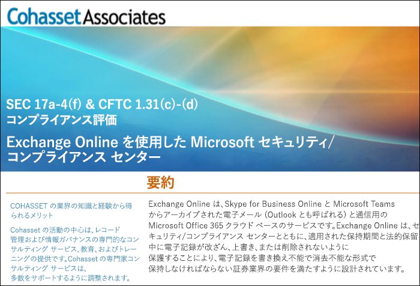

# Exchange Online および セキュリティ/コンプライアンス センターを使用して米国証券取引委員会規則 17a-4 (SEC Rule 17a-4) に準拠するUse Exchange Online and the Security & Compliance Center to comply with SEC Rule 17a-4

>*[セキュリティとコンプライアンスのための Microsoft 365 ライセンス ガイダンス](https://aka.ms/ComplianceSD)。**[Microsoft 365 licensing guidance for security & compliance](https://aka.ms/ComplianceSD).*

If your organization needs to comply with regulatory standards for retaining your data, the Security & Compliance Center provides features to manage the lifecycle of your data in Exchange Online.If your organization needs to comply with regulatory standards for retaining your data, the Security & Compliance Center provides features to manage the lifecycle of your data in Exchange Online. This includes the ability to retain, audit, search, and export your data.This includes the ability to retain, audit, search, and export your data. These capabilities are sufficient to meet the needs of most organizations.These capabilities are sufficient to meet the needs of most organizations.

However, some organizations in highly regulated industries are subject to more stringent regulatory requirements.However, some organizations in highly regulated industries are subject to more stringent regulatory requirements. For example, financial institutions such as banks or broker dealers are subject to Rule 17a-4 issued by the Securities and Exchange Commission (SEC).For example, financial institutions such as banks or broker dealers are subject to Rule 17a-4 issued by the Securities and Exchange Commission (SEC). Rule 17a-4 has specific requirements for electronic data storage, including many aspects of record management, such as the duration, format, quality, availability, and accountability of records retention.Rule 17a-4 has specific requirements for electronic data storage, including many aspects of record management, such as the duration, format, quality, availability, and accountability of records retention.

セキュリティ/コンプライアンス センターを活用して Exchange Online での規制上の義務 (特に、規則 17a-4 の要件に関する義務) を遵守することができ、これをこれらの組織でもっと知っていただくために、Microsoft は Cohasset Associates と協力して評価をリリースしました。To help these organizations better understand how the Security & Compliance Center can be leveraged to meet their regulatory obligations for Exchange Online, specifically in relation to Rule 17a-4 requirements, we have released an assessment in partnership with Cohasset Associates.

Cohasset validated that when Exchange Online and the Security & Compliance Center are configured as recommended, they meet the relevant storage requirements of CFTC Rule 1.31(c)-(d), FINRA Rule 4511, and SEC Rule 17a-4.Cohasset validated that when Exchange Online and the Security & Compliance Center are configured as recommended, they meet the relevant storage requirements of CFTC Rule 1.31(c)-(d), FINRA Rule 4511, and SEC Rule 17a-4. We targeted this set of rules because they represent the most prescriptive guidance globally for records retention for financial institutions.We targeted this set of rules because they represent the most prescriptive guidance globally for records retention for financial institutions.

## Cohasset 評価をダウンロードするDownload the Cohasset assessment

[Cohasset 評価はこちらからダウンロード](https://servicetrust.microsoft.com/ViewPage/TrustDocuments?command=Download&downloadType=Document&downloadId=9fa8349d-a0c9-47d9-93ad-472aa0fa44ec&docTab=6d000410-c9e9-11e7-9a91-892aae8839ad_FAQ_and_White_Papers)できます。You can [download the Cohasset assessment here](https://servicetrust.microsoft.com/ViewPage/TrustDocuments?command=Download&downloadType=Document&downloadId=9fa8349d-a0c9-47d9-93ad-472aa0fa44ec&docTab=6d000410-c9e9-11e7-9a91-892aae8839ad_FAQ_and_White_Papers).

## この評価は、Exchange Online に固有のものですThis assessment is specific to Exchange Online

Note that this assessment is specific to Exchange Online.Note that this assessment is specific to Exchange Online. The assessment does not include other Microsoft 365 services such as SharePoint Online or OneDrive for Business, although we are planning support for those services with respect to SEC 17a-4 in the future.The assessment does not include other Microsoft 365 services such as SharePoint Online or OneDrive for Business, although we are planning support for those services with respect to SEC 17a-4 in the future.

It's important to understand that Skype for Business and Teams also store data in Exchange Online.It's important to understand that Skype for Business and Teams also store data in Exchange Online. Therefore, the assessment does cover messages from Skype for Business and channel and chat messages from Teams.Therefore, the assessment does cover messages from Skype for Business and channel and chat messages from Teams.

## 推奨構成の鍵は保持ロックを使用することですUsing Preservation Lock is key to the recommended configuration

Highly regulated industries are often required to store electronic communications to meet the WORM (write once, read many) requirement.Highly regulated industries are often required to store electronic communications to meet the WORM (write once, read many) requirement. The WORM requirement dictates a storage solution in which a record must be:The WORM requirement dictates a storage solution in which a record must be:

- 記録は義務づけられた保持期間保持される必要があります。保持期間を短縮することはできず、延長のみが可能です。Retained for a required retention period that cannot be shortened, only increased.
- 記録は不変である必要があります。つまり、保持期間中は記録の上書き、消去、または変更をすることができません。Immutable, meaning that the record cannot be overwritten, erased, or altered during the required retention period.

In Exchange Online, when a [retention policy](retention.md) is applied to a user's mailbox, all the user's content will be retained based on the criteria of the policy.In Exchange Online, when a [retention policy](retention.md) is applied to a user's mailbox, all the user's content will be retained based on the criteria of the policy. In fact, if a user attempts to delete or modify an email, a copy of the email before the change is made will be preserved in a secure, hidden location in the user's mailbox.In fact, if a user attempts to delete or modify an email, a copy of the email before the change is made will be preserved in a secure, hidden location in the user's mailbox. Retention policies can help ensure that an organization retains electronic communications, but those policies can be modified.Retention policies can help ensure that an organization retains electronic communications, but those policies can be modified.

By placing a Preservation Lock on a retention policy, an organization ensures that the policy cannot be modified.By placing a Preservation Lock on a retention policy, an organization ensures that the policy cannot be modified. In fact, after a Preservation Lock is applied to a retention policy, the following actions are restricted:In fact, after a Preservation Lock is applied to a retention policy, the following actions are restricted:

- ポリシーの保持期間は延長のみが可能で、短縮することはできません。The retention period of the policy can only be increased, not shortened.
- ユーザーをポリシーに追加することはできますが、ユーザーを削除することはできません。Users can be added to the policy, but no user can be removed.
- アイテム保持ポリシーを管理者が削除することはできません。The retention policy cannot be deleted by an administrator.

保持ロックを使用して、米国証券取引委員会規則 17a-4 の規制要件を満たすことができます。Preservation Lock can help you meet the SEC 17a-4 regulatory requirements.

## 保持ロックを設定する方法How to set up Preservation Lock

アイテム保持ポリシーは、PowerShell を使用してロックできます。You can lock a retention policy by using PowerShell. 詳細については、「[[保持ロック] を使用して規制要件に準拠する](retention.md#use-preservation-lock-to-comply-with-regulatory-requirements)」をご覧ください。For more information, see [Use Preservation Lock to comply with regulatory requirements](retention.md#use-preservation-lock-to-comply-with-regulatory-requirements).

## 既知の制限Known limitations

現在、Exchange Online にはいくつかの制限があります。Currently, there are a few limitations for Exchange Online:

- スレッド形式の通信は、Teams チャットおよびチャンネル メッセージでサポートされていません。Threaded communications are not available for Teams chat and channel messages.
- Teams チャットおよびチャンネル メッセージでの "いいね" は保持されません。Likes are not retained for Teams chat and channel messages.

> [!NOTE]
> アイテム レベルの監査は Microsoft 365 グループのメールボックスで利用できるようになりました。Item-level auditing is now available for Microsoft 365 group mailboxes. 詳細については、「[メールボックスの監査を管理する](enable-mailbox-auditing.md)」を参照してください。For more information, see [Manage mailbox auditing](enable-mailbox-auditing.md).
