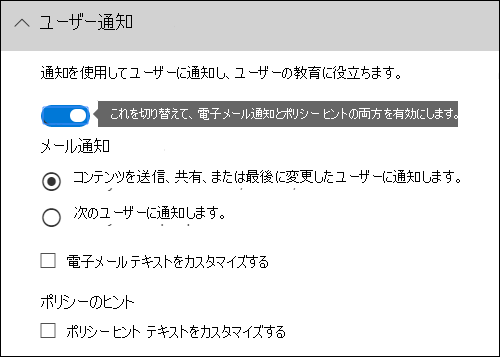

# メール通知を送信して、DLP ポリシーのポリシーのヒントを表示するSend email notifications and show policy tips for DLP policies

データ損失防止 (DLP) ポリシーを使用して、Office 365 全体の機密情報の識別、監視、保護を行うことができます。このような機密情報を扱う組織内のユーザーを DLP ポリシーに準拠させつつ、不必要にブロックしてユーザーの作業が完了できないような事態は避けたいでしょう。このような場合に、メール通知とポリシー ヒントが役立ちます。You can use a data loss prevention (DLP) policy to identify, monitor, and protect sensitive information across Office 365. You want people in your organization who work with this sensitive information to stay compliant with your DLP policies, but you don't want to block them unnecessarily from getting their work done. This is where email notifications and policy tips can help.
  

  
ポリシー ヒントは、誰かがコンテンツを使用していて、それが DLP ポリシーと競合している場合に表示される通知または警告です。たとえば、個人情報 (PII) が含まれ、外部ユーザーと共有されている OneDrive for Business サイト上の Excel ブックなどのコンテンツがこれに該当します。A policy tip is a notification or warning that appears when someone is working with content that conflicts with a DLP policy—for example, content like an Excel workbook on a OneDrive for Business site that contains personally identifiable information (PII) and is shared with an external user.
  
メール通知とポリシー ヒントを使用して、組織のポリシーに関する認識を高め、ユーザーの教育に役立てることができます。また、業務上の正当な理由がある場合や、ポリシーが誤検知した場合にブロックされないように、ユーザーにポリシーを上書きするオプションを提供することもできます。You can use email notifications and policy tips to increase awareness and help educate people about your organization's policies. You can also give people the option to override the policy, so that they're not blocked if they have a valid business need or if the policy is detecting a false positive.
  
コンプライアンス センターで、DLP ポリシーを作成するときに、次のユーザー通知を構成できます。In the Compliance Center, when you create a DLP policy, you can configure the user notifications to:
  
- 選択したユーザーに、問題を説明するメール通知を送信します。Send an email notification to the people you choose that describes the issue.
> [!NOTE]
> 通知メールは保護されていない状態で送信されます。Notification emails are sent unprotected.
    
- DLP ポリシーと競合しているコンテンツのポリシー ヒントを表示します。Display a policy tip for content that conflicts with the DLP policy:
    
  - Outlook on the web および Outlook 2013 以降のメールの場合は、メッセージの作成中、受信者の上のメッセージの上部にポリシー ヒントが表示されます。For email in Outlook on the web and Outlook 2013 and later, the policy tip appears at the top of a message above the recipients while the message is being composed.
    
  - OneDrive for Business アカウントまたは SharePoint Online サイト内のドキュメントの場合、ポリシー ヒントはアイテムに表示される警告アイコンで示されます。For documents in a OneDrive for Business account or SharePoint Online site, the policy tip is indicated by a warning icon that appears on the item. 詳細情報を表示するには、アイテムを選択し、ページの右上隅にある [情報] ウィンドウ アイコンを選択して詳細ウィンドウ  を開きます。To view more information, you can select an item and then choose **Information**  in the upper-right corner of the page to open the details pane. 
    
  - DLP ポリシーに含まれる OneDrive for Business サイトまたは SharePoint Online サイトに保存されている Excel、PowerPoint、および Word のドキュメントの場合、ポリシー ヒントはメッセージ バーと Backstage ビュー **(ファイル** メニュー \> **情報**) に表示されます。For Excel, PowerPoint, and Word documents that are stored on a OneDrive for Business site or SharePoint Online site that's included in the DLP policy, the policy tip appears on the Message Bar and the Backstage view ( **File** menu \> **Info**).
    
## ユーザー通知を DLP ポリシーに追加するAdd user notifications to a DLP policy

DLP ポリシーを作成すると、ユーザー通知を **有効にできます**。When you create a DLP policy, you can enable **User notifications**. ユーザー通知を有効にすると、Microsoft 365 は電子メール通知とポリシー ヒントの両方を送信します。When user notifications are enabled, Microsoft 365 sends out both email notifications and policy tips. 通知メールの送信先、電子メール テキスト、ポリシー ヒント テキストをカスタマイズできます。You can customize who notification emails are sent to, the email text and the policy tip text.
  
1. [https://protection.office.com](https://protection.office.com) に移動します。Go to [https://protection.office.com](https://protection.office.com).
    
2. 職場または学校のアカウントを使用してサインインします。Sign in using your work or school account. これで、セキュリティ コンプライアンス センターに &amp; 入っています。You're now in the Security &amp; Compliance Center.
    
3. セキュリティ/コンプライアンス センターの左側のナビゲーションで、**[データ損失防止]** \> **[ポリシー]** \> **[+ ポリシーの作成]** の順に移動します。In the Security &amp; Compliance Center \> left navigation \> **Data loss prevention** \> **Policy** \> **+ Create a policy**.
    
    ![[ポリシーの作成] ボタン](../media/b1e48a08-92e2-47ca-abdc-4341694ddc7c.png)
  
4. 必要な種類の機密情報を保護する DLP ポリシー テンプレートを選び、**[次へ]** を選択します。Choose the DLP policy template that protects the types of sensitive information that you need \> **Next**.
    
    空のテンプレートから始めるには、**[カスタム]** \> **[カスタム ポリシー]** \> **[次へ]** の順に選びます。To start with an empty template, choose **Custom** \> **Custom policy** \> **Next**.
    
5. ポリシーの名前を設定し、**[次へ]** を選びます。Name the policy \> **Next**.
    
6. DLP ポリシーで保護する場所を選ぶには、次のいずれかを行います。To choose the locations that you want the DLP policy to protect, do one of the following:
    
   - **[Office 365 のすべての場所]** \> **[次へ]** と選びます。Choose **All locations in Office 365** \> **Next**.
    
   - **[自分で特定の場所を選択する]** \> **[次へ]** と選びます。Choose **Let me choose specific locations** \> **Next**.
    
   すべての Exchange メールやすべての OneDrive アカウントなど、特定の場所全体を含めたり除外したりするには、その場所の **[状態]** をオンまたはオフに切り替えます。To include or exclude an entire location such as all Exchange email or all OneDrive accounts, switch the **Status** of that location on or off. 
    
   特定の SharePoint サイトまたは OneDrive アカウントだけを含めるには、**[状態]** をオンに切り替えた後、**[含める]** の下のリンクをクリックして、特定のサイトまたはアカウントを選びます。To include only specific SharePoint sites or OneDrive accounts, switch the **Status** to on, and then click the links under **Include** to choose specific sites or accounts. 
    
7. **[詳細設定を使う]** \> **[次へ]** の順に選びます。Choose **Use advanced settings** \> **Next**.
    
8. **[+ 新しいルール]** を選びます。Choose **+ New rule**.
    
9. ルール エディターで、**[ユーザー通知]** の状態をオンにします。In the rule editor, under **User notifications**, switch the status on.
    
    

> [!NOTE]
> DLP ポリシーは、新しいドキュメントか既存のドキュメントかに関あれ、ポリシーに一致するすべてのドキュメントに適用されます。DLP policies apply to all documents that match the policy, whether those documents are new or existing. ただし、電子メール通知は、新しいコンテンツが既存の DLP ポリシーと一致する場合にのみ生成されます。However, an email notification is only generated when new content matches an existing DLP policy. 既存のコンテンツは保護されますが、電子メールによるユーザー通知は生成されません。Existing content is protected, but will not generate a user notification via email.
  
## メール通知を設定するためのオプションOptions for configuring email notifications

DLP ポリシーのそれぞれのルールで、次のことを行えます。For each rule in a DLP policy, you can:
  
- 選択したユーザーに通知を送信します。これらのユーザーとしては、コンテンツ所有者、コンテンツの最終変更者、コンテンツが格納されているサイトの所有者、または特定のユーザーなどが挙げられます。Send the notification to the people you choose. These people can include the owner of the content, the person who last modified the content, the owner of the site where the content is stored, or a specific user.
    
- HTML またはトークンを使用して、通知に含まれるテキストをカスタマイズできます。詳細については、次のセクションを参照してください。Customize the text that's included in the notification by using HTML or tokens. See the section below for more information.
    
> [!NOTE]
>  電子メール通知は、グループや配布リストではなく、個々の受信者にのみ送信できます。Email notifications can be sent only to individual recipients—not groups or distribution lists. 電子メール通知をトリガーするのは新しいコンテンツだけです。Only new content will trigger an email notification. 既存のコンテンツを編集すると、ポリシー ヒントがトリガーされますが、電子メール通知はトリガーされます。Editing existing content will trigger policy tips, but not an email notification. 
  

  
### 既定のメール通知Default email notification

通知には、実行されるアクションから始まる件名行があります。たとえば、メールの場合は、“通知”、“メッセージがブロックされました” など、ドキュメントの場合は、“アクセスがブロックされました” などと表示されます。ドキュメントに関する通知の場合、通知メッセージの本文には、ドキュメントが保存されているサイトに移動し、ドキュメントのポリシー ヒントを表示するリンクが含まれています。ここで問題を解決できます (ポリシー ヒントについては、以下のセクションを参照)。メールに関する通知の場合、通知には DLP ポリシーと一致するメッセージが添付ファイルとして含まれます。Notifications have a Subject line that begins with the action taken, such as "Notification", "Message Blocked" for email, or "Access Blocked" for documents. If the notification is about a document, the notification message body includes a link that takes you to the site where the document's stored and opens the policy tip for the document, where you can resolve any issues (see the section below about policy tips). If the notification is about a message, the notification includes as an attachment the message that matches a DLP policy.
  

  
既定では、通知には、サイト上の項目に対して以下のようなテキストが表示されます。通知テキストは、ルールごとに個別に構成されるため、表示されるテキストは、一致するルールによって異なります。By default, notifications display text similar to the following for an item on a site. The notification text is configured separately for each rule, so the text that's displayed differs depending on which rule is matched.

|**構成されている DLP ポリシー ルール****If the DLP policy rule does this…**|**SharePoint または OneDrive for Business のドキュメントの既定の通知内容****Then the default notification for SharePoint or OneDrive for Business documents says this…**|**Outlook メッセージの既定の通知内容****Then the default notification for Outlook messages says this…**|
|:-----|:-----|:-----|
|通知を送信するが、上書きは許可しないSends a notification but doesn't allow override    |このアイテムは、組織のポリシーと競合しています。This item conflicts with a policy in your organization.    |あなたのメール メッセージは、組織のポリシーと競合しています。Your email message conflicts with a policy in your organization.    |
|アクセスをブロックし、通知を送信し、上書きを許可するBlocks access, sends a notification, and allows override    |このアイテムは組織のポリシーと競合しています。この競合を解決しないと、このファイルへのアクセスがブロックされる可能性があります。This item conflicts with a policy in your organization. If you don't resolve this conflict, access to this file might be blocked.    |あなたのメール メッセージは、組織のポリシーと競合しています。メッセージは、すべての受信者には配信されませんでした。Your email message conflicts with a policy in your organization. The message wasn't delivered to all recipients.    |
|アクセスをブロックして、通知を送信するBlocks access and sends a notification    |このアイテムは組織内のポリシーと競合します。アイテムの所有者、最後に更新した人、プライマリ サイト コレクションの管理者を除くすべてのユーザーが、このアイテムへのアクセスをブロックされます。This item conflicts with a policy in your organization. Access to this item is blocked for everyone except its owner, last modifier, and the primary site collection administrator.    |あなたのメール メッセージは、組織のポリシーと競合しています。メッセージは、すべての受信者には配信されませんでした。Your email message conflicts with a policy in your organization. The message wasn't delivered to all recipients.    |
   
### ユーザー設定のメール通知Custom email notification

エンド ユーザーまたは管理者に既定のメール通知を送信する代わりに、カスタムのメール通知を作成することができます。ユーザー設定のメール通知は、HTML に対応しており、5,000 文字の制限があります。HTML を使用すると、通知に画像、書式、その他のブランド設定を含めることができます。You can create a custom email notification instead of sending the default email notification to your end users or admins. The custom email notification supports HTML and has a 5,000-character limit. You can use HTML to include images, formatting, and other branding in the notification.
  
また、次のトークンを使用して、メール通知をカスタマイズすることもできます。これらのトークンは、送信される通知の固有の情報によって置き換えられる変数です。You can also use the following tokens to help customize the email notification. These tokens are variables that are replaced by specific information in the notification that's sent.

|**トークン****Token**|**説明****Description**|
|:-----|:-----|
|%%AppliedActions%%%%AppliedActions%%    |アクションがコンテンツに適用されます。The actions applied to the content.    |
|%%ContentURL%%%%ContentURL%%    |SharePoint Online サイトまたは OneDrive for Business サイトのドキュメントの URL。The URL of the document on the SharePoint Online site or OneDrive for Business site.    |
|%%MatchedConditions%%%%MatchedConditions%%    |コンテンツと一致した条件。コンテンツで想定される問題をユーザーに通知する場合にこのトークンを使用します。The conditions that were matched by the content. Use this token to inform people of possible issues with the content.    |
   

  
## ポリシー ヒントを構成するためのオプションOptions for configuring policy tips

DLP ポリシー内の各ルールに関して、次の事柄を行うポリシー ヒントを構成できます。For each rule in a DLP policy, you can configure policy tips to:
  
- コンテンツが DLP ポリシーと競合していることをユーザーに通知して、競合を解決するアクションを実行できるようにします。既定のテキスト (下記の表を参照) を使用するか、または組織の特定のポリシーに関するユーザー設定のテキストを入力することができます。Simply notify the person that the content conflicts with a DLP policy, so that they can take action to resolve the conflict. You can use the default text (see the tables below) or enter custom text about your organization's specific policies.
    
- ユーザーによる DLP ポリシーの上書きを許可します。必要に応じて、次のことも行えます。Allow the person to override the DLP policy. Optionally, you can:
    
  - ポリシーを無効にするための業務上の正当な理由の入力をユーザーに求めることができます。この情報はログに記録され、セキュリティ/コンプライアンス センターの **[レポート]** セクションの DLP レポートで確認できます。Require the person to enter a business justification for overriding the policy. This information is logged and you can view it in the DLP reports in the **Reports** section of the Security &amp; Compliance Center. 
    
  - ユーザーが誤検知を報告し、DLP ポリシーを上書きできるようにします。この情報はレポート用にも記録されるので、誤検知を使用してルールを微調整できます。Allow the person to report a false positive and override the DLP policy. This information is also logged for reporting, so that you can use false positives to fine tune your rules.
    

  
たとえば、個人を特定できる情報 (PII) を検出する DLP ポリシーを OneDrive for Business サイトに適用する場合、このポリシーに次の 3 つのルールを含めることができます。For example, you may have a DLP policy applied to OneDrive for Business sites that detects personally identifiable information (PII), and this policy has three rules:
  
1. 最初のルール:5 個以下の対象機密情報インスタンスがドキュメントで検出され、ドキュメントが組織内のユーザーと共有されている場合、[**通知を送信**] アクションによってポリシー ヒントが表示されます。ポリシー ヒントについては、上書きオプションは必要ありません。このルールは単にユーザーに通知を行うだけで、アクセスをブロックするわけではないからです。First rule: If fewer than five instances of this sensitive information are detected in a document, and the document is shared with people inside the organization, the **Send a notification** action displays a policy tip. For policy tips, no override options are necessary because this rule is simply notifying people and not blocking access. 
    
2. 2 番目のルール: 5 個を超える対象機密情報インスタンスがドキュメントで検出され、組織内のユーザーとドキュメントを共有する場合、**[コンテンツへのアクセスの禁止]** アクションによってファイルのアクセス許可が制限され、**[通知の送信]** アクションでは業務上の理由を提供することによってこのルールのアクションの上書きをユーザーに許可します。場合によっては、組織のビジネスにおいて内部ユーザーが PII データを共有する必要が生じ、DLP ポリシーによってその作業をブロックしたくないことがあります。Second rule: If greater than five instances of this sensitive information are detected in a document, and the document is shared with people inside the organization, the **Block access to content** action restricts the permissions for the file, and the **Send a notification** action allows people to override the actions in this rule by providing a business justification. Your organization's business sometimes requires internal people to share PII data, and you don't want your DLP policy to block this work. 
    
3. 3 番目のルール:5 個を超える対象機密情報インスタンスがドキュメントで検出され、組織外のユーザーとドキュメントを共有する場合、[**コンテンツへのアクセスの禁止**] アクションによってファイルのアクセス許可が制限され、[**通知の送信**] アクションではこのルールのアクションの上書きをユーザーに許可しません。情報が外部共有されているためです。いかなる状況においても、組織内のユーザーが組織外で PII データを共有することを許可すべきではありません。Third rule: If greater than five instances of this sensitive information are detected in a document, and the document is shared with people outside the organization, the **Block access to content** action restricts the permissions for the file, and the **Send a notification** action does not allow people to override the actions in this rule because the information is shared externally. Under no circumstances should people in your organization be allowed to share PII data outside the organization. 
    
ルールを上書きするポリシー ヒントを使用する際に把握しておくべきいくつかの点を以下に記します。Here are some fine points to understand about using a policy tip to override a rule:
  
- 上書きオプションはルールごとのオプションで、対象ルール内のすべてのアクションを上書きします (ただし、上書きできない通知の送信は除きます)。The option to override is per rule, and it overrides all of the actions in the rule (except sending a notification, which can't be overridden).
    
- コンテンツが 1 つの DLP ポリシー内の複数のルールに一致する可能性がありますが、その場合には最も制限的で優先順位の高いルールのポリシー ヒントのみが表示されます。たとえば、単に通知を送信するルールのポリシー ヒントよりも、コンテンツへのアクセスを禁止するルールのポリシー ヒントの方が優先して表示されます。これにより、ポリシー ヒントがカスケード表示されるのを防止します。It's possible for content to match several rules in a DLP policy, but only the policy tip from the most restrictive, highest-priority rule will be shown. For example, a policy tip from a rule that blocks access to content will be shown over a policy tip from a rule that simply sends a notification. This prevents people from seeing a cascade of policy tips.
    
- 	最も制限の厳しいルールでユーザーにルールを上書きすることを許可している場合は、このルールを上書きすることで、コンテンツに一致した他のルールもすべて上書きされます。If the policy tips in the most restrictive rule allow people to override the rule, then overriding this rule also overrides any other rules that the content matched.
    
## OneDrive for Business サイトおよび SharePoint Online サイトのポリシー ヒントPolicy tips on OneDrive for Business sites and SharePoint Online sites

OneDrive for Business サイトまたは SharePoint Online サイト上のドキュメントが DLP ポリシー内のルールに一致し、そのルールがポリシー ヒントを使用する場合、ポリシー ヒントは特別なアイコンをドキュメント上に表示します。When a document on a OneDrive for Business site or SharePoint Online site matches a rule in a DLP policy, and that rule uses policy tips, the policy tips display special icons on the document:
  
1. ルールがファイルに関する通知を送信する場合、警告アイコンが表示されます。If the rule sends a notification about the file, the warning icon appears.
    
2. ルールがドキュメントへのアクセスをブロックする場合、ブロックされたアイコンが表示されます。If the rule blocks access to the document, the blocked icon appears.
    
   
  
ドキュメントに対してアクションを実行するには、ページの右上隅にある [情報] ウィンドウ アイコンを選択して、詳細ウィンドウの [ポリシー ヒントの表示] を \>   \> **開きます**。To take action on a document, you can select an item \> choose **Information**  in the upper-right corner of the page to open the details pane \> **View policy tip**.
  
ポリシー ヒントにはコンテンツに関する問題が一覧表示され、ポリシー ヒントにオプションが構成されている場合には、[**解決**] を検索してから、ポリシー ヒントの [**上書き**] または誤検知の [**レポート**] を選択できます。The policy tip lists the issues with the content, and if the policy tips are configured with these options, you can choose **Resolve**, and then **Override** the policy tip or **Report** a false positive. 
  

  

  
DLP ポリシーがサイトと同期され、コンテンツが定期的かつ非同期的に評価されます。それで、DLP ポリシーを作成してからポリシー ヒントが表示されるまで少しの遅延があります。ポリシーを解決または上書きしてから、サイトのドキュメントのアイコンが消えるまで同様の遅延が生じる可能性があります。DLP policies are synced to sites and contented is evaluated against them periodically and asynchronously, so there may be a short delay between the time you create the DLP policy and the time you begin to see policy tips. There may be a similar delay from when you resolve or override a policy tip to when the icon on the document on the site goes away.
  
### サイト上のポリシー ヒントの既定テキストDefault text for policy tips on sites

既定では、ポリシー ヒントは、サイト上の項目に対して以下のようなテキストを表示します。通知テキストは、ルールごとに個別に構成されるため、表示されるテキストは、一致するルールによって異なります。By default, policy tips display text similar to the following for an item on a site. The notification text is configured separately for each rule, so the text that's displayed differs depending on which rule is matched.

|**構成されている DLP ポリシー ルール****If the DLP policy rule does this…**|**既定のポリシー ヒント内容****Then the default policy tip says this…**|
|:-----|:-----|
|通知を送信するが、上書きは許可しないSends a notification but doesn't allow override    |このアイテムは、組織のポリシーと競合しています。This item conflicts with a policy in your organization.    |
|アクセスをブロックし、通知を送信し、上書きを許可するBlocks access, sends a notification, and allows override    |このアイテムは組織のポリシーと競合しています。この競合を解決しないと、このファイルへのアクセスがブロックされる可能性があります。This item conflicts with a policy in your organization. If you don't resolve this conflict, access to this file might be blocked.    |
|アクセスをブロックして、通知を送信するBlocks access and sends a notification    |このアイテムは組織内のポリシーと競合します。アイテムの所有者、最後に更新した人、プライマリ サイト コレクションの管理者を除くすべてのユーザーが、このアイテムへのアクセスをブロックされます。This item conflicts with a policy in your organization. Access to this item is blocked for everyone except its owner, last modifier, and the primary site collection administrator.    |
   
### サイトのポリシー ヒントのユーザー設定テキストCustom text for policy tips on sites

メール通知とは別に、ポリシー ヒントのテキストをカスタマイズすることができます。メール通知のユーザー設定テキストとは異なり (上のセクションを参照)、ポリシー ヒントのユーザー設定テキストでは HTML もトークンも使用できません。代わりに、ポリシー ヒントのユーザー設定テキストは、プレーン テキストで、256 文字の制限があります。You can customize the text for policy tips separately from the email notification. Unlike custom text for email notifications (see above section), custom text for policy tips does not accept HTML or tokens. Instead, custom text for policy tips is plain text only with a 256-character limit.
  
## Outlook on the web および Outlook 2013 以降におけるポリシー ヒントPolicy tips in Outlook on the web and Outlook 2013 and later

Outlook on the web および Outlook 2013 以降で新しいメールを作成するとき、DLP ポリシーのルールに一致するコンテンツを追加し、そのルールがポリシー ヒントを使用する場合、ポリシー ヒントが表示されます。ポリシー ヒントは、メッセージの作成中、受信者の上のメッセージの上部に表示されます。When you compose a new email in Outlook on the web and Outlook 2013 and later, you'll see a policy tip if you add content that matches a rule in a DLP policy, and that rule uses policy tips. The policy tip appears at the top of the message, above the recipients, while the message is being composed.
  

  
ポリシー ヒントは、次のように、機密情報がメッセージの本文、件名行、またはメッセージの添付ファイルに含まれる場合でも機能します。Policy tips work whether the sensitive information appears in the message body, subject line, or even a message attachment as shown here.
  

  
ポリシー ヒントが上書きできるように構成されている場合は、**[詳細の表示]**、**[上書き]** を選択し、業務上の妥当性を入力するか、誤検知を報告し、**[上書き]** を選択します。If the policy tips are configured to allow override, you can choose **Show Details** \> **Override** \> enter a business justification or report a false positive \> **Override**.
  

  

  
メールに機密情報を追加すると、機密情報を追加してからポリシー ヒントが表示されるまでに遅延が生じる場合があることに注意してください。Note that when you add sensitive information to an email, there may be latency between when the sensitive information is added and when the policy tip appears.

### Outlook 2013 以降では、一部の条件に対するポリシー ヒントのみが表示Outlook 2013 and later supports showing policy tips for only some conditions

現在、Outlook 2013 以降では、次の条件に対するポリシー ヒントのみが表示されます。Currently, Outlook 2013 and later supports showing policy tips only for these conditions:

- コンテンツが含まれているContent contains
- コンテンツが共有されているContent is shared

例外は条件と見なされ、これらの条件はすべて Outlook で動作し、コンテンツと一致し、コンテンツに保護アクションを適用します。Note that Exceptions are considered conditions and all of these conditions work in Outlook, where they will match content and enforce protective actions on content. ただし、ユーザーにポリシー ヒントを表示する方法はまだサポートされていません。But showing policy tips to users is not yet supported. 
  
### Exchange 管理センターとセキュリティ コンプライアンス センターのポリシー &amp; ヒントPolicy tips in the Exchange admin center vs. the Security &amp; Compliance Center

ポリシー ヒントは、Exchange 管理センターで作成された DLP ポリシーとメール フロー ルール、またはセキュリティ コンプライアンス センターで作成された DLP ポリシーで動作できますが、両方は使用 &amp; できません。Policy tips can work either with DLP policies and mail flow rules created in the Exchange admin center, or with DLP policies created in the Security &amp; Compliance Center, but not both. これは、これらのポリシーは異なる場所に保存されますが、ポリシー ヒントは 1 つの場所からのみ描画できるためです。This is because these policies are stored in different locations, but policy tips can draw only from a single location.
  
Exchange 管理センターでポリシー ヒントを構成した場合、Exchange 管理センターでヒントをオフにするまで、セキュリティ コンプライアンス センターで構成したポリシー ヒントは、Outlook on the web および Outlook 2013 以降のユーザーには表示されません。 &amp;If you've configured policy tips in the Exchange admin center, any policy tips that you configure in the Security &amp; Compliance Center won't appear to users in Outlook on the web and Outlook 2013 and later until you turn off the tips in the Exchange admin center. これにより、セキュリティ コンプライアンス センターに切り替えるまで、現在の Exchange メール フロー ルール (トランスポート ルールとも呼ばれる) が引き続き &amp; 機能します。This ensures that your current Exchange mail flow rules (also known as transport rules) will continue to work until you choose to switch over to the Security &amp; Compliance Center.
  
ポリシー ヒントは 1 つの場所からしか描画されませんが、セキュリティ コンプライアンス センターと Exchange 管理センターの両方で DLP ポリシーを使用している場合でも、電子メール通知は常に &amp; 送信されます。Note that while policy tips can draw only from a single location, email notifications are always sent, even if you're using DLP policies in both the Security &amp; Compliance Center and the Exchange admin center.
  
### メールのポリシー ヒントの既定のテキストDefault text for policy tips in email

既定では、ポリシー ヒントは、次のようなテキストでメールに表示されます。By default, policy tips display text similar to the following for email.

|**構成されている DLP ポリシー ルール****If the DLP policy rule does this…**|**既定のポリシー ヒント内容****Then the default policy tip says this…**|
|:-----|:-----|
|通知を送信するが、上書きは許可しないSends a notification but doesn't allow override    |メールは組織内のポリシーと競合しています。Your email conflicts with a policy in your organization.    |
|アクセスをブロックし、通知を送信し、上書きを許可するBlocks access, sends a notification, and allows override    |メールは組織内のポリシーと競合しています。Your email conflicts with a policy in your organization.    |
|アクセスをブロックして、通知を送信するBlocks access and sends a notification    |メールは組織内のポリシーと競合しています。Your email conflicts with a policy in your organization.    |
   
## Excel、PowerPoint、Word のポリシー ヒントPolicy tips in Excel, PowerPoint, and Word

ユーザーがデスクトップ バージョンの Excel、PowerPoint、および Word で機密性の高いコンテンツを操作する場合、ポリシー ヒントは、コンテンツが DLP ポリシーと競合するリアルタイムで通知できます。When people work with sensitive content in the desktop versions of Excel, PowerPoint, and Word, policy tips can notify them in real time that the content conflicts with a DLP policy. そのためには以下のことが必要となります。This requires that:
  
- Office ドキュメントが OneDrive for Business サイトまたは SharePoint Online サイトに保存されていること。The Office document is stored on a OneDrive for Business site or SharePoint Online site.
    
- サイトが、ポリシー ヒントを使用するように構成された DLP ポリシーに含まれていること。The site is included in a DLP policy that's configured to use policy tips.
    
Office プログラムは、Office 365 から DLP ポリシーを自動的に直接同期し、ドキュメントをスキャンして、DLP ポリシーと競合し、リアルタイムでポリシー ヒントを表示します。Office desktop programs automatically sync DLP policies directly from Office 365, and then scan your documents to ensure that they don't conflict with your DLP policies and display policy tips in real time.

> [!NOTE]
> Officeデスクトップ アプリはドキュメント自体をスキャンして、DLP ポリシー ヒントを表示する必要があるかどうかを判断します。SharePoint Online サイトまたは OneDrive for Business サイトがファイルに表示する必要が既に決定されているポリシー ヒントは表示されません。Office desktop apps scan documents themselves to determine if DLP policy tips should be shown; they do not show policy tips that SharePoint Online sites or OneDrive for Business sites have already determined should be shown on a file. そのため、SharePoint Online サイトまたは OneDrive for Business サイトに表示されるデスクトップ アプリに DLP ポリシー ヒントが常に表示されない場合があります。As a result, you may not always see a DLP policy tip in the desktop apps that you see in the SharePoint Online sites or OneDrive for Business sites. これに対し、web 上Officeアプリケーションは、SharePoint Online サイトまたは OneDrive for Business サイトが既に決定している DLP ポリシー ヒントのみを表示します。In contrast, the Office applications on the web only show DLP policy tips that SharePoint Online sites or OneDrive for Business sites have already determined should be shown.
  
DLP ポリシーにおけるポリシー ヒントの構成法によっては、ユーザーがポリシー ヒントを単に無視すること、業務上の理由を提供してまたは提供せずにポリシーを上書きすること、誤検知を報告することを選択できます。Depending on how you configure the policy tips in the DLP policy, people can choose to simply ignore the policy tip, override the policy with or without a business justification, or report a false positive.
  
ポリシー ヒントは、メッセージ バーに表示されます。Policy tips appear on the Message Bar.
  

  
ポリシー ヒントは、(**[ファイル]** タブ上の) Backstage ビューにも表示されます。And policy tips also appear in the Backstage view (on the **File** tab). 
  

  
DLP ポリシーのポリシー ヒントにこれらのオプションが設定されている場合、[**解決**] を選択した後、ポリシー ヒントの [**上書き**]、または誤検知の [**レポート**] を選択できます。If policy tips in the DLP policy are configured with these options, you can choose **Resolve** to **Override** a policy tip or **Report** a false positive. 
  

  
これらの各デスクトップ プログラムOffice、ユーザーはポリシー ヒントをオフにできます。In each of these Office desktop programs, people can choose to turn off policy tips. 無効にすると、通知を単に行うポリシー ヒントはメッセージ バーにも Backstage ビュー ([**ファイル**] タブ) にも表示されません。If turned off, policy tips that are simple notifications will not appear on the Message Bar or Backstage view (on the **File** tab). ただし、ブロックおよび上書きに関するポリシー ヒントは依然表示され、電子メール通知も引き続き受け取ります。However, policy tips about blocking and overriding will still appear, and they will still receive the email notification. さらに、ポリシー ヒントを無効にしても、適用されている DLP ポリシーがドキュメントに対して無効になるわけではありません。In addition, turning off policy tips does not exempt the document from any DLP policies that have been applied to it. 
  
### Excel 2016、PowerPoint 2016、Word 2016 におけるポリシー ヒントの既定テキストDefault text for policy tips in Excel 2016, PowerPoint 2016, and Word 2016

既定では、ポリシー ヒントは、開いているドキュメントのメッセージ バーと Backstage ビューに次のようなテキストを表示します。通知テキストは、ルールごとに個別に構成されるため、表示されるテキストは、一致するルールによって異なります。By default, policy tips display text similar to the following on the Message Bar and Backstage view of an open document. The notification text is configured separately for each rule, so the text that's displayed differs depending on which rule is matched.

|**構成されている DLP ポリシー ルール****If the DLP policy rule does this…**|**既定のポリシー ヒント内容****Then the default policy tip says this…**|
|:-----|:-----|
|通知を送信するが、上書きは許可しないSends a notification but doesn't allow override    |このファイルは組織内のポリシーと競合します。詳細については、**[ファイル]** メニューに移動します。This file conflicts with a policy in your organization. Go to the **File** menu for more information.    |
|アクセスをブロックし、通知を送信し、上書きを許可するBlocks access, sends a notification, and allows override    |このファイルは組織内のポリシーと競合します。この競合を解決しないと、このファイルへのアクセスがブロックされる可能性があります。詳細については、**[ファイル]** メニューに移動します。This file conflicts with a policy in your organization. If you don't resolve this conflict, access to this file might be blocked. Go to the **File** menu for more information.    |
|アクセスをブロックして、通知を送信するBlocks access and sends a notification    |このファイルは組織内のポリシーと競合します。この競合を解決しないと、このファイルへのアクセスがブロックされる可能性があります。詳細については、**[ファイル]** メニューに移動します。This file conflicts with a policy in your organization. If you don't resolve this conflict, access to this file might be blocked. Go to the **File** menu for more information.    |
   
### Excel、PowerPoint、Word のポリシー ヒントのカスタム テキストCustom text for policy tips in Excel, PowerPoint, and Word

メール通知とは別に、ポリシー ヒントのテキストをカスタマイズすることができます。メール通知のユーザー設定テキストとは異なり (上のセクションを参照)、ポリシー ヒントのユーザー設定テキストでは HTML もトークンも使用できません。代わりに、ポリシー ヒントのユーザー設定テキストは、プレーン テキストで、256 文字の制限があります。You can customize the text for policy tips separately from the email notification. Unlike custom text for email notifications (see above section), custom text for policy tips does not accept HTML or tokens. Instead, custom text for policy tips is plain text only with a 256-character limit.
  
## 詳細情報More information

- [データ損失防止についてLearn about data loss prevention](dlp-learn-about-dlp.md)    
- [テンプレートからの DLP ポリシーの作成Create a DLP policy from a template](create-a-dlp-policy-from-a-template.md)
- [DLP ポリシーの条件、例外、およびアクション (プレビュー)DLP policy conditions, exceptions, and actions (preview)](./dlp-microsoft-teams.md) 
- [FCI または他のプロパティを含むドキュメントを保護するために DLP ポリシーを作成するCreate a DLP policy to protect documents with FCI or other properties](protect-documents-that-have-fci-or-other-properties.md)
- [DLP ポリシー テンプレートに含まれるものWhat the DLP policy templates include](what-the-dlp-policy-templates-include.md)
- [機密情報の種類のエンティティ定義Sensitive information type entity definitions](sensitive-information-type-entity-definitions.md)