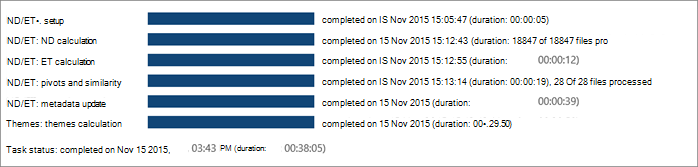

# Advanced eDiscovery (クラシック) で結果の分析を表示する

> [!NOTE]
> Advanced eDiscovery を使用するには、Advanced Compliance アドオンがインストールされた Office 365 E3 サブスクリプション、または E5 サブスクリプションがお客様の組織で必要になります。このプランを利用しておらず、Advanced eDiscovery をお試しになりたい場合は、[Office 365 Enterprise E5 の試用版にサインアップ](https://go.microsoft.com/fwlink/p/?LinkID=698279)してください。 
  
Advanced eDiscovery では、分析プロセスの進行状況と結果を、次に示すさまざまな表示で表示できます。
  
## タスクの状態の分析を表示する

[ **結果 \> の分析 \> の \> 準備] タスクの状態では**、分析プロセスの実行中および実行後に状態が表示されます。 
  

  
表示されるタスクは、選択したオプションによって異なる場合があります。 
  
- **ND/ET: setup**: 実行の準備 (実行パラメーターやケース パラメーターなど) を設定します。
    
- **ND/ET: ND 計算**: ファイルのほぼ重複した分析を処理します。
    
- **ND/ET: ET 計算**: 電子メール セット全体に対して電子メール スレッド分析を実行します。
    
- **ND/ET: ピボットと類似** 性 : ピボットとファイルの類似処理を実行します。
    
- **ND/ET: メタデータ更新**: データベース内のファイルに収集された新しいデータを最終処理します。
    
- **テーマ: テーマの計算**: テーマ分析を実行します。 (選択されている場合にのみ表示されます。
    
- **タスクの状態**: この行は、タスクの完了後に表示されます。 タスクの実行中は、実行期間が表示されます。
    
> [!NOTE]
> 近重複および電子メール スレッド (ND および ED) の分析結果は、処理するドキュメントの数に適用されます。 このファイルには、完全に重複するファイルは含まれます。 
  
## 近重複および電子メール スレッドの状態を表示する

ターゲット **母** 集団の結果には、ターゲット母集団内のドキュメント、電子メール、添付ファイル、およびエラーの数が表示されます。 
  
ドキュメント **の結果には** 、ピボットの数、一意の近くの重複、および正確な重複ファイルが表示されます。 
  
電子 **メールの結果** には、包括性を含む負の数、一意の包括的コピー、および電子メール メッセージの残りの数が表示されます。 電子メールの結果の種類は次のとおりです。 
  
- **包括**: 包括的な電子メールは、電子メール スレッドの終了ノードであり、そのスレッドの以前のすべての履歴が含まれています。 その結果、レビューアーはスレッド内の以前のメッセージを読む必要なく、包括的なメールに安全に集中できます。 
    
- **包括的なマイナス**: 包括的なメッセージの親に関連付けられている添付ファイルが 1 つ以上ある場合、包括的な電子メールは包括的なマイナスとして指定されます。 このコンテキストでは、Parent という用語は、電子メール スレッド上のメッセージ、または特定の包括的な電子メールに含まれる会話に使用されます。 レビュー者は、包括的なメールの親のコンテンツを確認する必要はないが、包括的なパスの親に関連付けられている添付ファイルを確認すると役立つ可能性があるというシグナルとして、包括的な負符号を使用できます。 
    
- **包括コピー**: 包括的または包括的なマイナスとしてマークされている別のメッセージのコピーである場合、包括的な電子メールが包括コピーとして指定されます。 つまり、このメッセージの件名と本文は別の包括的なメッセージと同じであり、同じノードに存在します。 包括コピー メッセージには同じコンテンツが含まれるため、通常はレビュー プロセスでスキップできます。 
    
- **残り**: これは、一意のコンテンツが含まれているので、前の 3 つのカテゴリに分類できないメールを示します。 これらの電子メール メッセージを確認する必要はない。 後の包括的な電子メールに含まれている添付ファイルがメッセージに含まれている場合は、添付ファイルの確認が必要になる場合があります。 これは、スレッド内に包括的なマイナス電子メールが存在することで示されます。
    
添付 **ファイルの** 結果には、一意の添付ファイルや重複ファイルなどの種類に従って、添付ファイルの数が表示されます。 
  

  
## 関連項目

[Advanced eDiscovery (クラシック)](office-365-advanced-ediscovery.md)
  
[ドキュメントの類似性について](understand-document-similarity-in-advanced-ediscovery.md)
  
[分析オプションの設定](set-analyze-options-in-advanced-ediscovery.md)
  
[テキストを無視する設定](set-ignore-text-in-advanced-ediscovery.md)
  
[分析の詳細設定の設定](view-analyze-results-in-advanced-ediscovery.md)

