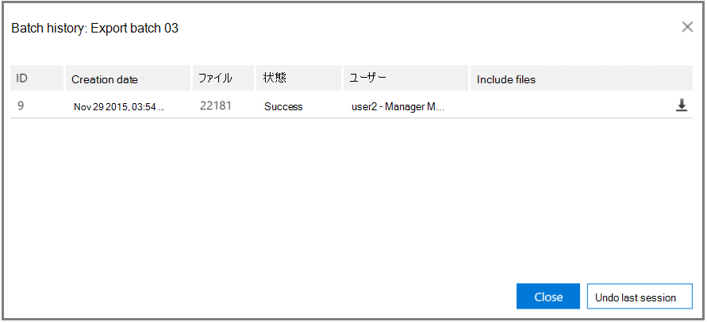

# 詳細な電子情報開示でのバッチ履歴の表示と過去の結果のエクスポート (クラシック)View batch history and export past results in Advanced eDiscovery (classic)

> [!NOTE]
> Advanced eDiscovery requires an Office 365 E3 with the Advanced Compliance add-on or an E5 subscription for your organization.Advanced eDiscovery requires an Office 365 E3 with the Advanced Compliance add-on or an E5 subscription for your organization. If you don't have that plan and want to try Advanced eDiscovery, you can [sign up for a trial of Office 365 Enterprise E5](https://go.microsoft.com/fwlink/p/?LinkID=698279).If you don't have that plan and want to try Advanced eDiscovery, you can [sign up for a trial of Office 365 Enterprise E5](https://go.microsoft.com/fwlink/p/?LinkID=698279). 
  
次のセクションでは、高度な電子情報開示でのデータの一括表示およびエクスポートの追加オプションについて説明します。The following section describes additional options for batch viewing and export of data in Advanced eDiscovery. 
  
## バッチのエクスポート履歴を表示し、以前のバッチをエクスポートするViewing Export batch history and exporting previous batches

[エクスポート履歴] ダイアログは、選択したエクスポートバッチセッションの詳細情報を提供します。また、最後のセッションを取り消すこともできます。The Export history dialog provides detailed information of selected export batch sessions and also provides the ability to undo the last session.
  
1. [**エクスポートの \> 設定**] で、[バッチの**エクスポート**] ドロップダウンリストからバッチ名を選択します。In **Export \> Setup**, select the batch name from the **Export batch** drop-down list. 
    
2. [バッチ名のエクスポート] の右にある [**バッチ履歴**] アイコンを選択します。To the right of the export batch name, select the **Batch history** icon: 
    
    ![[バッチ履歴のエクスポート] アイコン](../media/a14f6ef9-0c3c-4851-b65d-9380f2d8a38a.gif)
  
    [バッチ履歴] ダイアログが表示されます。The Batch history dialog is displayed.
    
    
  
3. 前のセッションをロールバックする必要がある場合は、[**前回のセッションを元に戻す**] をクリックします。If it is necessary to roll back a previous session, click **Undo last session**. Rollback を複数回実行して、最後のセッションを取り消すことができます。Rollback can be performed multiple times, which cancels the last session.
    
4. 以前に実行したエクスポートバッチセッションからいつでもデータをダウンロードする場合は、 **Download**エクスポートする  エクスポートバッチの横にある [ダウンロード] アイコンエクスポートバッチ履歴のダウンロードアイコンをクリックします。If you want to download data at any time from a previously executed export batch session, click the **Download** icon  next to the desired export batch to be exported. 
    
5. [**共有アクセス署名**] ダイアログボックスが表示されたら、[**クリップボードにコピー** ] をクリックして、エクスポートセッションデータをローカルコンピューターにコピーし、[**閉じる**] をクリックします。When the **Shared access signature** dialog is displayed, click **Copy to clipboard** to copy the export session data to the local machine, and then click **Close**. [セキュリティ &amp; コンプライアンスセンターの**電子情報開示エクスポートツール**] ダイアログが表示されます。The Security &amp; Compliance Center **eDiscovery Export Tool** dialog is displayed. 
    
    ![[電子情報開示のエクスポート] ダイアログボックス](../media/01f79d2d-6da0-45e6-9c6f-ab12347572cb.gif)
  
6. [**電子情報開示エクスポートツール**] ダイアログボックスで、次のようになります。In the **eDiscovery Export Tool** dialog: 
    
1. [**貼り付け元への接続に使用される共有アクセス署名**] に、以前にクリップボードにコピーした**共有アクセス署名**の値を貼り付けます。In **Paste the Shared Access Signature that will be used to connect to the source**, paste the **Shared access signature** value, which was previously copied to the clipboard. 
    
2. [**参照**] をクリックして、ダウンロードしたエクスポートファイルをローカルコンピューターに保存するためのターゲットの場所を選択します。Click **Browse** to select the target location for storing the downloaded export files on a local machine. 
    
3. **[開始]** をクリックします。Click **Start**. エクスポートファイルがローカルコンピューターにダウンロードされます。The export files are downloaded to the local machine. 
    
## 関連項目Related topics

[Advanced eDiscovery (クラシック)Advanced eDiscovery (classic)](office-365-advanced-ediscovery.md)
  
[結果のエクスポートExporting results ](export-results-in-advanced-ediscovery.md)

[レポート フィールドのエクスポートExport report fields](export-report-fields-in-advanced-ediscovery.md)

