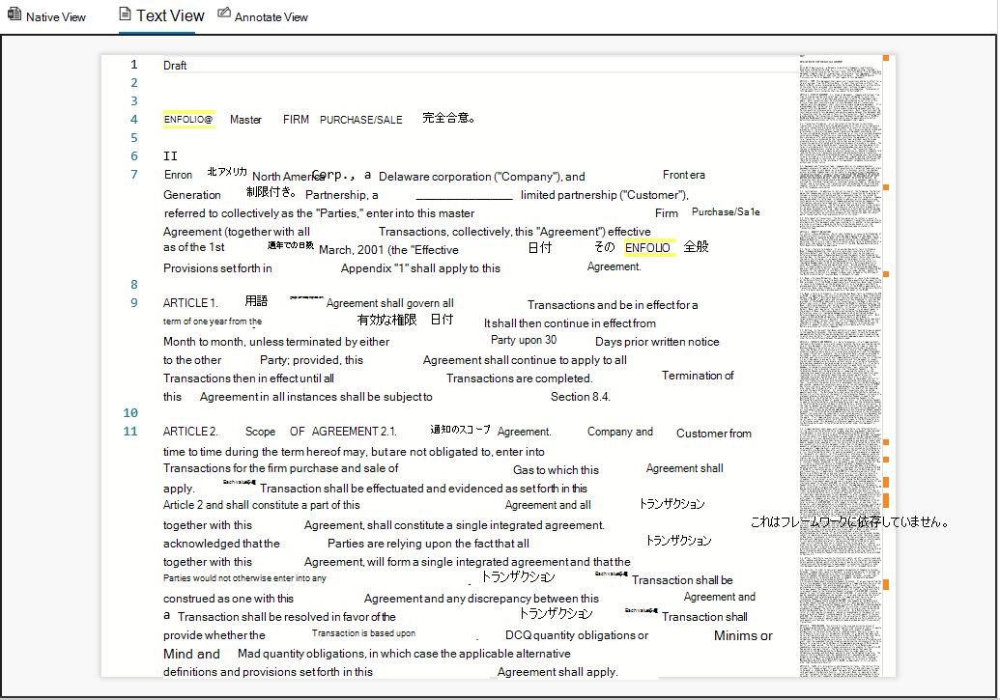

# [ドキュメント] でレビュー セット内のドキュメントを表示Advanced eDiscovery

Advanced eDiscovery では、それぞれ異なる目的を持つ複数のビューアーを使用してコンテンツを表示します。 さまざまなビューアーを使用するには、レビュー セット内の任意のドキュメントをクリックします。 現在提供されている閲覧者は次のとおりです。

- ファイルのメタデータ
- ネイティブ ビュー
- テキスト ビュー
- 注釈ビュー

## ファイルのメタデータ

このパネルをオン/オフに切り替え、ドキュメントに関連付けられたさまざまなメタデータを表示できます。 検索結果グリッドをカスタマイズして特定のメタデータを表示することはできますが、データをレビューしているときに、水平方向のスクロールが難しくなる場合があります。 [ファイルのメタデータ] パネルでは、ビューアー内のビューを切り替えることができます。

## ネイティブ ビュー

ネイティブ ビューアーは、ドキュメントの最もリッチ なビューを表示します。 数百のファイルの種類がサポートされており、可能な限りオリジナルに近い表示をすることを目的としています。 Microsoft Office ファイルの場合、ビューアーは Web 版の Office アプリを使用して、文書のコメント、Excel の数式、非表示の行/列、PowerPoint のノートなどのコンテンツを表示します。

## テキスト ビュー

[テキスト ビューアー] には、ファイルの抽出されたテキストが表示されます。 埋め込まれた画像と書式設定は無視されますが、コンテンツをすばやく理解したい場合は、非常に効果的です。 テキスト ビューには、次の機能も含まれます。

- 行カウンターを使用すると、ドキュメントの特定の部分を簡単に参照できます
- 文書内の用語とスクロール バーを強調表示する検索ヒットの強調表示
- 差分ビューは、近くの重複ドキュメントを表示するときにテキストの違いを強調表示する比較ビューを提供します。

## 注釈ビュー

[注釈] ビューには、次を含むドキュメントにマークアップを適用できる機能が用意されています。

- エリアのやり直し – ユーザーは、機密コンテンツを非表示にするためにドキュメントにボックスを描画できます
- 鉛筆 – ユーザーは、ドキュメントの特定の部分に注意を向けするために、ドキュメントを自由に描画できます
- 注釈の選択 - ユーザーはドキュメント上の注釈を選択して削除できます
- 注釈の透明度の切り替え – 注釈の背後にあるコンテンツを表示するために注釈を半透明にします
- 前のページ – 前のページに移動します。
- 次のページ – 次のページに移動します。
- [ページに移動] – ユーザーは、特定のページ番号を入力して移動できます。
- Zoom – 注釈ビューのズーム レベルを設定する
- 回転 – ユーザーはドキュメントを時計回りに回転できます
- 検索 - ユーザーはドキュメント内で検索し、ドキュメント内のさまざまなヒットに移動できます

  

## ダッシュボード ビュー

ダッシュボード ビューを使用すると、検索結果グリッド内のデータを視覚化して集計できます。 このビューでは、カスタム ウィジェットを作成して、レビュー セットの分析とレポート作成を直感的かつ簡単に行えます。 ウィジェットを作成したら、それらを操作してアイテム数を取得したり、検索を作成することができます。
