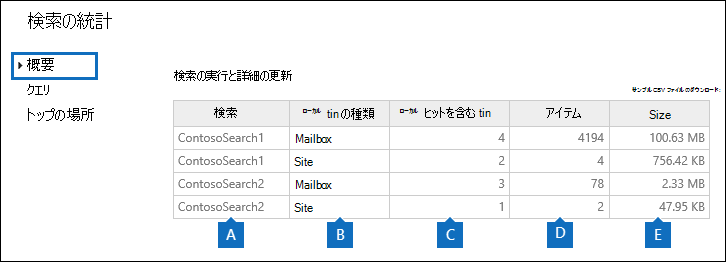
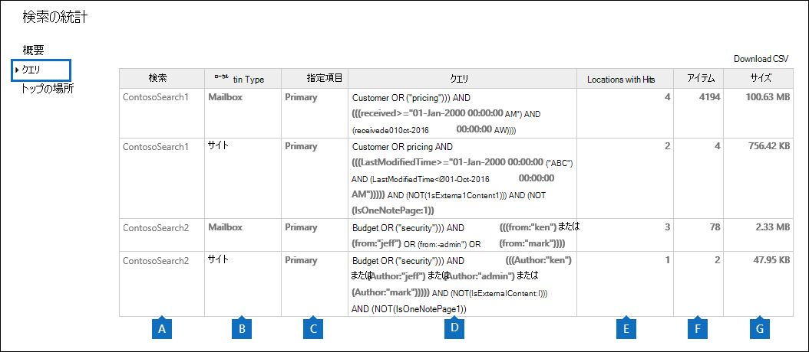
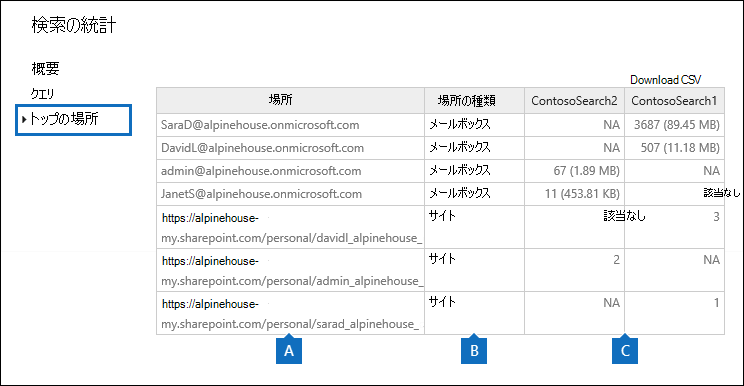

# コンテンツ検索結果のキーワード統計の表示

After you create and run a Content Search, you can view statistics about the estimated search results. This includes a summary of the search results (similar to the summary of the estimated search results displayed in the details pane), the query statistics such as the number of content locations with items that match the search query, and the name of content locations that have the most matching items. You can display statistics for one or more content searches. This lets you to quickly compare the results for multiple searches and make decisions about the effectiveness of your search queries.
  
Additionally, you can configure new and existing searches to return statistics for each keyword in a search query. This lets you compare the number of results for each keyword in a query and to compare the keyword statistics from multiple searches.
  
You can also download the search statistics and keyword statistics to a CSV file. This lets you use the filtering and sorting features in Excel to compare results, and prepare reports for your search results.
  
## コンテンツ検索の統計情報を取得する

コンテンツ検索の統計情報を表示するには:
  
1. [セキュリティ & コンプライアンスセンター] で、[**検索** \> **コンテンツ検索**] に移動します。
    
2. 検索の一覧で、検索を 1 つ以上選択して、**[検索の統計]**  をクリックします。
    
    ![複数の検索を選択してから [検索の統計] をクリックする](../media/1195c6c3-2e00-469d-8c29-85c1c7ebe6c7.png)
  
3. **[検索の統計]** ページで、次のリンクのいずれかをクリックして、選択した検索の統計情報を表示します。 
    
    **概要**
    
    This page displays statistics similar to the ones displayed in the details pane on the **Content search** page. Statistics for all selected searches are displayed. Note that you can also re-run the selected searches from this page to update the statistics. 
    
    
  
    a.  The name of the Content Search. As previously stated, you can display and compare statistics for multiple searches.
    
    b. The type of content location that was searched. Each row displays statistics for mailboxes, sites, and public folders from the specified search.
    
    c. The number of content locations containing items that match the search query. For mailboxes, this statistic also includes the number of archive mailboxes that contain items that match the search query.
    
    d. The total number of items of all specified content locations that match the search query. Examples of item types include email messages, calendar items, and documents. If an item contains multiple instances of a keyword that is being searched for, it's only counted once in the total number of items. For example, if you're searching for words "stock" or "fraud" and an email message contains three instances of the word "stock", it's only counted once in the **Items** column. 
    
    e. The total size of all items that were found in the specified content location that match the search query. 
    
    **クエリ**
    
    このページには、検索クエリに関する統計情報が表示されます。
    
    
  
    a. The name of the Content Search that the row contains query statistics for.
    
    b. The type of content location that the query statistics are applicable to.
    
    c. This column indicates which part of the search query the statistics are applicable to. **Primary** indicates the entire search query. If you use a keyword list when you create or edit a search query, statistics for each component of the query are included in this table. See the [Get keyword statistics for Content Searches](#get-keyword-statistics-for-content-searches) section in this article for more information. 
    
    d. This column contains the actual search query that run by the Content Search tool. Note that the tool automatically adds a few additional components to the query that you create. 

    - キーワードを指定せず、メールボックス内のすべてのコンテンツを検索すると、すべてのアイテムが返されるように、実際のキーワード クエリは `size>=0` のようになります。 
    
     - SharePoint Online と OneDrive for Business サイトを検索すると、次の 2 つのコンポーネントが追加されます。
    
          **NOT IsExternalContent:1** - オンプレミスの SharePoint 組織のコンテンツを除外します。 
    
          **NOT IsOneNotePage:1** - すべての OneNote ファイルを除外します。これは、これらのファイルは検索クエリと一致するドキュメントと重複するためです。 

    
    e. The number of the content locations (specified by the ** Location type ** column) that contain items that match the search query listed in the **Query** column. 
    
    f. The number of items (from the specified content location) that match the search query listed in the **Query** column. As previously explained, if an item contains multiple instances of a keyword that is being searched for, it's only counted once in the this column. 
    
    g. The total size of all items that were found (in the specified content location) that match the search query in the **Query** column. 
    
    **トップの場所**
    
    This page displays statistics about the number of items that match the search query in each content location that was searched. The top 1,000 locations are displayed. If you view statistics for multiple searches, the top 1,000 locations for each search are displayed. Note that a content location isn't included on this page if it doesn't contain any items that match the search query.
    
    
  
    a. The name of the content location.
    
    b. The type of content location that the location statistics are applicable to.
    
    c. There are columns for each search that you're displaying statistics for. This column shows the number (and total size) of items that match the search query in each content location. Note that when you're displaying statistics for multiple searches, the "NA" in this column indicates that the content location wasn't included in that search. 

## コンテンツ検索のキーワード統計情報を取得する

As previous explained, the **Queries** page shows the search query and the number (and size) of items that match the query. If you use a keyword list when you create or edit a search query, you can get enhanced statistics that show how many items match each keyword or keyword phrase. This can help you quickly identify which parts of the query are the most (and least) effective. For example, if a keyword returns a large number of items, you might choose to refine the keyword query to narrow the search results. You can set up a keyword list when you create or edit a Content Search. 

キーワード リストを作成して、コンテンツ検索のキーワード統計情報を表示するには:
  
1. [セキュリティ & コンプライアンスセンター] で、[**検索** \> **コンテンツ検索**] に移動します。
    
2. コンテンツ検索の一覧で、検索をクリックし、**[編集]**  をクリックします。
    
3. **[クエリ]** をクリックして、次のようにします。 
    
    ![[キーワード リストの表示] チェック ボックスをオンにして、各行にキーワードを入力する](../media/73ef46dd-3d5c-415d-b5e7-c3559caaafe2.png)
  
    a. Click the **Show keyword list** check box. 
    
    b. Type a keyword or keyword phase in a row in the keywords table. For example, type **budget** in the first row and then type **security** in the second row. 
    
4. 検索して統計情報を取得するキーワードを追加した後、**[検索]** をクリックして修正した検索を実行します。 
    
5. When the search is completed, select it in the list of searches, and then click **Search statistics** . You can also display and compare keyword statistics for multiple searches.
    
6. **[検索の統計]** ページで、**[クエリ]** をクリックして選択した検索のキーワード統計情報を表示します。 
    
    
  
    前のスクリーンショットで示したように、各キーワードの統計情報が表示されます。次の情報が含まれます。 
    
    - 検索に含まれるコンテンツの場所の各種類に対するキーワード統計。
    
    - 各キーワードの実際の検索クエリ。これには、検索クエリのすべての条件が含まれます。 
    
    - The complete search query (identified as **Primary** in the **Part** column) and the statistics for the complete query. Note these are the same statistics displayed on the **Summary** page. 

> [!NOTE]
> 大規模なキーワード リストによって生じる問題を軽減するため、検索クエリのキーワード リストの行は最大 20 行に設定されています。
