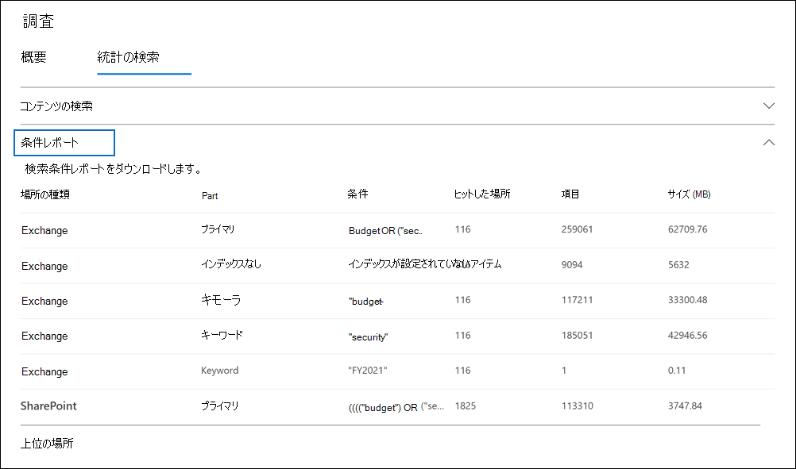

# 電子情報開示検索結果の統計情報を表示する

コンテンツ検索または Core 電子情報開示ケースに関連付けられた検索を作成して実行した後、推定検索結果に関する統計情報を表示できます。 これには、検索結果の概要 (検索フライアウト ページに表示される推定検索結果の概要と同様)、検索クエリに一致するアイテムを含むコンテンツの場所の数、最も一致するアイテムがあるコンテンツの場所の ID などのクエリ統計が含まれます。
  
さらに、キーワード リストを使用して、検索クエリ内の各キーワードの統計情報を返す検索を構成できます。 これにより、クエリ内の各キーワードによって返される結果の数を比較できます。
  
検索統計を CSV ファイルにダウンロードできます。 これにより、フィルター処理と並べ替え機能を使用して、Excelを比較し、検索結果のレポートを準備できます。
  
## 検索の統計情報を取得する

コンテンツ検索またはコア電子情報開示ケースに関連付けられた検索の統計情報を表示するには、次の方法を実行します。
  
1. [すべて表示 **Microsoft 365 コンプライアンス センター]** をクリックし、次のいずれかの操作を行います。

   - [ **コンテンツ検索] を** クリックし、検索を選択して、フライアウト ページを表示します。

     または

   - [**電子情報開示**  >  **コア]** をクリックし、ケースを選択し、[検索] タブで検索を **選択** して、フライアウト ページを表示します。

2. 選択した検索のフライアウト ページで、[検索の統計情報] **タブをクリック** します。
  
   ![[検索の統計情報] タブ。](../media/SearchStatistics1.png)

[ **検索の統計情報]** タブには、検索に関するさまざまな種類の統計情報を含む次のセクションが含まれます。

### 検索コンテンツ

このセクションでは、検索によって返される推定アイテムの概要をグラフィカルに表示します。 これは、検索条件に一致するアイテムの数を示します。 この情報は、検索によって返されるアイテムの推定数に関するアイデアを提供します。

- **場所別の推定アイテム**: 検索によって返される推定アイテムの総数。 メールボックスとサイト内にあるアイテムの特定の数も表示されます。

- **ヒットの推定場所**: 検索によって返されるアイテムを含むコンテンツの場所の総数。 メールボックスとサイトの場所の特定の数も表示されます。

- **場所別のデータボリューム (MB 単位)**: 検索によって返される推定アイテムの合計サイズ。 メールボックス アイテムとサイト アイテムの特定のサイズも表示されます。

### 条件レポート

このセクションでは、検索クエリに関する統計情報と、検索クエリの異なる部分に一致した推定アイテムの数を表示します。 これらの統計を使用して、検索クエリの各コンポーネントに一致するアイテムの数を分析できます。 これにより、検索条件を絞り込み、必要に応じて範囲を絞り込むのに役立ちます。 このレポートのコピーを CSV 形式でダウンロードできます。

- **場所の** 種類: クエリ統計が適用されるコンテンツの場所の種類。 この値は **Exchange** メールボックスの場所を示します。サイトの場所 **SharePoint** 値を指定します。

- **Part**: 統計が適用される検索クエリの一部。 **Primary は** 、検索クエリ全体を示します。 **キーワード** は、行内の統計情報が特定のキーワードに対する値を示します。 検索クエリにキーワード リストを使用する場合は、クエリの各コンポーネントの統計情報が次の表に含まれます。 詳細については、「検索の [キーワード統計を取得する」を参照してください](#get-keyword-statistics-for-searches)。

- **Condition**: 対応する行に表示される統計情報を返した検索クエリの実際のコンポーネント (キーワードまたは条件)。

- **ヒットのある場所**: [条件] 列にリストされているプライマリクエリまたはキーワード クエリに一致するアイテムを含むコンテンツの場所 ([場所の種類] 列で指定) の **数**。

- **アイテム**: [条件] 列に一覧表示されているクエリに一致するアイテムの数 (指定したコンテンツの場所 **から** )。 前に説明したように、検索中のキーワードの複数のインスタンスがアイテムに含まれている場合、この列には 1 回だけカウントされます。

- **サイズ (MB)**: [条件] 列の検索クエリに一致する (指定したコンテンツの場所で) 見つかったすべてのアイテムの **合計サイズ。**

### トップの場所

このセクションでは、検索によって返されるアイテムが最も多い特定のコンテンツの場所に関する統計情報を表示します。 上位 1,000 の場所が表示されます。 このレポートのコピーを CSV 形式でダウンロードできます。

- 場所名 (メールボックスの電子メール アドレスとサイトの URL) の名前。

- 場所の種類 (メールボックスまたはサイト)。

- 検索によって返されるコンテンツの場所のアイテムの推定数。

- 各コンテンツの場所の推定アイテムの合計サイズ。

## 検索のキーワード統計を取得する

前に説明したように、[ **条件] レポート** セクションには、検索クエリと、クエリに一致するアイテムの数 (およびサイズ) が表示されます。 検索クエリを作成または編集するときにキーワード リストを使用する場合は、各キーワードまたはキーワード フレーズに一致するアイテムの数を示す拡張統計情報を取得できます。 これにより、クエリの最も有効な部分 (および最も少ない) を迅速に特定できます。 たとえば、キーワードが多数のアイテムを返す場合は、キーワード クエリを絞り込んで検索結果を絞り込む場合があります。

キーワード リストを作成し、検索のキーワード統計を表示するには、次の方法を使用します。
  
1. 次のMicrosoft 365 コンプライアンス センター、新しいコンテンツ検索または Core 電子情報開示ケースに関連付けられた検索を作成します。

2. 検索ウィザード **の [** 条件] ページで、次の手順を実行します。 [キーワード リスト **の表示] チェック ボックスを** オンにします。

   ![[キーワード一覧を表示する] チェック ボックスをオンにします。](../media/SearchKeywordsList1.png)

3. キーワード テーブルの行にキーワードまたはキーワード フェーズを入力します。 たとえば、最初の行 **に「budget」** と入力し、2 行目に **「security」** と入力し、3 行目に **「FY2021」** と入力します。

   

   > [!NOTE]
   > 大規模なキーワード リストによって発生する問題を軽減するために、検索クエリのキーワード リストの最大 20 行に制限されています。

4. 検索して統計情報を取得するキーワードをリストに追加した後、検索を実行します。

5. 検索が完了したら、それを選択して、フライアウト ページを表示します。

6. [検索の **統計情報] タブ** で、[条件] レポート **をクリックして** 、検索のキーワード統計を表示します。

    
  
    前のスクリーンショットで示したように、各キーワードの統計情報が表示されます。次の情報が含まれます。

    - 検索に含まれるコンテンツの場所の各種類に対するキーワード統計。

    - インデックスが作成されていないメールボックス アイテムの数。

    - 各キーワードの実際の検索クエリと結果 ([パーツ] 列の **[** キーワード] として識別されます) (検索クエリの条件を含む)。

    - 完全な検索クエリ ([パーツ] 列 **でプライマリ** として識別) と、場所の種類ごとに完全なクエリの統計情報。 これらは、[概要] タブに表示される統計 **と同じ点に注意** してください。
