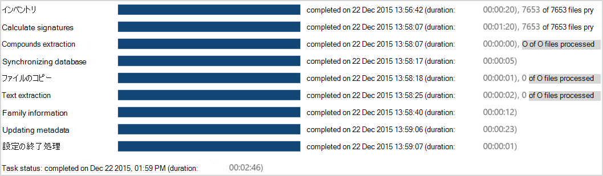

# プロセス モジュールの結果を Advanced eDiscovery (クラシック) で表示する

準備 **プロセス** \> **が開始** された後、進行状況と結果を表示できます。 
  
> [!NOTE]
> Advanced eDiscovery を使用するには、Advanced Compliance アドオンがインストールされた Office 365 E3 サブスクリプション、または E5 サブスクリプションがお客様の組織で必要になります。このプランを利用しておらず、Advanced eDiscovery をお試しになりたい場合は、[Office 365 Enterprise E5 の試用版にサインアップ](https://go.microsoft.com/fwlink/p/?LinkID=698279)してください。 
  
## タスクの状態を処理する

[**プロセス** \> **の準備の** 結果] ページには、次の例に示すように、現在の状態 (プロセスが現在実行中の場合) または最後のプロセス状態タスクの状態 \> が表示されます。
  

  
表示されるタスクは、選択されている [プロセス] オプションによって異なる場合があります。 
  
- **Inventory**: Advanced eDiscovery は、プロセス用に選択されたファイルを反復処理し、基本的なデータ収集を実行します。
    
- **署名の計算**: MD5 デジタル署名を計算します。
    
- **複合抽出**: 複合ファイル (PST、ZIP、MSG など) から内部ファイルまたは含まれているファイルを再帰的に抽出します。 抽出されたファイルは、ケースのケース フォルダーに格納されます。
    
- **データベースの同期**: 内部データベース プロセス。
    
- **ファイル コピー**: プロセス ファイルをコピーします。 [ファイルのコピー] オプションが選択されている場合でも、このタスクは常に表示されます。
    
- **テキスト抽出**: ネイティブ ファイルがある場合、Advanced eDiscovery は DTSearch を使用してこれらのファイルからテキストを抽出します。 抽出されたこれらのファイルのテキストは、ケース フォルダーにテキスト ファイルとして格納されます。
    
- **メタデータの更新**: 読み込まれたメタデータを処理します。 
    
- **最終処理**: 読み込まれたケース ファイルのデータを最終処理する内部処理 (エラー ファイルや成功ファイルの特定など)。 
    
タスクの状態: タスクの完了後に表示されます。 タスクの実行中は、実行期間が表示されます。
  
> [!NOTE]
> 完了したタスクには、処理を完了したファイルまたはエラーのあるファイルの合計も含まれる場合があります。 
  
> [!TIP]
> "キャンセル" は、プロセスの実行を停止し、前のデータ群または保存された処理済みデータにロールバックするロールバック オプションを提供します。 ロールバックは、処理されたデータをすべてクリアします。 処理されたデータが失われたくない場合 (たとえば、これらのファイルを再読み込みする場合) は、このウィンドウの [キャンセル] オプションを選択してロールバックしない選択をします。 
  
## プロセスの概要

[プロセス結果処理の準備] の概要では、正常なファイル処理とエラー結果に従って、読み込まれたファイルの結果の \> \> \> 内訳が表示されます。
  
次のように、ウィンドウにはインポートされたファイル統計のグラフィック表示が表示されます。
  
- **プロセスの概要は** d: ケース内のすべてのファイルを蓄積します。
    
- **最後のプロセスの概要**: 最後のセッションまたはアクションから読み込まれたファイル。 
    
- **家族の最後**: ケース内の家族情報 (場合)。
    
- シード **ファイル** が追加された場合は、ファイルに対して定義された問題ごとにシード ファイルの数が一覧表示されます。 
    
    シード ファイルのマーキング **が失敗** した場合は、そのマークも示されます。 
    
- 事前 **にタグ付け** されたファイルが追加された場合、ファイルに対して定義された問題ごとに、事前にタグ付けされたファイルの数が一覧表示されます。 
    
    事前にタグ付 **けされたファイルの** マーキングが失敗した場合も、そのマークは示されます。 
    

  
## 積み上がったグラフと最後のグラフのプロセス サマリー

左側のバーには、ソースと抽出されたファイルが含まれています。すべてのファイルが見つかりました。 
  
右側のバー (処理) には、次が含まれます。
  
- 読み込みエラーが発生したファイル
    
- ファイルが正常に読み込まれます。次のものが含まれる場合があります。 
    
  - **既存 :** 以前に読み込まれ、再び読み込まれるファイル (重複を含む)
    
  - **テキスト**: テキストを含む一意のファイル。
    
  - **テキスト以外**: 空のテキスト ファイル、空のネイティブ テキスト ファイル、ネイティブの非テキスト ファイル。 
    
  - **重複する** s: テキストを含むファイルを複製します。
    
## 最後のプロセス エラー

[Prepare Process Results Last process errors] (プロセスの最後の処理エラーの準備) に、最後に実行されたセッションまたはアクションのエラー \> \> \> の詳細が表示されます。
  

  
## 関連項目

[Advanced eDiscovery (クラシック)](office-365-advanced-ediscovery.md)
  
[プロセス モジュールの実行とデータの読み込み](run-the-process-module-and-load-data-in-advanced-ediscovery.md)

