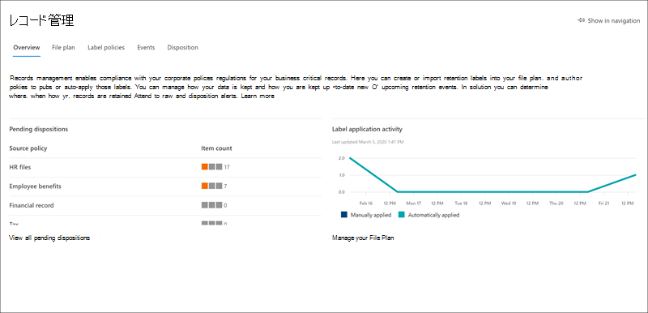

# Microsoft 365 コンプライアンスセンターの新機能What's new in the Microsoft 365 compliance center

[Microsoft 365 コンプライアンスセンター](microsoft-365-compliance-center.md)に新機能を継続的に追加し、学習した問題を修正し、フィードバックに基づいて変更を加えています。We're continuously adding new features to the [Microsoft 365 compliance center](microsoft-365-compliance-center.md), fixing issues we learn about, and making changes based on your feedback. お客様が現在利用できるものを確認するには、次のようにしてください。Take a look below to see what's available for you today. 一部の機能は、お客様のさまざまなスピードでロールアウトされます。Some features get rolled out at different speeds to our customers. 機能がまだ表示されていない場合は、[対象のリリース](https://docs.microsoft.com/office365/admin/manage/release-options-in-office-365)に追加してみてください。If you aren't seeing a feature yet, try adding yourself to [targeted release](https://docs.microsoft.com/office365/admin/manage/release-options-in-office-365).

> [!TIP]
> 他の管理センターでは何が起こっているのでしょうか。Interested in what's going on in other admin centers? 次の記事をご覧ください。Check out these articles: [Microsoft 365 管理センターの新機能What's new in the Microsoft 365 admin center](https://docs.microsoft.com/office365/admin/whats-new-in-preview?view=o365-worldwide) [SharePoint 管理センターの新機能What's new in the SharePoint admin center](https://docs.microsoft.com/sharepoint/what-s-new-in-admin-center)  
また、 [microsoft 365 ロードマップ](https://www.microsoft.com/en-us/microsoft-365/roadmap)を参照して、起動された、展開中の、開発中である、キャンセルされた、または既にリリースされた microsoft 365 の機能について説明します。And visit the [Microsoft 365 Roadmap](https://www.microsoft.com/en-us/microsoft-365/roadmap) to learn about Microsoft 365 features that were launched, are rolling out, are in development, have been cancelled, or previously released.

## 2020 年 2 月February 2020

### Insider リスク管理が正式にリリースされているInsider risk management is officially released

ドラムロール (ご記入ください)Drum roll, please... Insider リスク管理は、次のサブスクリプションを使用する組織で使用できるようになりました。Insider risk management is now available to organizations with the following subscriptions:

- [Microsoft 365 E5](https://go.microsoft.com/fwlink/?linkid=2120431) (有料または試用版)[Microsoft 365 E5](https://go.microsoft.com/fwlink/?linkid=2120431) (paid or trial)
- Microsoft 365 Enterprise E3 サブスクリプションと[Microsoft E5 コンプライアンスアドオン](https://go.microsoft.com/fwlink/?linkid=2120432)Microsoft 365 Enterprise E3 subscription with the [Microsoft E5 Compliance add-on](https://go.microsoft.com/fwlink/?linkid=2120432)

プレビューリリース後に、[新しい役割グループ](insider-risk-management-configure.md#step-1-required-enable-permissions-for-insider-risk-management)と[ソリューションレベルの設定](insider-risk-management-configure.md#step-4-required-configure-insider-risk-settings)を含むいくつかの改善を行いました。Heads up that we made some improvements since the preview release, including [new role groups](insider-risk-management-configure.md#step-1-required-enable-permissions-for-insider-risk-management) and [solution-wide settings](insider-risk-management-configure.md#step-4-required-configure-insider-risk-settings).

そのため、ソリューションを使用するときにはフィードバックを残して、改善を続けられるようにしてください。As always, please leave feedback as you use the solution so we can continue to make improvements.

### レコード管理Records management

この新しいソリューションにより、すべてのレコード管理機能が1つの包括的な下に表示されます。This new solution brings all the records management capabilities under a single umbrella. 重要な点としては、SharePoint と OneDrive のレコードバージョン管理の導入やレコードの廃棄証明が挙げられます。Highlights include the introduction of records versioning for SharePoint and OneDrive and proof of disposal for records.

[レコード管理についての詳細情報Learn more about records management](records-management.md)

### ソリューションスポットライト: Facebook および Twitter のデータコネクタSolution spotlight: Data connectors for Facebook and Twitter

先月[リリース](#just-launched)されたデータコネクタは、次のコネクタをテストするためのヘルプを探しています。Data connectors [released last month](#just-launched) and we're looking for your help in testing out the following connectors.

- [Facebook ビジネスページ](archive-facebook-data-with-sample-connector.md)[Facebook business pages](archive-facebook-data-with-sample-connector.md). Facebook のビジネスページのデータをインポートし、Microsoft 365 にアーカイブします。Imports and archives data from Facebook business pages to Microsoft 365. レコード管理や電子情報開示などのコンプライアンスソリューションに役立ちます。Beneficial for compliance solutions such as records management and eDiscovery.
- [Twitter](archive-twitter-data-with-sample-connector.md)。[Twitter](archive-twitter-data-with-sample-connector.md). Twitter から Microsoft 365 にデータをインポートしてアーカイブします。Imports and archives data from Twitter to Microsoft 365. レコード管理や電子情報開示などのコンプライアンスソリューションに役立ちます。Beneficial for compliance solutions such as records management and eDiscovery.

これらのコネクタを設定して検証するときには、何がうまくいったのか、何ができなかったのか、また、操作を改善するためにできることについてのフィードバックをお寄せください。As you set up and validate these connectors, please leave us feedback about what went well, what didn't, and what we can do to improve the experience.

## 2020 年 1 月January 2020

待機が終了しています。The wait is over. Microsoft 365 コンプライアンスセンターは、Microsoft 365、Office 365、Enterprise Mobility + Security (EMS)、および Windows 10 Enterprise プランを使用しているすべてのお客様が利用できることを嬉しくお勧めいたします。We're pleased to announce that the Microsoft 365 compliance center is available to all customers with Microsoft 365, Office 365, Enterprise Mobility + Security (EMS), and Windows 10 Enterprise plans. セキュリティ & コンプライアンスセンターで管理していたすべてのデータやポリシーは、コンプライアンスセンターで利用できます。そのため、前後に移動する必要はありません。Any data or policies you were managing in the Security & Compliance Center are available in the compliance center, so no need to jump back and forth.

> [!TIP]
> 最近プレビューした[新しいソリューション](#new-compliance-solutions)の一部、およびセキュリティ & コンプライアンスセンターからのコンプライアンス機能が Microsoft 365 で有効になっていることを示す[ロードマップ](#updated-compliance-solutions)については、先月の「更新」を参照してください。Read through last month's update again for a refresher on some of the [new solutions](#new-compliance-solutions) we previewed recently, as well as a [roadmap](#updated-compliance-solutions) showing where compliance features from the Security & Compliance Center now live in Microsoft 365.

[https://compliance.microsoft.com](https://compliance.microsoft.com)組織全体にわたるコンプライアンスを管理するためのワンストップショップのツアーを開始するには、今すぐにブックマークを作成してください。詳細については、[この記事を参照](microsoft-365-compliance-center.md)してください。Bookmark and head over now to [https://compliance.microsoft.com](https://compliance.microsoft.com) to tour your one-stop-shop for managing compliance across your org...or [read this article](microsoft-365-compliance-center.md) to dig in a bit more.

また、今月の新規および更新されたソリューションもリリースしました。We also released new and updated solutions this month. 強調表示の概要は次のとおりです。Here's a quick glance at the highlights.

### 現在はプレビューNow in preview

**Insider リスク管理 (プレビュー)****Insider risk management (preview)**

これで、insider のリスク管理ソリューションが公開プレビューであることがわかります。We're happy to announce that our insider risk management solution is now in public preview. 簡単に言うと、insider リスク管理は、次のような情報を提供することで、組織がインテリジェントに内部のリスクを特定し、アクションを実行できるようにします。In a nutshell, insider risk management helps your organization intelligently identify and take action on insider risks by providing:

- ユーザーのプライバシーを確保するための匿名性制御。Anonymity controls to help ensure user privacy.
- 内部の脅威 (データリークなど) を識別するネイティブおよびサードパーティの指標を使用したインテリジェントポリシーテンプレート。Intelligent policy templates with native and third-party indicators that identify insider threats, such as data leaks.
- IT、人事、および法務チーム全体にわたる、統合されたエンドツーエンドの調査ワークフロー。Integrated end-to-end investigation workflows that span across IT, HR and legal teams.

ご感想をお聞かせください。We'd love to hear what you think. ソリューションを使用している間に、フィードバックをお寄せください。これにより、一般的な可用性に至るまでのニーズを満たすことができるようになります。As you use the solution, leave us feedback so we can make sure we're meeting your needs as we head toward general availability.

[Insider リスク管理の詳細情報Learn more about insider risk management](insider-risk-management.md)

### 開始したばかりJust launched

**通信コンプライアンス****Communication compliance**

Graduating は、プレビュー段階から完全な可用性まで、コミュニケーションコンプライアンスは新しい insider リスクソリューションセットの主要なコンポーネントです。Graduating from the preview phase to full availability, communication compliance is a key component of our new insider risk solution set. この堅牢なソリューションにより、組織の標準に準拠していないメッセージの検出、調査、修復処理を行うためのワークフローを使用して、コミュニケーションリスクを最小限に抑えることができます。This robust solution helps minimize communication risks using workflows for detecting, investigating, and taking remediation actions for messages that don't meet your organization's standards.

プレビュー中のお客様からのフィードバックはすばらしいものでした。Customer feedback during the preview was fantastic. 開始、調査、修復処理の改善など、いくつかの機能強化が行われています。It resulted in several enhancements, including a first-run experience to get you started, improvements to investigation and remediation actions, and more.

[通信のコンプライアンスに関する詳細情報Learn more about communication compliance](communication-compliance.md)

![Microsoft 365 コンプライアンスセンターの [通信コンプライアンス] ページで、最初のカードの案内画面が表示されている](../media/mcc-communication-compliance-page-with-fre.png)

**データコネクタ****Data connectors**

以前は、Office 365 セキュリティ & コンプライアンスセンターの他の「インポート」機能とのスペースを共有しています。データコネクタは、Microsoft 365 コンプライアンスセンターで独自のホームになっています。Formerly sharing space with other 'Import' features in the Office 365 Security & Compliance Center, data connectors now have their very own home in the Microsoft 365 compliance center. 新しい [データコネクタ] ページを使用して、組織の人事 (HR) ファイルと、さまざまなサードパーティ製プラットフォーム (Facebook、LinkedIn、Twitter、インスタント Bloomberg など) のデータを Microsoft 365 組織のメールボックスにインポートおよびアーカイブします。Use the new 'Data connectors' page to import and archive data from your organization's human resources (HR) files and various third-party platforms (like Facebook, LinkedIn, Twitter, and Instant Bloomberg) to mailboxes in your Microsoft 365 organization. インポートされると、このデータは、電子情報開示、insider リスク管理、コミュニケーションコンプライアンス、監査、アイテム保持ポリシーなどを含む、いくつかのコンプライアンスソリューションで管理できます。Once imported, this data can be managed in several compliance solutions, including eDiscovery, insider risk management, communication compliance, audit, retention policies, and more.

[データコネクタの詳細情報Learn more about data connectors](archiving-third-party-data.md)

### 注目すべき更新プログラムNoteworthy updates

**コンプライアンススコアの新しい評価テンプレート (プレビュー)****New assessment templates for Compliance Score (preview)**

常に努力していくことにより、絶えず進化するコンプライアンスに役立てられるようになり、コンプライアンススコアチームは新しい一連のテンプレートを提供し、最近の規制に対する組織のコンプライアンスを評価し、より効果的な制御を実装する方法に関するガイダンスを得ることができます。Always working hard to help you get ahead of the ever-evolving compliance landscape, our Compliance Score team shipped a new set of templates to help you assess your organization's compliance posture against recent regulations and get guidance on how to implement more effective controls. 次の新しいテンプレートが表示られるようになります。You'll see new templates for:

- ISO/IEC 27701:2019ISO/IEC 27701:2019
- カリフォルニア州消費者プライバシー法 (CCPA)California Consumer Privacy Act (CCPA)
- ブラジルの一般データ保護法 (Lei Geral de Proteção de Dados-LGPD)Brazil General Data Protection Law (Lei Geral de Proteção de Dados - LGPD)
- SOC 1 タイプ2および SOC 2 タイプ2SOC 1 Type 2 and SOC 2 Type 2

[コンプライアンススコアテンプレートの詳細情報Learn more about Compliance Score templates](compliance-score.md#templates)

## 2019年12月 &November & December 2019

休日に加えて、Ignite でデモされていたすべての高度なコンプライアンスソリューションのロールアウトを開始しました。Over the holidays, we started rolling out all the great compliance solutions that were demo'd at Ignite. ほとんどはプレビュー状態であるため、それをテストして、コンプライアンスセンターの右下でフィードバックカードを開いて、ご意見をお聞かせください。Most are in a preview state, so test them out and be sure to let us know what you think by opening the Feedback card at the bottom right of the compliance center.

### 新しい近隣を理解するGet to know the new neighborhood

新しい Microsoft 365 コンプライアンスセンターには、新しいソリューションに加えて、Office 365 セキュリティ & コンプライアンスセンターで熟知しているコンプライアンス機能が含まれています。The new Microsoft 365 compliance center includes brand new solutions as well as the compliance features you know and love from the Office 365 Security & Compliance Center. 詳細については、さらに詳しく説明します。Let's dig in a bit more…

#### 新しいコンプライアンスソリューションNew compliance solutions

*ソリューション*について疑問があるかもしれません。You might be wondering what a *solution* is. クラウドがビジネスを遂行する方法によって革命になるにつれて、データの盗用や不正行為の新たな方法や、必要とされる新しい規制についても、このドアを開くことができます。As much as the cloud has revolutionized the way business is done, it's also opened the door for new methods of data theft and fraud and necessitated new regulations. コンプライアンスソリューションは、これらの進化したコンプライアンス要件を管理するのに役立つ統合された機能の集合です。Our compliance solutions are collections of integrated capabilities that can help you help you manage these evolving compliance requirements. ソリューションの機能には、ポリシー、警告、レポートなどの組み合わせが含まれることがあります。A solution's capabilities might include a combination of policies, alerts, reports, and more.

ここでは、次のような新しいソリューションについて概要を説明します。Here's a summary of the new solutions you'll find. 近日中に他のユーザーが閲覧できるようにしておきます。Keep an eye out for others coming soon.

> [!NOTE]
> これらのソリューションは、Microsoft 365 コンプライアンスセンターのみにあります。These solutions are located only in the Microsoft 365 compliance center. Office 365 セキュリティ & コンプライアンスセンターで管理することはできません。They can't be managed in the Office 365 Security & Compliance Center.
 

|**新しいソリューション****New solution**|**説明****Description**|**詳細情報****Learn more**|
|:-----|:-----|:-----|
|Microsoft コンプライアンススコア (プレビュー)Microsoft Compliance Score (preview)  |コンプライアンス[マネージャー](compliance-manager-overview.md)を基にしたコンプライアンススコアは、よりシンプルでわかりやすい設計を備えたスタンドアロンの機能です。これにより、組織の法令遵守状況を理解し、改善することができます。Built from [Compliance Manager](compliance-manager-overview.md), Compliance Score is a standalone feature with a simpler, more user-friendly design that helps you understand and improve your organization's compliance posture. データ保護および規制標準に関するリスクを軽減するために、進行状況を測定するリスクベースのスコアを計算します。It calculates a risk-based score measuring your progress in completing actions that help reduce risks around data protection and regulatory standards.  |[Microsoft コンプライアンススコアの概要 (プレビュー)Overview of Microsoft Compliance Score (preview)](compliance-score.md)|
|ソリューションカタログ (プレビュー)Solution catalog (preview)  |ソリューションカタログは、コンプライアンスおよびリスク管理ソリューションの発見、学習、迅速な開始を行うためのワンストップショップです。The solution catalog is your one-stop-shop for discovering, learning about, and quickly getting started with our compliance and risk management solutions. カタログは3つのコンプライアンスカテゴリに編成されており、それぞれにカテゴリを構成するソリューションに関する詳細が含まれています。The catalog is organized into three compliance categories, each containing details about the solutions that make up that category. カテゴリには、情報保護 & ガバナンス、Insider リスク管理、検出 & 応答が含まれます。Categories include Information protection & governance, Insider risk management, and Discovery & response  |[ソリューションカタログの概要 (プレビュー)Overview of the solution catalog (preview)](microsoft-365-solution-catalog.md)|
|通信のコンプライアンス (プレビュー)Communication compliance (preview)  |コミュニケーションへのコンプライアンスは、組織内の不適切なメッセージに対する修復アクションを検出、取得、および実行できるようにすることで、コミュニケーションリスクを最小限にするために役立つ、新しい insider リスク管理カテゴリに含まれています。Communication compliance is part of the new insider risk management category that helps minimize communication risks by helping you detect, capture, and take remediation actions for inappropriate messages in your organization. このソリューションでは、インテリジェントテンプレート、柔軟な修復ワークフロー、実践的な洞察など、いくつかの新しい拡張機能を導入することで、Office 365 の監督ポリシーの機能が拡張されています。The solution extends the capabilities of supervision policies in Office 365 by introducing several new enhancements such as intelligent templates, flexible remediation workflows, and actionable insights.  |[Microsoft 365 の通信コンプライアンス (プレビュー)Communication compliance in Microsoft 365 (preview)](communication-compliance.md)|
|データ分類 (プレビュー)Data classification (preview)  |新しいデータ分類ページには、組織全体のコンテンツに機密情報とラベル (保持と機密情報) がどのように使用されているかを検出して評価するのに役立つ、強力な洞察とツールが含まれています。Our new Data classification page contains powerful insights and tools to help you discover and evaluate how sensitive info and labels (retention and sensitivity) are being used in content across your organization. 機密情報が含まれている、またはラベルが適用されているコンテンツを確認し、Microsoft 365 の場所にまたがるラベルアクティビティを調査し、カスタムの機密情報の種類を作成するなど、さまざまな内容を確認します。Review content that contains sensitive info or has labels applied, explore label activity across Microsoft 365 locations, create custom sensitive info types, and much more. |[データ分類の概要 (プレビュー)Data classification overview (preview)](data-classification-overview.md)|
|Trainable 分類子 (プレビュー)Trainable classifiers (preview)  |この強力な新しいツールは、機械学習エンジンを使用して、規制文書や従業員契約書など、組織内のコンテンツのカテゴリを特定するのに役立ちます。This powerful new tool uses our machine learning engine to help identify categories of content in your org, like regulatory docs or employee agreements. 作成した分類子は、いくつかのコンプライアンスソリューションで使用して、関連するコンテンツを検出し、それを分類し、保護し、その他の情報を保持することができます。Once created, classifiers can be used in several compliance solutions to detect related content and classify it, protect it, retain it, and more. |[トレーニング可能な分類子の使用を開始する (プレビュー)Getting started with trainable classifiers (preview)](classifier-getting-started-with.md)|

#### コンプライアンスソリューションの更新Updated compliance solutions

コンプライアンスのニーズに応じて Office 365 セキュリティ & コンプライアンスセンターを使用している場合は、一部の機能が新しい Microsoft 365 コンプライアンスセンターで有効になっていることを不思議に思うかもしれません。If you've been using the Office 365 Security & Compliance Center for your compliance needs, you might wonder where some features now live in the new Microsoft 365 compliance center. 新しい自宅を見つけるのに役立つクイックロードマップを次に示します。Here's a quick roadmap to help find their new homes.

> [!NOTE]
> 一部の機能は依然として Office 365 セキュリティ & コンプライアンスセンターでのみ利用できます。Some features are still available only in the Office 365 Security & Compliance Center – these are noted below. しかし、Microsoft 365 コンプライアンスセンターでは、これらをプレビューするのは困難なので、更新プログラムを常にチューニングするように努力しています。But we're working hard to preview these in the Microsoft 365 compliance center, so stay tuned for updates. 
 

|**機能****Feature**|**Office 365 セキュリティ/コンプライアンス センター****Office 365 Security & Compliance Center**|**Microsoft 365 コンプライアンス センター****Microsoft 365 compliance center**|**詳細情報****Learn more**|
|:-----|:-----|:-----|:-----|
|Advanced eDiscoveryAdvanced eDiscovery|電子情報開示 > の高度な電子情報開示eDiscovery > Advanced eDiscovery   https://protection.office.com/advancedediscoverycases |電子情報開示 > の詳細eDiscovery > Advanced   https://compliance.microsoft.com/advancedediscovery | [Microsoft 365 の高度な電子情報開示ソリューションの概要Overview of the Advanced eDiscovery solution in Microsoft 365](overview-ediscovery-20.md) |
|ポリシーを通知するAlert policies|通知 > 警告ポリシーAlerts > Alert policies   https://protection.office.com/alertpolicies |現時点では、アラートポリシーは Office 365 セキュリティ & コンプライアンスセンターでのみ管理されます。At this time, alert policies are managed only in the Office 365 Security & Compliance Center. |[セキュリティ/コンプライアンス センターのアラート ポリシーAlert policies in the security and compliance center](alert-policies.md) |
|アラートAlerts|通知 > 表示する通知Alerts > View alerts   https://protection.office.com/viewalerts |アラートAlerts   https://compliance.microsoft.com/compliancealerts |[通知の表示Viewing alerts](alert-policies.md#viewing-alerts)|
|アーカイブArchive|情報ガバナンス > アーカイブInformation governance > Archive   https://protection.office.com/archiving |情報ガバナンス > [アーカイブ] タブInformation governance > Archive tab   https://compliance.microsoft.com/informationgovernance?viewid=archive |[アーカイブ メールボックスの有効化Enable archive mailboxes](enable-archive-mailboxes.md)|
|監査ログ検索Audit log search|検索 > 監査ログの検索Search > Audit log search   https://protection.office.com/unifiedauditlog |監査Audit   https://compliance.microsoft.com/auditlogsearch | [セキュリティ & コンプライアンスセンターで監査ログを検索するSearch the audit log in the Security & Compliance Center](search-the-audit-log-in-security-and-compliance.md)|
|コンテンツ検索Content search|検索 > コンテンツ検索Search > Content search   https://protection.office.com/contentsearchbeta?ContentOnly=1 | コンテンツ検索Content search   https://compliance.microsoft.com/contentsearch |[Office 365 のコンテンツを検索するSearch for content in Office 365](search-for-content.md) |
|データコネクタData connectors|情報ガバナンス > サードパーティのデータをアーカイブするInformation governance > Archive third-party data   https://protection.office.com/nativeconnector | データコネクタData connectors   https://compliance.microsoft.com/connectorlanding |[サード パーティのデータをアーカイブするArchive third-party data](archiving-third-party-data.md)|
|データ損失防止Data loss prevention|データ損失防止Data loss prevention   https://protection.office.com/datalossprevention |データ損失防止Data loss prevention   https://compliance.microsoft.com/datalossprevention |[データ損失防止の概要Overview of data loss prevention](data-loss-prevention-policies.md)|
|データ主体要求Data subject requests |データのプライバシー > データ主体要求Data privacy > Data subject requests   https://protection.office.com/dsrcases |データ主体要求Data subject requests   https://compliance.microsoft.com/datasubjectrequest |[DSR ケースツールを使用して GDPR データ主体要求を管理するManage GDPR data subject requests with the DSR case tool](manage-gdpr-data-subject-requests-with-the-dsr-case-tool.md)|
|電子情報開示eDiscovery|電子情報開示 > 電子情報開示eDiscovery > eDiscovery   https://protection.office.com/ediscoveryv1 |電子情報開示 > コアeDiscovery > Core   https://compliance.microsoft.com/classicediscovery |[eDiscovery ケースを管理するManage eDiscovery cases](ediscovery-cases.md) |
|イベントEvents|レコード管理 > イベントRecords management > Events   https://protection.office.com/events |レコード管理 > [イベント] タブRecords management > Events tab   https://compliance.microsoft.com/recordsmanagement?viewid=events |[イベント ベースの保持の概要Overview of event-driven retention](event-driven-retention.md)|
|ファイル計画File plan|レコード管理 > ファイル計画Records management > File plan   https://protection.office.com/fileplan |レコード管理 > ファイル計画] タブRecords management > File plan tab   https://compliance.microsoft.com/recordsmanagement?viewid=fileplan |[ファイル計画を使用して保持ラベルを管理するUse file plan to manage retention labels](file-plan-manager.md)|
|PST ファイルのインポートImport PST files|情報ガバナンス > PST ファイルのインポートInformation governance > Import PST files   https://protection.office.com/importV2 |情報ガバナンス > インポート] タブInformation governance > Import tab   https://compliance.microsoft.com/informationgovernance?viewid=import |[組織の PST ファイルのインポートの概要Overview of importing your organization's PST files](importing-pst-files-to-office-365.md)|
|ラベルアクティビティエクスプローラーLabel activity explorer|情報ガバナンス > ラベルアクティビティエクスプローラーInformation governance > Label activity explorer   https://protection.office.com/labelexplorer |データ分類 > アクティビティエクスプローラータブData classification > Activity explorer tab   https://compliance.microsoft.com/dataclassification?viewid=activitiesexplorer |[ラベル付きコンテンツのアクティビティを表示する (プレビュー)View activity on your labeled content (preview)](data-classification-activity-explorer.md)|
|保持ラベルとラベルポリシーRetention labels and label policies |[ラベル] タブと [ラベルポリシー] タブ > の > 保持ラベルの分類Classification > Retention labels > Labels and Label policies tabs   https://protection.office.com/retentionlabels |情報ガバナンス > ラベルとラベルポリシー] タブInformation governance > Labels and Label policies tabs   https://compliance.microsoft.com/informationgovernance?viewid=labels   https://compliance.microsoft.com/informationgovernance?viewid=labelpolicies | 「[保持ラベルの概要](labels.md)」を参照してください。[Overview of retention labels](labels.md)|
|アイテム保持ポリシーRetention policies|情報ガバナンス > の保持Information governance > Retention   https://protection.office.com/retention |情報ガバナンス > [保持] タブInformation governance > Retention tab   https://compliance.microsoft.com/informationgovernance?viewid=retention |[アイテム保持ポリシーの概要Overview of retention policies](retention-policies.md)|
|機密情報の種類Sensitive info types|機密情報の種類 > 分類Classification > Sensitive info types   https://protection.office.com/sensitivetypes |データ分類 > 機密情報の種類] タブData classification > Sensitive info types tab   https://compliance.microsoft.com/dataclassification?viewid=sensitiveinfotypes |[機密情報の種類のエンティティ定義Sensitive information type entity definitions](sensitive-information-type-entity-definitions.md)|
|機密ラベルとラベルポリシーSensitivity labels and label policies|[ラベル] タブと [ラベルポリシー] タブ > 機密ラベルの分類 >Classification > Sensitivity labels > Labels and Label policies tabs   https://protection.office.com/sensitivity |情報保護 > ラベルとラベルポリシー] タブInformation protection > Labels and Label policies tabs   https://compliance.microsoft.com/informationprotection?viewid=sensitivitylabels   https://compliance.microsoft.com/informationprotection?viewid=sensitivitylabelpolicies |[秘密度ラベルの詳細Learn about sensitivity labels](sensitivity-labels.md) |
|サービス アシュアランスService assurance|サービス アシュアランスService assurance   https://protection.office.com/serviceassurance/dashboard |現時点では、サービス保証のリソースには、Office 365 セキュリティ & コンプライアンスセンターのみがアクセスできます。At this time, service assurance resources can only be accessed in the Office 365 Security & Compliance Center. |[セキュリティ & コンプライアンスセンターのサービスアシュアランスService assurance in the Security & Compliance Center](service-assurance.md)|
|監督Supervision|監督Supervision   https://protection.office.com/supervisoryreviewv2 |通信コンプライアンスCommunication compliance   https://compliance.microsoft.com/supervisoryreview |[Microsoft 365 の通信コンプライアンス (プレビュー)Communication compliance in Microsoft 365 (preview)](communication-compliance.md) |

## 2019 年 9 月September 2019

今月リリースのリリース前に静かになる理由をご確認ください。Wondering why it's quiet on the release front this month? マイクロソフトは、11月に[Microsoft Ignite](https://www.microsoft.com/ignite)で最近される新しい革新的なコンプライアンスソリューションの構築に取り組んでいます。We're heads down building new, innovative compliance solutions that'll be unveiled at [Microsoft Ignite](https://www.microsoft.com/ignite) in November. 引き続きご調整ください。Stay tuned!

### 機密ラベルの新しい暗号化オプションNew encryption options for sensitivity labels 

機密ラベルの暗号化を構成する場合、次の2つのオプションがあるので、ユーザーはラベルを電子メールやドキュメントに手動で適用するときにアクセス許可を割り当てることができます。When configuring encryption for a sensitivity label, you now have two options that lets users assign permissions when they manually apply the label to email and docs: 
- **Outlook 電子メール**にラベルを適用する場合、ユーザーは [転送不可] オプションに相当する制限を適用できます。When applying the label to **Outlook email**, users can enforce restrictions equivalent to the Do Not Forward option. 受信者は、メッセージを読み取ることはできますが、コンテンツを転送、印刷、またはコピーすることはできません。Recipients will be able to read the message but not forward, print, or copy the content.
- **Word、PowerPoint、Excel**の各ファイルにラベルを適用すると、ユーザーは特定のユーザーやグループにアクセス許可を割り当てるように求められます。When applying the label to **Word, PowerPoint, and Excel files**, users will be prompted to assign access permissions to specific users and groups.

[詳細情報Learn more](encryption-sensitivity-labels.md#let-users-assign-permissions)

## 2019 年 8 月August 2019

### データ調査への更新Update to data investigations

データの調査を実行すると、元の場所からアイテムを削除できるようになります。When performing a data investigation, you can now delete items from their original locations. これは、組織全体の Exchange メールボックス、SharePoint サイト、および OneDrive アカウントからアイテムを削除できることを意味します。This means you can delete items from Exchange mailboxes, SharePoint sites, and OneDrive accounts across your organization. アイテムを証拠として収集したため、証拠セットに保存されたアイテムのコピーが、さらに参考になるか、参照として保持することができます。Because you collected the items as evidence, you'll have copies of them retained in the evidence set to you can investigate further or just keep as a reference. [詳細情報Learn more](manage-data-spillage-incidents.md#step-4-delete-the-spilled-data) 

## 2019 年 7 月July 2019

### 新しい管理者の役割New admin roles

組織のセキュリティとコンプライアンスを管理するために、2つの新しい管理者の役割をリリースしました。すべての友人に連絡します。We released two new admin roles to help manage security and compliance in your org. Tell all your friends.

- **コンプライアンスデータ管理者**。この役割を持つユーザーは、Microsoft 365 コンプライアンスセンター、Microsoft 365 管理センター、および Azure のデータを保護および追跡するためのアクセス許可を持っています。**Compliance data admin**. Users with this role have permissions to protect and track data in the Microsoft 365 compliance center, Microsoft 365 admin center, and Azure. また、Exchange 管理センター、コンプライアンスマネージャー、Teams & Skype for Business 管理センターを管理したり、Azure および Microsoft 365 のサポートチケットを作成したりすることもできます。They can also manage everything the Exchange admin center, Compliance Manager, Teams & Skype for Business admin center and create support tickets for Azure and Microsoft 365.
- **セキュリティオペレーター**。**Security operator**. この役割を持つユーザーは、通知を管理し、Microsoft 365 セキュリティセンター、Azure Active Directory、Id 保護、特権 Id 管理、および Office 365 Security & コンプライアンスセンターのすべてを含む、セキュリティ関連機能へのグローバルな読み取り専用アクセスを持つことができます。Users with this role can manage alerts and have global read-only access to security-related features, including everything in the Microsoft 365 security center, Azure Active Directory, Identity Protection, Privileged Identity Management and Office 365 Security & Compliance Center.

[これらの役割の詳細情報Learn more about these roles](https://docs.microsoft.com/microsoft-365/security//office-365-security/permissions-microsoft-365-compliance-security)

### レポートの検索とフィルター処理Search and filtering for reports

必要なレポートを見つけるために、大量のレポートをスクロールする必要はありません。No more scrolling through a sea of reports to find the ones you want. これで、(タイトルに基づいて) レポートを検索し、「ラベル」や「コンプライアンス」、「Office 365」や「Microsoft Cloud App Security」などのソースのカテゴリにフィルターを適用することができます。You can now search for reports (based on their titles) and filter on categories like 'Labels' and 'Compliance' and sources like 'Office 365' and 'Microsoft Cloud App Security'.

