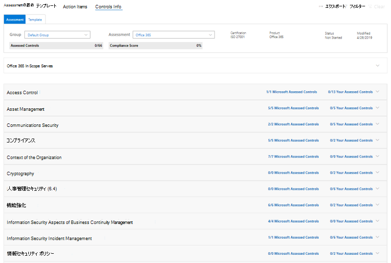

# Microsoft コンプライアンスマネージャーを使用する (プレビュー)Working with Microsoft Compliance Manager (preview)

> [!IMPORTANT]
> Microsoft コンプライアンスマネージャーは、データ保護とコンプライアンスの stature と、データ保護とコンプライアンスを向上させるための推奨事項の概要を提供するダッシュボードおよび管理ツールです。Microsoft Compliance Manager is a dashboard and management tool that provides a summary of your data protection and compliance stature and recommendations to improve data protection and compliance. コンプライアンスマネージャーで提供されるお客様のアクションは推奨事項です。The customer actions provided in Compliance Manager are recommendations. 実装の前に、それぞれの規制環境でこれらの推奨事項の有効性を評価することは、組織によって行われます。It is up to your organization to evaluate the effectiveness of these recommendations in their respective regulatory environment prior to implementation. コンプライアンス マネージャーで見つかった推奨事項は、コンプライアンスの保証として解釈してはいけません。Recommendations found in Compliance Manager should not be interpreted as a guarantee of compliance.

## Access コンプライアンスマネージャーAccess Compliance Manager

コンプライアンスマネージャーには、Microsoft Service Trust Portal からアクセスできます。Compliance Manager is accessible from the Microsoft Service Trust Portal. Microsoft アカウントまたは Azure Active Directory 組織のアカウントを持つユーザーは、コンプライアンスマネージャーにアクセスできます。Anyone with a Microsoft account or Azure Active Directory organizational account can access Compliance Manager.

1. [https://servicetrust.microsoft.com/ComplianceManager/V3](https://servicetrust.microsoft.com/ComplianceManager/V3) に移動します。Go to [https://servicetrust.microsoft.com/ComplianceManager/V3](https://servicetrust.microsoft.com/ComplianceManager/V3).

2. Office 365、Microsoft 365、または Azure Active Directory (Azure AD) のユーザーアカウントである Microsoft サービスアカウントを使用してサインインします。Sign in with your Microsoft service account, which is your Office 365, Microsoft 365, or Azure Active Directory (Azure AD) user account.

> [!NOTE]
> Service Trust Portal で、[**コンプライアンスマネージャー**] を選択します。これは、最新の機能を備えたプレビューバージョンです。In the Service Trust Portal, select **Compliance Manager**, which is the preview version with the most current features. このドキュメントに記載されていない初期リリース機能を含む、**コンプライアンスマネージャー (クラシック)** は選択しないでください。Do not select **Compliance Manager (classic)**, which contains early-release features not covered by this documentation.

## 管理Administration

全体管理者のみが使用でき、全体管理者アカウントでログインしている場合にのみ表示される特定の管理機能があります。There are specific administrative functions that are only available to the global administrator and only visible when logged in with a global administrator account. グローバル管理者は次のことができます。The global administrator can:
- [ユーザーロールを割り当てるAssign user roles](#assigning-compliance-manager-roles-to-users)
- [セキュリティで保護されたスコアの自動更新をオンまたはオフにするTurn on and off automatic Secure Score updates](#controlling-automatic-secure-score-updates)
- [ユーザーのプライバシー設定を構成するConfigure user privacy settings](#configuring-user-privacy-settings)
  
### コンプライアンス マネージャーのロールをユーザーに割り当てるAssigning Compliance Manager roles to users

管理者がコンプライアンスマネージャーの役割を他のユーザーに割り当てると、それらのユーザーはコンプライアンスマネージャーでデータを表示し、その役割によって決定されたアクションを実行できます。Once the administrator assigns Compliance Manager roles to other users, those users can view data in Compliance Manager and perform actions determined by their role. 管理者は、 [Azure Active Directory (AZURE AD) でユーザーにグローバルリーダーの役割](https://docs.microsoft.com/azure/active-directory/users-groups-roles/directory-assign-admin-roles#global-reader)を割り当てることによって、コンプライアンスマネージャーへの読み取り専用アクセス権を付与することもできます。The administrator can also give read-only access to Compliance Manager by assigning the user the [Global Reader role in Azure Active Directory (Azure AD)](https://docs.microsoft.com/azure/active-directory/users-groups-roles/directory-assign-admin-roles#global-reader).

各コンプライアンスマネージャーの役割には、多少異なるアクセス許可があります。Each Compliance Manager role has slightly different permissions. 各役割に割り当てられているアクセス許可を表示したり、どのユーザーがどの役割に所属しているかを確認したり、その役割に対してユーザーを追加または削除することができます。You can view the permissions assigned to each role, see which users are in which roles, and add or remove users from that role through the Service Trust Portal. [**管理**] メニュー項目を選択し、表示する**設定**を選択します。Select the **Admin** menu item, and choose **Settings** to view.
  

  
コンプライアンス マネージャーのロールにユーザーを追加したり、ロールからユーザーを削除したりするには、次の操作を行います。To add or remove users from Compliance Manager roles.
  
1. [https://servicetrust.microsoft.com](https://servicetrust.microsoft.com) に移動します。Go to [https://servicetrust.microsoft.com](https://servicetrust.microsoft.com).

2. Azure Active Directory 全体管理者アカウントでサインインします。Sign in with your Azure Active Directory global administrator account.

3. Service Trust Portal のトップメニューバーで、[**管理者**] を選択し、[**設定**] を選択します。On the Service Trust Portal top menu bar, select **Admin** and then choose **Settings**.

4. **[役割の選択**] ドロップダウンリストで、管理する役割を選択します。In the **Select Role** drop-down list, select the role that you want to manage.

5. 各ロールに追加されたユーザーは、**[ロールの選択]** ページに一覧表示されます。Users added to each role are listed on the **Select Role** page.

6. この役割にユーザーを追加するには、[**追加**] を選択します。To add users to this role, select **Add**. [**ユーザーの追加**] ダイアログで、[ユーザー] フィールドを選択します。In the **Add Users** dialog, select the user field. 利用可能なユーザーの一覧をスクロールするか、ユーザー名の入力を開始して、検索用語に基づいてリストをフィルター処理することができます。You can scroll through the list of available users or begin typing the user name to filter the list based on your search term. そのアカウントを、その役割を使用してプロビジョニングされた**ユーザーの追加**リストに追加するユーザーを選択します。Select the user to add that account to the **Add Users** list provisioned with that role. 複数のユーザーを同時に追加する場合は、リストにフィルターを適用するためのユーザー名の入力を開始してから、リストに追加するユーザーを選択します。If you would like to add multiple users concurrently, begin typing a user name to filter the list, and then select the user to add to the list. [**保存**] を選択して、選択した役割をこれらのユーザーに提供します。Select **Save** to provision the selected role to these users. 

    
  
7. この役割からユーザーを削除するには、ユーザーを選択して [**削除**] を選択します。To remove users from this role, select the users and select **Delete**.

    

### セキュリティで保護された自動スコア更新の制御Controlling automatic Secure Score updates

セキュリティで保護されたスコア更新は、すべてのアクションに対して自動的に有効にするか、すべてのアクションに対してオフにするか、または次の手順に従って個々のアクションで設定できます。Secure Score updates can be turned on automatically for all actions, turned off for all actions, or set by individual action by following these steps.

1. グローバル管理者アカウントを使用して、[サービス信頼ポータル](https://servicetrust.microsoft.com)にサインインします。Sign in to the [Service Trust Portal](https://servicetrust.microsoft.com) with your global administrator account.

2. サービス信頼ポータルのトップメニューバーで、[**詳細**設定] の下の [**管理**] を選択し、[**設定**] を選択します。On the Service Trust Portal top menu bar, under **More**, select **Admin** and then choose **Settings**.

3. [ **Secure Score** ] タブで、対応するボタンを選択して、**すべてのアクション**に対してオンにするか、**すべてのアクションに対し**て無効にするか、または**アクションごとに設定します。**In the **Secure Score** tab, select the corresponding button to either **turn on for all actions**, **turn off for all actions**, or **set per action.**

[**アクションごとに設定**] を選択した場合は、個々のアクションについてセキュリティで保護されたスコア更新を有効にする追加の手順を実行します。If you choose **set per action,** take these additional steps to turn on Secure Score updates for individual actions:

4. 上部のメニューから [**コンプライアンスマネージャー** ] を選択します (注: [コンプライアンスマネージャー (クラシック)] を選択しないでください)。Select **Compliance Manager** from the top menu (note: do not select "Compliance Manager (classic)").

5. 画面の右上隅にある [**テナント管理**] を選択します。Select **Tenant Management** in the upper-right corner of your screen.

6. [**顧客の操作**] ウィンドウで、[**影響を受ける操作**] 列の下に、省略記号 (**...**) を含む目的のアクションを見つけます。On the **Customer Actions** pane, find your intended action with an ellipsis (**...**) under the **Affected Actions** column. 省略記号をクリックして、[編集] を選択し**ます。**Click on the ellipses and select **Edit.**

7. **セキュリティで保護されたスコアの継続更新**の切り替えトグルスイッチをオンに切り替え**ます。**Switch the **Secure Score continuous update** toggle switch to **On.**

8. [保存] を選択し**ます。**Select **Save.** セキュリティで保護されたスコア継続的監視は、そのアクションに対して有効になっています。Secure Score continuous monitoring is now turned on for that action.

**注:** すべてのアクションの自動更新をオンまたはオフにすることができるのは、全体管理者のみです。**Note:** Only the global administrator can turn on or off automatic updates for all actions. コンプライアンスマネージャー管理者は、個々のアクションに対して自動更新を有効にできますが、すべてのアクションに対してグローバルに行うことはできません。The Compliance Manager administrator can turn on automatic updates for individual actions, but not for all actions globally.

### ユーザーのプライバシー設定を構成するConfiguring user privacy settings

特定の規制では、組織がユーザー履歴データを削除できる必要があります。Certain regulations require an organization to be able to delete user history data. これを有効にするために、**ユーザーのプライバシー設定**機能を使用して管理者は次の操作を実行できます。To enable this, the **User Privacy Settings** functions allow administrators to:
  
- [ユーザーの検索Search for a user](#search-for-a-user)

- [アカウント データ履歴のレポートのエクスポートExport a report of account data history](#export-a-report-of-account-data-history)

- [実施項目の再割り当てReassign action items](#reassign-action-items)

- [ユーザー データの履歴の削除Delete user data history](#delete-user-data-history)
    

  
#### ユーザーの検索Search for a user

ユーザー アカウントを検索するには、次のようにします。To search for a user account:
  
1. エイリアス (@ 記号の左側の情報) を入力し、右側のドメイン サフィックス リストをクリックすることでドメイン名を選択し、ユーザー メール アドレスを入力します。Enter the user email address by typing in the alias (the information to the left of the @ symbol) and choosing the domain name by clicking the domain suffix list on the right. 組織に複数の登録済みドメインがある場合は、電子メールアドレスドメイン名サフィックスをもう一度確認して、それが正しいことを確認できます。If your organization has multiple registered domains, you can double check the email address domain name suffix to ensure that it is correct.
    
2. ユーザー名が正しく入力されたら、[**検索**] を選択します。When you have the username correctly entered, select **Search**.
    
3. ユーザーアカウントが見つからない場合は、ページに "ユーザーが見つかりません" というエラーメッセージが表示されます。If the user account is not found, the error message 'User not found' will be displayed on the page. ユーザーの電子メールアドレス情報を確認し、必要に応じて修正して、[**検索**] を選択してもう一度実行します。Check the user's email address information, make corrections as necessary and select **Search** to try again.
    
4. ユーザー アカウントが見つかった場合、ボタンのテキストは **[検索]** から **[クリア]** に変更されます。これは、返されたユーザー アカウントは以下に示される追加機能の操作のコンテキストであり、この追加機能を実行すると、このユーザー アカウントに適用されることを示します。If user account is found, the text of the button changes from **Search** to **Clear**, which indicates that the returned user account is the operating context for the additional functions that will be displayed below, that running those functions will apply to this user account.
    
5. 検索結果をクリアして別のユーザーを検索するには、[**クリア**] を選択します。To clear search results and search for a different user, select **Clear**.
    
#### アカウント データ履歴のレポートのエクスポートExport a report of account data history

ユーザー アカウントが識別されたら、このアカウントにリンクされている依存関係のレポートの生成が必要な場合があります。Once the user account has been identified, you may wish to generate a report of dependencies that exist linked to this account. この情報によって、オープンのアクション アイテムを割り当てたり、前にアップロードされたエビデンスへのアクセス権を確保したりできます。This information allows you to reassign open action items or ensure access to previously uploaded evidence.
  
 レポートを生成してエクスポートするには:To generate and export a report:
  
1. [**エクスポート**] を選択して、返されたユーザーアカウントに現在割り当てられているコンプライアンスマネージャーコントロールアクションアイテムのレポートと、そのユーザーによってアップロードされたドキュメントのリストを生成し、ダウンロードします。select **Export** to generate and download a report of the Compliance Manager control action items currently assigned to the returned user account and the list of documents uploaded by that user. 割り当てられたアクションまたはアップロードされたドキュメントがない場合は、エラーメッセージに "このユーザーにはデータがありません。" というメッセージが表示されます。If there are no assigned actions or uploaded documents, an error message displays "No data for this user."

2. レポートは、アクティブなブラウザーウィンドウのバックグラウンドでダウンロードされます。The report downloads in the background of the active browser window. ダウンロードポップアップが表示されない場合は、ブラウザーのダウンロード履歴を確認します。If you don't see a download pop up, check your browser download history.

3. ドキュメントを開いてレポート データを確認します。Open the document to review the report data.

> [!NOTE]
> This is not a historical report that retains and displays state changes to action item assignment history.This is not a historical report that retains and displays state changes to action item assignment history. The generated report is a snapshot of the control action items assigned at the time that the report is run (date and time stamp written into the report).The generated report is a snapshot of the control action items assigned at the time that the report is run (date and time stamp written into the report). For instance, any subsequent reassignment of action items will result in different snapshot report data if this report is generated again for the same user.For instance, any subsequent reassignment of action items will result in different snapshot report data if this report is generated again for the same user.
  
#### 実施項目の再割り当てReassign action items

This function enables an organization to remove any active or outstanding dependencies on the user account by reassigning all action item ownership (which includes both active and completed action items) from the returned user account to a new user selected below.This function enables an organization to remove any active or outstanding dependencies on the user account by reassigning all action item ownership (which includes both active and completed action items) from the returned user account to a new user selected below. This action does not change document upload history for the returned user account.This action does not change document upload history for the returned user account.
  
 他のユーザーに実施項目を再割り当てするには、次のようにします。To reassign action items to another user:
  
1. 参照する入力ボックスをクリックして、返されたユーザーの実施項目を割り当てる必要がある、組織内の別のユーザーを選択します。Click the input box to browse for and select another user within the organization to whom the returned user's action items should be assigned.
    
2. **[置換]** を選択して、コントロールの実施項目すべてを、返されたユーザーから新しく選択したユーザーに再割り当てします。Select **Replace** to reassign all control action items from the returned user to the newly selected user.
    
3. 「現在のユーザーから選択したユーザーにすべてのコントロールアクションアイテムが再割り当てされます」という確認のダイアログボックスが表示されます。A confirmation dialog box appears stating, "This will reassign all control action items from the current user to the selected user. この操作は元に戻せません。This action cannot be undone. 続行してよろしいですか?"Are you sure you want to continue?"
    
4. 続行するには、[ **OK**] を選択します。そうでない場合は [**キャンセル**] を選択To continue, select **OK**, otherwise select **Cancel**.
    
> [!NOTE]
> All action items (both active and completed) will be assigned to the newly selected user.All action items (both active and completed) will be assigned to the newly selected user. However, this action does not affect the document upload history; any documents uploaded by the previously assigned user will still show the date/time and name of the previously assigned user.However, this action does not affect the document upload history; any documents uploaded by the previously assigned user will still show the date/time and name of the previously assigned user. 
  
Changing the document upload history to remove the previously assigned user will have to be done as a manual process.Changing the document upload history to remove the previously assigned user will have to be done as a manual process. In that case, the administrator will need to:In that case, the administrator will need to:
  
1. 以前にダウンロードしたエクスポート レポートを開きます。Open the previously downloaded Export report.
  
2. 目的のコントロールの実施項目を特定し、そこに移動します。Identify and navigate to the desired control action item.
  
3. [ **Manage Documents** ] を選択して、そのコントロールの証拠リポジトリに移動します。Select **Manage Documents** to navigate to the evidence repository for that control.
  
4. ドキュメントをダウンロードします。Download the document.
  
5. 証拠のリポジトリでドキュメントを削除します。Delete the document in the evidence repository.
  
6. ドキュメントを再度アップロードします。Re-upload the document. これで、ドキュメントには新しいアップロード日、時間、"upload by" というユーザー名が追加されました。The document will now have a new upload date, time, and "Uploaded by" username.
  
#### ユーザー データの履歴の削除Delete user data history

This sets control action items to 'unassigned' for all action items assigned to the returned user.This sets control action items to 'unassigned' for all action items assigned to the returned user. This also sets uploaded by value to 'user removed' for any documents uploaded by the returned userThis also sets uploaded by value to 'user removed' for any documents uploaded by the returned user
  
 ユーザー アカウントの実施項目とドキュメントのアップロード履歴を削除するには、次のようにします。To delete the user account action item and document upload history:
  
1. **[削除]** を選択します。Select **Delete**.

2. 確認ダイアログが表示されます。 "これにより、選択したユーザーのすべてのコントロール操作アイテムの割り当てとドキュメントのアップロード履歴が削除されます。A confirmation dialog displays: "This will remove all control action item assignments and the document upload history for the selected user. この操作は元に戻せません。This action cannot be undone. 続行してよろしいですか?"Are you sure you want to continue?"
    
3. 続行するには、[ **OK**] を選択します。そうでない場合は [**キャンセル**] を選択To continue, select **OK**, otherwise select **Cancel**.

## グループGroups

グループは、評価を組織化し、同じまたは関連する顧客管理のコントロールを持つ評価間で共通情報とワークフロータスクを共有できるようにするコンテナーです。Groups are containers that allow you to organize Assessments and share common information and workflow tasks between Assessments that have the same or related customer-managed controls.

評価は、年、標準、サービス、または組織の teams、部署、または地域に基づいて論理的な方法でグループ化できます。You can group Assessments in a way that is logical to you, such as by year, standard, service, or based on your organization's teams, divisions, or geographies. 2つのグループとその基になる評価の例を次に示します。Below are examples of two groups and their underlying Assessments:
  
- **FFIEC は評価2020****FFIEC IS Assessments 2020**
  - Office 365 + FFIEC はOffice 365 + FFIEC IS
  - Intune + FFIEC はIntune + FFIEC IS
- **データ セキュリティとプライバシー Assessment****Data Security and Privacy Assessments**
  - Office 365 + ISO 27001:2013Office 365 + ISO 27001:2013
  - Office 365 + ISO 27018:2014Office 365 + ISO 27018:2014

> [!NOTE]
> 新しい評価を追加*する前に*、組織のグループ戦略を決定することをお勧めします。We recommend determining a grouping strategy for your organization *before* adding new Assessments.

まず、データ保護基準を含む**既定**のグループが設定されています。To get you started, a **Default** group is set up for you that contains the Data Protection Baseline. このベースラインは、一般的な業界の規制と標準を含む一連のコントロールです ([詳細につい](compliance-score-methodology.md#initial-score-based-on-microsoft-365-data-protection-baseline)ては、こちらを参照してください)。This baseline is a set of controls that includes common industry regulations and standards ([learn more](compliance-score-methodology.md#initial-score-based-on-microsoft-365-data-protection-baseline)).

### グループを作成する方法How to create a group

グループをスタンドアロンのエンティティとして作成することはできません。Groups cannot be created as standalone entities. グループには常に少なくとも1つの評価が含まれている必要があるため、グループを作成するには、まずグループに入れる評価を作成する必要があります。A group must always contain at least one Assessment, so in order to create a group, you must first create an Assessment to put in the group.

グループを作成するには、次の手順を実行します。Follow the steps below to create a group:

1. ダッシュボードの上部付近にある [ **+ 評価の追加**] を選択して、新しい評価を作成します。Create a new Assessment by selecting **+ Add Assessment** near the top of your dashboard.
2. [**評価**] ポップアップウィンドウで、評価のタイトルを入力し、ドロップダウンメニューからテンプレートを選択します。From the **Assessment** flyout pane, enter a title for your Assessment and select a template from the drop-down menu.
3. **[グループを選択するか、新しいグループを追加してください**] で、[**新しいグループの追加**] を選択し、次のフィールドにグループ名を入力します。At **Please select a group or add a new group**, select **Add a new group** and enter your group name in the field below.
4. 既存のグループから情報をコピーするには、[**既存のグループのデータをコピーする方法を選択しますか?]** に切り替えます **。**To copy information from an existing group, toggle the **Would you like to copy the data from an existing group?** switch to **On.** 下にあるドロップダウンメニューからコピーするグループを選択し、新しいグループ内の新しい評価に保存するフィールドのチェックボックスをオンにします。Select the group you want to copy from the drop-down menu underneath, and select the checkboxes of any fields you want to carry over to the new Assessment in your new group.
5. [**保存**] を選択します。Select **Save**. 完了すると、フライアウトウィンドウが閉じ、ダッシュボードに新しいグループが表示されます。When completed, the flyout pane closes and you'll see your new group on your dashboard.

グループを使用する場合の注意事項:What to know when working with groups:
  
- グループ名 (*グループ id*とも呼ばれます) は、組織内で一意である必要があります。Group names (also called *Group IDs*) must be unique within your organization.
- グループにはセキュリティプロパティはありません。Groups do not have any security properties. すべてのアクセス許可が評価に関連付けられています。All permissions are associated with Assessments.
- グループに評価を追加すると、グループを変更することはできません。Once you add an Assessment to a group, the grouping cannot be changed. 評価グループの名前を変更することができます。これにより、そのグループに関連付けられているすべての評価の評価グループの名前が変更されます。You can rename the assessment group, which changes the name of the assessment grouping for all the assessments associated with that group.
- 同じグループ内の異なる評価に含まれる関連評価コントロールが、完了時に自動的に更新されます。Related Assessment controls in different Assessments within the same group automatically update when completed.
- 既存のグループに新しい評価を追加すると、そのグループの評価からの共通情報が新しい評価にコピーされます。If you add a new Assessment to an existing group, common information from Assessments in that group are copied to the new Assessment.
- グループには同じ証明書または規制の評価を含めることができますが、各グループには特定の製品証明書ペアの評価を1つだけ含めることができます。Groups can contain Assessments for the same certification or regulation, but each group can only contain one Assessment for a specific product-certification pair. たとえば、グループに Office 365 および NIST CSF の2つの評価を含めることはできません。For example, a group can't contain two Assessments for Office 365 and NIST CSF. 1つのグループには、対応する証明書または規制が異なる場合にのみ、同じ製品に対して複数の評価を含めることができます。A group can contain multiple Assessments for the same product only if the corresponding certification or regulation for each one is different.
- 評価を非表示にすると、評価とグループの間の関係が失われます。Hiding an Assessment breaks the relationship between that Assessment and the group. その他の関連する評価に関するその他の更新プログラムは、非表示の評価に反映されなくなりました。Any further updates to other related Assessments are no longer reflected in the hidden assessment. ([評価を非表示にする方法について説明します)。](#hide-a-template-or-an-assessment)([Learn how to hide Assessments.](#hide-a-template-or-an-assessment))
- グループを削除することはできません。Groups cannot be deleted.
- 複数のグループに表示されるアクションアイテムに変更が加えられると、その変更はそのアクションアイテムのすべてのインスタンスに反映されます。When a change is made to an Action Item that appears in multiple Groups, that change is reflected in all instances of that Action Item.

## ディメンション、所有者、& 顧客のアクションのテナント管理Tenant management of dimensions, owners, & customer actions

**テナント管理**インターフェイスを使用すると、次の組織全体の設定を管理できます。The **Tenant Management** interface enables you to manage these organization-wide settings:

- **次元:** テンプレート、評価、およびアクションアイテムのメタデータを表示して、フィルターのカスタムピボットを作成できるようにします。**Dimensions:** View metadata for Templates, Assessments, and Action Items that allow you to create custom pivots for filters.
- **所有者:** アクションに関連付けることができる責任者の一覧を作成します。**Owners:** Populate a list of responsible parties that can be associated with actions.
- **お客様のアクション:** コンプライアンスマネージャー (プレビュー) に含まれるアクションアイテムの完全なリストを管理し、セキュリティで保護されたスコアと統合されたアクションに対するセキュリティで保護されたスコア監視を有効/無効にします。**Customer Actions:** Manage the complete list of Actions Items included in Compliance Manager (Preview) and enable/disable Secure Score monitoring for Actions that are integrated with Secure Score.

画面の右上隅にある [**テナント管理**] を選択して管理インターフェイスを開き、以下の手順を使用して**ディメンション**、**所有者**、および**顧客の操作**を管理します。Select **Tenant Management** from the upper-right corner of your screen to open the management interface, and use the steps below to manage  **Dimensions**, **Owners**, and **Customer Actions**.

### DimensionsDimensions

ディメンションは、テンプレート、評価、またはアクションアイテムに関する情報を提供するメタデータのセットです。Dimensions are sets of metadata that provide information about a Template, an Assessment, or an Action Item. 次元は、キーと値の概念を使用します。次元キーはプロパティを表し、ディメンション値はプロパティの有効な値を表します。Dimensions use the concept of Keys and Values, where the Dimension Key represents a property, and Dimension Value represents valid values for the property. たとえば、コンプライアンスマネージャーには、3種類のアクションがあります。For example, in Compliance Manager there are three types of Actions. これらは、**アクションの目的**のディメンションキーと、**予防的**、**検出**、および**是正**の分析コード値で定義されます。They are defined by a Dimension Key of **Action Purpose** and Dimension Values of **Preventative**, **Detective**, and **Corrective**.

### OwnersOwners

所有者は、各コントロールの責任者を識別するために使用されます。Owners are used to identify the person responsible for each control. すべての組み込みコントロールは、Microsoft、顧客、またはその両方によって所有されます。All built-in controls are owned by Microsoft, by customers, or by both. 組織内でより詳細な責任を指定するために使用できる、所有者のカスタム値を作成できます。You can create custom values for Owners that can be used to specify more granular responsibilities within your organization. たとえば、組織内の特定のグループ、チーム、またはビジネス単位を表す所有者を作成することができます。For example, you could create Owners that represent specific groups, teams, or business units within your organization.

#### 所有者を追加するAdd an Owner

1. [**テナント管理**] を開き、[**所有者**] を選択します。Open **Tenant Management** and select **Owners**.
2. [ **+ 所有者の追加**] を選択します。Select **+ Add owner**.
3. 所有者の名前と説明を入力し、[**保存**] を選択します。Provide a Name and Description for the Owner and select **Save**. 説明は [所有者] 列に表示されます。The description is displayed in the Owner column.

#### 所有者を編集するEdit an Owner

所有者名を編集することはできませんが、[所有者] 列に表示される説明を変更することができます。You can't edit an Owner name, but you can modify the description that is displayed in the Owner column.

1. [**テナント管理**] を開き、[**所有者**] を選択します。Open **Tenant Management** and select **Owners**.
2. 編集する所有者を見つけ、その下にある省略記号 (...) を選択して、[**編集**] を選択します。Locate the Owner you want to edit, select the ellipses (…) next to it, and select **Edit**.
3. 必要に応じて説明を変更し、[**保存**] を選択します。Modify the Description as needed and select **Save**.

#### 所有者を削除するDelete an Owner

1. [**テナント管理**] を開き、[**所有者**] を選択します。Open **Tenant Management** and select **Owners**.
2. 削除する所有者を見つけ、その下にある省略記号 (...) を選択して、[**削除**] を選択します。Locate the Owner you want to delete, select the ellipses (…) next to it, and select **Delete**.
3. 確認メッセージが表示されたら、[**削除**] を選択します。When the confirmation message appears, select **Delete**.

### 顧客のアクションCustomer Actions

[顧客の操作] 領域には、コンプライアンスマネージャー (プレビュー) のすべてのテンプレートと評価に関するすべてのお客様のアクションが表示されます。The Customer Actions area shows all the customer actions for all Templates and Assessments in Compliance Manager (Preview).

アクションのタイトル、所有者、カテゴリ、強制、およびスコアを一目で確認し、セキュリティで保護されたスコアと統合されているかどうかを確認できます。At a glance, you can see an Action's title, owner, category, enforcement, and score, and determine if it is integrated with Secure Score. アクションを展開して、[**詳細の読み取り**] を選択すると、アクションの説明が読み込まれ、説明内のリンクにアクセスできます。You can expand an Action and select **Read More** to read the Action's description and access any links in the description. このインターフェイスを使用して、アクションごとにセキュリティで保護されたスコアの統合を有効または無効にしたり、カスタムアクションを追加したりすることもできます。You can also use this interface to enable and disable Secure Score integration on a per-action basis, and to add custom actions. セキュリティで保護されたスコア統合機能を持つアクションの横には、省略記号 (...) が付いています (カスタムアクションにも、その横に省略記号 (...) があることに注意してください)。Actions that have Secure Score integration capabilities have an ellipsis (…) next to them (note that custom actions also have an ellipsis next to them).

#### セキュリティで保護されたスコアの統合を有効または無効にするEnable or disable Secure Score integration

1. 変更するアクションの省略記号 ([...]) を選択し、[**編集**] を選択します。Select the ellipses (…) for the Action you want to modify and select **Edit**.
2. セキュリティで保護されたスコアを使用して継続的監視を有効または無効にするためのスイッチをオンまたはオフに切り替えます。Toggle the switch for Secure Score continuous update to On or Off to enable or disable continuous monitoring through Secure Score.
3. [**保存**] を選択します。Select **Save**.

組織が最初に Microsoft 365 または Office 365 を展開するときは、セキュリティで保護されたスコアがデータを完全に収集してスコアになるまでに約7日かかります。When organizations first deploy Microsoft 365 or Office 365, it takes approximately seven days for Secure Score to fully collect data and factor it into your score. その間、「Secure Score continuous update」スイッチを [**オフ**] に設定し、**実装**するアクションを手動で設定すると、スコアに対する処理がカウントされます。During that time, setting the Secure Score continuous update switch to **Off** and manually setting an action to **implemented** will count that action toward your score. 最初の7日より後に、セキュリティで保護されたスコア継続的更新をオンにすると、それ以降の継続的な監視が有効になります。After the initial seven days, turning Secure Score continuous update back on will enable continuous monitoring from that point forward.

セキュリティで保護されたスコア統合でサポートされていないアクションは、手動で実装できます。Any actions that are not supported by Secure Score integration can be manually implemented. 手動による実装では、そのアクションのグループのスコアが考慮されます。A manual implementation will factor into the score for that action's group.

## 講習Assessments

このセクションでは、評価を表示して操作する方法について説明します。これには、新しいものを追加したり、エクスポートしたり、既存の評価から情報をコピーしたり、バージョン管理を通じて更新を維持したりする方法が含まれます。This section explains how to view and work with your Assessments, including how to add new ones, export them, copy information from existing Assessments, and keep them updated through versioning.

> [!NOTE]
> コンプライアンススコアで評価を作成できるようになりました。You can now create assessments in Compliance Score. [ガイダンスと手順を表示](compliance-score-assessments.md)します。[View guidance and instructions](compliance-score-assessments.md).

### 評価とアクションの詳細を表示するView an Assessment and Action details
  
**評価**ダッシュボードで、評価名を選択して、アクションアイテムとコントロール情報を表示します。In the **Assessments** dashboard, select the assessment name to open it and view the Action Items and Controls Info.

Office 365 および ISO 27001 の評価の例を次に示します。Here's an example of the Assessment for Office 365 and ISO 27001. 最初のビューは、コンプライアンスマネージャー (プレビュー) の新しいアクションアイテムビューを示しています。The first view illustrates the new Action Items view in Compliance Manager (Preview).

アクションはアルファベット順に一覧表示され、各アクションにスコアと所有者が割り当てられます。The Actions are listed in alphabetical order, and each Action is assigned a score and an owner. 各アクションの詳細については、「詳細情報の**読み取り**」リンクを選択してください。Select  the **Read More** link to read the details of each Action.

アクションを管理、割り当て、実装、およびテストするには、[**レビュー** ] リンクを選択します。Select the **Review** link to manage, assign, implement, and test the action. 次に、アクションの例を示します。Below is an example Action.

アクションワークフローを管理するには、次のフィールドを使用します。Use the following fields to manage the Action workflow:

- **ユーザーを割り当てる:** このアクションを割り当てるユーザーを選択または入力するには、このフィールドを選択します。**Assign User:** Select this field to choose or enter the user to whom this Action should be assigned. リストをスクロールするか、検索する名前を入力して、それを選択します。You can scroll through the list, or type a name to find it, and then select it.
- **ドキュメントの管理:** 実装の証拠は、Office ドキュメント、画像ファイル、スクリーンショット、CSV または TXT の PowerShell 出力、および Pdf の形式でアップロードできます。**Manage Documents:** You can upload evidence of implementation in the form of Office documents, image files and screenshots, PowerShell output in CSV or TXT, and PDFs.
- **実装の状態:** アクションの現在の実装状態を示すために使用されます。**Implementation Status:** Used to indicate the Action's current implementation status. 使用可能な値は、実装、実装、代替実装、計画済み、スコープ内ではありません。Possible values are Not Implemented, Implemented, Alternative Implementation, Planned, and Not in Scope.
- **実装日:** アクションが実行された日付。**Implementation Date:** The date on which the Action was taken.
- **テスト結果:** 実装検証の結果を示すために使用されます。**Test Result:** Used to indicate the results of implementation validation. 可能な値は、評価、合格、Failed-低リスク、失敗-中規模リスク、失敗-高リスク、範囲外。Possible values are Not Assessed, Passed, Failed-Low Risk, Failed-Medium Risk, Failed-High Risk, and Not in Scope.
- **テストの日付:** 検証が発生した日付。**Test Date:** The date on which validation occurred.
- **実装に関する注意事項:** 組織の実装の詳細と、含める必要のあるメモを入力します。**Implementation Notes:** Enter implementation details for your organization, along with any notes that you want to include.
- **テスト計画:** このアクションのテスト計画の詳細と、追加するメモを入力します。**Test Plan:** Enter the test plan details for this action, along with any notes that you want to include.
- **追加情報:** このアクションに関する追加情報を入力するか、組織内での実装方法、および必要なメモを入力します。**Additional Information:** Enter any additional information about this Action or how it was implemented in your organization, along with any notes you want to include.

**Controls** information dashboard では、評価およびテンプレートレベルでコントロールの情報を表示できます。On the **Controls Info** dashboard, you can view information for controls at the Assessment and Template level. 評価用の Controls Info ダッシュボードの例を次に示します。Below is an example of the Controls Info dashboard for Assessments.

評価の場合、Controls Info dashboard には次の情報が表示されます。For Assessments, the Controls Info dashboard displays the following information:

- 表示するグループを選択するための**グループ**ドロップダウン (複数のグループを使用する場合)。A **Group** dropdown to select which Group to view (when using multiple groups).
- 表示する評価を選択するための**評価**ドロップダウンAn **Assessment** dropdown to select which Assessment to view.
- 選択した評価に関するメタデータ (次のものが含まれます)。Metadata about the selected Assessment, including:
    - 評価されたコントロールの総数**を示す、評価さ**れたコントロールの進捗状況のインジケーター。A progress indicator for **Assessed Controls** showing the number of assessed controls over the total number of controls.
    - 評価の現在の**コンプライアンススコア**。パーセンテージで表示されます。The current **Compliance Score** for the Assessment, shown as a percentage.
    - 評価に使用された**証明書**と**製品**に関する詳細。Details about the **Certification** and **Product** used in the Assessment.
    - 評価の現在の**状態**と最終**更新**日。The current **Status** of and last **Modified** date for the Assessment.
- 評価の対象となる**サービス**の一覧。A list of **In Scope Services** for the Assessment.
- コントロールファミリごとにグループ化されたコントロールの詳細。お客様のアクションと Microsoft 実装の詳細情報へのリンクがあります。Details of the controls, grouped by Control Family, with links to customer actions and Microsoft implementation details:
    - **操作により**、一部またはすべてのコントロールの要件を満たすために実行できるユーザー操作が表示されます。**Your Actions** displays the customer actions that you can perform to satisfy some or all the control's requirements. 多くのコントロールには複数のアクションが関連付けられており、コントロールに関連付けられたすべてのアクションがここに表示されます。Many controls have multiple Actions associated with them, and all Actions associated with a control are displayed here. ここでのアクションは、アクションダッシュボードに一覧表示されている UI と同じです。The Actions here have the same UI as those listed in the Actions dashboard.
    - **Microsoft アクション**では、選択した証明書コントロールに適用される microsoft の内部フレームワークからのコントロールの一覧が表示されます。**Microsoft Actions** displays the list of controls from Microsoft's internal framework that apply to the selected certification control. 内部コントロールごとに、[**実装**済み] を選択して、次に示すように、Microsoft の実装とテストの詳細、およびテスト結果とテスト日付を表示します。For each internal control, select **Implemented** to see Microsoft's implementation and test details, along with the test result and test date, as shown below.

### 評価を追加するAdd an Assessment
  
1. 評価ダッシュボードで、[ **+ 評価の追加**] を選択します。In the Assessments dashboard, select **+ Add Assessment**.

2. ブレードが開いたら、次の情報を入力します。When the blade opens, enter the following information:

    - **タイトル (必須):** 評価のタイトルを入力します。**Title (required):** Enter a title for your Assessment
    - **テンプレートを選択してください (必須):** 標準またはカスタムテンプレートを選択する**Please select a template (required):** Select a standard or custom template
    - **グループを選択するか、新しいグループを追加してください (必須):** 既存のグループを選択するか、新しいグループを追加して、一意のグループ名を指定します。**Please select a group or add a new group (required):** Select an existing group or choose to add a new group, and provide a unique group name
    - **既存のグループのデータをコピーしますか?(オプション):** グループコピーを有効にするようにコントロールを切り替え、次のようにします。**Would you like to copy the data from an existing group? (optional):** Toggle the control to enable group copy and then:
        - **グループを選択します (省略可能)。** グループコピーが有効になっている場合は、コピー元のグループを選択します。**Select a group (optional):** If group copy is enabled, select the group to copy from
            - **実装の詳細 (オプション):** 実装の詳細を新しいグループにコピーする場合に選択します。**Implementation Details (optional):** Select to copy implementation details to the new group
            - **テスト計画 & 追加情報 (オプション):** テスト計画と追加情報の詳細を新しいグループにコピーする場合に選択します**Test plan & additional information (optional):** Select to copy test plan and additional information details to the new group
            - **ドキュメント (オプション):** 選択すると、新しいグループにドキュメントがコピーされます。**Documents (optional):** Select to copy documents to the new group

3. [**保存**] を選択して、評価を作成します。Select **Save** to create the Assessment.

 新しい評価が評価ダッシュボードに表示され、次の情報が表示されます。The new Assessment appears on the Assessment dashboard and displays the following information:

- 評価のタイトル。The title of the Assessment.
- 評価に適用される評価の大きさ (証明書、環境、および製品を含む)。The dimensions of the Assessment, including certification, environment, and product applied to the Assessment.
- 作成日時、および最終変更日時。The date it was created and date when it was last modified.
- 評価スコアがパーセンテージで表示されます。The Assessment Score shown as a percentage. このスコアには、Microsoft 管理コントロールからのスコアと、セキュリティで保護されたスコアが自動的に含まれます。This score automatically includes your scores from Microsoft-managed controls and from Secure Score.
- 評価された Microsoft 管理および顧客管理のコントロールの数を示す進行状況インジケーター。Progress indicators that show the number of assessed Microsoft-managed and customer-managed controls.

### 既存の Assessment から情報をコピーするCopying information from existing Assessments

評価を作成するときは、既存のグループから情報をコピーすることもできます。When you create an Assessment, you have the option to copy information from an existing group. コピーにより、コピーした評価に入力された情報を新しい評価の同じコントロールに適用できます。Copying allows you to apply the information entered into the copied assessment to the same controls in the new Assessment. たとえば、組織内のすべての FFIEC に関連する評価のグループがある場合は、次の情報を既存の評価からコピーできます。For example, if you have a group for all FFIEC-related Assessments in your organization, you can copy the following information from existing assessments:

- 実装の詳細Implementation Details
- テスト計画 & 追加情報Test Plan & Additional Information
- ドキュメントDocuments

#### 既存の評価から新しい評価に情報をコピーするCopy information from an existing Assessment to a new Assessment
  
1. 評価ダッシュボードで、[ **+ 評価の追加**] を選択します。In the Assessment dashboard, select **+ Add Assessment**.
    
2. [**評価の追加**] ウィンドウで、次の情報を入力します。In the **Add an Assessment** window, complete the following information

    - **タイトル (必須):** 評価のタイトルを入力します。**Title (required):** Enter a title for your Assessment.
    - **テンプレートを選択してください (必須):** 標準またはカスタムテンプレートを選択します。**Please select a template (required):** Select a standard or custom template.
    - **グループを選択するか、新しいグループを追加してください (必須):**[**新しいグループの追加**] を選択し、一意のグループ名を指定します。**Please select a group or add a new group (required):** Choose **Add a new group** and provide a unique group name.
    - **既存のグループのデータをコピーしますか?(オプション):** グループコピーを有効にするためにコントロールをオンに切り替え、[グループ**の選択**]: グループコピーが有効になっている場合は、コピー元のグループを選択します。**Would you like to copy the data from an existing group? (optional):** Toggle the control to On to enable group copy and then: - **Select a group (optional):** If group copy is enabled, select the group to copy from.
            - **実装の詳細 (オプション):** 実装の詳細を新しいグループにコピーする場合に選択します。- **Implementation Details (optional):** Select to copy implementation details to the new group.
            - **テスト計画 & 追加情報 (オプション):** テスト計画と追加情報の詳細を新しいグループにコピーする場合に選択します。- **Test plan & additional information (optional):** Select to copy test plan and additional information details to the new group.
            - **ドキュメント (オプション):** 選択すると、新しいグループにドキュメントがコピーされます。- **Documents (optional):** Select to copy documents to the new group.

3. [**保存**] を選択して、評価を作成します。Select **Save** to create the Assessment.

### 評価の更新のバージョン管理警告Versioning alerts for Assessment updates

評価のために更新プログラムが利用可能になると、更新が準備できたことを通知するアラートアイコンが表示されます。When an update is available for an Assessment, an alert icon notifies you that an update is ready. このアイコンをクリックすると、更新プログラムについて説明するポップアップウィンドウが表示されます。When you click on that icon, a pop-up window explains the update and prompts you to accept. 次に、評価のバージョン管理警告の例を示します。Below is an example of the versioning alert for an Assessment:

通知アイコンを選択すると、更新プログラムについて説明するフライアウトウィンドウが表示されます。Selecting the alert icon reveals a flyout pane explaining the update and prompting you to accept:

更新通知を受信するときには、すべての更新を受け入れることを強くお勧めします。We strongly recommend accepting all updates when you receive update notifications.

### 評価をエクスポートするExport an Assessment

組織内のコンプライアンスステークホルダーまたは外部の監査者や規制機関の評価を Excel ファイルにエクスポートすることができます。You can export an Assessment to an Excel file for compliance stakeholders in your organization or for external auditors and regulators. レポートは、レポートが作成された日時の時点での評価のスナップショットです。The report is a snapshot of the Assessment as of the date and time that the report is created. このレポートには、評価のためのすべての Microsoft およびお客様が管理するコントロールの詳細、制御実装状態、コントロールのテスト日、テスト結果、アップロードされた証拠ドキュメントへのリンクが含まれています。The report contains the details for all Microsoft and customer-managed controls for the Assessment, control implementation status, control test date, test results, and provides links to uploaded evidence documents.
  
### 評価レポートをエクスポートするExport an Assessment report
  
1. コンプライアンスマネージャーダッシュボードで、[**コントロールの情報**] タブを選択します。On the Compliance Manager dashboard, select **Controls Info** tab.
2. エクスポートする評価のドロップダウンメニューで、**グループ**と**評価**を選択します。Select the **Group** and **Assessment** in the drop-down menus for the Assessment you want to export.
3. [**エクスポート**] ボタンを選択します。Select the **Export** button.

評価レポートは、ブラウザーセッションで Excel ファイルとしてダウンロードされます。The assessment report is downloaded as an Excel file in your browser session. Excel ファイルのファイル名の既定値は、評価のタイトルです。The files name for the Excel file defaults to the title of the Assessment.

### テンプレートまたは評価を非表示にするHide a Template or an Assessment

テンプレートまたは評価が終了し、法令遵守のために必要でなくなったら、ビューから非表示にすることができます。When you are finished with a Template or Assessment and no longer need it for compliance purposes, you can hide it from your view. テンプレートまたは評価が非表示の場合は、既定のビューから削除されるので、表示するには [**非表示**] チェックボックスをオンにする必要があります。When a Template or Assessment is hidden, it is removed from the default view, and you must select **Include Hidden** checkbox to display it.

> [!IMPORTANT]
> 非表示の評価では、アップロードされた証拠ドキュメントへのリンクは保持されません。Hidden Assessments don't retain their links to uploaded evidence documents. 評価は、レポート内の証拠ドキュメントへのリンクを保持するために非表示にする前に、エクスポートすることを強くお勧めします。We highly recommended that you export an Assessment before hiding it to retain links to evidence documents in the report.
  
#### テンプレートを非表示にするHiding a Template

1. **テンプレート**ダッシュボードを開きます。Open the **Templates** dashboard.
2. 非表示にするテンプレートを見つけ、その行の省略記号で、[**非表示**] を選択します。Locate the Template you want to hide and at the ellipses in its row, select **Hide**.
3. 確認メッセージが表示されたら、[**非表示**] を選択します。When you see the confirmation message, select **Hide**.

#### 評価を非表示にするHide an Assessment

1. **評価**ダッシュボードを開きます。Open the **Assessments** dashboard.
2. 非表示にする評価を含む**グループ**をドロップダウンから選択します。Select the **Group** from the dropdown that contains the Assessment you want to hide.
3. 非表示にする評価を見つけ、省略記号で [**非表示**] を選択します。Locate the Assessment you want to hide and at the ellipses, select **Hide**.
4. 確認メッセージが表示されたら、[**非表示**] を選択します。When you see the confirmation message, select **Hide**.

#### 非表示の評価の表示View hidden Assessments
  
1. [**評価**ダッシュボード] タブを開き、[**非表示**にする] チェックボックスをオンにします。Open the **Assessments** dashboard tab and select the **Include Hidden** checkbox.
2. 非表示の評価は、[**非表示の評価**] セクションに表示されます。The hidden assessments appear in the **Hidden Assessments** section.

#### 評価を非表示にするUnhide an Assessment

1. [**評価**] タブで、[**非表示を含める**] チェックボックスをオンにします。On the **Assessments** tab, select the **Include Hidden** checkbox.
2. 非表示の評価は、[**非表示の評価**] セクションに表示されます。The hidden assessments appear in the **Hidden Assessments** section.
3. 再表示する評価を見つけ、省略記号の [再表示]**を選択し**ます。Locate the Assessment you want to unhide and at the ellipses, select **Unhide**.
4. 確認メッセージが表示されたら、[再表示]**を選択し**ます。When you see the confirmation message, select **Unhide**.

## コントロールとアクションControls and Actions

コントロールとアクションは、コンプライアンスマネージャー (プレビュー) で使用される主要なデータのピボットです。Controls and Actions are the primary data pivots used in Compliance Manager (Preview). 以前のバージョンのコンプライアンスマネージャーに含まれていたコントロールピボットは、Microsoft とお客様のコントロールを同じコントロールファミリに表示するように強化されています。The Control pivot, which existed in previous versions of Compliance Manager, has been enhanced to show the Microsoft and customer controls in the same control families. この統合ビューを使用すると、管理者ごとに完全な共有責任モデルを簡単に表示できます。This consolidated view makes it easier to see the complete shared responsibility model on a per-control basis. アクションピボットは、コンプライアンスマネージャー (プレビュー) で新しく追加されたものであり、Microsoft が推奨するすべての操作を合理化したビューを提供するように設計されています。The Action pivot is new in Compliance Manager (Preview) and it is designed to provide a streamlined view of all of actions recommended by Microsoft.

### コントロールControls

コントロールは、コントロールの情報ダッシュボードから表示できます。Controls can be viewed from the Controls Info dashboard. コントロールは、標準、認定、規制、またはフレームワークからの要件を表します。Controls represent the requirements from a standard, certification, regulation, or framework. これらの要件を複数の標準、規制などにマッピングし、それらをアクションに関連付けるには、すべての要件をコントロールフレームワークとして扱います。To map these requirements across multiple standards, regulations, etc., and to associate them with Actions, everything is treated as if it were a control framework. たとえば、次に示すように、法令規制 (HIPAA など) がセクションごとに分類されており、コンプライアンスマネージャーの HIPAA コントロールは、これらのセクションと同じ番号付けスキームを使用しています。For example, like a control framework, regulations, such as HIPAA, have been broken down by section, and the HIPAA controls in Compliance Manager use the same numbering scheme as those sections, as shown below:

次の3種類のコントロールがあります。There are three types of controls:

1. **Microsoft 管理コントロール:** これらは microsoft のみが責任を持っているコントロールです。**Microsoft-managed controls:** these are controls for which only Microsoft has responsibility. これらは、インボックステンプレートに表示され、Microsoft によってコンプライアンスマネージャーに追加されます。They appear in the in-box Templates and are added to Compliance Manager by Microsoft.
2. **顧客管理コントロール:** 顧客のみが責任を持つコントロールです。**Customer-managed controls:** these are controls for which only customers have responsibility. これらは、インボックステンプレートに表示され、顧客からコンプライアンスマネージャーに追加されます。They appear in the in-box Templates and are added to Compliance Manager by customers.
3. **共有管理コントロール:** これらは、Microsoft とお客様との間で責任を共有するコントロールです。**Shared management controls:** these are controls where responsibility is shared between Microsoft and the customer. これらは、インボックステンプレートに表示され、Microsoft によってコンプライアンスマネージャーに追加されます。These appear in the in-box Templates and are added to Compliance Manager by Microsoft. お客様は、Microsoft 管理コントロールを編集または無効化することもできます。The customer can also edit or disable Microsoft-managed controls.

### アクションアイテムActions Items

[アクション] アイテムは、標準または規制の要件を実装したり、組織の実装要件をテスト、検証、および文書化したりするために推奨されるタスクです。Actions Items are the recommended tasks for implementing the requirements of a standard or regulation, or to test, verify, and document your organization's implementation requirements. アクションは1つまたは複数のコントロールに関連付けられます。Actions are associated with one or more Controls. 各コントロールには1つ以上のアクションが関連付けられており、各アクションは1つまたは複数のコントロールに関連付けることができます。Each Control has one or more Action associated with it, and each Action can be associated with one or more Controls. アクションは、組織によって割り当てられ、追跡され、検証されるオブジェクトであるため、コンプライアンスマネージャー (プレビュー) のコアワークフローの一部です。Actions are part of the core workflow in Compliance Manager (Preview), as they are the objects that are assigned, tracked, and validated by your organization.

#### アクションアイテムを割り当てるAssign Action Items
  
1. [**アクションアイテム**] ダッシュボードで、アクションを割り当てる対象の評価を含む**グループ**を選択します。On the **Action Items** dashboard, select the **Group** containing the Assessment(s) whose Action you want to assign.
2. [**評価**] ドロップダウンで、アクションを割り当てる対象の評価を選択するか、または [**すべて**] を選択して、使用可能なすべてのアクションを表示します。In the **Assessment** dropdown, select the Assessment whose Action you want to assign, or select **All** from the dropdown to see all available Actions.
3. 割り当てるアクションを見つけ、[**所有者**] 列で、[**レビュー**]、[実装済み]、または [**テスト**] のリンクを選択します。Locate the Action you want to assign, and in the **Owner** column, select the link for **Review**, \*\*Implemented, or **Test**.
4. [**ユーザーの割り当て**] フィールドを選択し、組織内のユーザーの一覧が表示されます。Select the **Assign User** field, and a list of users in your organization appear. リストをスクロールし、[ユーザー] または [リストにフィルターを適用] を選択して、ユーザーの名前を入力してユーザーを選択します。Scroll the list and select user or filter the list to select a user by typing in the user's name.
5. [実装メモ] フィールドに、割り当てられたユーザーに伝えたいメモを入力します。In the Implementation Notes field, enter any notes you wish to convey to the assigned user.
6. [**保存**] を選択して、アクションを割り当てます。Select **Save** to assign the Action.

#### アクションアイテムの再割り当てReassign Action Items

この関数を使用すると、新しいユーザーにアクションを再割り当てすることで、ユーザーアカウントのアクティブまたは保留中の依存関係を削除することができます。This function enables an organization to remove any active or outstanding dependencies on the user account by reassigning an Action to a new user.

1. [**アクションアイテム**] ダッシュボードで、アクションを再割り当てするアセスメントを含む**グループ**を選択します。On the **Action Items** dashboard, select the **Group** containing the Assessment(s) whose Action you want to reassign.
2. [**評価**] ドロップダウンで、アクションを再割り当てする評価を選択するか、または [**すべて**] を選択して、使用可能なすべてのアクションを表示します。In the **Assessment** dropdown, select the Assessment whose Action you want to reassign, or select **All** from the dropdown to see all available Actions.
3. 再割り当てするアクションを見つけ、[**所有者**] 列で、**レビュー**、**実装**、または**テスト**用のリンクを選択します。Locate the Action you want to reassign, and in the **Owner** column, select the link for **Review**, **Implemented**, or **Test**.
4. [**ユーザーの割り当て**] フィールドから既存のユーザーを削除し、ユーザーの一覧から別のユーザーを選択するか、または一覧をフィルター処理して、ユーザーの名前を入力してユーザーを選択します。Delete the existing user from the **Assign User** field, and either choose a different user from the list of users or filter the list to select a user by typing in the user's name.
5. [実装メモ] フィールドに、ユーザーに伝えたいメモを入力します。In the Implementation Notes field, enter any notes you wish to convey to the user.
6. [**保存**] を選択して、アクションを再割り当てします。Select **Save** to reassign the Action.

#### グループ間で共通するアクションアイテムの同期状態Common Action Items synch status across Groups

組織に複数の評価グループが含まれている場合、技術的な操作 (つまり、組織全体に影響を与えるアクション) の動作があります。If your organization has multiple groups of assessments, there is a behavior of Technical actions (that is, actions affecting your entire organization). グループ間の重複するアクションは、1つのアクションにまとめられました。Any duplicate actions across groups are now combined into one single action. この1つのアクションには、以前に重複したバージョンからのすべてのアップロードされたメモと証拠が含まれます。That single action contains all uploaded notes and evidence from previously duplicate versions. 1つのグループまたは評価のアクションに加えられた変更は、そのアクションのすべてのインスタンスに反映されます。Any change made to the action in one group or assessment will be reflected in all instances of that action. [**実装の状態**]、[**実装日**]、[**テストの状態**]、および [**テスト日**] の各フィールドに最新の更新プログラムが反映されます。The **Implementation Status**, **Implementation Date**, **Test Status**, and **Test Date** fields reflect the most recent updates.

## テンプレートTemplates

テンプレートは、製品と証明書に関連付けられているコンプライアンスマネージャー (プレビュー) の基本オブジェクトです (たとえば、標準、規制、制御フレームワークなど)。A Template is the base object in Compliance Manager (Preview) that is associated with a product and a certification (for example, standard, regulation, control framework, etc.). テンプレートは、**テンプレート**ダッシュボードから表示および追加できます。Templates can be viewed and added from the **Templates** dashboard.

 
ダッシュボードには、各テンプレートと共に、テンプレートに関連付けられている証明書と製品、テンプレートが作成された日付、最終変更された日付、顧客および Microsoft 管理コントロールの数、テンプレートの状態 (承認済み、保留中の承認、インポートされたなど) が表示されます。The dashboard displays each Template, along with the Certification and Product associated with the Template, the dates on which the Template was created and last modified, the number of customer and Microsoft-managed controls, the maximum Compliance Score for the Template, and the status of the Template (for example, Approved, Pending Approval, Imported).

### テンプレートを作成するCreate a Template

評価を作成するためにテンプレートを使用するには、次の3つの方法があります。There are three ways to work with Templates to create Assessments:

1. Microsoft によって提供されるテンプレートを使用するには、[準備完了 (1)」を使用します。Use one of the ready to use Templates provided by Microsoft.
2. 拡張プロセスを通じて独自のアクションやコントロールを使用して、自分のアクションやコントロールを使用できるようにテンプレートをカスタマイズします。Customize a ready to use Template with your own actions and controls through the extension process.
3. 独自のテンプレートを作成し、コンプライアンスマネージャーにインポートします。Create your own Template and import it into Compliance Manager.

> [!NOTE]
> テンプレートをコンプライアンスマネージャーにアップロードする場合、そのテンプレートは公開されて使用可能になる前に、管理者の役割を持つ2人のユーザーによって承認される必要があります。When you upload a template into Compliance Manager, it must be approved by two users who hold an admin role before it is published and available for use.

#### 準備完了テンプレートを使用するUse a ready to use Template

テンプレートを使用する準備は、**テンプレート**ダッシュボードで利用できます。Ready to use templates are available on your **Templates** dashboard. [テンプレートの](compliance-score-templates.md)現在の一覧を表示します。これは、新しいテンプレートが使用可能になるたびに更新されます。View the current [list of templates](compliance-score-templates.md), which is updated each time a new template is available.

#### 拡張プロセスを使用してテンプレートをカスタマイズするCustomize a Template through the extension process

1. **テンプレート**ダッシュボードを開き、[ **+ テンプレートの追加**] を選択します。Open the **Templates** dashboard and select **+ Add Template**.
2. テンプレートのポップアップウィンドウで、[**グローバルテンプレートからの拡張機能を作成**する] チェックボックスをオンにします。On the Template flyout pane, select the **Create extension from global template** checkbox.
3. 拡張するテンプレートをドロップダウンメニューから選択します。Select the template you want to extend from the drop-down menu.
4. Excel でテンプレートデータをまだ書式設定していない場合、Excel ファイルをダウンロードするには、フライアウトウィンドウでリンクを選択します。If you have not already formatted your template data in Excel, select the link in the flyout pane to download an Excel file. 以下の「[テンプレートデータをインポート](#import-template-data-with-excel)する」の手順に従ってスプレッドシートに入力し、ローカルドライブに保存します。Fill out the spreadsheet according to the [Import Template data with Excel](#import-template-data-with-excel) instructions below and save it to your local drive.
5. [**参照**] を選択して、カスタマイズしたテンプレートデータをインポートし、Excel ファイルをアップロードします。Import your customized template data by selecting **Browse** to upload your Excel file.
6. [**ダッシュボードに追加**] を選択します。Select **Add to Dashboard**.
7. テンプレートを変更するには、管理者の役割を持つ2人のユーザーの承認が必要です。The changes to the template require approval of two users who hold an admin role. これらのユーザーには、テンプレートの更新の通知が送信されます。Those users receive a notification of the template updates. 変更が2人の管理者によって承認されると、更新されたテンプレートが**テンプレート**ダッシュボードに表示されます。One the changes are approved by two admins, you'll see your updated template on your **Templates** dashboard.

#### 独自のテンプレートを作成してコンプライアンスマネージャーにインポートするCreate your own Template and import it into Compliance Manager

1. **テンプレート**ダッシュボードを開き、[ **+ テンプレートの追加**] を選択します。Open the **Templates** dashboard and select **+ Add Template**.
2. テンプレートのポップアップウィンドウで、[**新しいテンプレートの作成**] を選択します。On the Template flyout pane, select **Create a new template**.
3. [**参照**] を選択して、データを含む excel ファイルをアップロードし、テンプレートのデータをインポートします (「 [excel でテンプレートデータをインポート](#import-template-data-with-excel)する」を参照してください)。Import your template data by selecting **Browse** to upload your Excel file containing the data (see [Import Template data with Excel](#import-template-data-with-excel) below).
4. [**ダッシュボードに追加**] を選択します。Select **Add to Dashboard**.
5. 新しいテンプレートでは、管理者の役割を持つ2人のユーザーの承認が必要です。The new template requires approval of two users who hold an admin role. これらのユーザーは、新しいテンプレートが承認の準備が整っているという通知を受け取ります。Those users receive a notification that a new template is ready for approval. テンプレートが2人の管理者によって承認されると、**テンプレートダッシュボードに**新しいテンプレートが表示されます。One the template is approved by two admins, you'll see your new template on your **Templates** dashboard.

#### Excel でテンプレートデータをインポートするImport Template data with Excel

テンプレートを変更したり、独自のテンプレートを作成したりするには、 [Excel スプレッドシート](https://go.microsoft.com/fwlink/?linkid=2124865)を使用して必要なデータを取得し、それをコンプライアンスマネージャーにアップロードします。To modify a template or create your own template, you'll use an [Excel spreadsheet](https://go.microsoft.com/fwlink/?linkid=2124865) to capture the necessary data and upload it to Compliance Manager. このスプレッドシートテンプレートには、使用する必要がある特定の形式とスキーマがあります。また、コンプライアンスマネージャーにはインポートされません。This spreadsheet template has a specific format and schema that must be used or it will not import into Compliance Manager.

> [!IMPORTANT]
> 以前にコンプライアンスマネージャーでテンプレートを作成またはカスタマイズした場合、**このプロセスは最近更新されています。このセクションを慎重に確認してください。**If you've created or customized templates in Compliance Manager before, **this process has been recently updated. Please review this section carefully.**

スプレッドシートには次の4つのタブが含まれています。3つは必要です。The spreadsheet contains four tabs, three of which are required:

1. テンプレート (必須)Template (required)
2. ControlFamily (必須)ControlFamily (required)
3. アクション (必須)Actions (required)
4. 次元 (省略可能)Dimensions (optional)

スプレッドシートには、**この順序でタブを含める必要があり**ます。そうしないと、データはテンプレートに正常にインポートされません。Your spreadsheet **must include the tabs in this order**, otherwise your data won't successfully import to a template.

##### [テンプレート] タブTemplate tab

[**テンプレート**] タブが必要です。The **Template** tab is required. このタブの情報は、テンプレートに関するメタデータを提供します。The information in this tab provides metadata about the template. 必要な列が4つあります。There are four required columns. 以下に示すように、列は、Excel シートの順序を保持する必要があります。The columns must retain the order on the Excel sheet as listed below. 4つの列の**後**に独自の列を追加して、独自の次元を提供することができます。You can add your own column **after** the four columns to provide your own dimensions. その場合は、[以下の手順](#dimensions-tab)を使用して、それらを [**ディメンション**] タブに追加してください。If you do this, be sure to add them to the **Dimensions** tab using the [instructions below](#dimensions-tab).

- **title**: これはテンプレートのタイトルで、一意である必要があります。**title**: This is the title for your template, which must be unique. コンプライアンスマネージャーで使用している他のテンプレートと名前を共有することはできません。既に作成したテンプレートであるか、Microsoft によって事前に構成されたテンプレートであるかを確認してください。It can't share a name with another template you have in Compliance Manager, whether it's a template you already created, or a pre-configured template provided by Microsoft.

- **製品**: これは必須のディメンションです。**product**: This is a required dimension. テンプレートに関連付けられている製品を一覧表示します。List the product associated with the template.

- **サーティフィケーション**: これは、テンプレートに使用している規制です。**certification**: This is the regulation you're using for the template.

- **inScopeServices**: これは、この評価が対応する製品内のサービスです (たとえば、製品として Office 365 を指定した場合、Microsoft Teams は、範囲内のサービスになる可能性があります)。**inScopeServices**: These are the services within the product that this assessment addresses (for example, if you listed Office 365 as the product, Microsoft Teams could be an in-scope service). 2つのセミコロンで区切られた複数のサービスを一覧表示できます。You can list multiple services separated by two semi-colons.

> [!NOTE]
> 製品と証明書に関して:**製品**および**証明書**のセルに挿入するデータは、スプレッドシートをインポートしてテンプレートを作成またはカスタマイズした後に編集することはできません。Regarding product and certification: The data you insert in the **product** and **certification** cells cannot be edited after you import the spreadsheet to create or customize a template. また、同じ**製品/証明書**の組み合わせを持つ2つの評価をグループに含めることはできません。Also, a group cannot contain two assessments that have the same **product/certification** combination. 製品と証明書の組み合わせが同じ複数のテンプレートを使用できます。You can have multiple templates that have the same product/certification combination.

##### ControlFamily タブControlFamily tab

[ **Controlfamily** ] タブが必要です。The **ControlFamily** tab is required.  このタブの必須の列は、サンプルスプレッドシートで提供される順序に従う必要があります。The required columns in this tab, which must follow the order provided in the sample spreadsheet, are:

- **controlName**: これは、証明書、標準、または規制からのコントロール名です。通常は ID の一種です。**controlName**: This is the control name from the certification, standard, or regulation, which is typically some type of ID. コントロール名は、テンプレート内で一意である必要があります。Control names must be unique within a template. スプレッドシートに同じ名前を持つ複数のコントロールを設定することはできません。You can't have multiple controls with the same name in the spreadsheet.

- **controlfamily**: コントロールの広範なグループを識別する、controlfamily の単語または語句を指定します。**controlFamily**: Provide a word or phrase for the controlFamily, which identifies a broad grouping of controls. ControlFamily は、一意である必要はありません。スプレッドシートに複数回表示することができます。A controlFamily doesn't have to be unique; it can be listed more than once in a spreadsheet. 同じ controlFamily を複数のテンプレートに表示することもできますが、相互に関係はありません。The same controlFamily can also be listed in multiple templates, though they have no relation to each other. 各 controlFamily は、少なくとも1つのコントロールにマップする必要があります。Every controlFamily must be mapped to at least one control.

- **controltitle**: コントロールのタイトルを指定します。**controlTitle**: Provide a title for the control. ControlName は参照コードですが、タイトルは一般的に規制で見られるリッチテキスト形式です。Whereas the controlName is a reference code, the title is a rich text format typically seen in the regulations.

- **controldescription**: コントロールの説明を入力します。**controlDescription**: Provide a description of the control.

- **Controlactiontitle**: これは、このコントロールに関連付けるアクションのタイトルです。**controlActionTitle**: This is the title of an action that you want to relate to this control. 複数のアクションを追加するには、2つのセミコロンで区切ってスペースを空けないようにします。You can add multiple actions by separating by two semi-colons with no space in between. リストに含まれるすべてのコントロールには少なくとも1つのアクションが必要であり、アクションが存在する必要があります (つまり、同じスプレッドシートの [ **Actions** ] タブに表示されているアクション、別のテンプレートに存在するアクション、または Microsoft によって作成されたアクション) を一覧表示できます。Every control you list must include at least one action, and the action must exist (which means you can list an action that you list on the **Actions** tab of the same spreadsheet, an action that exists in a different template, or an action created by Microsoft). 異なるコントロールは同じアクションを参照できます。Different controls can reference the same action.

##### [操作] タブActions tab

[ **Actions** ] タブが必要です。The **Actions** tab is required.  これは、コンプライアンスマネージャーに既に存在する、Microsoft のアクションではなく、組織のアクションを指定します。It designates actions of your organization and not the actions of Microsoft, which already exist in Compliance Manager. このタブに必要な列は、サンプルスプレッドシートで提供される順序に従う必要があります。The required columns for this tab, which must follow the order provided in the sample spreadsheet, are:

- **Actiontitle**: アクションのタイトルです。必須のフィールドです。**actionTitle**: This is the title for your action and is a required field. 指定するタイトルは一意である必要があります。The title you provide must be unique. **重要**: 既に存在するアクション (別のテンプレートなど) を参照し、その後の列でその要素のいずれかを変更すると、それらの変更は他のテンプレートの同じアクションに反映されます。**Important**: if you reference an action you own that already exists (such as in another template) and you modify any of its elements in the subsequent columns, those changes will propagate to the same action in other templates.

- **implementationType**: この必須フィールドに、次の3つの実装の種類のいずれかを一覧表示します。**implementationType**: In this required field, list one of the three implementation types below:
    - 組織のシステム、資産、データ、および人員の機密性、整合性、および可用性を保護するために、ユーザーとプロセスによって実装される**運用**アクション (例: セキュリティの認識とトレーニング)**Operational** - actions implemented by people and processes to protect the confidentiality, integrity, and availability of organizational systems, assets, data, and personnel (example: security awareness and training)
    - **技術的**な処置: 情報システムのハードウェア、ソフトウェア、またはファームウェアコンポーネントに含まれるテクノロジとメカニズムを使用して、組織のシステムとデータの機密性、整合性、可用性を保護します (例: 多要素認証)**Technical** - actions completed through the use of technology and mechanisms contained in the hardware, software, or firmware components of the information system to protect the confidentiality, integrity, and availability of organizational systems and data (example: multi-factor authentication)
    - **ドキュメント**-文書化されたポリシーと手順によって実装されるアクション組織のシステム、資産、データ、および人員の機密性、整合性、および可用性を保護するために必要な制御を確立し、定義します (例: 情報セキュリティポリシー)**Documentation** - actions implemented through documented policies and procedures establishing and defining the controls required to protect the confidentiality, integrity, and availability of organizational systems, assets, data, and personnel (example: an information security policy)

- **actionscore**: この必須フィールドで、アクションの数値スコア値を指定します。**actionScore**: In this required field, provide a numeric score value for your action. この値は、1 ~ 99 の範囲の整数であることが必要です。0、null、または空白にすることはできません。It must be a whole number ranging from 1 to 99; it cannot be 0, null, or blank. 数値が大きいほど、コンプライアンスの姿勢が向上します。The higher the number, the greater its value toward improving your compliance posture. ガイダンスについては、次を参照してください。For guidance, see below how Microsoft scores its controls:

- **Actiondescriptiontitle**: これは、説明のタイトルです。必須です。**actionDescriptionTitle**: This is the title of the description and is required. この説明タイトルでは、複数のテンプレートで同じアクションを実行し、各テンプレートで異なる説明を表示することができます。This description title allows you to have the same action in multiple templates and surface a different description in each template.  このフィールドを使用すると、説明で参照されているテンプレートを明確にすることができます。This field helps you clarify what template the description is referencing. ほとんどの場合、このフィールドに作成するテンプレートの名前を入れることができます。In most cases, you can put the name of the template you're creating in this field.

- **actiondescription**: アクションの説明を入力します。**actionDescription**: Provide a description of the action. 太字のテキストやハイパーリンクなどの書式を適用することができます。You can apply formatting such as bold text and hyperlinks. これは必須フィールドです。This is required field.

- **ディメンション-アクションの目的**: これは省略可能なフィールドです。**dimension-Action Purpose**: This is an optional field. これを含める場合は、ヘッダーに "dimension-" プレフィックスを含める必要があります。If you include it, the header must include the "dimension-" prefix. ここに含めるディメンションは、[コンプライアンススコアのフィルター](compliance-score-setup.md#filtering-your-dashboard-view)として使用され、コンプライアンススコアの [アクションの詳細] ページに表示されます。Any dimensions you include here will be used as [filters in Compliance Score](compliance-score-setup.md#filtering-your-dashboard-view) and appear on the improvement actions details page in Compliance Score.

##### [ディメンション] タブDimensions tab

[**次元**] タブはオプションです。The **Dimensions** tab is optional. ただし、既に作成したテンプレートに存在しない場合、または Microsoft のテンプレートでディメンションを参照する場合は、ここで指定する必要があります。However, if you reference a dimension elsewhere, you need to specify it here if it does not exist in a template you've already created or in a Microsoft template. このタブの列を次に示します。The columns for this tab are listed below:

- **Dimensionkey**: リストとして "product"、"証明書"、"アクションの目的"**dimensionKey**: list as "product", "certifications," "action purpose"
- **Dimensionvalue**: 例: Office 365、HIPPA、予防的、検出**dimensionValue**: examples: Office 365, HIPPA, Preventative, Detective

既存のディメンションを表示するには、[**テナントの管理**] に移動し、[**ディメンション**] タブを選択します。また、既存のテンプレートをエクスポートすると、エクスポートされたスプレッドシートには、テンプレートで使用されているすべてのディメンションが一覧表示される [**ディメンション**] タブが表示されます。You can view your existing dimensions by going to **Tenant Management** and selecting the **Dimensions** tab. Also, anytime you export an existing template, the exported spreadsheet will have the **Dimensions** tab, which lists all the dimensions used in the template.

### 既存のテンプレートを変更するModify an existing Template

前述のインポートプロセスを使用して作成またはカスタマイズしたテンプレートに変更を加えるには、同じプロセスを使用してそれらの変更をテンプレートにインポートします。To make changes to a Template you created or customized using the import process outlined above, you use the same process to import those changes into your Template.

> [!NOTE]
> テンプレートコンポーネントを編集するときに注意すべき重要な要因がいくつかあります。このため、このセクションは慎重に確認してください。There are several important factors to be aware of as you edit template components, so please review this section carefully.

#### テンプレートを変更するための一般的なプロセスGeneral process for modifying a Template

組織の既存のテンプレートの1つに変更を加えるには、一般的なプロセスは次のとおりです。To make changes to one of your organization's existing templates, the general process is:

1. **テンプレート**ダッシュボードで、変更するテンプレートを選択します。これにより、[**テンプレート**] タブが表示されている**コントロール情報**ダッシュボードが開きます。From your **Templates** dashboard, select the Template you want to modify, which brings up your **Controls Info** dashboard showing your **Template** tab.
2. ここから、[**エクスポート**] を選択します。From here, select **Export**. すべてのテンプレートデータを含む Excel シートがダウンロードされます。An Excel sheet with all your template data will download.
3. アクションを編集、追加、または削除するには、以下のセクションを参照してください。To edit, add, or remove an action, see the sections below.
4. Excel ファイルの変更が完了したら、ダッシュボードからテンプレートを選択して [**インポート**] を選択することによって、ファイルをテンプレートにインポートして戻します。When you're done making changes to your Excel file, import the file back into the template by selecting the template from your dashboard and selecting **Import**. これで、テンプレートに加えた変更が含まれるようになります。Your template will now include the changes you made.

#### テンプレートの属性を編集するにはTo edit Template attributes

[**テンプレート**] タブでは、[**タイトル**] 列、 **inScopeServices**列、および追加したその他の列の内容を編集できます。On the **Templates** tab, you can edit anything in the **title** column, the **inScopeServices** column, and in any other column you may have added. ただし、[**製品**] 列または [**証明書**] 列の内容を編集することはできません。However, you can't edit anything in the **product** or **certification** columns.

#### アクションをテンプレートに追加するにはTo add an action to a Template

1. [ **Actions** ] タブに移動し、既存のアクションの下にある最初の空の行の必須フィールドに情報を追加します。Go to the **Actions** tab and add your information in the required fields in the first empty row underneath your existing actions.
2. [ **Controlfamily** ] タブに移動します。アクションがマップされるコントロールを含む行を検索します。Go to your **ControlFamily** tab. Find the row containing the control your action maps to. その行の**Controlactiontitle**列に新しいアクションを追加します (このフィールド内の複数のアクションは、2つのセミコロンで区切って、スペースを空けないようにしてください)。Add your new action to the **controlActionTitle** column in that row (remember to separate multiple actions in this field with two semi-colons, no space in between).
3. ワークシートをローカルコンピューターに保存します。Save your spreadsheet to your local machine.

#### アクションの情報を編集するにはTo edit an action's information

アクションの*タイトル以外*の情報を変更することができます。You can change any action's information *except for its title*. 列 B 以降の任意のセルを編集することができ、テンプレートにファイルをインポートして戻すと、そのテンプレート内のアクションに更新されたデータが含まれるようになります。You can edit any cell from columns B onward, and when you import the file back into the template, the actions in that template will now contain the updated data.

この操作を行うと、コンプライアンスマネージャーが新しいアクションになると見なされるため、 **Actiontitle** (列 A) を編集することはできません。You cannot edit the **actionTitle** (column A) because if you do, Compliance Manager considers this to be a new action. アクションの名前を変更する場合は、次の手順に従ってください。If you want to change an action's name, see the instructions immediately below.

#### アクションの名前を変更するにはTo change the name of an action

アクションの名前を変更する場合は、既存の名前を新しい名前に置き換えるように、スプレッドシートで明示的に指定する必要があります。If you want to change the name of an action, you have to explicitly designate in the spreadsheet that you are replacing an existing name with a new name. アクションの名前を変更するには、次の手順を実行します。To change an action's name, follow these steps:

1. スプレッドシートの [ **Actions** ] タブで、列 a の後に新しい列をスプレッドシートに追加します。In the **Actions** tab of your spreadsheet, add a new column to the spreadsheet after column A.
2. 列 B のこの新しい列で、行 1: **Oldactiontitle**にヘッダーを入力します。In this new column, which is now column B, put as its header in row 1: **oldActionTitle**.
3. 列 A の内容をコピーして、列 B に貼り付けます。これにより、変更する必要がある既存のアクションタイトルが列 B に配置されます。Copy the contents of column A and paste them into column B. This puts your existing action titles, which are what you want to change, into column B.
4. 列 A、 **Actiontitle**で、古い名前を削除し、アクションの新しい名前で置き換えます。In column A, **actionTitle**, delete the old name and replace it with the new name for your action.

#### アクションをテンプレートから削除するにはTo remove an action from a Template

スプレッドシートの行からアクションを削除しても、編集中のテンプレートからアクションが削除**されることはありません**。Deleting an action from a row in a spreadsheet **does not** remove the action from the template you're editing. 代わりに、次のプロセスに従ってアクションを削除します。Instead, follow the process below to remove an action:

1. [ **Actions** ] タブで、列 a として新しい列を挿入し、行番号1の見出し行に "**操作**" と入力します。On the **Actions** tab, insert a new column as column A and put **Operation** in the header row, which is row number one.
2. 削除するアクションの行で、その行の列 A に**Delete**を入力します。On the row for the action you want to remove, put **Delete** in column A for that row.
3. このアクションがコントロールによって参照されていないことを確認します。Ensure that this action is no longer referenced by a control. [ **Controlfamily** ] タブに移動して、列 F ( **controlactiontitle**) でアクションのタイトルを検索します。Go to the **ControlFamily** tab and look for your action's title in column F, which is **controlActionTitle**.
4. [ **Controlactiontitle** ] 列にアクションが表示されたら、それを削除します。When you find your action listed in the **controlActionTitle** column, delete it.
5. ワークシートをローカルコンピューターに保存します。Save your spreadsheet to your local machine.

スプレッドシートをテンプレートにインポートして戻すと、そのアクションはテンプレートから削除されます。When you import your spreadsheet back into the template, your action will be removed from the template. アクションをテンプレートから削除しても、アクションが完全に削除されるわけではありません。Removing an action from a template does not completely remove the action. そのアクションは、別のテンプレートで引き続き参照できます。That action can still be referenced by another template.

コントロールが参照する最後の操作を削除する場合は、コントロールを削除する必要があります。If you are removing the last action that a control references, then you need to remove the control.

> [!NOTE]
> コントロールを削除するには、上記の手順と同じ手順に従って操作を削除します。To remove a control: Follow the same process for removing an action as outlined above. [ **Controlfamily** ] タブで、[**操作**] 列を追加し、削除するコントロールの横に [**削除**] を入力します。In the **ControlFamily** tab, add an **Operation** column and put **Delete** next to the control you want to remove.

### テンプレートに対する更新Updates to Templates

バージョン管理プロセスによって評価が更新されるたびに、カスタマイズされた評価はそれらの更新を継承し、カスタムコントロールを保持します。Each time an Assessment is updated through the versioning process, your customized Assessment will inherit those updates and keep your custom controls. 「[評価の更新のバージョン管理警告」を](#versioning-alerts-for-assessment-updates)参照してください。See [Versioning alerts for Assessment updates](#versioning-alerts-for-assessment-updates).

### JSON にテンプレートをエクスポートするExport a Template to JSON

コンプライアンスマネージャー (プレビュー) は、テンプレートを JavaScript Object Notation (JSON) 形式にエクスポートすることをサポートしています。Compliance Manager (Preview) supports exporting Templates to JavaScript Object Notation (JSON) format. これにより、コンプライアンスマネージャーのデータを JSON をサポートする他のシステムと交換することができます。This enables you to exchange Compliance Manager data with other systems that support JSON.

## レポートReports

組織内のコンプライアンスステークホルダーまたは外部の監査者や規制機関の評価を Excel ファイルにエクスポートすることができます。You can export an Assessment to an Excel file for compliance stakeholders in your organization or for external auditors and regulators. レポートは、エクスポートの日時の時点での評価のスナップショットです。The report is a snapshot of the Assessment as of the date and time of the export. このレポートには、評価のための Microsoft およびお客様が管理する統制の詳細、コントロールの実装状態、コントロールのテスト日、テスト結果、アップロードされた証拠ドキュメントへのリンクが含まれています。The report contains the details for Microsoft and customer-managed controls for the Assessment, control implementation status, control test date, test results, and links to uploaded evidence documents. 非表示の評価はアップロードされたドキュメントへのリンクを保持しないので、評価を非表示にする前にエクスポートする必要があります。Because hidden Assessments don't retain links to uploaded documents, you should export the Assessment before you hide it.

### 評価をエクスポートするExport an Assessment

1. コンプライアンスマネージャーダッシュボードで、[**コントロールの情報**] タブを選択します。On the Compliance Manager dashboard, select **Controls Info** tab.
2. エクスポートする評価のドロップダウンメニューで、グループと評価を選択します。Select the Group and Assessment in the dropdown menus for the Assessment you want to export.
3. [エクスポート] を選択します。Select Export. 評価エクスポートは、Excel ファイルとしてダウンロードされます。The Assessment export is downloaded as an Excel file.

## アクセス許可Permissions

次の表では、各コンプライアンスマネージャーのアクセス許可と、ユーザーが実行できる操作について説明します。The following table describes each Compliance Manager permission and what it allows the user do. この表は、各アクセス許可が割り当てられている役割も示しています。The table also indicates the role that each permission is assigned.

||**Azure AD グローバルリーダー****Azure AD Global Reader**|**コンプライアンス マネージャー リーダー****Compliance Manager Reader**|**コンプライアンス マネージャー投稿者****Compliance Manager Contributor**|**コンプライアンス マネージャー評価者****Compliance Manager Assessor**|**コンプライアンス マネージャー管理者****Compliance Manager Administrator**|**ポータル管理者****Portal Admin**|
|:-----|:-----|:-----|:-----|:-----|:-----|:-----|
|**データの読み取り:** ユーザーは、データの読み取りはできますが、編集はできません (テンプレートデータおよびテナント管理を除く)。**Read data:** Users can read but not edit data (except for Template data and Tenant Management).    | XX | XX | XX | XX | XX  | XX |
|**データの編集:** ユーザーは、テスト結果とテスト日付フィールド (テンプレートデータおよびテナント管理を除く) を除くすべてのフィールドを編集できます。**Edit data:** Users can edit all fields, except the Test Result and Test Date fields (except for Template data and Tenant Management).    ||| XX | XX  | XX | XX |
|**テスト結果を編集します。** ユーザーは、テスト結果とテスト日付フィールドを編集できます。**Edit test results:** Users can edit the Test Result and Test Date fields.    |||| XX | XX | XX |
|**評価の管理:** ユーザーは評価を作成、アーカイブ、および削除できます。**Manage assessments:** Users can create, archive, and delete Assessments.    ||||| XX | XX |
|**マスタデータを管理します。** ユーザーは、テンプレートデータおよびテナント管理データを表示、編集、および削除できます。**Manage master data:** Users can view, edit, and delete template data and tenant management data.    ||||| XX | XX |
|**ユーザーを管理する:** ユーザーは、組織内の他のユーザーを閲覧者、投稿者、査定人、および管理者の役割に追加できます。**Manage users:** Users can add other users in their organization to the Reader, Contributor, Assessor, and Administrator roles. 組織内のグローバル管理者の役割を持つユーザーのみが、ポータル管理者の役割に対してユーザーを追加または削除できます。Only those users with the Global Administrator role in your organization can add or remove users from the Portal Admin role.    |||||| XX |