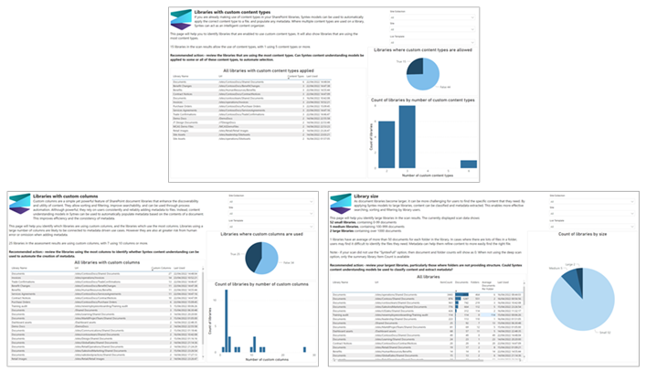

# Microsoft 365 評価ツールを使用してSharePoint Syntexの機会を見つける

> [!NOTE]
> Microsoft 365 評価ツールは、SharePoint Online に対してのみ実行できます。 

Microsoft 365 評価ツールを使用すると、SharePoint Syntexが組織にどのようなメリットをもたらすかを評価できます。 評価を実行すると、SharePoint 情報アーキテクチャの側面をまとめた Power BI レポートが生成されます。これは、SharePoint Syntexが価値を持つ可能性がある場所を示す指標です。

評価レポートには、次の情報が含まれています。 

- **カスタム列を含むライブラリ** – SharePoint Syntexが列を自動的に設定できるライブラリを特定し、一貫性を向上します。 

- **列の使用法** – 列の使用パターンを特定し、最大のメリットを得られるSharePoint Syntex モデルをターゲットに設定します。 

- **カスタム コンテンツ タイプを持つライブラリ – カスタム** コンテンツ タイプを使用してライブラリを識別します。この場合、SharePoint Syntex モデルを使用してファイルを自動的に分類できます。 

- **コンテンツ タイプの使用状況** – コンテンツ タイプの使用状況のパターンを特定し、最大のメリットを得られるSharePoint Syntex モデルをターゲットに設定します。 

- **保持ラベルを含むライブラリ – 保持ラベル** が使用されているライブラリを識別します。このライブラリでは、SharePoint Syntexを使用して一貫性を自動化および改善できます。 

- **ライブラリ サイズ** – 分類とメタデータによってコンテンツ検出エクスペリエンスが向上する大きなライブラリを特定します。 

- **ライブラリの最新化の状態** – SharePoint Syntexを完全に利用するために最新化する必要があるライブラリを特定します。 

- **事前構築済みモデル候補** – 名前またはコンテンツ タイプが事前構築済みモデルを適用できることを示唆するライブラリを特定します。 

- **Syntex モデルの使用状況** – サイト内のSharePoint Syntex モデルの現在の使用状況を確認します。 

- **評価の概要** – 評価結果を確認して、エラーを特定します。 

## 評価を実行する

SharePoint Syntex評価は、Microsoft 365 評価ツールのモジュールです。 評価を実行するには: 

1. 詳細については、 [Microsoft 365 評価ツールのドキュメントを参照](https://pnp.github.io/pnpassessment/index.html) してください。

2. [ツールをダウンロードします](https://pnp.github.io/pnpassessment/using-the-assessment-tool/download.html)。 

3. [認証方法を決定します](https://pnp.github.io/pnpassessment/using-the-assessment-tool/setupauth.html)。

4. [アクセス許可を構成します](https://pnp.github.io/pnpassessment/sharepoint-syntex/requirements.html)。 

5. [SharePoint Syntex評価を実行します](https://pnp.github.io/pnpassessment/sharepoint-syntex/assess.html)。 

