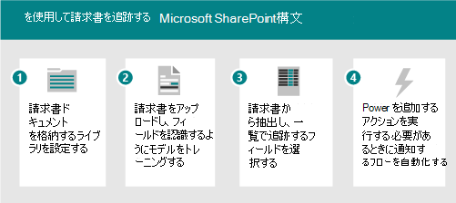

# Microsoft SharePoint Syntex のシナリオとユース ケース

次のシナリオ例を使用して、組織内でSharePoint Syntexを使用する方法に関するアイデアを求めます。

- [シナリオ: フォーム処理を使用して請求書のデータを追跡する](adoption-scenarios.md#scenario-track-data-from-invoices-with-form-processing)
- [シナリオ: ドキュメントの理解を使用してコントラクトからの情報を追跡する](adoption-scenarios.md#scenario-track-information-from-contracts-with-document-understanding)
- [シナリオ: SharePoint Syntexに基づくレコード管理、ドキュメント ガバナンス、コンプライアンス プロセスでリスクを回避する](adoption-scenarios.md#scenario-avoid-risk-with-records-management-document-governance-and-compliance-processes-based-on-sharepoint-syntex)
- [シナリオ: 以前にアクセスできなかったドキュメントから情報をキャプチャする](adoption-scenarios.md#scenario-capture-information-from-previously-inaccessible-documents)
- [シナリオ: データ処理を改善して分析情報と分析情報を提供する](adoption-scenarios.md#scenario-improve-data-processing-to-provide-insights-and-analytics)
- [シナリオ: 注文処理を自動化する](adoption-scenarios.md#scenario-automate-order-processing)
- [シナリオ: Visa の更新プロセスを簡略化する](adoption-scenarios.md#scenario-simplify-visa-renewal-process)

## シナリオ: フォーム処理を使用して請求書のデータを追跡する

たとえば、SharePoint Syntex機能とPower Automate機能を使用して、請求書を追跡および監視するプロセスを設定できます。

1. 請求書ドキュメントを格納するライブラリを設定します。
1. ドキュメント内のフィールドを認識するようにモデルをトレーニングします。
1. 追跡するフィールドをリストに抽出します。
1. 次のような特定のイベントについて通知するフローを設定します。
    - 新しい請求書が追加されます。
    - 請求書が期限を過ぎている。
    - 請求書は、自動承認金額よりも大きい金額です。

このシナリオを自動化すると、次のことができます。

- 手動で行うのではなく、請求書からデータを自動的に抽出することで、時間とコストを節約できます。
- ワークフローを使用して請求書をチェックし、問題が発生した場合は通知することで、潜在的なエラーを減らし、コンプライアンスを向上させます。

## シナリオ: ドキュメントの理解を使用してコントラクトからの情報を追跡する

別の例として、会社が他の会社や個人と持つ契約を特定するプロセスを設定できます。 クライアント名、料金、日付、その他の重要な情報などの重要な情報をコントラクトから抽出し、すばやく表示できるフィールドとしてライブラリに情報を追加するモデルを設定します。 ドキュメント ライブラリに保持ラベルを適用して、ビジネス規制に適切に準拠するために、特定の期間前にコントラクトを削除できないようにします。

1. コンテンツ センターから開始し、コントラクトの新しいドキュメント理解モデルを作成します。
1. サンプル ドキュメントをアップロードして正の例と負の例を示した後、トレーニングを実行してコントラクト ドキュメントを特定し、結果を確認します。
1. クライアント名、料金、日付などのコントラクト内のフィールドを識別するように抽出器をトレーニングし、抽出器をテストします。
1. モデルが完了したら、コントラクトをアップロードできるライブラリにモデルを適用します。
1. 保持ラベルを日付フィールドに適用し、コントラクトがライブラリ内に必要な期間保持されるようにします。

このシナリオを自動化すると、次のことができます。

- 手動ではなく、コントラクトからデータを自動的に抽出することで、時間とコストを節約できます。
- 保持ラベルを使用して、コントラクトが適切に保持されるようにして、コンプライアンスを強化します。

## シナリオ: SharePoint Syntexに基づくレコード管理、ドキュメント ガバナンス、コンプライアンス プロセスでリスクを回避する

リスクを減らすことは、ほとんどの企業にとって一般的な目標です。 次のものが必要な場合があります。

- テナント全体に情報ガバナンスを提供/適用するより優れた方法です。
- ドキュメント、電子メール、およびその他の形式のコミュニケーションの分類のためのシステムを改善するために、プロジェクトの "レコード" と見なされます。
- 領収書、契約などを監査して、会社のポリシーに準拠していることを確認する。
- コンプライアンスに必要なすべてのドキュメントがプロジェクトに確実に含まれるようにする。

より適切なガバナンスが必要なドキュメントやフォームをキャプチャし、適切に分類、監査、フラグを付けるために、SharePoint Syntexに準拠するための一部のプロセスを設定します。 エンド ユーザーが手動でタグ付けするのではなく、コンテンツを自動分類するSharePoint Syntex、ガバナンス ルールとアーカイブを手動で適用するコンプライアンス チームに依存できます。 また、簡略化された検索エクスペリエンスを有効にしたり、データ ボリュームを管理したり、レコード管理とアイテム保持ポリシーを適用したり、コンプライアンスを確保したり、ベスト プラクティスのアーカイブと削除のプラクティスを行うことができます。

このシナリオを自動化すると、次のようなセキュリティで保護されます。

- コンプライアンスが維持され、リスクが軽減されます。
- 分類とレコードの管理は一貫して正確に適用されます。
- コンテンツ ボリュームは制御されます。
- 従業員は、適切なコンテキストで適切な情報を簡単に見つけ出すことができます。

## シナリオ: 以前にアクセスできなかったドキュメントから情報をキャプチャする

ほとんどの組織には、法的ドキュメント、ポリシー、契約、人事ドキュメント、ガバナンス ガイドラインの大規模なリポジトリがあります。 これらのデータ ストアをマイニングして、プロジェクト、セクター、テーマ、人、地理的領域などの貴重な情報を抽出します。

たとえば、人事ディレクターは、履歴書、人事ポリシー、その他のフォームなど、すべての人事ドキュメントにすばやくアクセスする必要があります。 また、履歴書やその他の人事関連のドキュメントから必要な情報をすばやく特定し、ドキュメントを手動で確認する必要はありません。 何千もの履歴書、人事ポリシー、その他のドキュメントを複数のサイトにまたがって手動で調べる必要なく、必要な情報をすばやく見つけることができるソリューションを探しています。

このシナリオを自動化すると、次のことができます。

- デジタル コンテンツから知識を解き放つ。
- 人事ポリシー、履歴書、販売ドキュメント、技術ブループリント、アカウント プランを分類し、情報を抽出します。
- 探している正しい情報またはドキュメントをすばやく見つけます。
- 最新情報にすぐにアクセスできます。
- 検索時間を短縮します。

## シナリオ: データ処理を改善して分析情報と分析情報を提供する

たとえば、ある製薬会社は、SharePoint Syntexを使用して、リーダーが持つ質問に答えるために、SHAREPOINT SYNTEXを使用して、情報を抽出することができます。 回答に簡単にアクセスできるようにすることで、これらの回答を生成するために必要な時間を短縮し、データの可用性を高めて、リーダーシップの質問に対してより正確な回答を生成できます。

たとえば、プロジェクト マネージャーは、自分のリーダーシップ チームから製品関連の質問に対する回答をすばやく提供する必要があります。 1 つの統合ダッシュボードで、クエリに関連する情報とメトリックを見つける必要があります。 製品ラベル、製品パンフレット、その他の資料から必要な情報を抽出し、リーダーシップ チームに報告するときに使用できる統合レポートを生成するソリューションを探しています。

このシナリオを自動化すると、次のことができます。

- 回答を生成する時間を短縮します。
- データの可用性を高める。
- より正確な回答を提供します。

## シナリオ: 注文処理を自動化する

SharePoint Syntexを使用すると、顧客注文の手動処理の時間を短縮できます。 たとえば、OCR 処理を使用して FAX、電子メール、または用紙からSharePointに注文をアップロードし、それらの注文からメタデータを抽出して、自動化されたプロセスを使用してフルフィルメントすることができます。

たとえば、サプライ チェーン マネージャーは、手動データ入力によって発生するエラーを減らしたいと考えています。 ビジネス システムに入るエラーを減らすために、受信顧客注文 (紙、FAX、または電子メール) の手動レビューとデータ入力を回避したいと考えています。 受注情報を検証し、コア データを抽出し、注文のフルフィルメントと調整のために ERP システムに自動的にプッシュする AI と機械学習の手法を適用するソリューションが必要です。

このシナリオを自動化すると、次のことを確認できます。

- 注文と出荷の精度が向上します。
- 注文または出荷エラーに関連する料金またはペナルティは減額されます。
- 請求または支払いの遅延が減少します。
- 人事コストが削減されます。

## シナリオ: Visa の更新プロセスを簡略化する

SharePoint Syntexは、重要なコントラクト情報のアラームと更新を自動化するのに役立ちます。 たとえば、人事部長は、従業員のビザが最新の状態に保たれているか、期限内に更新されるようにする必要があります。 彼らは、人々に自分のVisaを更新するための簡単で直感的なプロセスを提供したいと考えています。 契約から更新日を抽出し、更新日が近づくと自動的に従業員にリマインダーを送信するソリューションが必要です。

このシナリオを自動化すると、次のことを確認できます。

- コンプライアンス違反のレベルが低下します。
- 手動アラームの数が減ります。
- コンプライアンス違反に対する細則の数が減ります。

## 関連項目

[SharePoint Syntexの導入を促進する概要](adoption-getstarted.md)