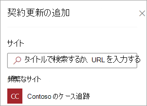
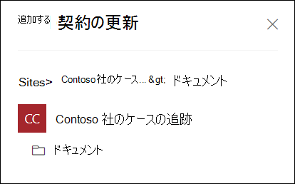
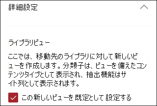
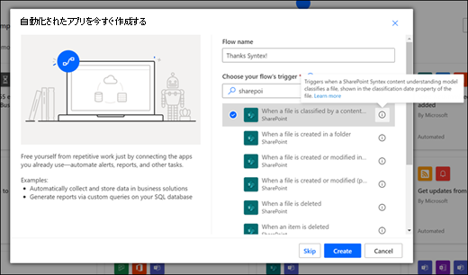

# Microsoft SharePoint Syntexのドキュメント理解モデルを適用する

 

> [!VIDEO https://www.microsoft.com/videoplayer/embed/RE4CSoL]

 

ドキュメント理解モデルを発行した後、そのモデルをテナント内の 1 つ以上SharePointドキュメント ライブラリにMicrosoft 365できます。

> [!NOTE]
> ユーザーがアクセスできるドキュメントライブラリにのみモデルを適用できます。

## ドキュメント ライブラリにモデルを適用する

モデルをSharePointドキュメントライブラリに適用するには、次の操作を行います。

1. モデル ホーム ページの [ライブラリにモデル **を適用]** タイルで、[モデルの適用] **を選択します**。 または、[モデルの適用 **先] セクションで** 、[+ライブラリの追加] **を選択します**。

    ![[ライブラリの追加] オプションが強調表示された [モデルの適用場所] セクションのスクリーンショット。](../media/content-understanding/apply-to-library.png)

2. モデルを適用するドキュメントライブラリが含まれている SharePoint サイトを選択できます。 リストにサイトが表示されない場合は、検索ボックスを使用して検索します。

    

    > [!NOTE]
    > モデルを適用しようとしているドキュメントライブラリへの *リスト管理* 許可を持っているかまたは、*編集* 権限を持っていなければなりません。

3. サイトを選択した後、モデルを適用するドキュメントライブラリを選択します。 このサンプルでは、*Contoso ケーストラッキング* サイトから *ドキュメント* ドキュメントライブラリ を選びます。

    

4. モデルはコンテンツ タイプに関連付けられているため、ライブラリに適用すると、抽出したラベルが列として表示されたコンテンツ タイプとそのビューが追加されます。 既定では、このビューはライブラリの既定のビューです。 ただし、[詳細設定] を選択し、[この新しいビューを既定のビューとして設定する] チェック ボックスをオフにすることで、既定のビューに表示しないオプションを **選択** できます。

    

5. モデルをライブラリに適用するには、[ **追加** ] を選択します。

6. モデル のホーム ページの[モデルの適用場所] セクションに、一覧に表示されるSharePoint表示されます。

7. ドキュメントライブラリに移動し、モデルのドキュメントライブラリビューに移動していることを確認します。 [ドキュメント **の**  >  **理解モデルの表示を自動化する] を選択します**。

8. [モデル **の確認と新しい** モデルの適用] ページで、[適用] タブを選択して、ドキュメント ライブラリに適用されるモデルを確認します。

    ![[適用] タブが選択され、適用されたモデルを示すスクリーンショット。](../media/content-understanding/applied-models.png) 

9. [ **モデルの詳細の** 表示] を選択すると、モデルの説明、モデルの公開者、分類するファイルに保持ラベルまたは感度ラベルが適用される場合など、モデルに関する情報が表示されます。

モデルをドキュメントライブラリに適用したら、サイトにドキュメントをアップロードし、結果を確認できます。

モデルは、モデルに関連付けられたコンテンツ タイプを持つファイルとフォルダーを識別し、ビューに一覧表示します。 モデルに抽出器がある場合、ビューには、各ファイルまたはフォルダーから抽出するデータの列が表示されます。

## ドキュメント ライブラリ内のファイルおよびフォルダー コンテンツにモデルを適用する

適用されたモデルは、適用後にドキュメント ライブラリにアップロードされたファイルとフォルダーコンテンツを処理しますが、適用されるモデルの前にドキュメント ライブラリに既に存在するファイルおよびフォルダー コンテンツでモデルを実行するには、次の操作を実行することもできます。

1. ドキュメント ライブラリで、モデルで処理するファイルとフォルダーを選択します。

2. ファイルとフォルダーを選択すると、[ **分類と** 抽出] がドキュメント ライブラリ リボンに表示されます。 **分類および抽出** を選択します。

      ![[分類と抽出] オプションを示すスクリーンショット。](../media/content-understanding/extract-classify.png) 

3. 選択したファイルとフォルダーは、処理するキューに追加されます。

    > [!NOTE]
    > 分類に必要な時間を示すメッセージが表示されます。 ファイルのみを選択した場合、分類に最大で 30 分かかる場合があります。 1 つ以上のフォルダーを選択した場合、分類には最大 24 時間かかる場合があります。

### [分類日] フィールド

ドキュメントのSharePoint Syntexまたはフォーム処理モデルをドキュメント ライブラリに適用すると、[分類日]フィールドがライブラリ スキーマに含まれます。 既定では、このフィールドは空です。 ただし、ドキュメントがモデルによって処理および分類される場合、このフィールドは完了の日付/時刻スタンプで更新されます。 

   ![[分類日] 列を示すドキュメント ライブラリのスクリーンショット。](../media/content-understanding/class-date-column.png) 

[**分類** 日] フィールドは、[ファイルをコンテンツ理解モデルによって分類する場合] トリガーによって使用され、Syntex コンテンツ理解モデルがファイルまたはフォルダーの処理を完了し、[分類日] フィールドを更新した後に Power Automate フローを実行します。

   

[ **ファイルをコンテンツ** 理解モデルで分類する場合] トリガーを使用して、ファイルまたはフォルダーから抽出された情報を使用して別のワークフローを開始できます。

## 関連項目

[分類子を作成する](create-a-classifier.md)

[エクストラクターを作成する](create-an-extractor.md)

[ドキュメント理解の概要](document-understanding-overview.md)
