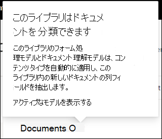

# SharePoint Syntex のモデルに保持ラベルを適用する

 

> [!VIDEO https://www.microsoft.com/videoplayer/embed/RE4GydO]  

 

Microsoft SharePoint Syntex のモデルに[保持ラベル](../compliance/retention.md)を簡単に適用できます。 これは、ドキュメント理解モデルとフォーム処理モデルの両方で実行できます。

保持ラベルを使用すると、モデルが識別するドキュメントに保持設定を適用できます。  たとえば、モデルで、ドキュメント ライブラリにアップロードされた *保険通知* ドキュメントを識別するだけでなく、*ビジネス* 保持タグを適用して、これらのドキュメントを指定された期間 ( たとえば、次の5か月) ドキュメント ライブラリから削除できないようにする必要があります。

モデルのホーム ページのモデル設定を使用して、既存の保持ラベルをモデルに適用できます。 

> [!Important]
> 保持ラベルをドキュメント理解モデルに適用できるようにするには、保持ラベルを[作成して Microsoft 365 コンプライアンス センターで公開する](../compliance/create-apply-retention-labels.md#how-to-create-and-publish-retention-labels)必要があります。

## 保持ラベルをドキュメント理解モデルに追加する

1. モデルのホーム ページから、[**モデルの設定**]を選択します。 
2. [**モデルの設定**] の [**セキュリティとコンプライアンス**] セクションで、[**保持ラベル**] メニューを選択して、モデルに適用できる保持ラベルのリストを表示します。 
 ![[保持ラベル] メニュー。](../media/content-understanding/retention-labels-menu.png)  
3. モデルに適用する保持ラベルを選択し、[**保存**] を選択します。 

モデルに保持ラベルを適用した後、次のものに適用できます。
- 新しいドキュメント ライブラリ
- モデルがすでに適用されているドキュメント ライブラリ
 
## モデルがすでに適用されているドキュメント ライブラリに保持ラベルを適用します

ドキュメント理解モデルがすでにドキュメント ライブラリに適用されている場合は、次の手順を実行して、保持ラベルの更新を同期し、ドキュメント ライブラリに適用できます。 

1. モデルホームページの [**このモデルのあるライブラリ**] セクションで、保持ラベルの更新を適用するドキュメントライブラリを選択します。   
2. [**同期**] を選択します。  
   

更新を適用してモデルに同期した後、次の手順を実行して、更新が適用されたことを確認できます。

1. コンテンツ センターの [**このモデルのあるライブラリ**] セクションで、更新したモデルが適用されたライブラリをクリックします。  
2. ドキュメント ライブラリ ビューで、情報アイコンを選択してモデルのプロパティを確認します。   
3. [**アクティブモデル**] リストで、更新したモデルを選択します。 
4. [**保持ラベル**] セクションに、適用された保持ラベルの名前が表示されます。 

ドキュメント ライブラリのモデルの表示ページに、新しい **保持ラベル** 列が表示されます。  モデルがそのコンテンツ タイプに属するものとして識別したファイルを分類し、それらをライブラリ ビューに一覧表示すると、[保持ラベル]列には、モデルを通じてモデルに適用された保持ラベルの名前も表示されます。

たとえば、モデルが識別するすべての *保険通知* ドキュメントには、*ビジネス* 保持ラベルも適用され、ドキュメント ライブラリから5か月間削除されないようにします。 ドキュメント ライブラリからファイルを削除しようとすると、保持ラベルが適用されているため許可されていないというエラーが表示されます。

## 保持ラベルをフォーム処理モデルに追加するには

> [!Important]
> 保持ラベルをフォーム処理モデルに適用できるようにするには、保持ラベルを[作成して Microsoft 365 コンプライアンス センターで公開する](../compliance/create-apply-retention-labels.md#how-to-create-and-publish-retention-labels)必要があります。

モデルの作成時にフォーム処理モデルに保持ラベルを適用するか、既存のモデルに適用することができます。

### フォーム処理モデルを作成するときに保持ラベルを追加するには

1. [新しいフォーム処理モデルを作成する](./create-a-form-processing-model.md)場合は、<b>[詳細設定]</b> を選択します。
2. <b>[詳細設定]</b> の <b>[保持ラベル]</b> セクションで、メニューを選択してから、モデルに適用する保持ラベルを選択します。</b>

 
      

3.  残りのモデル設定が完了したら、<b>[作成]</b> を選択してモデルを作成します。

### 保持ラベルを既存のフォーム処理モデルに追加するには

さまざまな方法で、保持ラベルを既存のフォーム処理モデルに追加できます。
- ドキュメント ライブラリの [自動化] メニューから
- ドキュメント ライブラリの [アクティブなモデル] の設定から 

#### [自動化] メニューを使用して、既存のフォーム処理モデルに保持ラベルを追加するには

モデルが適用されているドキュメント ライブラリの [自動化] メニューから、所有している既存のフォーム処理モデルに保持ラベルを追加できます。

1. フォーム処理モデルが適用されているドキュメント ライブラリで、<b>[自動化]</b> メニューを選択し、<b>[AI Builder]</b> を選択してから、<b>[フォーム処理モデルの詳細を表示する]</b> を選択します。

   ![[自動化] メニュー。](../media/content-understanding/automate-menu.png) 

2. モデルの詳細の <b>[保持ラベル]</b> セクションで、適用する保持ラベルを選択します。  その後、<b>[保存]</b> を選択します。

       

#### [アクティブなモデル] の設定で既存のフォーム処理モデルに保持ラベルを追加するには

モデルが適用されているドキュメント ライブラリの [アクティブなモデル] の設定から、所有している既存のフォーム処理モデルに保持ラベルを追加できます。

1. モデルが適用されている SharePoint ドキュメント ライブラリで、<b>[アクティブなモデルを表示する]</b> アイコンを選択し、<b>[アクティブなモデルを表示する]</b> を選択します。</b>

     

2. <b>[アクティブなモデル]</b> で、保持ラベルを適用するフォーム処理モデルを選択します。

       

3. モデルの詳細の <b>[保持ラベル]</b> セクションで、適用する保持ラベルを選択します。  その後、<b>[保存]</b> を選択します。

> [!NOTE]
> モデル設定ウィンドウを編集可能にするには、モデルの所有者である必要があります。 

## 関連項目
[分類子を作成する](create-a-classifier.md)

[エクストラクターを作成する](create-an-extractor.md)

[ドキュメント理解の概要](document-understanding-overview.md)
