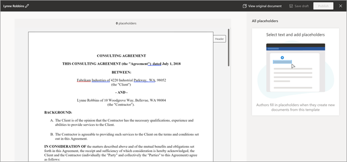
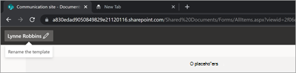

# Microsoft のコンテンツ アセンブリを使用してドキュメントを作成SharePoint Syntex

SharePoint Syntex を使用すると、契約、作業明細書、サービス契約、同意書、販売ピッチ、対応など、標準的な反復的なビジネス ドキュメントを自動的に生成できます。 コンテンツ アセンブリを使用すると、この処理を迅速かつ一貫して実行し、エラーが発生しにくくSharePoint Syntex。

コンテンツ アセンブリを使用すると、既存のドキュメントを使用してモダン テンプレートを作成し、そのテンプレートを使用して、SharePoint リストまたはユーザー入力をデータ ソースとして使用して新しいコンテンツを自動的に生成できます。

> [!NOTE]
> コンテンツ アセンブリ機能にアクセスSharePoint Syntex使用するには、ユーザーがライセンスを取得している必要があります。 また、リストを管理するためのアクセス許可SharePoint必要があります。

## モダン テンプレートの作成

モダン テンプレートを作成するには、次の手順に従います。

1. Sharepoint ドキュメント ライブラリから、[**NewCreate** >  **モダン テンプレート] を選択します**。 
 
   ![[モダン テンプレートの作成] オプションが強調表示されたドキュメント ライブラリのスクリーンショット。](../media/content-understanding/content-assembly-create-template-1.png)

2. モダン テンプレートを作成するための基礎として使用する既存の Word ドキュメントを選択し、[開く] を選択 **します**。 
 
   

   > [!NOTE]
   > 現在、テンプレートを作成するには、Word ドキュメント (.docx拡張機能) のみをアップロードできます。 アップロードまたはデスクトップから Word ドキュメントを削除します。

3. ドキュメントをアップロードすると、ドキュメントがテンプレート スタジオに表示され、ドキュメントをテンプレートに変換できます。
 
   

4. テンプレート スタジオの左上隅で、テンプレートの名前を選択します。 既定の名前は、テンプレートの作成に使用されるドキュメントの名前です。 テンプレートの名前を変更する場合は、既定の名前または名前の横にある鉛筆アイコンを選択し、新しい名前を入力し、[Enter] を選択 **します**。
 
   

5. ユーザーがドキュメント間で変更する可能性がある、ドキュメント内のすべての動的テキストのプレースホルダーを作成します。 たとえば、会社名、クライアント名、住所、電話番号、日付などの入力用のプレースホルダーを作成できます。

    プレースホルダーを作成するには、テキスト (日付など) を選択します。 [ **すべてのプレースホルダー]** パネルが開き、プレースホルダーに関連する名前を付け、プレースホルダーに関連付ける入力の種類を選択します。
 
   ![強調表示されているフィールドと [すべてのプレースホルダー] パネルを示すテンプレート ビューアーのスクリーンショット。](../media/content-understanding/content-assembly-create-template-4a.png)

   現在、ユーザーがプレースホルダーを入力するには、次の 2 つの方法があります。

   - [テキストを入力するか、日付を選択する](#associate-a-placeholder-by-entering-text-or-selecting-a-date)
   - [リストまたはライブラリの列の選択肢から選択する](#associate-a-placeholder-by-selecting-from-choices-in-a-column-of-a-list-or-library)

   > [!NOTE]
   > テキストのプレースホルダーのみを作成できます。 現在、画像、スマート アート、テーブル、箇条書きリストはサポートされていません。   

### テキストを入力するか、日付を選択してプレースホルダーを関連付ける 

[すべての **プレースホルダー] パネルで、次の操作を** 行います。

1. [名前 **] フィールド** に、プレースホルダーの関連する名前を入力します。

   ![手動入力用の [すべてのプレースホルダー] パネルを示すテンプレート ビューアーのスクリーンショット。](../media/content-understanding/content-assembly-create-template-5.png)

2. [このプレースホルダー **に作成者が入力する方法] セクションで** 、[テキストの入力] を選択 **するか、日付を選択します**。

3. [情報 **の種類] フィールド** で、プレースホルダーに関連付けるデータ型を選択します。 現在、1 行のテキスト、複数行のテキスト、**数値**、日付 **と** 時刻、電子メール、**ハイパーリンク** の 6 つのオプション **があります。**

4. **[追加]** を選択します。

### リストまたはライブラリの列で選択肢から選択してプレースホルダーを関連付ける

[すべての **プレースホルダー] パネルで、次の操作を** 行います。

1. [名前 **] フィールド** に、プレースホルダーの関連する名前を入力します。

   ![[すべてのプレースホルダー] パネルで、リストから入力するテンプレート ビューアー SharePoint。](../media/content-understanding/content-assembly-create-template-6.png)

2. [この **プレースホルダーの入力方法**] セクションで、[リストまたはライブラリの列の選択肢から選択] を選択し、[選択] を選択 **します**。

3. [ソース **列を追加するリスト** の選択] ページで、使用するリストを選択し、[次へ] を選択 **します**。

   ![リストを表示する [ソース列を追加するリストの選択] ページのスクリーンショット。](../media/content-understanding/content-assembly-create-template-7.png)

4. [既存の **リストからソース** 列を選択する] ページで、プレースホルダーに関連付ける列名を選択し、[保存] を選択 **します**。 

   

    リストの元のページを再度表示する場合は、リストの下部にある [移動] **(リスト名)** リンクを選択します。

5. 完了すると、リスト フィールドがプレースホルダーに関連付けられているのが表示されます。

   ![プレースホルダーに関連付けられたリスト フィールドを示す [すべてのプレースホルダー] パネルのスクリーンショット。](../media/content-understanding/content-assembly-create-template-9.png)

6. ユーザーが手動で入力を追加できる場合は、リストから選択する以外に、[作成者に新しい選択肢の追加を許可する **] を選択します**。 この場合、手動入力データ型の既定値は *1 行のテキストです*。 また、作成者が入力した値は、ドキュメントの生成にのみ使用されます。 リストに追加SharePointされません。
 
必要な数のプレースホルダーを作成できます。 完了したら、テンプレートを下書きとして保存するか、テンプレートを発行するか選択できます。

   - **[下書き** を保存] – テンプレートを下書きとして保存し、後でアクセスできます。 ドキュメント ライブラリから [ > **NewEdit New**] メニューを選択すると、[モダン テンプレート] セクションから保存した下書きを表示、編集、または発行できます。 
   - **発行** – 組織内の他のユーザーがドキュメントを作成するために使用するテンプレートを発行します。 ドキュメント ライブラリから [ > **NewEdit New**] メニューを選択すると、[モダン テンプレート]  セクションから発行済みテンプレートを表示、編集、または非公開にできます。 

## モダン テンプレートの編集

既存のテンプレートを編集する必要がある場合、またはテンプレートを削除または公開解除する必要がある場合は、次の手順を実行します。

1. Sharepoint ドキュメント ライブラリで、[NewEdit **New** > ] **メニューを選択します**。 
 
   ![[新しいメニューの編集] オプションが強調表示されたドキュメント ライブラリのスクリーンショット。](../media/content-understanding/content-assembly-edit-template-1.png)

2. [新しい **編集] メニュー パネル** の [モダン テンプレート] **セクションで、** 編集する公開テンプレートまたは下書きテンプレートを選択します。
 
   ![[モダン テンプレート] セクションを示す [新しいメニューの編集] パネルのスクリーンショット。](../media/content-understanding/content-assembly-edit-template-2.png)

3. 発行済みテンプレートまたは下書きテンプレートを編集するには、次の方法を実行します。

   - [ **発行済みテンプレート]** で 、[ **編集** ] を選択して、発行済みテンプレートを編集できるテンプレート スタジオを開きます。 テンプレートを削除または公開解除することもできます。 
 
      ![発行済みテンプレートを示す [モダン テンプレート] セクションのスクリーンショット。](../media/content-understanding/content-assembly-edit-published.png)

   - [ **下書きテンプレート]** で 、[ **編集** ] を選択して、下書きテンプレートを編集できるテンプレート スタジオを開きます。 テンプレートを削除または発行することもできます。
 
      ![下書きテンプレートを示す [モダン テンプレート] セクションのスクリーンショット。](../media/content-understanding/content-assembly-edit-draft.png)

## モダン テンプレートからドキュメントを作成する

発行済みモダン テンプレート *を使用* すると、最初から開始することなく、類似のドキュメントをすばやく作成できます。 発行済みテンプレートを使用してドキュメントを作成するには、次の手順を実行します。

1. Sharepoint ドキュメント ライブラリから [新規 **] を選択** し、使用するモダン テンプレートを選択します。
 
   ![[新しい] メニューのモダン テンプレートの選択肢を示すドキュメント ライブラリのスクリーンショット。](../media/content-understanding/content-assembly-create-document-1.png)

2. テンプレートがテンプレート スタジオで開きます。

3. [テンプレートから **ドキュメントを作成する] パネル** で、情報を入力し、[ドキュメントの作成] **を選択します**。

   ![[テンプレートからドキュメントを作成する] パネルを示すドキュメント ライブラリのスクリーンショット。](../media/content-understanding/content-assembly-create-document-2.png)

   プレースホルダーの値の入力に伴う時間と労力を削減するために、次のSharePoint Syntex提供します。

      - リストから値を選択するときに値を簡単に選ぶ際に役立つ候補。
      - 同じリストに関連付けられたプレースホルダーのレコードを一意に識別できる場合は、プレースホルダーの値を自動入力します。

> [!NOTE]
> - 現在、テンプレートMicrosoft Word作成.docxドキュメント (.docx) だけがサポートされています。 ドキュメントをアップロードする前に、Word ドキュメントに変更の追跡が有効 **になっていないか、** コメントが有効になっていないか確認してください。 ドキュメントに画像のテキスト プレースホルダーが含まれている場合は、テキストラップされていないことを確認します。 現時点では、Word **のコンテンツ コントロール** はサポートされていません。 コンテンツ コントロールを含む Word ドキュメントからテンプレートを作成する場合は、モダン テンプレートを作成する前にテンプレートを削除してください。
>- テンプレートとドキュメントは、1 つのドキュメント ライブラリに関連付けされます。 別のドキュメント ライブラリでテンプレートを使用するには、そのドキュメント ライブラリでテンプレートを再度作成する必要があります。
>- モダン テンプレートの作成に使用されるアップロードされたドキュメントは、別のコピーとして保存され、ドキュメント ライブラリの /forms ディレクトリに配置されます。 ディスク上の元のファイルは影響を受けません。
>- テキストのプレースホルダーのみを作成できます。 現在、画像、スマート アート、テーブル、箇条書きリストはサポートされていません。
>- テンプレートからドキュメントを作成すると、そのドキュメントはテンプレートに関連付けされません。

 
