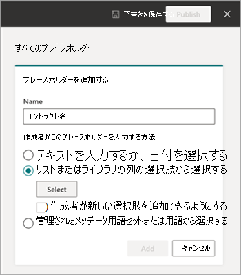

# Microsoft SharePoint Syntexでコンテンツ アセンブリを使用してドキュメントを作成する

SharePoint Syntexを使用すると、コントラクト、作業明細書、サービス契約、同意書、セールス ピッチ、通信などの標準的な反復ビジネス ドキュメントを自動的に生成するのに役立ちます。 SharePoint Syntexでコンテンツ アセンブリを使用することで、このすべてを迅速に、より一貫性のある、より少ないエラーで実行できます。

コンテンツ アセンブリでは、既存のドキュメントを使用して *モダン テンプレート* を作成し、そのテンプレートを使用して、SharePoint リストまたは手動エントリをデータ ソースとして使用して新しいコンテンツを自動的に生成できます。

> [!NOTE]
> コンテンツ アセンブリ機能にアクセスして使用するには、ライセンスSharePoint Syntexユーザーである必要があります。 SharePoint リストを管理するためのアクセス許可も必要です。

## モダン テンプレートを作成する

モダン テンプレートを作成するには、次の手順に従います。

1. SharePoint ドキュメント ライブラリから、[ **新しい** > **モダン テンプレートの作成**] を選択します。

   ![[モダン テンプレートの作成] オプションが強調表示されているドキュメント ライブラリのスクリーンショット。](../media/content-understanding/content-assembly-create-template-1.png)

2. モダン テンプレートの作成の基礎として使用する既存の Word 文書を選択し、[ **開く**] を選択します。

   

   > [!NOTE]
   > 現時点では、Word ドキュメント (.docx拡張機能) のみをアップロードしてテンプレートを作成できます。 ローカル ストレージまたはデスクトップから Word ドキュメントをアップロードします。

3. ドキュメントをアップロードすると、ドキュメントがテンプレート スタジオに表示され、ドキュメントをテンプレートに変換できます。

   

4. テンプレート スタジオの左上隅で、テンプレートの名前を選択します。 既定の名前は、テンプレートの作成に使用されるドキュメントの名前です。 テンプレートの名前を変更する場合は、既定の名前または名前の横にある鉛筆アイコンを選択し、新しい名前を入力して Enter キーを **押します**。

   

5. ドキュメント内のすべての動的テキストのプレースホルダーを作成し、ユーザーがドキュメント間で変更する必要がある場合があります。 たとえば、会社名、クライアント名、住所、電話番号、日付などの入力用のプレースホルダーを作成できます。

    プレースホルダーを作成するには、テキスト (日付など) を選択します。 **[すべてのプレースホルダー]** パネルが開き、プレースホルダーに関連する名前を付けて、プレースホルダーに関連付ける入力の種類を選択します。
 
   ![強調表示されたフィールドと [すべてのプレースホルダー] パネルを示すテンプレート ビューアーのスクリーンショット。](../media/content-understanding/content-assembly-create-template-4b.png)

   現在、ユーザーがプレースホルダーを入力するには、次の 3 つの方法があります。

   - [テキストを入力するか、日付を選択する](#associate-a-placeholder-by-entering-text-or-selecting-a-date)
   - [リストまたはライブラリの列の選択肢から選択する](#associate-a-placeholder-by-selecting-from-choices-in-a-column-of-a-list-or-library)
   - [管理されたメタデータ用語セットまたは用語から選択する](#associate-a-placeholder-by-selecting-from-managed-metadata-term-set-or-term)

   > [!NOTE]
   > テキスト専用のプレースホルダーを作成できます。 現在、画像、スマート アート、テーブル、箇条書きはサポートされていません。   

### テキストを入力するか、日付を選択してプレースホルダーを関連付ける

**[すべてのプレースホルダー] パネルで、次の操作を行います**。

1. **[名前]** フィールドに、プレースホルダーに関連する名前を入力します。

   ![手動入力用の [すべてのプレースホルダー] パネルを示すテンプレート ビューアーのスクリーンショット。](../media/content-understanding/content-assembly-create-template-5a.png)

2. [ **作成者がこのプレースホルダーを入力する方法** ] セクションで、[ **テキストの入力] を選択するか、日付を選択します**。

3. [ **情報の種類** ] フィールドで、プレースホルダーに関連付けるデータ型を選択します。 現在、1 **行のテキスト、複数行のテキスト**、**数値**、**日付と時刻**、**Email**、**ハイパーリンク****の** 6 つのオプションを使用できます。

4. **[追加]** を選択します。

   > [!NOTE]
   > MM/DD/YYYY、DD/MM/YYYY、YYYY/MM/DD、Month DD などの複数の日付フォーマッタを構成できます。これには、12 時間形式と 24 時間形式の両方の設定時間を含みます。 

### リストまたはライブラリの列の選択肢から選択してプレースホルダーを関連付ける

**[すべてのプレースホルダー] パネルで、次の操作を行います**。

1. **[名前]** フィールドに、プレースホルダーに関連する名前を入力します。

   

2. [ **作成者がこのプレースホルダーを入力する方法** ] セクションで、 **リストまたはライブラリの列で [選択**] を選択し、[選択] を選択 **します**。

3. [ **ソース列を追加するリストの選択] ページで** 、使用するリストを選択し、[ **次へ**] を選択します。

   ![リストを示す [ソース列を追加するリストの選択] ページのスクリーンショット。](../media/content-understanding/content-assembly-create-template-7.png)

4. 既存の **リスト ページからソース列を選択** し、プレースホルダーに関連付ける列名を選択し、[保存] を選択 **します**。

   

    リストの元のページをもう一度表示する場合は、リストの下部にある **[移動] (リスト名)** リンクを選択します。

5. 完了すると、リスト フィールドがプレースホルダーに関連付けられていることがわかります。

   ![プレースホルダーに関連付けられているリスト フィールドを示す [すべてのプレースホルダー] パネルのスクリーンショット。](../media/content-understanding/content-assembly-create-template-9.png)

6. ユーザーが入力を手動で追加できるようにする場合は、リストから選択するだけでなく、[ **作成者に新しい選択肢の追加を許可する**] を選択します。 この場合、手動入力データ型の既定値は *1 行のテキストです*。 また、作成者が入力した値は、ドキュメントの生成にのみ使用されます。 これらは SharePoint リストに追加されません。

### マネージド メタデータ用語セットまたは用語から選択してプレースホルダーを関連付ける

**[すべてのプレースホルダー] パネルで、次の操作を行います**。

1. **[名前]** フィールドに、プレースホルダーに関連する名前を入力します。

   ![用語または用語セットからの入力用の [すべてのプレースホルダー] パネルを示すテンプレート ビューアーのスクリーンショット。](../media/content-understanding/content-assembly-create-template-term.png)

2. [ **作成者がこのプレースホルダーを入力する方法** ] セクションで、[ **管理されたメタデータ用語セットまたは用語から選択**] を選択し、[選択] を選択 **します**。

3. [ **用語セットまたは用語の選択** ] ページで、プレースホルダーに関連付ける用語セットまたは用語を検索または選択し、[保存] を選択 **します**。

   ![[用語セットまたは用語の選択] ページのスクリーンショット。](../media/content-understanding/content-assembly-select-term.png)

4. 完了すると、選択した用語セットまたは用語がプレースホルダーに関連付けられていることがわかります。 

   ![関連する用語セットまたは用語を示す [すべてのプレースホルダー] パネルのスクリーンショット。](../media/content-understanding/content-assembly-associated-term.png)

5. ユーザーが用語セットまたは用語に対応する複数の値を追加できるようにするには、[ **複数の値を許可する**] を選択します。 また、用語セットがオープン用語セットとして構成されている場合は、[ **新しい値を許可する**] を選択できます。 このオプションを有効にすると、モダン テンプレートからドキュメントを生成するユーザーは、用語セットに新しい用語を追加し、それらの用語をプレースホルダー値として追加できます。

   > [!TIP]
   > **[新しい値を許可する**] オプションを有効にすると (用語セットを開く場合にのみ許可されます)、ユーザーは用語ストアに冗長な用語を追加する可能性が高くなります。 冗長な用語を使用すると、管理者が用語セットを管理することが困難になる場合があります。

必要な数のプレースホルダーを作成できます。 完了したら、テンプレートを下書きとして保存するか、テンプレートを発行するかを選択できます。

   - **下書きを保存** – テンプレートを下書きとして保存し、後でアクセスできます。 [ **モダン テンプレート** ] セクションから保存した下書きを表示、編集、または発行するには、ドキュメント ライブラリの **[新しい** > **編集] メニュー** を選択します。
 
   - **発行** – 組織内の他のユーザーがドキュメントを作成するために使用するテンプレートを発行します。 ドキュメント ライブラリから **[新しい** > **編集] メニュー** を選択すると、[**モダン テンプレート**] セクションから *発行済み* テンプレートを表示、編集、または非公開にすることができます。 

## モダン テンプレートを編集する

既存のテンプレートを編集する必要がある場合、またはテンプレートを削除または非公開にする必要がある場合は、次の手順に従います。

1. SharePoint ドキュメント ライブラリから、[ **新しい** > **編集] メニューを選択します**。

   ![[新しい編集] メニュー オプションが強調表示されているドキュメント ライブラリのスクリーンショット。](../media/content-understanding/content-assembly-edit-template-1.png)

2. [ **新しい編集] メニュー** パネルの [ **モダン テンプレート** ] セクションで、編集する発行済みテンプレートまたは下書きテンプレートを選択します。

   ![[モダン テンプレート] セクションを示す [新しい編集] メニュー パネルのスクリーンショット。](../media/content-understanding/content-assembly-edit-template-2.png)

3. 発行済みテンプレートまたは下書きテンプレートを編集するには:

   - **[発行済みテンプレート**] で [**編集]** を選択し、公開されたテンプレートを編集できるテンプレート スタジオを開きます。 テンプレートを削除または公開解除することもできます。

      ![発行されたテンプレートを示す [モダン テンプレート] セクションのスクリーンショット。](../media/content-understanding/content-assembly-edit-published.png)

   - **下書きテンプレート** の場合は、[**編集]** を選択してテンプレート スタジオを開き、下書きテンプレートを編集できます。 テンプレートを削除または発行することもできます。

      ![下書きテンプレートを示す [モダン テンプレート] セクションのスクリーンショット。](../media/content-understanding/content-assembly-edit-draft.png)

## モダン テンプレートからドキュメントを作成する

*公開済みの* モダン テンプレートを使用すると、最初から作業を開始しなくても、同様のドキュメントをすばやく作成できます。 発行されたテンプレートを使用してドキュメントを作成するには、次の手順に従います。

1. SharePoint ドキュメント ライブラリから [ **新規**] を選択し、使用するモダン テンプレートを選択します。

   ![[新規] メニューのモダン テンプレートの選択肢を示すドキュメント ライブラリのスクリーンショット。](../media/content-understanding/content-assembly-create-document-1.png)

2. テンプレートがテンプレート スタジオで開きます。

3. [ **テンプレートからドキュメントを作成** する] パネルで、情報を入力し、[ **ドキュメントの作成**] を選択します。

   ![[テンプレートからドキュメントを作成する] パネルを示すドキュメント ライブラリのスクリーンショット。](../media/content-understanding/content-assembly-create-document-2b.png)

   プレースホルダーの値の入力に関連する時間と労力を減らすため、SharePoint Syntexは次の情報を提供します。

      - リストから値を選択するときに値を簡単に選択するのに役立つ推奨事項。
      - 同じリストに関連付けられているプレースホルダーのレコードを一意に識別できる場合は、プレースホルダーの値を自動入力します。

> [!NOTE]
> **現在のリリースの制限事項**
>- 現在、テンプレートの作成では、Microsoft Word ドキュメント (.docx拡張機能) のみがサポートされています。 Word 文書をアップロードする前に、コメントが含まれていないか、変更 **履歴が有効** になっていることを確認します。 ドキュメントに画像のテキスト プレースホルダーが含まれている場合は、テキストで折り返されていないことを確認します。 Word のコンテンツ コントロールは現在サポートされていません。 コンテンツ コントロールを使用して Word 文書からテンプレートを作成する場合は、モダン テンプレートを作成する前に削除します。
>- テンプレートとドキュメントは、1 つのドキュメント ライブラリに関連付けられます。 別のドキュメント ライブラリでテンプレートを使用するには、そのドキュメント ライブラリでテンプレートを再度作成する必要があります。
>- モダン テンプレートの作成に使用されるアップロードされたドキュメントは、別のコピーとして保存され、ドキュメント ライブラリの /forms ディレクトリに配置されます。 ディスク上の元のファイルは影響を受けません。
>- テキスト専用のプレースホルダーを作成できます。 現在、画像、スマート アート、テーブル、箇条書きはサポートされていません。
>- ドキュメントがテンプレートから作成されると、そのドキュメントはテンプレートに関連付けられません。

 
