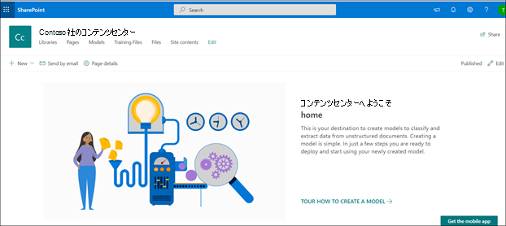
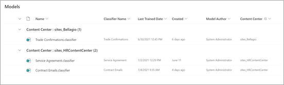

# Microsoft SharePoint Syntexでコンテンツセンターを作成する

 

> [!VIDEO https://www.microsoft.com/videoplayer/embed/RE4CPSF]

 

ドキュメント理解モデルを作成および管理するには、まずコンテンツ センターが必要です。 コンテンツ センターはモデル作成インターフェイスであり、公開されたモデルが適用されたドキュメント ライブラリに関する情報も含まれています。

   

[セットアップ](set-up-content-understanding.md)中に既定のコンテンツ センターを作成します。 ただし、SharePoint 管理者は、必要に応じて追加のセンターを作成することもできます。 すべてのモデル アクティビティをロールアップする環境では単一のコンテンツ センターで十分な場合もありますが、組織内の複数の部門に追加のセンターを用意することもできます。これらの部門では、モデルのニーズと権限要件が異なる場合があります。

また、SharePoint Syntex を試したい場合は、ライセンスを購入しなくても、この記事の手順を使用してコンテンツ センターを作成することができます。 ライセンスを付与されていないユーザーは、ドキュメント理解モデルを作成することはできますが、それをドキュメントライブラリに適用することはできません。

> [!NOTE]
> [Microsoft 365 Multi-Geo 環境](../enterprise/microsoft-365-multi-geo.md)では、中央の場所に単一の既定のコンテンツ センターがある場合、その場所内からのみモデル アクティビティのロールアップを提供できます。 現在、Multi-Geo 環境のファーム境界を越えてモデル アクティビティのロールアップを取得することはできません。 

## コンテンツ センターを作成する

SharePoint 管理者は、管理センター サイトプ ロビジョニング パネルを介して[他のSharePoint サイトを作成する](/sharepoint/create-site-collection)のと同じように、コンテンツ センター サイトを作成できます。

新しいコンテンツ センターを作成するには

1. Microsoft 365 管理センターで、[SharePoint 管理センター **アクティブ サイト** ページ](https://admin.microsoft.com/sharepoint?page=siteManagement&modern=true)に移動します。

2. [**アクティブなサイト**] ページで、[**作成**] をクリックし、[**その他のオプション**] を選択します。

3. [**テンプレートの選択**] メニューで、[**コンテンツセンター**] を選択します。

4. 新しいサイトの場合は、**サイト名**、**プライマリ管理者**、および **言語** を指定します。 

   > [!NOTE] 
   > コンテンツ センター サイトを選択して、使用可能な任意の言語で表示できますが、現在、モデルは英語のファイルに対してのみ作成できることに注意してください。 また、他のサイト テンプレートと同様に、サイトの作成後に既定のサイトの言語を編集できないことにも注意してください。

5. [**完了**] を選択します。
 
コンテンツセンターサイトを作成すると、SharePoint 管理センターの [**アクティブなサイト**] ページに一覧表示されます。 

### 追加のユーザーにアクセスを許可する
 
サイトを作成した後、標準の [SharePoint サイト アクセス許可モデル](/sharepoint/modern-experience-sharing-permissions)を使用して、追加のユーザーにサイトへのアクセスを許可できます。

### 既定のコンテンツ センターでのモデルのロールアップ

SharePoint Syntex では、セットアップ時に作成される最初のコンテンツ センターが *既定のコンテンツ センター* です。 後続のコンテンツ センターを作成した場合、そのモデルは既定のコンテンツ センター ビューに表示されます。

既定のコンテンツ センター ビューの [**モデル**] ライブラリは、作成されたモデルをコンテンツ センターごとにグループ化し、作成されたすべてのドキュメント理解モデルとフォーム処理モデルの概要を表示します。

> [!NOTE]
> 指定された既定のコンテンツ センターを変更することはできません。 それは、セットアップ時に最初に作成されるコンテンツ センターです。 

## 関連項目
[分類子を作成する](create-a-classifier.md)

[抽出子を作成する](create-an-extractor.md)

[コンテンツ センターを作成する](create-a-content-center.md)

[ドキュメント理解の概要](document-understanding-overview.md)

[フォーム処理モデルを作成する](create-a-form-processing-model.md)

[モデルを適用する](apply-a-model.md)