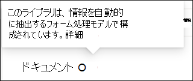

# フォーム処理モデルを作成する (プレビュー)

> [!Note] 
> この記事の内容は、Project Cortex のプライベートプレビュー用です。 [詳細については、「Project Cortex](https://aka.ms/projectcortex)」を参照してください。

[AI ビルダー](https://docs.microsoft.com/ai-builder/overview)を使用する-Microsoft PowerApps のフィーチャー-プロジェクト cortex ユーザーは、SharePoint ドキュメントライブラリから直接[フォーム処理モデル](form-processing-overview.md)を作成できます。 

フォーム処理モデルを作成するには、以下の作業を行います。
 - 手順 1: コンテンツタイプを作成するための from 処理モデルを作成する
 - 手順 2: サンプルファイルを追加して分析する
 - 手順 3: フォームフィールドを選択する
 - 手順 4: モデルをトレーニングおよびテストする
 - 手順 5: モデルを発行する
 - 手順 6: モデルを使用する

## Requirements

フォーム処理モデルは、それが有効になっている SharePoint ドキュメントライブラリでのみ作成できます。 フォーム処理が有効になっている場合は、ドキュメントライブラリの [**自動化**] メニューにある [**フォーム処理モデルを作成**する] という**AI ビルダー**が表示されます。  ドキュメントライブラリで処理が有効になっている必要がある場合は、管理者に問い合わせてください。

  

## 手順 1: フォーム処理モデルを作成する

フォーム処理モデルを作成する最初の手順は、新しいコンテンツタイプを定義して、そのコンテンツタイプに新しいドキュメントライブラリビューを作成するための名前を作成することです。

1. ドキュメントライブラリで、[ **自動化** ] メニューの [ **AI ビルダー**] を選択し、[ **フォーム処理モデルの作成**] を選択します。

     
2. [ **新しいフォーム処理モデル** ] ウィンドウの [  **名前** ] フィールドに、モデルの名前を入力します (例: *発注書*)。

      

3. フォーム処理モデルを作成するときは、新しい SharePoint コンテンツタイプを作成します。 SharePoint コンテンツタイプは、共通の特性を持つドキュメントのカテゴリを表し、その特定のコンテンツの列またはメタデータプロパティのコレクションを共有します。 SharePoint コンテンツタイプは、 [コンテンツタイプギャラリー]()を使用して管理されます。

    このモデルを SharePoint コンテンツタイプギャラリーの既存のコンテンツタイプにマッピングして、そのスキーマを使用する場合は、[ **詳細設定** ] を選択します。 

4. モデルによって、抽出されたデータ用のドキュメントライブラリに新しいビューが作成されます。 これを既定のビューにしない場合は、[ **既定としてビューを設定**する] をオフにします。
5. **[作成]** を選択します。

## 手順 2: ドキュメントを追加して分析する

新しいフォーム処理モデルを作成すると、ブラウザーに新しい PowerApps AI ビルダーフォーム処理モデルページが表示されます。 このページでは、サンプルドキュメントを追加して分析することができます。  

> [!Note]
> 使用するファイルの例については、「 [フォーム処理モデルの入力文書の要件」と「最適化のヒント](https://docs.microsoft.com/ai-builder/form-processing-model-requirements)」を参照してください。 

     
 

1. [ **ドキュメントの追加** ] をクリックして、分析するサンプルドキュメントの追加を開始し、抽出できる名前付き値のペアを決定します。 [ローカルストレージ、 **SharePoint**、または**Azure Blob ストレージ****からのアップロード**] のいずれかを選択できます。 トレーニングには、少なくとも5つのファイルを使用する必要があります。
2. ファイルを追加した後、[ **分析** ] を選択して、一般的な情報がすべてのファイルであるかどうかを確認します。 この処理が完了するまで数分かかる場合があることに注意してください。  
 
      

3. 分析した後、[保存する **フォームフィールドを選択** してください] ページで、ファイルをクリックして検出されたフィールドを表示します。 

      

## 手順 3: フォームフィールドを選択する

フィールドのドキュメントを分析すると、どのフィールドが検索されたか、どのフィールドが保存されるかを確認できるようになります。 保存されたフィールドは、モデルのドキュメントライブラリビューで列として表示され、各ドキュメントから抽出された値を表示します。

1. 次のページは、サンプルファイルの1つを表示し、システムによって自動的に検出されたすべての共通フィールドを強調表示します。  

      

2. 保存するフィールドを選択し、チェックボックスをオンにして選択内容を確認します。 たとえば、発注書モデルでは、 *日付*、 *PO*、および *集計* フィールドを選択することができます。  また、選択した場合は、フィールドの名前を変更することもできます。  

      

3. 分析でフィールドが検出されなかった場合でも、追加することを選択できます。 抽出する情報を選択し、[名前] ボックスに目的の名前を入力します。 次に、チェックを選択します。 このようなファイルの例では、検出されていないフィールドを確認する必要があることに注意してください。
4. 保存するフィールドを選択したら、[ **フィールドの確認** ] をクリックします。  
 
      
 
5. [ **保存するフォームフィールドを選択** してください] ページで、選択したフィールドの数が表示されます。 [**完了**] を選択します。

## 手順 4: モデルをトレーニングおよびテストする

保存するフィールドを選択すると、モデルの **概要** ページが表示され、モデルのトレーニングとテストができるようになります。

1. [ **モデルの概要** ] ページの [ **選択したフィールド** ] セクションに、保存したフィールドが表示されます。 サンプルファイルのトレーニングを開始するには、[ **Train** ] を選択します。 この処理が完了するまで数分かかる場合があることに注意してください。 
      
2. トレーニングが完了したことを示す通知が表示されたら、[ **詳細ページに移動**] を選択します。 
3. [ **モデルの詳細** ] ページで、[ **クイックテスト**] を選択してモデルの動作をテストできます。 これにより、ファイルをページにドラッグアンドドロップして、フィールドが検出されたかどうかを確認できます。

## 手順 5: モデルを発行する

1. モデルの結果に問題がなければ、[ **発行** ] を選択して使用できるようにします。
2. モデルが公開されたら、[ **Use model**] を選択します。 これにより、SharePoint ドキュメントライブラリで実行され、モデルで識別されたフィールドが抽出される PowerAutomate フローが作成されます。 [ **フローの作成**] を選択します。  
3. 完了すると、 **フローが正常に作成され**たことをメッセージが表示されます。
 
 
## 手順 6: モデルを使用する

モデルを発行して、そのモデルの PowerAutomate フローを作成した後、モデルを SharePoint ドキュメントライブラリで使用できます。

1. モデルを公開した後、[ **SharePoint に移動** ] を選択してドキュメントライブラリに移動します。
2. [ドキュメントライブラリモデル] ビューで、選択したフィールドが列として表示されることに注意してください。 

      

    また、[ **ドキュメント** ] の横にある [情報] リンクは、フォーム処理モデルがこのドキュメントライブラリに適用されていることに注意してください。

       

3. ファイルをドキュメントライブラリにアップロードします。 モデルがコンテンツタイプとして識別するすべてのファイルは、ビュー内のファイルを一覧表示し、抽出されたデータを列に表示します。 

       

## 関連項目
  
[電力の自動化に関するドキュメント](https://docs.microsoft.com/power-automate/) 
[トレーニング: AI ビルダーを使用してビジネスパフォーマンスを向上させる](https://docs.microsoft.com/learn/paths/improve-business-performance-ai-builder/?source=learn) 

