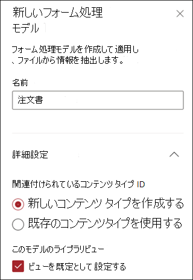
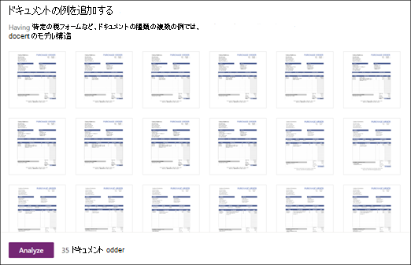
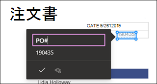
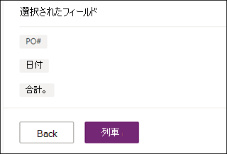

# Microsoft SharePoint Syntexでフォーム処理モデルを作成する

 

> [!VIDEO https://www.microsoft.com/videoplayer/embed/RE4GnhN]  

 

[AI ビルダー](https://docs.microsoft.com/ai-builder/overview)-Microsoft PowerApps の a 機能-SharePoint Syntex のユーザーは、SharePoint ドキュメントライブラリから直接 [フォームプ処理モデル](form-processing-overview.md)を作成できます。 

フォーム処理モデルを作成するには、次の操作を行います。
 - 手順 1: コンテンツタイプを作成するために、フォーム処理モデルを作成する
 - 手順 2: サンプルファイルを追加して分析する
 - 手順 3: フォームフィールドを選択する
 - 手順 4: モデルをトレーニングしてテストする
 - 手順 5:モデルを発行する
 - 手順 6: モデルを使う

## 要件

フォームを作成するには、それが有効になっている SharePoint ドキュメントライブラリを使用する必要があります。 フォームの処理が有効になっている場合は、ドキュメントライブラリの **自動化** メニューの [**フォームの処理モデルを作成する** "**AI ビルダー**が表示されます。  ドキュメントライブラリで処理を有効にする必要がある場合は、SharePoint 管理者にお問い合わせください。

  

## 手順 1: フォーム処理モデルを作成する

フォーム処理モデルを作成するには、最初に、名前を付けて、新しいコンテンツタイプを定義して、それに対応する新しいドキュメントライブラリビューを作成します。

1. ドキュメントライブラリで、 **オートメーションの** メニューを選択し、 **AI ビルダー**それから、**フォームの処理モデルを作成**を選択します。

     

2. [ **新しいフォームの処理モデル** ]  ウィンドウで、[  **名前の** ] フィールドにモデルの名前を入力します (たとえば、 *発注書*)。

      

3. フォーム処理モデルを作成する場合は、新しい SharePoint コンテンツタイプを作成します。 SharePointコンテンツタイプは、共通の特徴を持つドキュメントのカテゴリを表し、特定のコンテンツの列またはメタデータプロパティのコレクションを共有します。 SharePoint コンテンツタイプは、 [コンテンツタイプギャラリー]()で管理されます。

    このモデルを SharePoint コンテンツタイプギャラリーの既存のエンタープライズコンテンツタイプにマッピングして、そのスキーマを使用するには、[ **詳細設定**] を選択します。 

4. モデルでは、抽出されたデータ用に、ドキュメントライブラリに新しいビューが作成されます。 既定のビューを表示しない場合は、[**既定のとしてビューを設定する**] の選択を解除 ます。

5. **[作成]** を選択します。

## 手順 2: ドキュメントを追加して分析する

新しいフォーム処理モデルを作成すると、ブラウザーに新しい PowerApps AI ビルダーフォームプロセスモデルページが開きます。 このページでは、サンプルドキュメントを追加して分析できます。  

> [!NOTE]
> 使用するサンプルファイルを探すには、「 [フォームプロセッシングモデルインプットの要件および最適化のヒント](https://docs.microsoft.com/ai-builder/form-processing-model-requirements)」を参照してください。 

     
 
1. [**ドキュメントの追加** ] を選択して、名前付き値のペアを判断するために分析するサンプルドキュメントの追加を開始 ます。 その後、[**ローカルストレージからの アップロード**]、**SharePoint**または **Azure Blob ストレージ**のいずれかを選択できます。 トレーニングには少なくとも5つのファイルが必要です。

2. ファイルを追加した後は、[ **分析** ] を選択して、共通の情報があるかどうかを確認します。 このアクションは、完了するのに数分かかることがあります。  
 
      

3. ファイルの分析が完了したら、[ **保存するフォームフィールドの選択** ページで、検出されたフィールドを表示するファイルを選択します。 

      

## 手順 3: フォームフィールドを選択する

フィールドのドキュメントの分析が完了すると、見つかったフィールドが表示され、保存するフィールドが特定されます。 保存されたフィールドは、モデルのドキュメントライブラリビューに列として表示され、各ドキュメントから抽出された値が表示されます。

1. 次のページには、サンプルファイルの1つが表示され、システムによって自動的に検出された共通のフィールドがすべて強調表示されます。  

    ![[フィールドの選択] ページ](../media/content-understanding/select-fields-page.png)  

2. 保存するフィールドを選択し、チェックボックスをオンにして選択を確定します。 たとえば、発注書モデルでは、*日付*、*PO*、*合計 *フィールドを選択します。  選択した場合、フィールドの名前を変更することもできます。  

      

3. 分析でフィールドが検出されなかった場合は、追加することができます。 抽出する情報を強調表示し、[名前] ボックスに名前を入力します。 チェックボックスをオンにします。 残りのサンプルファイルでは、検出されないフィールドを確認する必要があります。

4. 保存するフィールドを選択した後、[ **フィールドの確認** をクリックします。  
 
      
 
5. [ **保存するフォームフィールド選択** ページに、選択したフィールド数が表示されます。 [**完了**] を選択します。

## 手順 4: モデルをトレーニングしてテストする

保存するフィールドを選択した後に、[ **モデルの概要** ] ページが表示され、モデルをトレーニングしてテストするよう促します。

1. **モデルの概要** ページでは、保存したフィールドが、[**選択されたフィールド**] セクションに表示されます。 [**トレーニング** ] を選択して、サンプルファイル上でトレーニングを開始します。 これには数分かかる場合があります。 

       

2. トレーニングが完了したことを示す通知が表示されたら、[ **詳細ページに移動します**] を選択します。 

3. [**モデルの詳細**] ページで、[**クイックテスト**] を 選択して、モデルの動作の速さを選択することができます。 これにより、ファイルをページにドラッグアンドドロップして、フィールドが検出されているかどうかを確認できます。

      

2. トレーニングが完了したことを示す通知が表示されたら、[ **詳細ページに移動します**] を選択します。 

3. [**モデルの詳細**] ページで、[**クイックテスト**] を 選択して、モデルの動作の速さを選択することができます。 これにより、ファイルをページにドラッグアンドドロップして、フィールドが検出されているかどうかを確認できます。

## 手順 5:モデルを発行する

1. モデルの結果に問題がなければ、[ **発行**] を選択して、使用できるようにします。

2. モデルが発行されたら、[**モデルを使用**] を選択 します。 これにより、SharePoint ドキュメントライブラリで実行できる PowerAutomate フローが作成され、モデルで識別されたフィールドが抽出されます。次に、[ **フローを作成**] を選択 します。
  
3. 完了すると、**フローが正常に作成された** メッセージが表示されます。
 
## 手順 6: モデルを使う

モデルを公開して、PowerAutomate フローを作成したら、SharePoint ドキュメントライブラリでモデルを使用できます。

1. モデルを発行した後は、[**SharePointへ行く**] を選択して、ドキュメントライブラリに移動します。

2. [ドキュメントライブラリモデル] ビューで、選択したフィールドが列として表示されるようになります。 

      

3. ** ドキュメント**の横にある [情報] リンクは、フォームプロセッシングモデルがこのドキュメントライブラリに適用されていることを示しています。

    ![[情報] ボタン](../media/content-understanding/info-button.png)   

4. ファイルをドキュメント ライブラリにアップロードする モデルがコンテンツタイプとして識別するファイルには、ビュー内のファイルが一覧表示され、列に抽出されたデータが表示されます。 

       

## 関連項目
  
[Power 自動化 ドキュメント](https://docs.microsoft.com/power-automate/)

[トレーニング: AI ビルダーを使用してビジネスの実績を高める](https://docs.microsoft.com/learn/paths/improve-business-performance-ai-builder/?source=learn)
