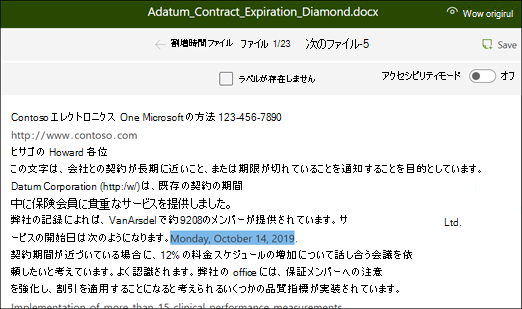
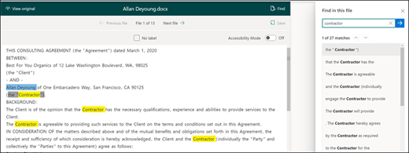
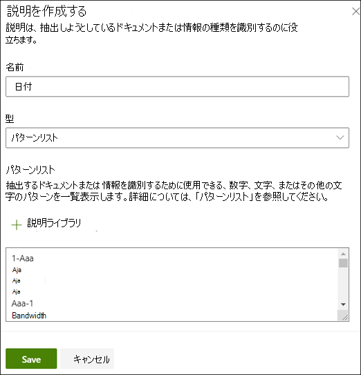
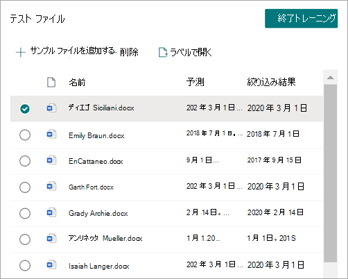

# Microsoft SharePoint Syntex でエクストラクターを作成する

 

> [!VIDEO https://www.microsoft.com/videoplayer/embed/RE4CL2G]

 

特定のドキュメントの種類の識別および分類を自動化するために、分類子モデルを作成する前または後に、必要に応じて、ドキュメントから特定の情報を抽出するために、エクストラクターをモデルに追加することができます。 たとえば、モデルでドキュメント ライブラリに追加されたすべての *契約更新* ドキュメントを識別するだけでなく、ドキュメント ライブラリの列値として各ドキュメントの *サービス開始日* を表示することもできます。

抽出するドキュメント内の各エンティティに、エクストラクターを作成する必要があります。 この例では、モデルによって識別される **各契約更新** ドキュメントの **サービス開始日** を抽出します。 すべての **契約更新** ドキュメントのドキュメント ライブラリにビューを表示し、各ドキュメントの **サービス開始日** の値を示す列を表示できるようにしたいと考えています。

> [!NOTE]
> エクストラクターを作成するには、先ほど分類子をトレーニングする目的でアップロードしたものと同ファイルを使用します。

## エクストラクターに名前を付ける

1. モデルのホーム ページの [ **抽出プログラムの作成とトレーニング** ] タイルで、[ **抽出プログラムのトレーニング**] を選択します。

2. [**新しいエンティティエクストラクター** ] 画面で、[ **新しいエクストラクター 名**] フィールドにエクストラクターの名前を入力します。 たとえば、契約更新の各ドキュメントからサービス開始日を抽出する場合は、「**サービスの開始日** と名前を入力します。 以前に作成した列 (例えば[管理されたメタデータ] 列など) を再使用することもできます。

    既定では、列の種類は **1 行のテキストです**。 列の種類を変更する場合は、[**詳細設定** > ]**Column 型** を選択し、使用する種類を選択します。

    ![[列の種類] オプションを示す [新しいエンティティ抽出ツール] パネルの [詳細設定] 部分のスクリーンショット。](../media/content-understanding/advanced-settings-column-type.png)

    > [!NOTE]
    > 列の種類が **1 行のテキストを** 含む抽出器の場合、最大文字数の上限は 255 です。 制限を超えて入力した文字はすべて切り捨てられます。

3. 完了したら、[ **作成**] を選択します。

## ラベルを追加する

次の手順では、サンプルトレーニングファイルで抽出するエンティティにラベルを付けます。

エクストラクターを作成すると、エクストラクター ページが開きます。ここでは、サンプル ファイルの一覧が表示され、リストの最初のファイルがビューアーに表示されます。

1. Viewer で、ファイルから抽出するデータを選択します。 たとえば、 *サービスの開始日* を抽出する場合は、最初のファイルの日付値を強調表示します (*月曜、2019年10月14日*)。 をクリックし、[保存] を選択 **します**。 ラベルの付いた [サンプル] リストにあるファイルの値を、[ **ラベル** ] 列で確認します。
2. [ **次のファイル** ] を選択して自動保存し、ビューアーの一覧で次のファイルを開きます。 または、[**保存**] を選択し [ **ラベルが付いた サンプル** ] の一覧から別のファイルを選択します。
3. このビューアーで、手順1と2を繰り返し、5つのファイルすべてにラベルを保存します。

    

5個のファイルにラベルを付けたら、トレーニングに移動するように通知バナーが表示されます。 ドキュメントのラベルを追加するか、トレーニングに進めるか、選択することができます。

### [検索] を使用してファイルを検索します。

**検索** 機能を使用して、ドキュメント内でラベルを付けるエンティティを検索できます。

   

検索機能は、大きなドキュメントを検索する場合や、ドキュメント内にエンティティのインスタンスが複数ある場合に便利です。 複数のインスタンスが見つかった場合は、検索結果から必要なインスタンスを選択して、ビューアー内のその場所に移動してラベルを付けることができます。

## 説明を作成する

この例では、エンティティの形式自体とサンプル ドキュメントに含まれる可能性のあるバリエーションに関するヒントを提供する説明を作成します。 たとえば、次のようなさまざまな形式の日付値を指定できます。

- 10/14/2019
- 2019 年 10 月 14 日
- 2019 年 10 月 14 日、月曜日

*サービスの開始日* を特定するには パターンの説明を作成します。

1. [説明] セクションで、[ **新しい**] を選択し、名前 (例えば *日付*) を入力します。
2. [種類] で、[ **パターン一覧]** を選択します。
3. [値] には、サンプルファイルに表示される日付のバリエーションを入力します。 たとえば、0/00/0000 として表示される日付形式がある場合は、次のようなドキュメントに表示されるバリエーションを入力します。
    - 0/0/0000
    - 0/00/0000
    - 00/0/0000
    - 00/00/0000
4. **[保存]** を選択します。

> [!NOTE]
> 説明の種類の詳細については、「 [説明の種類](./explanation-types-overview.md)」を参照してください。

### 説明ライブラリ

日付などの項目の説明を作成する場合は、すべてのバリエーションを手動で入力するよりも [説明ライブラリを使用](./explanation-types-overview.md) する方が簡単です。 説明ライブラリは、あらかじめ用意されている語句やパターンの説明のセットです。 ライブラリは、日付、電話番号、郵便番号など、一般的なフレーズやパターン リストのすべての形式を提供しようとします。

*サービス開始日* サンプルの場合は、説明ライブラリの *Date* の事前に構築された説明を使用する方が効率的です。

1. [ **の説明] セクション** で、[ **新規**] を選択し、[**説明ライブラリ から**]を選択します。
2. [説明ライブラリ] で、[ **日付**] を選択します。 認識された日付のあらゆるバリエーションを表示できます。
3. **[追加]** を選択します。

    

4. [**説明を作成する** ページで、説明ライブラリの *日付* 情報がフィールドに自動入力されます。 **[保存]** を選択します。

    

## モデルをトレーニングする

説明を保存すると、トレーニングが開始されます。 モデルに、ラベル付けされたサンプル ファイルからデータを抽出するのに十分な情報がある場合は、各ファイルに **Match** というラベルが付けられます。

抽出するデータを見つけるのに十分な情報がない場合は、各ファイルに **不一致** のラベルが付けられます。 **[不一致** ファイル] を選択すると、不一致が発生した理由の詳細を確認できます。

## 別の説明を追加する

多くの場合、不一致は、指定した説明で、ラベル付けされたファイルと一致するサービス開始日の値を抽出するのに十分な情報が提供されなかったことを示しています。 編集するか、別の説明を追加する必要がある場合があります。

この例では、文字列 *サービス開始日* が実際の値より前になることにご注意ください。 サービスの開始日を特定を容易にするには、語句の説明を作成する必要があります。

1. [説明] セクションで、[**新しい**] を選択し、名前を入力します (例: *Prefix String*)。
2. [種類] で、[ **語句のリスト**] を選択します。
3. *サービス の開始日* を値として使用します。
4. **[保存]** を選択します。

    

## モデルを再トレーニングする

説明を保存すると、トレーニングが開始されます。今回は、この2つの説明をサンプルファイルに使用します。 ラベル付けされたサンプルファイルからデータを抽出するのに十分な情報がモデルに含まれている場合は、 **一致** とファイルにラベルが付けられます。

ラベルが付けられたファイルの **不一致** が再び表示された場合は、ドキュメントの種類を識別するための詳細な情報をさらに追加するか、または既存の説明を変更することをお考えください。

## モデルをテストする

ラベル付きのサンプルファイルに対して一致が返された場合は、ラベルの付いていないその他のファイルの例でモデルをテストできます。 これは省略可能ですが、モデルが以前に見たことがないファイルでテストすることで、モデルを使用する前にモデルの "適合性" または準備状況を評価するのに便利な手順です。

1. [モデルのホーム] ページで、[ **テスト** ] タブを選択します。 ラベルなしのサンプルファイル上でモデルが実行されます。

2. [ **テストファイル** ] の一覧で、サンプルファイルから必要な情報が抽出されているかどうかが表示されます。 この情報を使用して、ドキュメントを特定するときの分類子の有効性を判断します。

    

### 抽出器をさらに絞り込む

エンティティが重複していて、1 つの値または特定の数の値のみを抽出する場合は、ルールを設定して処理する方法を指定できます。 抽出された情報を絞り込むためのルールを追加するには、次の手順に従います。

1. モデルのホーム ページの **[エンティティ抽出器** ] セクションで、絞り込む抽出器を選択し、[ **抽出された情報の絞り込み**] を選択します。

    ![[抽出された情報を絞り込む] オプションが強調表示されているエンティティ抽出器セクションのスクリーンショット。](../media/content-understanding/refine-extracted-info.png)

2. [ **抽出された情報の絞り込み** ] ページで、次のいずれかのルールを選択します。

    - 最初の値の 1 つ以上を保持する
    - 最後の値の 1 つ以上を保持する
    - 重複する値の削除
    - 最初の行の 1 つ以上を保持する
    - 最後の行を 1 つ以上保持する

    ![ルールのオプションを示す [抽出された情報の絞り込み] ページのスクリーンショット。](../media/content-understanding/refine-extracted-info-page.png)

3. 使用する行または値の数を入力し、[ **絞り込み**] を選択します。

4. 行または値の数を変更してルールを編集する場合は、編集する抽出器を選択し、 **抽出された情報を絞り込み**、数値を変更してから **、[保存**] を選択します。

5. 抽出器をテストすると、**テスト ファイル** の一覧の **絞り込み結果列に絞り込みを** 表示できます。

    

6. 抽出器で絞り込みルールを削除する場合は、ルールを削除する抽出器を選択し、 **抽出された情報を絞り込み**、 **削除** を選択します。

## 関連項目

[分類子を作成する](create-a-classifier.md)

[説明の種類](explanation-types-overview.md)

[エクストラクターの作成時に用語ストアの分類を活用する](leverage-term-store-taxonomy.md)

[ドキュメント理解の概要](document-understanding-overview.md)

[モデルを適用する](apply-a-model.md)

[SharePoint Syntex アクセシビリティ モード](accessibility-mode.md)
