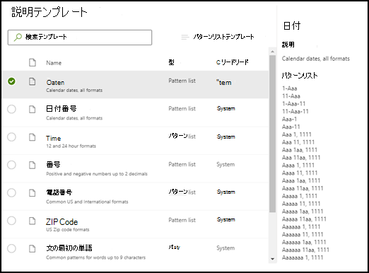
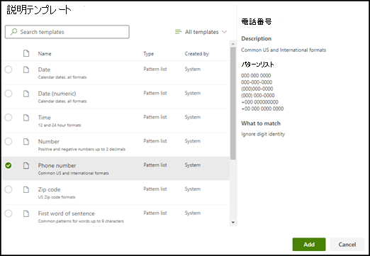

# Microsoft SharePoint Syntex で説明テンプレートを使用する

説明用にさまざまなフレーズ リスト値を手動で追加できますが、説明ライブラリで提供されているテンプレートを使用する方が簡単な場合があります。

たとえば、*日付* のすべてのバリエーションを手動で追加する代わりに、*日付* のフレーズ リスト テンプレートを使用できます。これには、すでに多くのフレーズ リスト値が含まれているためです。

説明ライブラリには、次のような一般的に使用される *フレーズ リスト* の説明が含まれています。

- 日付: 予定表の日付、すべての形式。 テキストと数値を含む (たとえば、"Dec 9, 2020")。
- 日付（数値）: 予定表の日付、すべての形式。 数値が含まれます (例: 1-11-2020)。
- 時刻: 12 時間と 24 時間表示。
- 数値: 最大 2 桁の小数点の正の数と負の数。
- パーセンテージ: パーセンテージを表すパターンの一覧。 たとえば、1%、11%、100%、11.11% などです。
- 電話番号: 米国および国際一般的な形式。 たとえば、000 000 0000、000-000-0000、(000)000-0000、(000) 000-0000 などです。
- 郵便番号: 米国の郵便番号の形式。 たとえば、11111、11111-1111 などです。
- 文の最初の単語: 最大 9 文字の単語の一般的なパターン。
- 文の末尾: 文の末尾の一般的な句読点。
- クレジット カード: 一般的なクレジット カード番号の書式。 たとえば、1111-1111-1111-111 などです。
- 社会保障番号: 米国の社会保障番号の書式。たとえば、111-11-1111 などです。
- チェック ボックス: 入力済みチェック ボックスのバリエーションを表す語句一覧。たとえば、_X_、_ _X_ などです。
- 通貨: 主要な国際記号。 たとえば、 ＄などです。
- 電子メール CC: "CC:" という用語を含む語句一覧。多くの場合、メッセージが送信された他のユーザーまたはグループの名前またはメール アドレスの近くに表示されます。
- メールの日付: "Sent on:" という用語を含む語句一覧です。多くの場合、メールの送信日の近くに表示されます。
- 電子メール応答: メールの一般的な起句。
- 電子メール受信者: "To:" という用語を含む語句一覧。多くの場合、メッセージが送信されたユーザーまたはグループの名前またはメール アドレスの近くに表示されます。
- メールの送信者: "差出人:" という用語を含む語句一覧。多くの場合、送信者の名前またはメールアドレスの近くに表示されます。
- メールの件名: "Subject:" という用語を含む語句一覧です。多くの場合、メールの件名の近くに表示されます。

説明ライブラリには、次のような一般的に使用される *正規表現* の説明も含まれています。

- 6 - 17 桁の数字: 6 - 17 桁の任意の数字に一致します。 米国の銀行口座番号はこのパターンに当てはまります。
- メール アドレス: meganb@contoso.com などの一般的な種類のメール アドレスに一致します。
- 米国納税者 ID 番号: 9 で始まる 3 桁の数字と、それに続く 7 または 8 で始まる 6 桁の数字に一致します。
- Web アドレス (URL): http:// または https:// で始まる Web アドレスの形式に一致します。

さらに、説明ライブラリには、サンプル ファイルでラベル付けしたデータで動作する自動テンプレートの 3 つの種類も含まれています。

- ラベルの後: サンプル ファイルのラベルの後に表示される単語または文字です。
- ラベルの前: サンプル ファイルのラベルの前に表示される単語または文字です。
- ラベル: サンプル ファイルの最初の 10 個までのラベルです。

自動テンプレートの動作例を示すために、次のサンプル ファイルでは、[ラベルの前] の説明テンプレートを使用して、モデルにより多くの情報を提供し、より正確な一致を取得します。

[ラベルの前] 説明テンプレートを選択すると、サンプル ファイルのラベルの前に表示される最初の単語セットが検索されます。 この例では、最初のサンプル ファイルで識別される単語セットは「現在」です。

![[ラベルの前] テンプレート。](../media/content-understanding/before-label-explanation.png)

**[追加]** を選択して、テンプレートから説明を作成できます。 サンプル ファイルをさらに追加すると、追加の単語が識別され、フレーズ リストに追加されます。

## 説明ライブラリのテンプレートを使用する

1. モデルの **トレーニング** ページの **[説明]** セクションで、**[新しい]** を選び、**[テンプレートから]** を選択します。

   ![[ラベルの前] を追加します。](../media/content-understanding/from-template.png)

2.  **説明テンプレート** ページで、使用する説明を選び、[**追加**] を選択します。

    

3. 選択したテンプレートの情報は、 **説明を作成する** ページに表示されます。 必要な場合は、説明の名前を編集して、フレーズ リストの項目を追加または削除します。

    

4. 完了したら、[**保存**] を選択します。

## 説明ライブラリにテンプレートを保存する

説明をテンプレートとして保存して、他のモデルで使用するためにコンテンツ センターの説明ライブラリで利用できるようにすることができます。 テンプレートには、語句がドキュメント内のどこに表示されるかを示すオプションを除いて、説明の基本設定と詳細設定が含まれます。

> [!NOTE]
> テンプレートとして保存できるのは、語句一覧と正規表現の説明のみです。

1. モデルの **トレーニング** ページの **[説明]** セクション:

   a. 説明の一覧トから、テンプレートとして保存するものを選択します。

   b. **[テンプレートとして保存]** を選択します。

    ![[テンプレートとして保存] オプションを示す [説明] セクションのスクリーンショット。](../media/content-understanding/explanation-save-as-template.png)

2. **説明テンプレートの保存** ページ:

   a. **[名前]** セクションで、必要に応じて説明の名前を変更します。

   b. **[説明]** セクションに説明を追加して、説明の使用方法を他のユーザーに知らせます。

   c. **[保存]** を選択します。

    

### 関連項目

[SharePoint Syntex の説明の種類](explanation-types-overview.md)