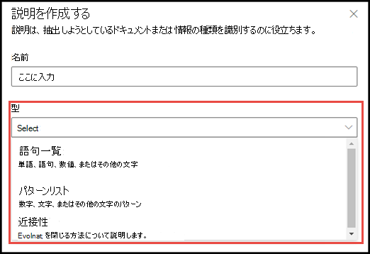
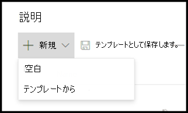

# 説明の種類の概要

説明は、 Microsoft SharePoint Syntexの文書把握モデルでラベルをつけたり、抽出する情報の定義付けをするときに役立ちます。 説明を作成するときに、説明の種類を選択する必要があります。 この記事では、さまざまな種類の説明とその使用方法の詳細について説明します。 

    
   
これらの説明の種類は次のとおりです。

- **語句リスト** : 抽出する文書または情報で使用できる単語、語句、数字、その他の文字の一覧です。 たとえば、文字列 **医師を参照する** は、指定したすべての医療紹介ドキュメントの中でに存在します。 

- **パターン一覧** : 抽出する情報を識別するために使用できる数字、文字、またはその他の文字のパターンのリストを表示します。 たとえば、識別しているすべての医療紹介ドキュメントから、参照元の医師の **電話番号** を抽出できます。 

- **類似性** : 説明が他の説明とどの程度相互に近いかについて説明します。 たとえば、 *のストリート番号* パターンリストは *ストリート名* 語句リストの直前にありますが、その間にトークンはありません (トークンについては、この記事の後半で説明します)。 近接型を使用するには、モデルに少なくとも 2 つの説明が必要です。そうでない場合、オプションは無効になります。 
 
## 語句リスト

通常、語句リストの説明の種類は、モデルを介してドキュメントを識別して分類するために使用されます。 *医師を参照する* ラベルの例に記載されているように、指定した文書に常に含まれる単語、語句、数字、または文字の文字列です。

必須ではありませんが、キャプチャしている語句が文書内の一貫した場所にある場合は、説明をうまく行うことができます。 たとえば、 *医師の参照* ラベルは、文書の最初の段落に常に保存されている場合があります。

ラベルを特定する際に大文字と小文字が区別される必要がある場合は、語句リストの種類を使用して、[ **文字の 大文字のみ を選択する** ] チェックボックスをオンにして、テキストの種類を指定します。

    

## パターン一覧

パターン リスト タイプは、ドキュメントから情報を特定して抽出する説明を作成する場合に特に便利です。 通常、日付、電話番号、クレジットカード番号などのさまざまな形式で表示されます。 たとえば、日付をさまざまな形式の数字で表示できます (1/1/2020、1-1-2020、01/01/20、01/01/2020、Jan 1、2020など)。 パターンリストを定義すると、指定して抽出するデータのバリエーションをキャプチャして、説明をより効率的にすることができます。 

**電話番号** の例では、モデルが識別するすべての医療紹介文書から、紹介する各医師の電話番号を抽出します。 説明を作成するときには、パターンリストの種類を選択し、返される可能性のあるさまざまな書式を設定します。

   

この例では、 **[0〜9 の任意の数字]** チェックボックスを選択して、パターンリストで使用されている各 "0" の値が 0〜9 の任意の数字であることを認識します。

   

同様に、テキスト文字を含むパターンリストを作成する場合は、 **[a-zから任意の文字]** チェックボックスを選択して、パターンリストで使用される各 "a" 文字が "a" から "z" までの任意の文字であることを認識します。

たとえば、 **日付** パターンリストを作成した場合、 *2020年1月1日* などの日付形式が認識されるようにするには、次の操作を行う必要があります。
- *aaa 0, 0000* *aaa 00, 0000* をパターンリストに追加します。
- **a-z の の任意の文字** が選択されていることを確認します。

   

また、[パターン] リストに大文字と小文字の区別をする要件がある場合は、[ **大文字のみを区別する** ] チェックボックスをオンにすることもできます。 日付の例では、月の最初の文字を大文字にする必要がある場合、次の操作を行う必要があります。

- *Aaa 0, 0000* および *Aaa 00, 0000* をパターンリストに追加します。
- **すべて大文字のみ** が選択されていることを確認してください。

   

> [!NOTE]
> パターンリストの説明を手動で作成する代わりに、 [説明ライブラリ](https://docs.microsoft.com/microsoft-365/contentunderstanding/explanation-types-overview#use-explanation-templates) を使用して、共通パターンのリストにパターンリストテンプレート ( *日付* 、 *電話番号* 、 *クレジットカード番号* など) を使用します。

## 類似性 

類似性の説明タイプは、モデルが他のデータがどの程度自分と似ているかを定義することで、データを特定するのに役立ちます。 たとえば、モデルでは、顧客にラベルを付けるために、 *住所の番地* と *電話番号* の2つの説明を定義しました。 

お客様の電話番号は番地の前に常に表示されることに注意してください。 

Alex Wilburn 
555-555-5555 
One Microsoft Way 
Redmond, WA 98034 

[類似性の説明を使用して、ドキュメント中の住所の番地をうまく特定するには、電話番号の説明はあまりに類似性が低いことを定義します。

    

#### トークンとは?

類似性の説明の種類を使用するには、トークンが何かを理解する必要があります。トークンの数は、ある説明から別の説明への距離を、類似性の説明がどのように測定しているかを表しています。 トークンは、文字と数字を連続しているスパン (スペースや句読点を含まない) です。 

次の表は、語句の中のトークン数を決定する方法の例を示しています。

|語句|トークン数|説明|
|--|--|--|
|`Dog`|1|句読点やスペースを含まない1つの単語。|
|`RMT33W`|1|レコードロケーター番号。 数字と文字が含まれる場合がありますが、区切り記号はありません。|
|`425-555-5555`|5|電話番号。 句読点はそれぞれ1つのトークンなので、`425-555-5555` は、5 トークンとなります。 `425` `-` `555` `-` `5555` |
|`https://luis.ai`|7|`https` `:` `/` `/` `luis` `.` `ai` |

#### 類似性の説明の種類を構成する

この例では、[類似性] 設定を構成して、 *番地* の説明から *電話番号* の説明のトークン数の範囲を定義します。 電話番号と住所の番地の間にトークンがないため、最小範囲が "0" であることがわかります。

ただし、サンプルドキュメントの一部の電話番号には、接頭語 *(mobile)* が追加されています。

Nestor Wilke 
111-111-1111 (モバイル) 
One Microsoft Way 
Redmond, WA 98034 

*(モバイル)* には次の3つのトークンがあります。

|語句|トークン数|
|--|--|
|(|1|
|モバイル|2|
|)|3|

0から3までの範囲を設定するには、[類似性] 設定を構成します。

    

## 説明テンプレートを使用する

説明用にさまざまなパターン リスト値を手動で追加できますが、説明ライブラリで提供されているテンプレートを使用する方が簡単な場合があります。

たとえば、 *Date* のすべてのバリエーションを手動で追加する代わりに、 *Date* のパターン リスト テンプレートを使用できます。これには、すでにいくつかのパターン リスト値が含まれているためです。 

    
 
説明ライブラリには、次のような一般的に使用されるパターンリストの説明が含まれています。 

- Date 
- Date (数値) 
- 時間 
- 数字 
- 電話番号 
- 郵便番号 
- 文章の最初の単語 
- クレジット カード 
- 社会保障番号 

説明ライブラリには、以下のフレーズリストの説明用テンプレートも含まれていることに注意してください。
- 文の最後
- 通貨

#### 説明ライブラリのテンプレートを使用するには

1. モデルの **トレーニング** ページの [ **説明** ] セクションで、[ **新しい** ] を選び、[ **テンプレート から** ]を選択します。 

    

2.  **説明テンプレート** ページで、使用する説明を選び、[ **追加** ] を選択します。 

        

3. 選択したテンプレートの情報は、 **説明を作成する** ページに表示されます。 必要な場合は、説明の名前を編集して、[パターン] リストの項目を追加または削除します。   

    

4. 完了したら、[ **保存** ] を選択します。
