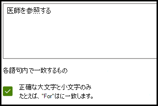
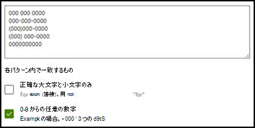
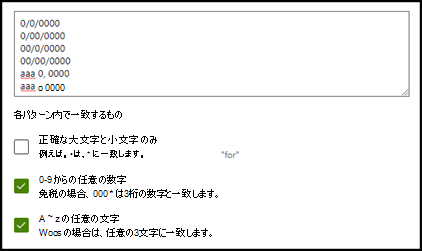
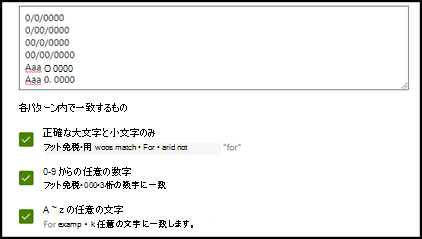
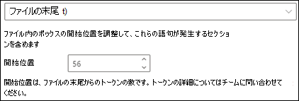

# Microsoft SharePoint Syntex の説明の種類

説明は、 Microsoft SharePoint Syntexの文書把握モデルでラベルをつけたり、抽出する情報の定義付けをするときに役立ちます。 説明を作成するときに、説明の種類を選択する必要があります。 この記事では、さまざまな種類の説明とその使用方法の詳細について説明します。

![3 つの説明の種類を示す [説明の作成] パネルのスクリーンショット。](../media/content-understanding/explanation-types.png)

説明の種類には、次のものがあります。

- [**語句リスト**](#phrase-list): 抽出する文書または情報で使用できる単語、語句、数字、その他の文字の一覧です。 たとえば、*委託医師* の文字列は、指定したすべての医療紹介文書に存在します。 または、識別しているすべての医療紹介文書から、委託医師の *電話番号* を抽出できます。

- [**正規表現**](#regular-expression): パターン マッチングの表記を使用して、特定の文字パターンを検索します。 たとえば、正規表現を使用して、一連のドキュメント内の *メール アドレス* パターンのすべてのインスタンスを検索できます。

- [**類似性**](#proximity): 説明が他の説明とどの程度相互に近いかについて説明します。 たとえば、 *のストリート番号* 語句一覧は *ストリート名* 語句リストの直前にありますが、その間にトークンはありません (トークンについては、この記事の後半で説明します)。 近接型を使用するには、モデルに少なくとも 2 つの説明が必要です。そうでない場合、オプションは無効になります。

## 語句リスト

通常、語句リストの説明の種類は、モデルを介してドキュメントを識別して分類するために使用されます。 *委託医師* のラベルの例に記載されているように、指定した文書に常に含まれる単語、語句、数字、または文字の文字列です。

必須ではありませんが、キャプチャしている語句が文書内の一貫した場所にある場合は、説明をうまく行うことができます。 たとえば、*委託医師* のラベルは、文書の最初の段落に常に保存されている場合があります。 また、[**[ドキュメント内の語句の位置を構成する](explanation-types-overview.md#configure-where-phrases-occur-in-the-document)**] 詳細設定を使用して、特にドキュメント内の複数の場所に語句がある可能性がある場合、語句を配置する特定のエリアを選択することができます。

ラベルを特定する際に大文字と小文字が区別される必要がある場合は、語句リストの種類を使用して、[**文字の 大文字のみ を選択する**] チェックボックスをオンにして、テキストの種類を指定します。

語句の種類は、日付、電話番号、クレジットカード番号など、さまざまな形式の情報を特定して抽出する説明を作成する場合に特に有効です。 たとえば、日付をさまざまな形式で表示できます (1/1/2020、1-1-2020、01/01/20、01/01/2020、Jan 1、2020 など)。 語句一覧を定義すると、指定して抽出するデータのバリエーションをキャプチャして、説明をより効率的にすることができます。

*電話番号* の例では、モデルが識別するすべての医療紹介文書から、委託する各医師の電話番号を抽出します。 説明を作成する場合は、電話番号が表示されるさまざまな形式を文書に入力し、可能なバリエーションをキャプチャできるようにします。

この例では、**詳細設定** で **[0〜9 の任意の数字]** チェックボックスを選択して、語句一覧で使用されている各 "0" の値が 0〜9 の任意の数字であることを認識します。

同様に、テキスト文字を含む語句一覧を作成する場合は、**[a-zから任意の文字]** チェックボックスを選択して、語句一覧で使用される各 "a" 文字が "a" から "z" までの任意の文字であることを認識します。

たとえば、 **日付** の語句一覧を作成した場合、 *2020年1月1日* などの日付形式が認識されるようにするには、次の操作を行う必要があります。

- *aaa 0, 0000* *aaa 00, 0000* を語句一覧に追加します。
- **a-z の の任意の文字** が選択されていることを確認します。

語句一覧に大文字と小文字の区別をする要件がある場合は、[**大文字のみを区別する**] チェックボックスをオンにできます。 日付の例では、月の最初の文字を大文字にする必要がある場合、次の操作を行う必要があります。

- *Aaa 0, 0000* および *Aaa 00, 0000* を語句一覧に追加します。
- **すべて大文字のみ** が選択されていることを確認してください。

> [!NOTE]
> 語句一覧の説明を手動で作成する代わりに、[説明ライブラリ](explanation-types-overview.md#use-explanation-templates)を使用して、共通語句一覧に語句一覧テンプレート (*日付*、 *電話番号*、*クレジット カード番号* など) を使用します。

## 正規表現

正規表現の説明の種類を使用すると、ドキュメント内の特定の文字列を見つけて識別するのに役立つパターンを作成できます。 正規表現を使用すると、大量のテキストをすばやく解析して次のことができます。

- 特定の文字パターンを見つけます。
- テキストを検証して、事前定義されたパターン (メール アドレスなど) と一致することを確認します。
- 部分文字列を抽出、編集、置換、または削除します。

正規表現の種類は、メール アドレス、銀行口座番号、URL など、同様の形式の情報を特定して抽出する説明を作成する場合に特に有効です。 たとえば、megan@contoso.com などのメール アドレスは、特定のパターン ("megan" が最初の部分、"com" が最後の部分) で表示されます。

メール アドレスの正規表現は、**[A-Za-z0-9._%-]+@[A-Za-z0-9.-]+.[A-Za-z]{2,6}** です。

この式は、次の順序の 5 つの部分から構成されます。

1. 次の任意の長さの文字:

   a. a から z までの文字

   b. 0 から 9 までの番号

   c. ピリオド、アンダースコア、パーセント、ダッシュ

2. @ 記号

3. 任意の長さのメール アドレスの最初の部分と同じ文字

4. ピリオド 1 つ

5. 2 文字から 6 文字

正規表現の説明を追加するには、次のように入力します。

1. [**説明の作成**] パネルの [**説明の種類**] で [**正規表現**] を選択します。

   ![[正規表現] が選択された [説明の作成] パネルを示すスクリーンショット。](../media/content-understanding/create-regular-expression.png)

2. [**正規表現**] テキスト ボックスに式を入力するか、[**テンプレートから正規表現を追加**] を選択できます。

   テンプレートを使用して正規表現を追加すると、名前と正規表現がテキスト ボックスに自動的に追加されます。 たとえば、[**メール アドレス**] テンプレートを選択すると、[**説明の作成**] パネルが表示されます。

   ![[メール アドレス] テンプレートが適用された [説明の作成] パネルを示すスクリーンショット。](../media/content-understanding/create-regular-expression-email.png)

### 制限事項

次の表は、現在正規表現パターンで使用できないインライン文字オプションを示しています。

|オプション  |状態  |最新機能  |
|---------|---------|---------|
|大文字と小文字の区別 | 現時点ではサポートされていません。 | 実行されるすべての一致では、大文字と小文字が区別されません。  |
|ライン アンカー     | 現時点ではサポートされていません。 | 一致する必要がある文字列内の特定の位置を指定できません。   |

## 類似性

類似性の説明タイプは、モデルが他のデータがどの程度自分と似ているかを定義することで、データを特定するのに役立ちます。 たとえば、モデルでは、顧客にラベルを付けるために、*番地* と *電話番号* の 2 つの説明を定義しました。

お客様の電話番号は番地の前に常に表示されることに注意してください。

Alex Wilburn 
555-555-5555 
One Microsoft Way 
Redmond, WA 98034 

[類似性の説明を使用して、ドキュメント中の住所の番地をうまく特定するには、電話番号の説明はあまりに類似性が低いことを定義します。

#### トークンとは?

類似性の説明の種類を使用するには、トークンが何かを理解する必要があります。 トークンの数は、ある説明から別の説明への距離を、類似性の説明がどのように測定しているかを表しています。 トークンは、文字と数字を連続しているスパン (スペースや句読点を含まない) です。

次の表は、語句の中のトークン数を決定する方法の例を示しています。

|語句|トークン数|説明|
|--|--|--|
|`Dog`|1|句読点やスペースを含まない1つの単語。|
|`RMT33W`|1|レコードロケーター番号。 数字と文字が含まれる場合がありますが、区切り記号はありません。|
|`425-555-5555`|5|電話番号 句読点はそれぞれ1つのトークンなので、`425-555-5555` は、5 トークンとなります。 `425` `-` `555` `-` `5555` |
|`https://luis.ai`|7|`https` `:` `/` `/` `luis` `.` `ai` |

#### 類似性の説明の種類を構成する

この例では、[類似性] 設定を構成して、*番地* の説明から *電話番号* の説明のトークン数の範囲を定義します。 電話番号と住所の番地の間にトークンがないため、最小範囲が "0" であることがわかります。

ただし、サンプルドキュメントの一部の電話番号には、接頭語 *(mobile)* が追加されています。

Nestor Wilke 
111-111-1111 (モバイル) 
One Microsoft Way 
Redmond, WA 98034 

*(モバイル)* には次の3つのトークンがあります。

|語句|トークン数|
|--|--|
|(|1|
|モバイル|2|
|)|3|

0から3までの範囲を設定するには、[類似性] 設定を構成します。

## ドキュメント内の語句の位置を構成する

説明を作成すると、既定でドキュメント全体から抽出しようとしている語句が検索されます。 ただし、**[これらの語句が表示される場所]** の詳細設定を使用すると、語句が表示されるドキュメント内の特定の場所を特定するのに役立ちます。 この設定は、ドキュメント内の別の場所に語句の類似のインスタンスが表示される可能性があり、正しいインスタンスが選択されていることを確認する場合に役立ちます。

医療紹介文書の例を参照すると、*委託医師* は常にドキュメントの第 1 段落に記載されています。 この例では、**[これらの語句が表示される場所]** の設定を使用して、このラベルをドキュメントの先頭部分、またはラベルが表示される可能性のあるその他の場所だけで検索するように説明を構成できます。

![[これらの語句が表示される場所] の設定。](../media/content-understanding/phrase-location.png)

この設定では、次のオプションを選択できます。

- ファイル内の任意の場所: ドキュメント全体で語句が検索されます。

- ファイルの先頭: ドキュメントの先頭から語句の場所まで検索されます。

   

    ビューアでは、フェーズが表示される場所を含めるように選択ボックスを手動で調整できます。 **[終了位置]** の値が更新され、選択した領域に含まれるトークンの数が表示されます。 **[終了位置]** の値を更新して、選択した領域を調整することもできます。

   

- ファイルの末尾: ドキュメントの末尾から語句の場所まで検索されます。

   

    ビューアでは、フェーズが表示される場所を含めるように選択ボックスを手動で調整できます。 **[開始位置]** の値が更新され、選択した領域に含まれるトークンの数が表示されます。 [開始位置] の値を更新して、選択した領域を調整することもできます。

   

- ユーザー設定の範囲: ドキュメントは指定された範囲内で、語句の場所が検索されます。

   

    ビューアでは、フェーズが表示される場所を含めるように選択ボックスを手動で調整できます。 この設定では、**[開始]** と **[終了]** の位置を選択する必要があります。 これらの値は、ドキュメントの先頭のトークンの数を表します。 これらの値は手動で入力できますが、ビューアーの選択ボックスを手動で調整する方が簡単です。

## 説明テンプレートを使用する

説明用にさまざまなフレーズ リスト値を手動で追加できますが、説明ライブラリで提供されているテンプレートを使用する方が簡単な場合があります。

たとえば、*日付* のすべてのバリエーションを手動で追加する代わりに、*日付* のフレーズ リスト テンプレートを使用できます。これには、すでに多くのフレーズ リスト値が含まれているためです。

説明ライブラリには、次のような一般的に使用される *フレーズ リスト* の説明が含まれています。

- 日付: 予定表の日付、すべての形式。 テキストと数値を含む (たとえば、"Dec 9, 2020")。
- 日付（数値）: 予定表の日付、すべての形式。 数値が含まれます (例: 1-11-2020)。
- 時刻: 12 時間と 24 時間表示。
- 数値: 最大 2 桁の小数点の正の数と負の数。
- パーセンテージ: パーセンテージを表すパターンの一覧。 たとえば、1%、11%、100%、11.11% などです。
- 電話番号: 米国および国際一般的な形式。 たとえば、000 000 0000、000-000-0000、(000)000-0000、(000) 000-0000 などです。
- 郵便番号: 米国の郵便番号の形式。 たとえば、11111、11111-1111 などです。
- 文の最初の単語: 最大 9 文字の単語の一般的なパターン。
- 文の末尾: 文の末尾の一般的な句読点。
- クレジット カード: 一般的なクレジット カード番号の書式。 たとえば、1111-1111-1111-111 などです。
- 社会保障番号: 米国の社会保障番号の書式。たとえば、111-11-1111 などです。
- チェック ボックス: 入力済みチェック ボックスのバリエーションを表す語句一覧。 たとえば、_X_、_ _X_ などです。
- 通貨: 主要な国際記号。 たとえば、 ＄などです。
- 電子メール CC: "CC:" という用語を含む語句一覧。多くの場合、メッセージが送信された他のユーザーまたはグループの名前またはメール アドレスの近くに表示されます。
- メールの日付: "Sent on:" という用語を含む語句一覧です。多くの場合、メールの送信日の近くに表示されます。
- 電子メール応答: メールの一般的な起句。
- 電子メール受信者: "To:" という用語を含む語句一覧。多くの場合、メッセージが送信されたユーザーまたはグループの名前またはメール アドレスの近くに表示されます。
- メールの送信者: "差出人:" という用語を含む語句一覧。多くの場合、送信者の名前またはメールアドレスの近くに表示されます。
- メールの件名: "Subject:" という用語を含む語句一覧です。多くの場合、メールの件名の近くに表示されます。

説明ライブラリには、次のような一般的に使用される *正規表現* の説明も含まれています。

- 6 - 17 桁の数字: 6 - 17 桁の任意の数字に一致します。 米国の銀行口座番号はこのパターンに当てはまります。
- メール アドレス: meganb@contoso.com などの一般的な種類のメール アドレスに一致します。
- 米国納税者 ID 番号: 9 で始まる 3 桁の数字と、それに続く 7 または 8 で始まる 6 桁の数字に一致します。
- Web アドレス (URL): http:// または https:// で始まる Web アドレスの形式に一致します。

さらに、説明ライブラリには、サンプル ファイルでラベル付けしたデータで動作する自動テンプレートの 3 つの種類も含まれています。

- ラベルの後: サンプル ファイルのラベルの後に表示される単語または文字です。
- ラベルの前: サンプル ファイルのラベルの前に表示される単語または文字です。
- ラベル: サンプル ファイルの最初の 10 個までのラベルです。

自動テンプレートの動作例を示すために、次のサンプル ファイルでは、[ラベルの前] の説明テンプレートを使用して、モデルにより多くの情報を提供し、より正確な一致を取得します。

[ラベルの前] 説明テンプレートを選択すると、サンプル ファイルのラベルの前に表示される最初の単語セットが検索されます。 この例では、最初のサンプル ファイルで識別される単語は「現在」です。

![[ラベルの前] テンプレート。](../media/content-understanding/before-label-explanation.png)

**[追加]** を選択して、テンプレートから説明を作成できます。  サンプル ファイルをさらに追加すると、追加の単語が識別され、フレーズ リストに追加されます。

#### 説明ライブラリのテンプレートを使用するには

1. モデルの **トレーニング** ページの [**説明**] セクションで、[**新しい**] を選び、[**テンプレート から**]を選択します。

   ![[ラベルの前] を追加します。](../media/content-understanding/from-template.png)

2.  **説明テンプレート** ページで、使用する説明を選び、[**追加**] を選択します。

    

3. 選択したテンプレートの情報は、 **説明を作成する** ページに表示されます。 必要な場合は、説明の名前を編集して、フレーズ リストの項目を追加または削除します。

    

4. 完了したら、[**保存**] を選択します。