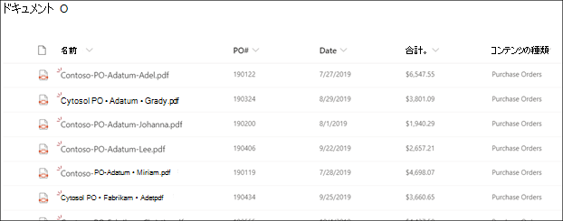

# Microsoft SharePoint Syntex でのフォーム処理の概要

  

Microsoft SharePoint Syntex は、Microsoft PowerApps [AI Builder](/ai-builder/overview) フォーム処理を使用して、SharePoint ドキュメント ライブラリ内にモデルを作成します。

AI Builder フォーム処理を使用して、機械学習テクノロジを使用する AI モデルを作成し、フォームや請求書などの構造化または半構造化文書からキーと値のペアとテーブル データを識別し、抽出できます。

組織は、メール、ファックス、電子メールなどのさまざまなソースから大量の請求書を受け取ることがよくあります。これらの文書を処理してデータベースに手動で入力するには、かなりの時間がかかる場合があります。 AI を使用してドキュメントからテキスト、キーと値のペア、およびテーブルを抽出することにより、フォーム処理はこのプロセスを自動化します。 

> [!NOTE]
> フォーム処理シナリオの例の詳細については、「[SharePoint Syntex の導入: 概要](./adoption-getstarted.md)」を参照してください。

たとえば、ドキュメント ライブラリにアップロードされたすべての発注書ドキュメントを識別するフォーム処理モデルを作成できます。 次に、各発注書から、*PO番号*、*日付*、*総コスト* など、重要な特定のデータを抽出して表示できます。

   

サンプルファイルを使用してモデルをトレーニングし、フォームから抽出する情報を定義します。 文書のレイアウトは、モデルをトレーニングすることで学習されます。 開始するのに必要なフォーム ドキュメントは5つだけです。 AI Builder は、キーと値のペアについてサンプル ファイルを分析し、検出されなかった可能性のあるファイルを手動で識別することもできます。  AI ビルダーを使用すると、サンプルファイルでモデルの精度をテストできます。

モデルをトレーニングして発行すると、モデルによって[Power Automateフロー](/power-automate/getting-started)が作成されます。 フローは、ファイルが SharePoint ドキュメントライブラリにアップロードされたときに実行され、モデルで識別されたデータを抽出します。 抽出されたデータは、モデルのドキュメント ライブラリ ビューの列に表示されます。

Office 365管理者は、ユーザーがフォーム処理モデルを作成できるようにするために、SharePoint ドキュメント ライブラリの[フォーム処理を](create-a-form-processing-model.md)[有効にする](./set-up-content-understanding.md)必要があります。 セットアップ中、またはセットアップ後に管理設定でサイトを選択できます。

### ファイルの制限事項

フォーム処理モデルを使用する場合は、[ファイルの使用に関する必要条件と制限事項](/ai-builder/form-processing-model-requirements)にご注意ください。

### サポートされている言語

フォーム処理では、73 を超える言語のドキュメントがサポートされます。 言語の一覧については、「 [フォーム処理言語のサポート](/power-platform-release-plan/2021wave2/ai-builder/form-processing-new-language-support)」を参照してください。

### Multi-Geo 環境

[Microsoft 365 Multi-Geo 環境](../enterprise/microsoft-365-multi-geo.md)で SharePoint Syntex をセットアップする場合、中央の場所でフォーム処理を使用するように構成することしかできません。 サテライトの場所でフォーム処理を使用する場合は、Microsoft サポートに連絡してください。

## 関連項目
  
[Power Automate ドキュメント](/power-automate/)

[フォーム処理モデルを作成する](create-a-form-processing-model.md)

[ドキュメント理解の概要](document-understanding-overview.md)

[トレーニング: AI ビルダーを使用してビジネスの実績を高める](/learn/paths/improve-business-performance-ai-builder/?source=learn)