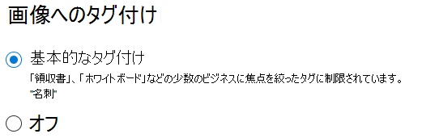

# SharePoint Syntex での画像のタグ付け

(近日公開予定)

SharePoint Syntex での画像のタグ付けを使って、ユーザーは、画像タグを検索することで画像を見つけることができ、画像タグを使ってワークフローを作成できます。 既定では、SharePoint と OneDrive での基本的な画像のタグ付けはオンになっています。 いずれかの場所にアップロードされた画像は自動的にスキャンされ、37 個の基本タグのリストから該当するタグが適用されます (可能な場合)。 ユーザーは、画像タグを検索することで画像を見つけることができます。

ユーザーが画像をアップロードすると、タグ付けプロセスが自動的に実行されます。 画像が編集されると、タグ付けプロセスが再度実行され、タグが更新されます。

画像ファイルへのアクセス許可を持つユーザーは、ファイル情報パネルまたは検索結果ページでタグを表示および編集できます。 ユーザーが画像のタグを編集すると、編集されている場合でも、システムはその画像に自動タグ付けを実行しなくなります。

タグ付けをオフにすると、画像に自動的にタグ付けされなくなります。 既存のタグは削除されません。

> [!NOTE]
> システム生成のタグは、画像またはタグ技術の更新プログラムで変更される場合があります。

## 画像のタグ付けを構成する

[SharePoint Syntex の設定](set-up-content-understanding.md)をすると、Microsoft 365 管理センターで画像のタグ付けを構成できます。  

画像のタグ付けをオンまたはオフにするには

1. Microsoft 365 管理センターで、[**セットアップ**] をクリックします。

2. **[組織における知識]** の下で、**[コンテンツの理解を自動化する]** をクリックします。

3. **[管理]** をクリックします。

4. **[画像のタグ付け]** タブで、**[編集]** をクリックします。

5. **[基本的なタグ付け]** を許可するか、タグ付けを **[オフ]** にするかを選択します。

6. **[保存]** をクリックします。

    
