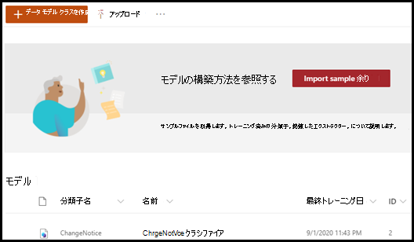

# サンプル モデルを通じてドキュメント理解モデルについて学ぶ

Microsoft SharePoint Syntex は、調査に使用できるサンプル モデルを提供し、独自のモデルを作成する方法をよりよく理解できるようにします。 サンプルモデルでは、分類子、抽出子、説明などのモデル コンポーネントを調べることもできます。 サンプル ファイルを使用して、モデルをトレーニングすることもできます。

## サンプルモ デルをインポートする

サンプルモデルにアクセスするには、最初にモデルをコンテンツ センターにインポートする必要があります。

1. コンテンツ センターから[**モデル**]を選択して、モデルリストを表示します。 
2. [**モデル**]ページで、[**サンプルモデルのインポート**]を選択します。 

      

3. インポートが完了すると、**BenefitsChangeNotice** モデルのホーム ページが開きます。 今後サンプル モデルを開く必要がある場合は、コンテンツ センターのモデル リストから開くことができます。  

      

サンプル モデルを分析してモデルがどのように構築されているかをよりよく理解するだけでなく、作業モデルとしてさらに進んで、次のようなことを行うことができます。

- 別の抽出子を追加します。 たとえば、*割引料金* を抽出するものを追加します。
- モデルをドキュメント ライブラリに適用し、トレーニング ファイルの一部をアップロードして、モデルがファイルを分類し、ファイルからデータを抽出する方法を確認します。

## 関連項目
[分類子を作成する](create-a-classifier.md)

[抽出子を作成する](create-an-extractor.md)

[ドキュメント理解の概要](document-understanding-overview.md)

[フォーム処理モデルを作成する](create-a-form-processing-model.md)  
