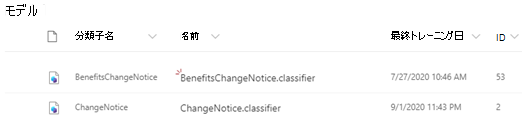

# サンプルモデルを使用したドキュメントの理解モデルについて

Microsoft SharePoint の Syntex では、サンプルモデルを使用して、独自のモデルの作成方法をより深く理解することができます。 サンプルモデルを使用すると、モデルコンポーネント (分類子、抽出器、説明など) を調べることもできます。 サンプルファイルを使用してモデルを学習することもできます。

## サンプルモデルをインポートする

サンプルモデルにアクセスするには、まず、コンテンツセンターにモデルをインポートする必要があります。

1. コンテンツセンターで、[ **モデル** ] を選択してモデルリストを表示します。 
2. [ **モデル** ] ページで、[ **サンプルモデルのインポート**] を選択します。 

      

3. [モデル] リストに表示される *BenefitsChangeNotice* という名前のサンプルモデルを探します。 

      

4. *BenefitsChangeNotice*を選択して、モデルのホームページを開きます。 
  
     

5. モデルのホームページで、モデルがどのように作成されたかを詳しく調べてください。
 
- モデルの学習に使用されるサンプルファイルを表示します。
- モデルのエンティティ抽出機能を詳しく調べて、サンプルモデルが説明を構成した方法を確認します。

     

## 関連項目
[分類子を作成する](create-a-classifier.md) 
[抽出器を作成する](create-an-extractor.md) 
[ドキュメント理解の概要](document-understanding-overview.md) 
[フォーム処理モデルを作成する](create-a-form-processing-model.md)  
