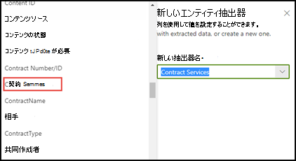

# Microsoft SharePoint Syntex の抽出子を作成するときに、用語ストアの分類法を活用します。

 

> [!VIDEO https://www.microsoft.com/videoplayer/embed/RE4GpJJ]  

 

SharePoint Syntex を使用してドキュメント理解モデルで抽出子を作成する場合、[用語ストア](/sharepoint/managed-metadata)のグローバル用語セットを利用して、抽出するデータの優先用語を表示できます。  

例として、モデルは、ドキュメント ライブラリにアップロードされているすべての **契約** ドキュメントを識別して分類します。  さらに、モデルは各契約から **契約サービス** 値も抽出し、ライブラリ ビューの列に表示します。 契約内のさまざまな契約サービス値の中には、会社が使用しなくなって名前が変更された古い値がいくつかあります。 たとえば、契約サービスでの *Design*、*Graphics*、*Topography* という用語への参照はすべて、*Creative* と呼ばれる必要があります。 モデルが契約ドキュメントから過去の条件の 1 つを抽出するときは必ず、ライブラリ ビューに現在の条件 (Creative) を表示する必要があります。 以下の例では、モデルのトレーニング中に、1 つのサンプル ドキュメントに古い用語である *Design* が含まれていることがわかります。

    

## 抽出子で管理されたメタデータ列を使用する

用語セットは、管理センターの管理メタデータ サービス (MMS) <a href="https://go.microsoft.com/fwlink/?linkid=2185219" target="_blank">用語ストアSharePoint構成されます</a>。 以下の例では、*契約サービス* の [用語セット](/sharepoint/managed-metadata#term-set)は、*Creative* などを含む複数の用語を含むように構成されています。  詳細は、この用語に 3 つの同義語 (*Design*、*Graphics*、*Topography*) があり、これらの同義語を *Creative* に翻訳する必要があることを示しています。 

    

用語セットで同義語を使用する理由は多く考えられます。 たとえば、古い用語、名前が変更された用語、または名前付けに関する組織部門間のバリエーションがある可能性があります。

モデルで抽出子を作成するときに管理メタデータ フィールドを選択できるようにするには、[それを管理メタデータ サイト列として追加する](https://support.microsoft.com/office/8fad9e35-a618-4400-b3c7-46f02785d27f)必要があります。 サイト列を追加すると、モデルの抽出子を作成するときに選択できるようになります。

    

モデルをドキュメント ライブラリに適用した後、ドキュメントがライブラリにアップロードされると、抽出子が同義語の値 (*Design*、*Graphics*、*Topography*) のいずれかを検出すると、*Creative Services* 列に優先用語 (*Creative*) が表示されます。

    

## 関連項目
[管理されたメタデータの概要](/sharepoint/managed-metadata#terms)

[抽出子を作成する](create-an-extractor.md)

[管理メタデータ列を作成する](https://support.microsoft.com/office/create-a-managed-metadata-column-8fad9e35-a618-4400-b3c7-46f02785d27f?redirectSourcePath=%252farticle%252fc2a06717-8105-4aea-890d-3082853ab7b7&ui=en-US&rs=en-US&ad=US)