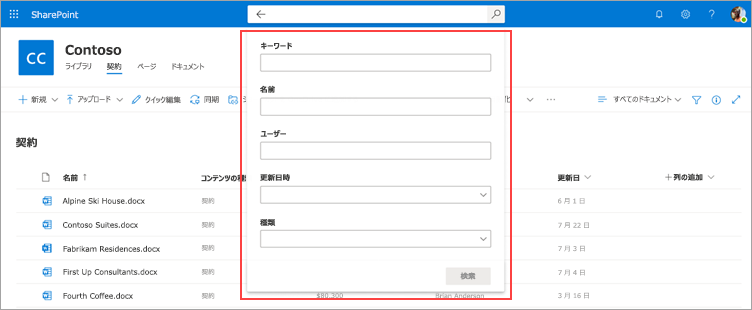

# Microsoft SharePoint Syntex のドキュメント ライブラリでメタデータを検索する

SharePoint Syntex の高度なメタデータ検索機能を使用すると、SharePoint ドキュメント ライブラリに対して特定のメタデータ ベースのクエリを実行できます。 キーワードを検索するのではなく、特定のメタデータ列の値に基づいて、より高速で正確なクエリを行なえます。

高度なメタデータ検索を使用すると、ドキュメントに関連付けられているメタデータを使用して、SharePoint ドキュメント ライブラリ内のファイルを見つけられます。 これは、ドキュメントが最後に変更されたとき、ファイルに関連付けられている特定のユーザー、特定のファイルの種類など、検索する特定の情報がある場合に特に便利です。

> [!NOTE]
> この機能は、SharePoint Syntex のライセンスを取得しているユーザーのみが使用できます。 

## 高度なメタデータ検索を使用するには

1. SharePoint ドキュメント ライブラリから、 **このライブラリを検索** ボックスで、メタデータ検索アイコン (メタデータ検索アイコンの ) をクリックまたはタップします。

    

2. メタデータ検索ウィンドウで、テキストを入力するか、1 つ以上の検索フィールドで検索するパラメーターを選択します。

    

   現在、5 つのメタデータ検索フィールドを使用できます。 今後、さらにフィールドが追加される予定です。

   |Field    |このフィールドを使用して  |
   |---------|---------|
   |キーワード |メタデータまたはドキュメントのフルテキストで文字列の一致を検索します。 |
   |名前     |ライブラリの **名前** 列を検索します。          |
   |ユーザー   |ライブラリ内の任意の列のユーザーとの一致を検索します。   |
   |Modified |ライブラリの **更新** 列で、選択した日付範囲を検索します。         |
   |種類     |選択したファイルの種類で検索します。        |

3. **[検索]** を選択します。 メタデータ検索に一致するドキュメントが結果ページに表示されます。 
