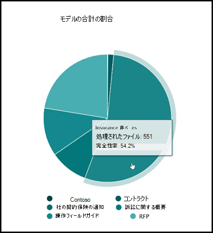
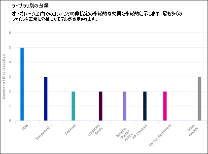

# Microsoft SharePoint Syntex での文書理解のモデル使用状況分析

 

> [!VIDEO https://www.microsoft.com/videoplayer/embed/RE4GnhX]  

 

Microsoft SharePoint Syntex コンテンツ センターは、モデル使用分析を提供して、コンテンツ センターから公開されたモデルがどのように使用されているかに関する詳細情報を提供します。 「<b>コンテンツ センターの過去 30 日間のモデルのパフォーマンス</b>」セクションには、次のグラフとリストに示す利用状況分析データの 30 日間のロールアップが含まれています。

- モデル別の分類
- ライブラリ別の分類
- モデルの利用状況 

   

### 既定のコンテンツ センターでのモデル利用状況データのロールアップ

SharePoint Syntex では、セットアップ時に既定のコンテンツ センターが作成されます。 必要に応じて、追加のコンテンツ センターを作成することもできます。 たとえば、部門が独自のコンテンツ センターを作成して、モデルを作成および管理する場合があります。 

モデルの利用状況分析については、次の点に注意してください。

- 既定のコンテンツ センターには、組織内のすべてのコンテンツ センターおよびモデルのモデル利用状況分析が表示されます。これには、追加のコンテンツ センターで作成されたモデルも含まれます。 これにより、コンテンツ マネージャーおよびその他の関係者は、全社のコンテンツ センターおよびモデルを一元的に管理および監視できるようになります。  
- 他のコンテンツ センターでは、そのコンテンツ センターで作成されたモデルのモデル利用状況分析だけが表示されます。 これにより、コンテンツ マネージャーは、関係するモデルのみの利用状況データのみを把握できます。

## モデル別の分類

     

**[モデル別の分類]** の円グラフには、最も多くのファイルを分類したモデルが表示されます。 これは、コンテンツ センターですべての公開モデルによって処理された合計ファイルのパーセンテージとして、公開された各モデルを表示します。

各モデルには、モデルによって正常に分析されたアップロードファイルの割合である **完了率** も表示されます。 完了率が低い場合、分析中のモデルまたはファイルのいずれかに問題があることを意味している可能性があります。

## ライブラリ別の分類

     

**[ライブラリ別の分類]** の横棒グラフは、組織におけるコンテンツ理解の有効性を判断するのに役立ちます。  これには、各モデルの時間の経過とともに処理されたファイルの数だけでなく、グラフの列を選択することで、モデルが適用されたドキュメン トライブラリも表示されます。

## モデルの利用状況

[モデルの利用状況] リストには、コンテンツ センターで作成されたモデルの利用状況分析が表示されます。  

> [!NOTE]
> 既定のコンテンツ センターにいて、組織内に追加のコンテンツ センターがある場合、モデルの利用状況リストはコンテンツ センターごとにグループ化されます。

モデルの利用状況リストの各モデルには、利用状況データが表示されます。

- 分類アイテムの数: モデル別に処理されるファイルの数。
- 平均信頼度スコア: ファイルに対して実行したときのモデルの平均精度スコア。
- ターゲット リスト URL: モデルが適用される SharePoint ドキュメント ライブラリ。

## 関連項目
[分類子を作成する](create-a-classifier.md)

[エクストラクターを作成する](create-an-extractor.md)

[ドキュメント理解の概要](document-understanding-overview.md)

[フォーム処理モデルを作成する](create-a-form-processing-model.md)  
