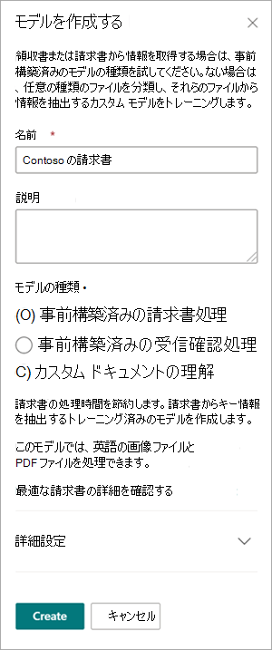
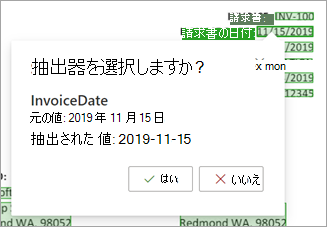
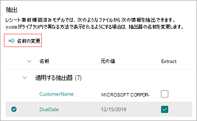

# 事前構築済みモデルを使用して、Microsoft SharePoint Syntexの請求書または領収書から情報を抽出する

事前構築済みモデルは、ドキュメントとドキュメント内の構造化された情報を認識するように事前トレーニングされています。 新しいカスタム モデルを最初から作成する代わりに、既存の事前トレーニング済みモデルを反復処理して、組織のニーズに合った特定のフィールドを追加できます。 

現時点では、請求書と領収書の 2 つの事前構築済みモデルを使用できます。

- *請求書の事前構築済みモデル* は、売上請求書から重要な情報を分析して抽出します。 API は、さまざまな形式で請求書を分析し、顧客名、請求先住所、期限、支払い金額などの [重要な請求書情報を抽出](/azure/applied-ai-services/form-recognizer/concept-invoice#field-extraction) します。

- *レシート事前構築済みモデル* では、売上の領収書から重要な情報を分析して抽出します。 この API は、印刷された手書きの領収書を分析し、マーチャント名、マーチャントの電話番号、取引日、税金、トランザクションの合計などの [主要な領収書情報を抽出](/azure/applied-ai-services/form-recognizer/concept-receipt#field-extraction) します。

その他の事前構築済みモデルは、今後のリリースで使用できるようになります。

## 事前構築済みモデルを作成する

次の手順に従って、事前構築済みモデルを作成して、SharePoint Syntex内のドキュメントを分類します。

1. [ **モデル** ] ページで、[ **モデルの作成**] を選択します。

    ![[モデルの作成] ボタンを示す [モデル] ページのスクリーンショット。](../media/content-understanding/prebuilt-create-model-button.png) 

2. [ **モデルの作成** ] パネルの [ **名前]** フィールドに、モデルの名前を入力します。

     

3. [ **モデルの種類]** セクションで、事前構築済みモデルのいずれかを選択します。
   - **事前構築済みの請求書処理**
   - **事前構築済みのレシート処理**

   事前構築済みモデルではなく、従来のトレーニングされていないドキュメント理解モデルを作成する場合は、[ **カスタム ドキュメントの理解**] を選択します。

4. コンテンツ タイプを変更する場合、または保持ラベルを追加する場合は、[詳細設定] を選択 **します**。

    > [!NOTE]
    > 現時点では、秘密度ラベルは事前構築済みモデルでは使用できません。

5. **[作成]** を選択します。 モデルは **モデル** ライブラリに保存されます。

## 分析するファイルを追加する

1. [ **モデル** ] ページの [ **分析するファイルの追加] セクションで** 、[ **ファイルの追加]** を選択します。

    ![[分析するファイルの追加] セクションを示す新しいモデル ページのスクリーンショット。](../media/content-understanding/prebuilt-add-file-to-analyze.png) 

2. **[モデルを分析するファイル**] ページで、[**追加**] を選択して、使用するファイルを見つけます。

    ![[追加] ボタンを示すモデル ページを分析するファイルのスクリーンショット。](../media/content-understanding/prebuilt-add-file-button.png) 

3. [ **トレーニング ファイル ライブラリからファイルを追加する] ページで、ファイル** を選択し、[ **追加**] を選択します。

    ![[トレーニング ファイル ライブラリからファイルを追加する] ページのスクリーンショット。](../media/content-understanding/prebuilt-add-file-from-training-library.png) 

6. **[モデルを分析するファイル**] ページで、[**次へ**] を選択します。

## モデルの抽出器を選択する

抽出器の詳細ページで、右側にドキュメント領域が表示され、左側に **[抽出プログラム]** パネルが表示されます。 **[抽出器]** パネルには、ドキュメント内で識別された抽出器の一覧が表示されます。

    

ドキュメント領域で緑色で強調表示されているエンティティ フィールドは、ファイルを分析したときにモデルによって検出された項目です。 抽出するエンティティを選択すると、強調表示されているフィールドが青に変わります。 後でエンティティを含めないことを決定した場合、強調表示されているフィールドは灰色に変わります。 強調表示を使用すると、選択した抽出器の現在の状態を簡単に確認できます。

> [!TIP]
> マウスのスクロール ホイール、またはドキュメント領域の下部にあるコントロールを使用して、必要に応じて拡大または縮小してエンティティ フィールドを読み取ることができます。

### 抽出エンティティを選択する

抽出器は、ユーザーの好みに応じて、ドキュメント領域または **抽出パネル** から選択できます。
 
- ドキュメント領域から抽出器を選択するには、エンティティ フィールドを選択します。

     

- **抽出器** パネルから抽出器を選択するには、エンティティ名の右側にあるチェック ボックスをオンにします。

     

抽出器を選択すると、文書領域に **[抽出器の選択** ] ボックスが表示されます。 ボックスには、抽出器の名前、元の値、抽出器として選択するオプションが表示されます。 数値や日付などの特定のデータ型の場合は、抽出された値も表示されます。

    

元の値は、ドキュメント内の実際の値です。 抽出された値は、SharePointの列に書き込まれる値です。 モデルがライブラリに適用されている場合は、列の書式設定を使用して、ドキュメント内での外観を指定できます。

引き続き、使用する追加の抽出器を選択します。 このモデル構成を分析するために他のファイルを追加することもできます。

## 抽出子の名前を変更する

抽出器の名前は、モデルのホーム ページから、または **抽出器** パネルから変更できます。 モデルがライブラリに適用されるときに、これらの名前が列名として使用されるため、選択した抽出器の名前を変更することを検討してください。

モデルのホーム ページから抽出器の名前を変更するには:

1. [ **抽出器** ] セクションで、名前を変更する抽出器を選択し、[ **名前の変更**] を選択します。

    ![[名前の変更] オプションが強調表示されている [抽出器] セクションのスクリーンショット。](../media/content-understanding/prebuilt-model-page-rename-extractor.png) 

2. [ **名前の変更] エンティティ抽出パネルで、抽出器** の新しい名前を入力し、[ **名前の変更**] を選択します。

抽出器パネルから抽出 **器** の名前を変更するには:

1. 名前を変更する抽出器を選択し、[ **名前の変更**] を選択します。

     

2. [ **抽出プログラムの名前の変更** ] ボックスに抽出器の新しい名前を入力し、[ **名前の変更**] を選択します。

## モデルを適用する

- 変更を保存してモデルのホーム ページに戻るには、[ **抽出]** パネルで **[保存して終了]** を選択します。

- モデルをライブラリに適用する準備ができたら、ドキュメント領域で **[次へ**] を選択します。 [ **ライブラリに追加]** パネルで、モデルを追加するライブラリを選択し、[ **追加**] を選択します。

## ドキュメント ライブラリのビューを変更する

[!INCLUDE [Change the view in a document library](../includes/change-library-view.md)]

