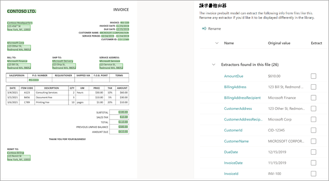
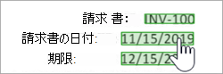

# 事前構築済みのモデルを使用して、Microsoft の請求書または領収書から情報を抽出SharePoint Syntex

事前構築済みのモデルは、ドキュメントとドキュメント内の構造化された情報を認識するように事前にトレーニングされています。 新しいカスタム モデルを最初から作成する代わりに、既存の事前トレーニング済みモデルを反復処理して、組織のニーズに合った特定のフィールドを追加できます。 

現在、使用できる事前構築済みのモデルは、請求書と受領書の 2 つがあります。

- 請求書 *の事前構築モデルは* 、売上請求書から主要な情報を分析および抽出します。 API は、さまざまな形式で請求書を分析し、顧客名、請求先住所、期日、期日、支払期日などの主要な請求書情報を抽出します。

- レ *シート事前構築モデルは* 、売上受領書から主要な情報を分析し、抽出します。 API は、印刷および手書きのレシートを分析し、マーチャント名、販売者の電話番号、取引日、税金、トランザクションの合計などの主要な領収書情報を抽出します。

その他の事前構築済みモデルは、今後のリリースで利用できる予定です。

## 事前構築済みモデルの作成

次の手順に従って、事前構築済みのモデルを作成して、ドキュメントを分類SharePoint Syntex。

1. [モデル] **ページで** 、[モデルの **作成] を選択します**。

    ![[モデルの作成] ボタンを示す [モデル] ページのスクリーンショット。](../media/content-understanding/prebuilt-create-model-button.png) 

2. [モデル **の作成] パネル** の [名前 **] フィールドに** 、モデルの名前を入力します。

    ![使用可能なモデルの種類を示す [新しいドキュメントの理解モデル] パネルのスクリーンショット。](../media/content-understanding/prebuilt-create-panel.png) 

3. [モデルの **種類] セクション** で、事前構築済みのモデルのいずれかを選択します。
   - **請求書処理の事前構築**
   - **受信処理の事前構築**

   事前構築済みモデルではなく、従来のトレーニングされていないドキュメント理解モデルを作成する場合は、[カスタム ドキュメントの理解] **を選択します**。

4. コンテンツ タイプを変更するか、保持ラベルを追加する場合は、[詳細設定] **を選択します**。

    > [!NOTE]
    > この時点では、事前構築済みのモデルでは、感度ラベルを使用できません。

5. **[作成]** を選択します。 モデルはモデル ライブラリに **保存** されます。

## 分析するファイルを追加する

1. [モデル] **ページの** [分析するファイル **の追加] セクション** で、[ファイルの追加] **を選択します**。

    ![[分析するファイルを追加する] セクションを示す新しいモデル ページのスクリーンショット。](../media/content-understanding/prebuilt-add-file-to-analyze.png) 

2. [モデルを **分析するファイル] ページで** 、[追加] を選択 **して** 、使用するファイルを検索します。

    ![[追加] ボタンを示すモデル ページを分析するファイルのスクリーンショット。](../media/content-understanding/prebuilt-add-file-button.png) 

3. [トレーニング **ファイル ライブラリからファイルを** 追加する] ページで、ファイルを選択し、[追加] を選択 **します**。

    ![[トレーニング ファイル ライブラリからファイルを追加する] ページのスクリーンショット。](../media/content-understanding/prebuilt-add-file-from-training-library.png) 

6. [モデルを **分析するファイル] ページで、[次** へ] を **選択します**。

## モデルの抽出器を選択する

抽出者の詳細ページには、右側にドキュメント領域、左側に **[抽出]** パネルが表示されます。 [ **抽出] パネル** には、ドキュメントで識別された抽出プログラムの一覧が表示されます。

    

ドキュメント領域で緑色で強調表示されているエンティティ フィールドは、ファイルの分析時にモデルによって検出されたアイテムです。 抽出するエンティティを選択すると、強調表示されたフィールドが青に変わります。 後でエンティティを含めない場合、強調表示されたフィールドは灰色に変わります。 強調表示を使用すると、選択した抽出器の現在の状態を簡単に確認できます。

> [!TIP]
> エンティティ フィールドを読み取る場合は、マウスのスクロール ホイール、またはドキュメント領域の下部にあるコントロールを使用して、必要に応じて拡大または縮小できます。

### 抽出エンティティを選択する

好みに応じて、ドキュメント領域または抽出パネルから抽出器を選択できます。
 
- ドキュメント領域から抽出プログラムを選択するには、エンティティ フィールドを選択します。

     

- 抽出パネルから抽出器を **選択するには、** エンティティ名の右側にあるチェック ボックスをオンにします。

     

抽出プログラムを選択すると、ドキュメント領域に [抽出プログラム **の選択]** ボックスが表示されます。 このボックスには、抽出プログラム名、元の値、および抽出プログラムとして選択するオプションが表示されます。 数値や日付などの特定のデータ型では、抽出された値も表示されます。

   ![抽出プログラムの詳細ページの [抽出プログラムの選択] ボックスのスクリーンショット。](../media/content-understanding/prebuilt-select-distractor-box.png) 

元の値は、ドキュメント内の実際の値です。 抽出された値は、列内の列に書き込まれるSharePoint。 モデルをライブラリに適用する場合は、列の書式設定を使用して、ドキュメント内での表示方法を指定できます。

引き続き、使用する追加の抽出機能を選択します。 他のファイルを追加して、このモデル構成を分析することもできます。

## 抽出子の名前を変更する

抽出プログラムの名前は、モデルのホーム ページまたは抽出パネル **から変更** できます。 選択した抽出プログラムの名前を変更する場合は、モデルをライブラリに適用するときに列名として使用されます。

モデルのホーム ページから抽出器の名前を変更するには、次のコマンドを実行します。

1. [抽出 **] セクションで** 、名前を変更する抽出プログラムを選択し、[名前の変更] を **選択します**。

    ![[名前の変更] オプションが強調表示された [Extractors] セクションのスクリーンショット。](../media/content-understanding/prebuilt-model-page-rename-extractor.png) 

2. [名前の **変更] エンティティ抽出パネル** で、抽出プログラムの新しい名前を入力し、[名前の変更] を選択 **します**。

抽出パネルから抽出器の名前 **を変更するには、次の操作を** 行います。

1. 名前を変更する抽出プログラムを選択し、[名前の変更] を **選択します**。

    ![抽出プログラムの名前を変更する方法を示す [抽出] パネルのスクリーンショット。](../media/content-understanding/prebuilt-extractors-panel-rename-field.png) 

2. [抽出 **プログラムの名前の変更]** ボックスに抽出プログラムの新しい名前を入力し、[名前の変更] を選択 **します**。

## モデルの適用

- 変更を保存し、モデルのホーム ページに戻る場合は、[ **抽出** ] パネルで [保存して **終了] を選択します**。

- モデルをライブラリに適用する準備が整った場合は、ドキュメント領域で [次へ] を選択 **します**。 [ライブラリ **に追加] パネルで** 、モデルを追加するライブラリを選択し、[追加] を選択 **します**。

## 関連項目

[ドキュメント理解モデルの適用](apply-a-model.md)