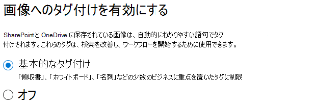

# SharePoint の同期 Tex をセットアップする

管理者は、Microsoft 365 管理センターを使用して、Microsoft SharePoint の同期 Tex をセットアップできます。 

開始する前に、次の点を考慮してください。

- どの SharePoint サイトでフォーム処理を有効にしますか? すべてのサイト、一部、またはサイトの選択
- コンテンツセンターの名前と、プライマリサイト管理者を指定してください。

Microsoft 365 管理センターの初期セットアップ後に設定を変更することができます。

この記事の内容は、Project Cortex のプライベートプレビュー用です。 [詳細については、「Project Cortex](https://aka.ms/projectcortex)」を参照してください。

セットアップの前に、環境内のコンテンツの理解を設定して構成するための最善の方法を計画してください。 たとえば、次のような名前を考慮する必要があります。

- フォーム処理を有効にする必要がある SharePoint サイト (すべてのサイト、一部、または選択したサイト)
- コンテンツセンターと、プライマリサイト管理者の名前

## Requirements 

> [!NOTE]
> Microsoft 365 管理センターにアクセスし、コンテンツの理解を設定するには、グローバル管理者または SharePoint 管理者のアクセス許可を持っている必要があります。

管理者であれば、セットアップ後に選択した設定を変更することもできます。また、コンテンツ全体で、Microsoft 365 管理センターの管理設定について理解する必要があります。

## SharePoint の同期 Tex をセットアップするには

1. Microsoft 365 管理センターで、[ **セットアップ**] を選択し、[ **組織ナレッジ** ] セクションを表示します。

2. [ **組織ナレッジ** ] セクションで、[ **コンテンツの理解を自動化**する] を選択します。 

     

3. [ **SharePoint の同期の自動化** ] ページで、[ **開始** ] をクリックして、セットアッププロセスの手順を順を追って説明します。 

     

4. [画像のタグ付けの有効化] ページで、画像への [タグ付け](image-tagging.md)を許可するかどうかを選択します。

     

5. [ **フォーム処理の構成** ] ページで、ユーザーが AI ビルダーを使用して、特定の SharePoint ドキュメントライブラリのフォーム処理モデルを作成できるようにするかどうかを選択できます。 [ドキュメントライブラリ] リボンでメニューオプションを使用して、フォーム処理モデルが有効になっている SharePoint ドキュメントライブラリに **フォーム処理モデルを作成** できます。
 
     **フォーム処理モデルを作成するためのオプションをどの SharePoint ライブラリに表示するかを指定**するには、次のオプションを選択します。 
      - 組織内のすべての SharePoint ライブラリで利用できるようにするための**すべての sharepoint ライブラリ**。 
      - [**選択したサイトのライブラリのみ**] を選択し、使用できるようにするサイトを選択します。 

   

   > [!Note]
   > SharePoint ドキュメントライブラリでこの設定を有効にしても、ライブラリに適用されている既存のモデル、またはドキュメントを認識するモデルをライブラリに適用する機能には影響しません。 
    
6. [ **コンテンツセンターの作成** ] ページで、ユーザーがドキュメントを作成および管理できる SharePoint コンテンツセンターサイトを作成できます。  
    a.  [ **サイト名**] に、コンテンツセンターサイトに付ける名前を入力します。 
    b.  サイト **アドレス** には、サイト名に対して選択した内容に基づいてサイトの URL が表示されます。 変更する場合は、[ **編集**] をクリックします。 

       

    [**次へ**] を選択します。

7. [ **確認と完了** ] ページで、選択した設定を確認して、変更を行うことができます。 選択内容に問題がなければ、[ **アクティブ化**] を選択します。

8. [確認] ページで、[ **完了**] をクリックします。

9. **コンテンツの自動理解**ページに戻ります。 このページでは、[ **管理** ] を選択して構成設定に変更を加えることができます。 

## ライセンスを割り当てる

SharePoint の同期 Tex を構成した後、フォーム処理を使用するユーザーにライセンスを割り当てる必要があります。また、ドキュメントを理解するには、その機能を使用する必要があります。

ライセンスを割り当てるには

1. Microsoft 365 管理センターで、[ **ユーザー**] の下の [ **アクティブなユーザー**] をクリックします。

2. ライセンスを付与するユーザーを選択し、[ **製品ライセンスの管理**] をクリックします。

3. [ **詳細の割り当て**] を選択します。

4. [ **インテリジェントコンテンツサービス**] を選択します。 [**アプリ**] の下で、[インテリジェントコンテンツサービス] と [**インテリジェントコンテンツ**サービス**用の共通データサービス] の**両方が選択されていることを確認します。

    

5. **[変更の保存]** をクリックします。

## AI ビルダークレジット

組織に300以上の sharepoint の同期 tex ライセンスがある場合は、100万 AI ビルダークレジットが割り当てられます。 ライセンス数が300未満の場合は、フォーム処理を使用するために、AI ビルダークレジットを購入する必要があります。

[Ai ビルダー電卓](https://powerapps.microsoft.com/ai-builder-calculator)で、適切な ai ビルダーの容量を見積もることができます。

1. [電源プラットフォーム管理センター](https://admin.powerplatform.microsoft.com/resources/capacity)に移動して、クレジットと使用状況を確認します。

    > [!NOTE]
    > SharePoint ドキュメントライブラリでこの設定を有効にしても、ライブラリに適用されている既存のモデル、またはドキュメントを認識するモデルをライブラリに適用する機能には影響しません。 
    
2. [ **コンテンツセンターの作成** ] ページで、ユーザーがドキュメントを作成および管理できる SharePoint コンテンツセンターサイトを作成できます。  
    a.  [ **サイト名**] に、コンテンツセンターサイトに付ける名前を入力します。 
    b.  サイト **アドレス** には、サイト名に基づいてサイトの URL が表示されます。 

    > [!NOTE] 
    > サポートされている言語を選択することはできますが、モデルを理解しているのは英語の場合に限られます。 

       

3. [**次へ**] を選択します。

4. [ **完了と確認** ] ページで、選択した設定を確認し、変更を行うように選択します。 選択内容に問題がなければ、[ **アクティブ化**] を選択します。

5. **コンテンツはアクティブ化**されたページを理解しており、システムがフォーム処理の設定を追加し、コンテンツセンターサイトを作成したことを確認します。 [**完了**] を選択します。

6. **コンテンツの自動理解**ページに戻ります。 このページでは、[ **管理** ] を選択して構成設定に変更を加えることができます。 

## 関連項目

[フォーム処理モデルの概要](https://docs.microsoft.com/ai-builder/form-processing-model-overview)

[ステップバイステップ: ドキュメントを構築する方法モデルについて (ビデオ)](https://www.youtube.com/watch?v=DymSHObD-bg)

