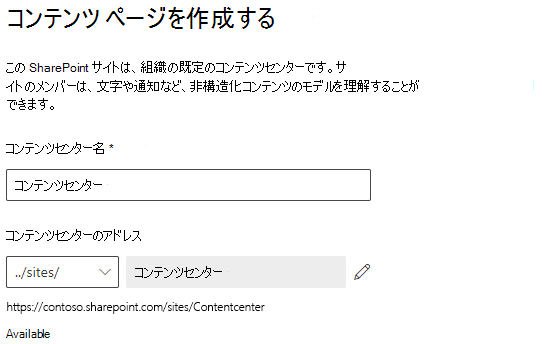
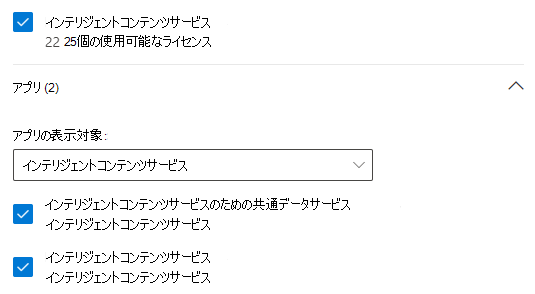

# SharePoint Syntex の設定

管理者は、<a href="https://go.microsoft.com/fwlink/p/?linkid=2024339" target="_blank">Microsoft 365 管理センター</a>を使用して、[Microsoft SharePoint Syntex](index.md) をセットアップできます。 

事前に、次のことを考慮します。

- どの SharePoint サイトでフォームの処理を有効にできますか? これらのすべて、それともサイトのいくつかを選択しますか?
- 既定のコンテンツ センターの名前を何にしますか?

<a href="https://go.microsoft.com/fwlink/p/?linkid=2024339" target="_blank">Microsoft 365 管理センター</a>での最初のセットアップの後でも設定を変更できます。

設定する前に、使用している環境のコンテンツ解釈をセットアップして構成する最適な方法を計画してください。たとえば、以下について決定を行う必要があります。

- フォームの処理を有効にする SharePoint サイト (すべてのサイト、一部、または選択したサイト)
- コンテンツ センターの名前と管理者

## 要件 

> [!NOTE]
> Microsoft 365 管理センターにアクセスし、SharePoint Syntex をセットアップするには、グローバル管理者または SharePoint 管理者のアクセス許可が必要です。

管理者は、セットアップ後、および <a href="https://go.microsoft.com/fwlink/p/?linkid=2024339" target="_blank">Microsoft 365 管理センター</a>のコンテンツの解釈管理設定全体を通じて、選択した設定に変更を加えることもできます。

カスタム Power Platform 環境を使用する場合は、フォーム処理モデルを作成する前に、[この環境で *プロジェクト Cortex の AI ビルダー* アプリをインストールし、](/power-platform/admin/manage-apps#install-an-app-in-the-environment-view)そのアプリに [AI ビルダー クレジットを割り当てる](/power-platform/admin/capacity-add-on)必要があります。

### ライセンス

SharePoint Syntex を使用するには、組織に SharePoint Syntex のサブスクリプションが必要であり、各ユーザーに次のライセンスが割り当てられている必要があります。

- SharePoint Syntex
- SharePoint Syntex - SPO の種類
- SharePoint Syntex の共通データ サービス

フォーム処理を使用するには、AI ビルダー クレジットも必要です。 ライセンス ユーザーが 300 人以上の場合、AI ビルダー クレジットの割り当てが毎月提供されます。

SharePoint Syntex ライセンスの詳細については、「[SharePoint Syntex ライセンス](syntex-licensing.md)」を参照してください

## SharePoint Syntex の設定

1. Microsoft 365 管理センターで、<a href="https://go.microsoft.com/fwlink/p/?linkid=2171997" target="_blank">**[設定]**</a> を選択し、**[ファイルとコンテンツ]** セクションを表示します。

2. **[ファイルとコンテンツ]** セクションで、**[コンテンツを自動的に理解する]** を選択します。 現在の AI ビルダー クレジットの可用性は、**[概要]** セクションに表示されていることに注意してください。 

3. [ **自動化コンテンツ理解世帯** ]の ページで、[ **使用を開始する**] をクリックして、セットアッププロセスを確認します。  

    > [!div class="mx-imgBorder"]
    >  

4. [ **フォーム処理の構成**] ページで、特定の SharePoint ドキュメントライブラリにユーザーがフォーム処理モデルを作成できるようにするかどうかを選択できます。 ドキュメントライブラリのリボンには、メニューオプションが用意されています。これを有効にしている SharePoint ドキュメントライブラリで  **フォーム処理モデルを作成** します。
 
     **どの SharePoint ライブラリがフォーム処理モデルを作成するためのオプションを表示するようにするか** については、次を選択できます。 
      - **すべての SharePoint サイトのライブラリ** は、組織内のすべての SharePoint ライブラリで使用できるようにします。 
      - **選択した SharePoint サイトのライブラリ** は、使用可能にするサイトを選択するか、最大 50 件のサイトのリストをアップロードします。 
      - **SharePointライブラリはなし** どのサイトも使用できるようにしたくない場合(セットアップ後に変更できます)。

   > [!div class="mx-imgBorder"]
   > 

   > [!Note]
   > 含まれているサイトを削除しても、そのサイトのライブラリに適用されている既存のモデルには影響しません。また、ドキュメント理解モデルをライブラリに適用する機能もありません。 
    
    複数の Power Platform 環境を構成している場合は、フォームの処理に使用する環境を選択できます。 (お持ちの環境が 1 つのみである場合、このオプションは表示されません)。

    

    **Power Platform 環境** には、以下を選択できます。
    - **既定の環境を使用** して、 Power Platform 環境を使用します。
    - **カスタム環境を使用** して、カスタム 環境を使用します。 リストから使用する環境を選択します。 ([カスタム環境の要件を参照してください](/microsoft-365/contentunderstanding/set-up-content-understanding#requirements)。)

    [**次へ**] をクリックします。

5. **コンテンツセンターの作成** ページで、ユーザーがドキュメント理解モデルを作成して管理することができるように、SharePoint コンテンツセンターサイトを作成できます。 以前に SharePoint 管理センターからコンテンツ センターを作成した場合は、その情報がここに表示されるので、**[次へ]** を選択するだけです。

    1. [**サイト名**] に、コンテンツ センター サイトの名前を入力します。
    
    1. [ **サイトアドレス** には、サイト名に選択した内容に基づいて、サイトの URL が表示されます。 変更する場合は、[ **編集**] をクリックします。

       > [!div class="mx-imgBorder"]
       >  

       [**次へ**] を選択します。

6. [ **確認と完了**] ページで、選択した設定を確認して、変更を行うことができます。 選択内容に問題がない場合は、[**ライセンス認証**]を行います。

7. [確認]ページで、 **[完了]** をクリックします。

8. **コンテンツ理解の自動作成** ページに戻ります。 このページでは、[ **管理** ] を選択して、構成設定に変更を加えることができます。 

## ライセンスを割り当てる

SharePoint Syntex を構成したら、SharePoint Syntex機能を使用するユーザーにライセンスを割り当てる必要があります。

ライセンスを割り当てる

1. Microsoft 365 管理センターの **[ユーザー]** で、<a href="https://go.microsoft.com/fwlink/p/?linkid=834822" target="_blank">**[アクティブなユーザー]**</a> を選択します。

2. ライセンスを付与するユーザーを選択し、**[製品ライセンスの管理]** を選択します。

3. ドロップダウン メニューから **[アプリ]** を選択します。

4. **[SharePoint Syntex のアプリを表示する]** を選択します。 **[アプリ]** で、**Common Data Service for SharePoint Syntex**、**SharePoint Syntex**、**SharePoint Syntex - SPO type** がすべて選択されていることを確認します。

    > [!div class="mx-imgBorder"]
    > 

5. **[変更の保存]** をクリックします。

## 関連項目

[フォーム処理モデルの概要](/ai-builder/form-processing-model-overview)

[ステップバイステップ: ドキュメント理解モデルを作成する方法について理解する (ビデオ)](https://www.youtube.com/watch?v=DymSHObD-bg)

[Power Platform 管理センターで環境を作成して管理する](/power-platform/admin/create-environment)
