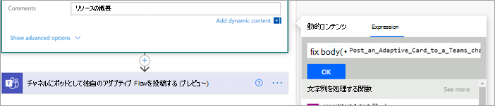

# <a name="step-3-use-power-automate-to-create-the-flow-to-process-your-contracts"></a>手順 3. 契約Power Automate処理するフローを作成するには、次の手順を実行します。

契約管理チャネルを作成し、ドキュメント ライブラリにSharePointしました。 次の手順は、Power Automateモデルが識別して分類する契約を処理するSharePoint Syntex作成します。 この手順を実行するには、[ドキュメント ライブラリにPower Automateフロー SharePoint作成します](https://support.microsoft.com/office/create-a-flow-for-a-list-or-library-in-sharepoint-or-onedrive-a9c3e03b-0654-46af-a254-20252e580d01)。

契約管理ソリューションでは、次のアクションを実行Power Automateフローを作成する必要があります。

-  契約がユーザー モデルによって分類されたSharePoint Syntex、契約の状態を [確認中]**に変更します**。
- その後、契約が確認され、承認または却下されます。
- 承認された契約の場合、契約情報は支払い処理用のタブに投稿されます。
- 却下された契約の場合、チームは詳細な分析を行う通知を受け取る。 

次の図は、契約Power Automateのフローを示しています。


## <a name="prepare-your-contract-for-review"></a>レビューのために契約を準備する

契約がドキュメント理解モデルによって識別され、SharePoint Syntex分類されると、Power Automateフローは最初に状態を [レビュー中]**に変更します**。


ファイルをチェックアウトした後、状態の値を [確認中] **に変更します**。


次の手順では、契約がレビューを待ち、それを契約管理チャネルに投稿することを示すアダプティブ カードを作成します。


次のコードは、この手順で使用される JSON を示Power Automateします。

```JSON
{
"$schema": "http://adaptivecards.io/schemas/adaptive-card.json",
"type": "AdaptiveCard",
"version": "1.0",
"body": [
    {
    "type": "TextBlock",
    "text": "Contract approval request",
    "size": "large",
    "weight": "bolder",
     "wrap": true
    },
        {
            "type": "Container",
            "items": [
                {
                    "type": "FactSet",
                    "spacing": "Large",
                    "facts": [
                        {
                            "title": "Client",
                            "value": "@{triggerOutputs()?['body/Client']}"
                        },
                        {
                            "title": "Contractor",
                            "value": "@{triggerOutputs()?['body/Contractor']}"
                        },
                        {
                            "title": "Fee amount",
                            "value": "@{triggerOutputs()?['body/FeeAmount']}"
                        },
                        {
                            "title": "Date created",
                            "value": "@{triggerOutputs()?['body/Modified']} "
                        },
                        {
                            "title": "Link",
                            "value": "[@{triggerOutputs()?['body/{FilenameWithExtension}']}](@{triggerOutputs()?['body/{Link}']})"
                        }
                    ]
                }
            ]
         },
    {
    "type": "TextBlock",
    "text": "Comment:"
    },
        {
            "type": "Input.Text",
            "placeholder": "Enter comments",
            "id": "acComments"
        }
],
"actions": [
    {
    "type": "Action.Submit",
    "title": "Approve",
    "data": {
        "x": "Approve"
    }
    },
    {
    "type": "Action.Submit",
    "title": "Reject",
    "data": {
        "x": "Reject"
    }
    }
]
}
```


## <a name="conditional-context"></a>条件付きコンテキスト

フローでは、次に、契約が承認または却下される条件  [を作成する](#if-the-contract-is-approved) 必要 [があります](#if-the-contract-is-rejected)。


## <a name="if-the-contract-is-approved"></a>契約が承認された場合

契約が承認されると、次のことが発生します。

- [契約 **] タブ** で、契約カードの状態が [承認済み] **に変更されます**。

   

- フローで、状態が [承認済み] **に変更されます**。

   

- このソリューションでは、契約データが [支払い]タブに追加され、支払いを管理できます。 このプロセスを拡張して、フローがサードパーティの金融アプリケーション (Dynamics CRM など) による支払いのための契約を提出できるよう拡張できます。

   ![契約が [支払い] に移動しました。](../media/content-understanding/for-payout.png)

- フローで、次のアイテムを作成して、承認済み契約を [支払い] タブ **に移動** します。

   

    カードから必要な情報の式をTeams、次の表に示す値を使用します。
 
    |名前     |Expression |
    |---------|-----------|
    | 承認状態  | body('Post_an_Adaptive_Card_to_a_Teams_channel_and_wait_for_a_response')?['submitActionId']         |
    | 承認済み     | body('Post_an_Adaptive_Card_to_a_Teams_channel_and_wait_for_a_response')?['responder']['displayName']        |
    | 承認日     | body('Post_an_Adaptive_Card_to_a_Teams_channel_and_wait_for_a_response')?['responseTime']         |
    | コメント     | body('Post_an_Adaptive_Card_to_a_Teams_channel_and_wait_for_a_response')?['data']['acComments']         |
    
    次の使用例は、数式ボックスを使用して式をPower Automateする方法を示しています。

       

- 契約が承認されたことを示すアダプティブ カードが作成され、契約管理チャネルに投稿されます。

   

   


   次のコードは、この手順で使用される JSON を示Power Automateします。

```JSON
{ 
    "type": "AdaptiveCard",
    "body": [
        {
            "type": "Container",
            "style": "emphasis",
            "items": [
                {
                    "type": "ColumnSet",
                    "columns": [
                        {
                            "type": "Column",
                            "items": [
                                {
                                    "type": "TextBlock",
                                    "size": "Large",
                                    "weight": "Bolder",
                                    "text": "CONTRACT APPROVED"
                                }
                            ],
                            "width": "stretch"
                        }
                    ]
                }
            ],
            "bleed": true
        },
        {
            "type": "Container",
            "items": [
                {
                    "type": "FactSet",
                    "spacing": "Large",
                    "facts": [
                        {
                            "title": "Client",
                            "value": "@{triggerOutputs()?['body/Client']}"
                        },
                        {
                            "title": "Contractor",
                            "value": "@{triggerOutputs()?['body/Contractor']}"
                        },
                        {
                            "title": "Fee amount",
                            "value": "@{triggerOutputs()?['body/FeeAmount']}"
                        },
                        {
                            "title": "Approval by",
                            "value": "@{body('Post_an_Adaptive_Card_to_a_Teams_channel_and_wait_for_a_response')?['responder']['displayName']}"
                        },
                        {
                            "title": "Approved date",
                            "value": "@{body('Post_an_Adaptive_Card_to_a_Teams_channel_and_wait_for_a_response')?['responseTime']}"
                        },
                        {
                            "title": "Approval comment",
                            "value": "@{body('Post_an_Adaptive_Card_to_a_Teams_channel_and_wait_for_a_response')?['data']['acComments']}"
                        },
                        {
                            "title": " ",
                            "value": " "
                        },
                        {
                            "title": "Status",
                            "value": "Ready for payout"
                        }
                    ]
                }
            ]
        }
    ],
    "$schema": "http://adaptivecards.io/schemas/adaptive-card.json",
    "version": "1.2",
    "fallbackText": "This card requires Adaptive Cards v1.2 support to be rendered properly."
}
```

## <a name="if-the-contract-is-rejected"></a>契約が拒否された場合

契約が拒否された場合、次の処理が行われます。

- [契約 **] タブで** 、契約カードの状態が [拒否済み] に **変更されます**。

   

- フローで、コントラクト ファイルをチェックアウトし、状態を [拒否] に変更し、ファイルを再びチェックインします。

   

- フローで、契約が拒否されたことを示すアダプティブ カードを作成します。

   

次のコードは、この手順で使用される JSON を示Power Automateします。

```JSON
{ 
    "type": "AdaptiveCard",
    "body": [
        {
            "type": "Container",
            "style": "attention",
            "items": [
                {
                    "type": "ColumnSet",
                    "columns": [
                        {
                            "type": "Column",
                            "items": [
                                {
                                    "type": "TextBlock",
                                    "size": "Large",
                                    "weight": "Bolder",
                                    "text": "CONTRACT REJECTED"
                                }
                            ],
                            "width": "stretch"
                        }
                    ]
                }
            ],
            "bleed": true
        },
        {
            "type": "Container",
            "items": [
                {
                    "type": "FactSet",
                    "spacing": "Large",
                    "facts": [
                        {
                            "title": "Client",
                            "value": "@{triggerOutputs()?['body/Client']}"
                        },
                        {
                            "title": "Contractor",
                            "value": "@{triggerOutputs()?['body/Contractor']}"
                        },
                        {
                            "title": "Fee amount",
                            "value": "@{triggerOutputs()?['body/FeeAmount']}"
                        },
                        {
                            "title": "Rejected by",
                            "value": "@{body('Post_an_Adaptive_Card_to_a_Teams_channel_and_wait_for_a_response')?['responder']['displayName']}"
                        },
                        {
                            "title": "Rejected date",
                            "value": "@{body('Post_an_Adaptive_Card_to_a_Teams_channel_and_wait_for_a_response')?['responseTime']}"
                        },
                        {
                            "title": "Comment",
                            "value": "@{body('Post_an_Adaptive_Card_to_a_Teams_channel_and_wait_for_a_response')?['data']['acComments']}"
                        },
                        {
                            "title": " ",
                            "value": " "
                        },
                        {
                            "title": "Status",
                            "value": "Needs review"
                        }
                    ]
                }
            ]
        }
    ],
    "$schema": "http://adaptivecards.io/schemas/adaptive-card.json",
    "version": "1.2",
    "fallbackText": "This card requires Adaptive Cards v1.2 support to be rendered properly."
}
```

- カードは契約管理チャネルに投稿されます。

   