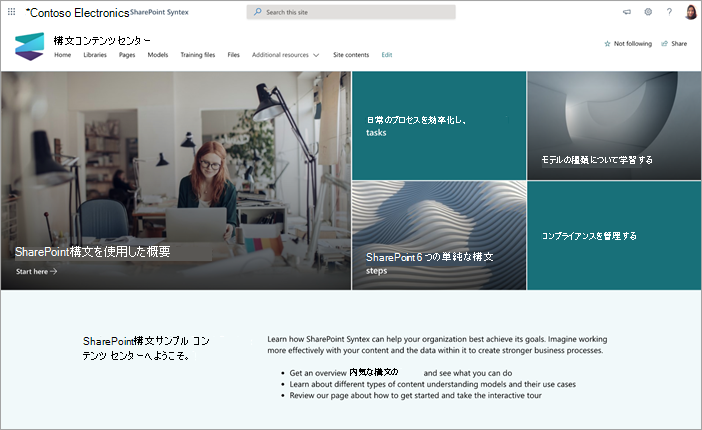
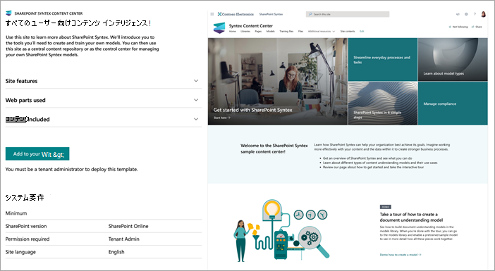

# Microsoft SharePoint Syntexのコンテンツ センター サイト テンプレートを使用する

SharePoint Syntex コンテンツ センター サイトは、SharePoint Syntex機能の理解を深めるために設計された、すぐに展開できる手順SharePointサイト テンプレートです。

独自のモデルを作成してトレーニングするために必要なツールと情報について説明します。 その後、このサイトを中央コンテンツ リポジトリとして、または独自のSharePoint Syntex モデルを管理するためのコントロール センターとして使用できるようになります。

このサイトでは、モデルをトレーニングし、独自のコンテンツを使用して評価できます。 ただし、ライブラリにモデルを適用するには、SharePoint Syntexのライセンスが必要です。  

## サイトをプロビジョニングする

コンテンツ センター サイトは、[SharePointルック ブック サービス](https://lookbook.microsoft.com/)からプロビジョニングできます。

> [!NOTE]
> サイトをプロビジョニングするには、Microsoft 365のグローバル管理者またはSharePoint管理者である必要があります。

1. [SharePointルック ブック](https://lookbook.microsoft.com/)のメイン ページの [**デザインの表示**] メニューで、**SharePoint Syntex** >  **SharePoint Syntexコンテンツ センター** を選択します。

2. **[コンテンツ センター**] ページで、[**テナントに追加]** を選択します。

    ![コンテンツ センター サイト テンプレートのプロビジョニング ページの [テナントに追加] ボタンのスクリーンショット。](../media/content-understanding/content-center-site-add-to-your-tenant.png)

3. 電子メール アドレス (サイトの使用準備が完了した場合の通知)、使用するサイト URL、サイトに使用するタイトルを入力します。 

    ![コンテンツ センター サイト テンプレートのプロビジョニング ページの [テナントに追加] ボタンのスクリーンショット。](../media/content-understanding/content-center-email-and-url.png)

4. [**プロビジョニング**] を選択すると、すぐにサイトを使用する準備が整います。 コンテンツ センター サイト テンプレートのプロビジョニング要求が完了したことを示す電子メール (指定したメール アドレスに送信) が届きます。

5. [ **サイトを開く**] を選択すると、コンテンツ センター サイトが表示されます。 ここから、サイトを探索し、SharePoint Syntexの詳細を確認できます。 

SharePointルック ブック サービスからのプロビジョニングの詳細については、「[新しいラーニング パス ソリューションのプロビジョニング](/office365/customlearning/custom_provision)」を参照してください。

## サイトを調べる

コンテンツ センター サイトには、組織でSharePoint Syntexの使用を開始する手順を説明する事前設定されたページが含まれています。 

### SharePoint Syntex の使用を開始する

SharePoint Syntexの概要を確認し、組織で使用する方法について説明します。 SharePoint Syntexの概要を示すビデオを見て、作業を開始するのに役立つトレーニングを見つけます。

### モデルの種類について学習する

3 種類のモデルについて説明し、それらを使用して、検索、ビジネス プロセス、コンプライアンスなどのビジネス上の問題を解決する方法について説明します。

### 対話型ツアーでモデルを作成する

モデル ライブラリでドキュメント理解モデルを構築し、事前トレーニング済みのサンプル モデルを有効にする方法について説明します。

### 6 つの簡単な手順でSharePoint Syntexする

コンテンツ センターから始め、必要な情報を識別、分類、抽出するモデルを作成する手順について詳しく説明します。

### 日常のプロセスとタスクを合理化する

SharePoint Syntexを使用して手動で実行し、組織の自動化された合理化された方法に変換する方法について説明します。

### コンプライアンスの管理

リスクを軽減し、組織がキャプチャしたデータと情報が安全で思慮深い方法で使用されるようにするための手順を実装します。

### モデル アクティビティを表示する

モデル アクティビティを示し、モデルの使用方法の詳細を提供するためにコンテンツがどのように使用されるかを確認します。

### その他のリソースを検索する

SharePoint Syntexの詳細については、その他のリソースとシナリオをご覧ください。

