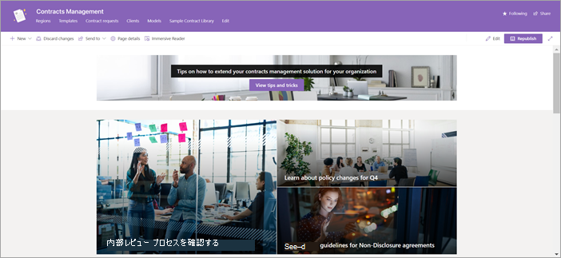

# Microsoft サービスの契約管理サイト テンプレートを使用SharePoint Syntex

契約管理サイトは、組織がサイト の価値を最大限に高SharePointできる、すぐに展開してカスタマイズ可能なサイト テンプレートSharePoint Syntex。 このサイトは、組織内の契約の状態を管理、処理、追跡するためのプロフェッショナル サイトを作成するように設計されています。

## サイトの機能

契約管理サイトには、事前入力されたページ、Web パーツ、およびサイト ナビゲーションが含まれます。 サイトをカスタマイズして、組織独自のブランド化、従業員情報、ポリシーと計画情報、ワークフロー、連絡先、リソースを組み込む。

サイトでは、ドキュメント ライブラリで実行されているSharePoint Syntexモデルの機能SharePointドキュメントを分類し、メタデータを抽出します。 このサイトには、すぐに開始するために構築済みのドキュメント ライブラリが用意されています。必要に応じて独自のドキュメント ライブラリを作成できます。 サイトには、次の機能ライブラリが含まれています。

- **[地域** ] – 契約ドキュメントを地理的領域、国、または地域別に分類します。

- **テンプレート** – 非開示契約、サービス契約、作業明細書など、契約の種類に適した契約テンプレートを選択します。

- **契約要求 –** 契約チームに直接契約要求を起動します。

- **クライアント** – 1 つの便利な場所でクライアント情報を検索します。

- **モデル** – このライブラリのモデルを使用して、ドキュメントを分類し、メタデータを抽出します。 ユーザーは、ニーズに合わせて独自のモデルを作成し、このライブラリに追加できます。

- **サンプル コントラクト ライブラリ** – 分類され、メタデータが抽出されたファイルを、データ モデルを使用してSharePoint Syntexします。 

ライブラリには、ステータスなどの他のメタデータを追跡できる別のビューがあります。ドキュメント ライブラリの書式設定を使用して、より視覚的な方法で表示します。

## サイトのプロビジョニング

コントラクト管理サイトは、サイトのルック ブック サービス[SharePointプロビジョニングできます](https://lookbook.microsoft.com/)。

![[契約管理] サイト テンプレートのプロビジョニング ページのスクリーンショット。](../media/content-understanding/contracts-management-site-provisioning-page.png)

> [!NOTE]
> サイトをプロビジョニングするには、SharePoint管理者Microsoft 365管理者である必要があります。 また、このサイト テンプレートを組織にSharePoint Syntexライセンスを持っている必要があります。

1. [デザイン] ルック ブックの [メイン ページSharePoint](https://lookbook.microsoft.com/) > 、[デザインの表示] メニューで、[契約管理] SharePoint Syntex **SharePoint Syntex選択します**。

2. [契約 **の管理] ページで** 、[テナントに **追加] を選択します**。

    ![[契約管理] サイト テンプレートのプロビジョニング ページの [テナントに追加] ボタンのスクリーンショット。](../media/content-understanding/contracts-management-site-add-to-your-tenant.png)

3. メール アドレス (サイトの使用準備が完了した場合の通知用)、使用するサイトの URL、サイトで使用するタイトルを入力します。 

    ![[契約管理] サイト テンプレートのプロビジョニング ページの電子メールフィールドとサイト URL フィールドのスクリーンショット。](../media/content-understanding/contracts-management-email-and-site-url.png)

4. [**プロビジョニング**] を選択すると、すぐにサイトを使用する準備が整います。 契約管理サイト テンプレートの準備要求が完了したことを示すメール (指定したメール アドレスに送信) が届きます。

5. [ **サイトを開く**] を選択すると、契約管理サイトが表示されます。 ここから、サイトを探索し、ページとコンテンツをカスタマイズできます。 

新しいルック ブック サービスからのプロビジョニングのSharePointについては、「Provision [a new learning pathways solution」を参照してください](/office365/customlearning/custom_provision)。

## サイトをカスタマイズする

契約管理サイトを他のユーザーと共有する前に、要件を満たしてサイトをカスタマイズする必要があります。 

### サイトの外観をカスタマイズする

組織のニーズに合わせて、サイトの次の要素をカスタマイズします。

- 契約管理 [サイトの](https://support.microsoft.com/office/customize-your-sharepoint-site-320b43e5-b047-4fda-8381-f61e8ac7f59b) ブランドを更新して、組織に合わせて調整します。
- 可能な場合は、 [ヒーロー Web パーツ](https://support.microsoft.com/office/use-the-hero-web-part-d57f449b-19a0-4b0d-8ce3-be5866430645)をカスタマイズして、組織の実際のサイトの画像を含めることができます。
- 契約管理者 [または他のユーザー](https://support.microsoft.com/office/show-people-profiles-on-your-page-with-the-people-web-part-7e52c5f6-2d72-48fa-a9d3-d2750765fa05) の連絡先情報を含めるには、People Web パーツをカスタマイズします。
- テキスト Web [パーツをカスタマイズして](https://support.microsoft.com/office/add-text-and-tables-to-your-page-with-the-text-web-part-729c0aa1-bc0d-41e3-9cde-c60533f2c801) 、スタイル、箇条書き、インデント、強調表示、リンクなど、段落を追加し、書式設定オプションを設定します。
- イメージ Web [パーツをカスタマイズして](https://support.microsoft.com/office/use-the-image-web-part-a63b335b-ad0a-4954-a65d-33c6af68beb2) 、ページにイメージを追加します。
- クイック リンク [Web パーツをカスタマイズして](https://support.microsoft.com/office/use-the-quick-links-web-part-e1df7561-209d-4362-96d4-469f85ab2a82) 、他のリソースへのリンクを整理および表示します。
- 必要 [に応じて、他](https://support.microsoft.com/office/using-web-parts-on-sharepoint-pages-336e8e92-3e2d-4298-ae01-d404bbe751e0) の Web パーツをサイトに追加します。
- 必要に応じて[ページ レイアウト](https://support.microsoft.com/office/add-sections-and-columns-on-a-sharepoint-modern-page-fc491eb4-f733-4825-8fe2-e1ed80bd0899)をカスタマイズします。
- 新 [しいページを追加](https://support.microsoft.com/office/create-and-use-modern-pages-on-a-sharepoint-site-b3d46deb-27a6-4b1e-87b8-df851e503dec) して、追加のサポートまたは情報リソースを追加します。

### サイト ナビゲーションをカスタマイズする

契約管理サイトのサイト ナビゲーションを制御できます。 組織に合わせて変更を行う場合は、次のリソースを使用します。

- [サイト ナビゲーション](https://support.microsoft.com/office/customize-the-navigation-on-your-sharepoint-site-3cd61ae7-a9ed-4e1e-bf6d-4655f0bf25ca)をカスタマイズする。
- [このサイトをハブに関連付けます](https://support.microsoft.com/office/associate-a-sharepoint-site-with-a-hub-site-ae0009fd-af04-4d3d-917d-88edb43efc05)。
- [対象ユーザー設定](https://support.microsoft.com/office/target-navigation-news-and-files-to-specific-audiences-33d84cb6-14ed-4e53-a426-74c38ea32293)を使用して、特定のユーザーに特定のナビゲーションリンクを設定します。 
- 必要な場合は、[不要なページを削除](https://support.microsoft.com/office/delete-a-page-from-a-sharepoint-site-1d4197b8-31b6-460d-906b-3fb492a51db1) します。

### 他のワークフローを追加する

契約管理サイトには、開始する必要があるコンポーネントが含まれますが、次のような追加のコンポーネントを含めもあります。

- 新しい [契約Power Automate](/power-automate/getting-started)コントラクト要求ライブラリに追加するときにワークフローをトリガーするには、ワークフロー フローを **使用** します。
- 追加のモデルを[SharePoint Syntexします](/microsoft-365/contentunderstanding/#models)。
- テンプレート ライブラリ [のコンテンツ アセンブリ](content-assembly.md) 機能 **を使用** します。
- 契約管理[ソリューションを作成するには](solution-manage-contracts-in-microsoft-365.md)、SharePoint Syntexの他のコンポーネントとMicrosoft 365。

## サイトを他のユーザーと共有する

[サイトを他のユーザーと共有します](https://support.microsoft.com/office/share-a-site-958771a8-d041-4eb8-b51c-afea2eae3658)。 組織内の他のユーザーとパートナーを組み、契約管理サイトが広く知られていると採用されています。

契約管理サイトを管理するための主な成功要因:

- 契約管理サイトの立ち上げを祝います。
- 新しいリソースを発表するニュースを作成して投稿します。
- ユーザーが質問やフィードバックを提供できるようにします。
- サイト分析からの分析 [情報を使用して](https://support.microsoft.com/office/view-usage-data-for-your-sharepoint-site-2fa8ddc2-c4b3-4268-8d26-a772dc55779e) 、ホーム ページ上のコンテンツの宣伝、ナビゲーションの更新、コンテンツの書き換えを行ってわかりやすくします。
- 必要に応じて契約管理サイトを確認し、コンテンツが最新で関連性が高い場合を確認します。

