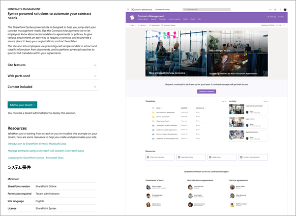

# Microsoft SharePoint Syntexの Contracts Management サイト テンプレートを使用する

Contracts Management サイトは、組織がSharePoint Syntexの価値を最大化するのに役立つ、すぐに展開できるカスタマイズ可能なSharePointサイト テンプレートです。 このサイトは、組織内の契約の状態を管理、処理、追跡するプロフェッショナル サイトを作成できるように設計されています。

## サイトの機能

Contract Management サイトには、事前設定されたページ、Web パーツ、サイト ナビゲーションが含まれます。 サイトをカスタマイズして、組織独自のブランド、従業員情報、ポリシーと計画の情報、ワークフロー、連絡先、リソースを組み込むことができます。

このサイトでは、SharePoint ドキュメント ライブラリで実行されているSharePoint Syntex モデルの機能を使用して、ドキュメントを分類し、メタデータを抽出します。 このサイトには、すぐに作業を開始するための事前構築済みのドキュメント ライブラリが用意されていますが、必要に応じて独自のドキュメント ライブラリを作成することもできます。 このサイトには、次の注目のライブラリが含まれています。

- **リージョン** – 地域、国、または地域別に契約ドキュメントを分類します。

- **テンプレート** – 秘密保持契約、サービス契約、作業明細書など、コントラクトの種類に適したコントラクト テンプレートを選択します。

- **コントラクト要求** – コントラクト 要求をコントラクト チームに直接起動します。

- **クライアント** – 1 つの便利な場所でクライアント情報を検索します。

- **モデル** – このライブラリのモデルを使用して、ドキュメントを分類し、メタデータを抽出します。 ユーザーは、ニーズに合わせて独自のモデルを作成し、このライブラリに追加できます。

- **サンプル コントラクト ライブラリ** – SharePoint Syntex モデルを使用して、分類され、メタデータが抽出されたファイルを検索します。 

ライブラリには、状態などの他のメタデータを追跡できる別のビューがあり、ドキュメント ライブラリの書式設定を使用して、より視覚的な方法で表示できます。

## サイトをプロビジョニングする

Contracts Management サイトは、[SharePointルック ブック サービス](https://lookbook.microsoft.com/)からプロビジョニングできます。

> [!NOTE]
> サイトをプロビジョニングするには、Microsoft 365のグローバル管理者またはSharePoint管理者である必要があります。 このサイト テンプレートを組織に追加するには、SharePoint Syntex ライセンスも必要です。

1. [SharePointルック ブック](https://lookbook.microsoft.com/)のメイン ページの [**デザインの表示**] メニューで、[**SharePoint Syntex** >  **SharePoint Syntex Contracts Management**] を選択します。

2. [ **コントラクト管理** ] ページで、[ **テナントに追加]** を選択します。

    ![Contracts Management サイト テンプレート のプロビジョニング ページの [テナントに追加] ボタンのスクリーンショット。](../media/content-understanding/contracts-management-site-add-to-your-tenant.png)

3. 電子メール アドレス (サイトの使用準備が完了した場合の通知)、使用するサイト URL、サイトに使用するタイトルを入力します。 

    

4. [**プロビジョニング**] を選択すると、すぐにサイトを使用する準備が整います。 Contracts Management サイト テンプレートのプロビジョニング要求が完了したことを示す電子メール (指定したメール アドレスに送信) が届きます。

5. [ **サイトを開く**] を選択すると、Contracts Management サイトが表示されます。 ここから、サイトを探索し、ページとコンテンツをカスタマイズできます。 

SharePointルック ブック サービスからのプロビジョニングの詳細については、「[新しいラーニング パス ソリューションのプロビジョニング](/office365/customlearning/custom_provision)」を参照してください。

## サイトをカスタマイズする

Contracts Management サイトを他のユーザーと共有する前に、要件を満たすようにサイトをカスタマイズする必要があります。 

### サイトの外観をカスタマイズする

組織のニーズに合わせて、サイトの次の要素をカスタマイズします。

- Contracts Management サイトの [ブランドを](https://support.microsoft.com/office/customize-your-sharepoint-site-320b43e5-b047-4fda-8381-f61e8ac7f59b) 更新して、組織に合わせます。
- 可能な場合は、 [ヒーロー Web パーツ](https://support.microsoft.com/office/use-the-hero-web-part-d57f449b-19a0-4b0d-8ce3-be5866430645)をカスタマイズして、組織の実際のサイトの画像を含めることができます。
- People [Web パーツ](https://support.microsoft.com/office/show-people-profiles-on-your-page-with-the-people-web-part-7e52c5f6-2d72-48fa-a9d3-d2750765fa05) をカスタマイズして、コントラクト マネージャーや他のユーザーの連絡先情報を含めます。
- [テキスト Web パーツ](https://support.microsoft.com/office/add-text-and-tables-to-your-page-with-the-text-web-part-729c0aa1-bc0d-41e3-9cde-c60533f2c801)をカスタマイズして、スタイル、箇条書き、インデント、強調表示、リンクなどの段落や書式設定オプションを追加します。
- [イメージ Web パーツ](https://support.microsoft.com/office/use-the-image-web-part-a63b335b-ad0a-4954-a65d-33c6af68beb2)をカスタマイズして、ページにイメージを追加します。
- [クイック リンク Web パーツ](https://support.microsoft.com/office/use-the-quick-links-web-part-e1df7561-209d-4362-96d4-469f85ab2a82)をカスタマイズして、他のリソースへのリンクを整理して表示します。
- 必要に応じて、サイトに [他の Web パーツ](https://support.microsoft.com/office/using-web-parts-on-sharepoint-pages-336e8e92-3e2d-4298-ae01-d404bbe751e0) を追加します。
- 必要に応じて[ページ レイアウト](https://support.microsoft.com/office/add-sections-and-columns-on-a-sharepoint-modern-page-fc491eb4-f733-4825-8fe2-e1ed80bd0899)をカスタマイズします。
- [新しいページ](https://support.microsoft.com/office/create-and-use-modern-pages-on-a-sharepoint-site-b3d46deb-27a6-4b1e-87b8-df851e503dec)を追加して、追加のサポートまたは情報リソースを追加します。

### サイト ナビゲーションをカスタマイズする

Contracts Management サイトのサイト ナビゲーションを制御できます。 次のリソースを使用すると、組織に合わせて変更を加えることができます。

- [サイト ナビゲーション](https://support.microsoft.com/office/customize-the-navigation-on-your-sharepoint-site-3cd61ae7-a9ed-4e1e-bf6d-4655f0bf25ca)をカスタマイズする。
- [このサイトをハブに関連付けます](https://support.microsoft.com/office/associate-a-sharepoint-site-with-a-hub-site-ae0009fd-af04-4d3d-917d-88edb43efc05)。
- [対象ユーザー設定](https://support.microsoft.com/office/target-navigation-news-and-files-to-specific-audiences-33d84cb6-14ed-4e53-a426-74c38ea32293)を使用して、特定のユーザーに特定のナビゲーションリンクを設定します。 
- 必要な場合は、[不要なページを削除](https://support.microsoft.com/office/delete-a-page-from-a-sharepoint-site-1d4197b8-31b6-460d-906b-3fb492a51db1) します。

### 他のワークフローを追加する

Contracts Management サイトには、作業を開始するために必要なコンポーネントが含まれていますが、次のような追加のコンポーネントを含めることもできます。

- [Power Automate フロー](/power-automate/getting-started)を使用して、コントラクト **要求** ライブラリに新しいコントラクトが追加されたときにワークフローをトリガーします。
- 追加[のSharePoint Syntex モデルをビルドします](/microsoft-365/contentunderstanding/#models)。
- **テンプレート** ライブラリの [コンテンツ アセンブリ](content-assembly.md)機能を使用します。
- Microsoft 365の他のコンポーネントと共にSharePoint Syntexを使用して[コントラクト管理ソリューション](solution-manage-contracts-in-microsoft-365.md)を作成します。

## サイトを他のユーザーと共有する

[サイトを他のユーザーと共有します](https://support.microsoft.com/office/share-a-site-958771a8-d041-4eb8-b51c-afea2eae3658)。 組織内の他のユーザーと協力して、Contracts Management サイトが広く知られ、採用されていることを確認します。

Contracts Management サイトを管理するための主な成功要因:

- Contracts Management サイトの立ち上げを祝います。
- 新しいリソースを発表するニュースを作成して投稿します。
- ユーザーが質問やフィードバックを提供できるようにします。
- [サイト分析](https://support.microsoft.com/office/view-usage-data-for-your-sharepoint-site-2fa8ddc2-c4b3-4268-8d26-a772dc55779e)の分析情報を使用して、ホーム ページのコンテンツを宣伝したり、ナビゲーションを更新したり、コンテンツを書き換えたりしてわかりやすくします。
- 必要に応じて Contracts Management サイトを確認し、コンテンツが最新で関連性が高い状態であることを確認します。

