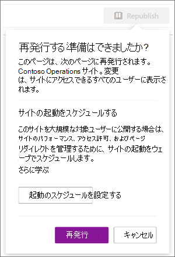

# <a name="launch-your-portal-using-the-sharepoint-portal-launch-scheduler"></a>SharePoint Portal 起動スケジューラを使用してポータルを起動する

ポータルは、トラフィックの多いイントラネット上の SharePoint 通信サイトです。数週間のうちに 10,000 人から 100,000 人以上の閲覧者を持つサイトです。 ポータル起動スケジューラを使用してポータルを起動し、新しい SharePoint ポータルにアクセスするときにユーザーがスムーズに表示できるようにします。
<br>
<br>
ポータル起動スケジューラは、ビューアーをウェーブでバッチ処理し、新しいポータルの URL リダイレクトを管理することで、段階的なロールアウト アプローチに従うのに役立ちます。 各ウェーブの起動中に、ユーザーのフィードバックを収集し、ポータルのパフォーマンスを監視し、起動を一時停止して問題を解決してから、次のウェーブに進むことができます。 [SharePoint でポータルの起動を計画する](/microsoft-365/Enterprise/Planportallaunchroll-out)方法の詳細について説明します。

**リダイレクトには、次の 2 種類があります。**

- **双方向**: 新しい最新の SharePoint ポータルを起動して、既存の SharePoint クラシック ポータルまたはモダン ポータルを置き換える
- **一時ページにリダイレクト** する: 既存の SharePoint ポータルを使用せずに新しい最新の SharePoint ポータルを起動する

サイトのアクセス許可は、起動の一環としてウェーブとは別に設定する必要があります。 たとえば、組織全体のポータルをリリースする場合は、アクセス許可を "外部ユーザーを除くすべてのユーザー" に設定し、セキュリティ グループを使用してユーザーをウェーブに分けることができます。 ウェーブにセキュリティ グループを追加しても、そのセキュリティ グループはサイトにアクセスできません。

> [!NOTE]
>
> - この機能には、SharePoint 通信サイトのホーム ページの **[設定]** パネルからアクセスできます。
> - この機能は、ポータルに使用する既定の推奨される種類であるため、サイト ページを使用する最新の SharePoint 通信サイトでのみ使用できます。
> - ポータルの起動をカスタマイズおよびスケジュールするには、サイトのサイト所有者のアクセス許可が必要です。
> - 起動は少なくとも 7 日前にスケジュールする必要があり、各ウェーブは 1 日から 7 日間続く可能性があります。
> - 必要なウェーブの数は、予想されるユーザー数によって自動的に決定されます。
> - ポータルの起動をスケジュールする前に、サイトのホーム ページが正常であることを確認するために [、SharePoint 用ページ診断ツール](https://aka.ms/perftool) を実行する必要があります。
> - 起動が終了すると、サイトに対するアクセス許可を持つすべてのユーザーが新しいサイトにアクセスできるようになります。
> - 組織で [Viva 接続](https://microsoft.sharepoint.com/teams/MicrosoftViva/SitePages/Viva-Connections.aspx)を使用している場合、ユーザーは Microsoft Teams アプリ バーに組織のアイコンが表示されることがありますが、アイコンが選択されている場合、ユーザーはウェーブが起動するまでポータルにアクセスできません。
> - この機能は、Office 365 Germany、21Vianet (中国) が運用する Office 365、または Microsoft 365 US Government プランでは使用できません。

## <a name="understand-the-differences-between-portal-launch-scheduler-options"></a>ポータル起動スケジューラ のオプションの違いについて理解します。

以前は、ポータルの起動は SharePoint PowerShell を使用してのみスケジュールできました。 これで、ポータルの起動のスケジュールと管理に役立つ 2 つのオプションが用意されました。 両方のツールの主な違いについて説明します。

**SharePoint PowerShell のバージョン:**

- [SharePoint PowerShell](/powershell/sharepoint/sharepoint-online/introduction-sharepoint-online-management-shell) を使用するには管理者の資格情報が必要です
- 1 つのウェーブの最小要件
- 協定世界時 (UTC) タイム ゾーンに基づいて起動をスケジュールする

**製品内バージョン:**

- サイト所有者の資格情報が必要です
- 2 つのウェーブの最小要件
- 地域の設定に示されているように、ポータルのローカル タイム ゾーンに基づいて起動をスケジュールする

## <a name="get-started-using-the-portal-launch-scheduler"></a>ポータル起動スケジューラの使用を開始する

1. ポータル起動スケジューラ ツールを使用する前に、サイト所有者、サイト メンバー、またはビジターとして **サイトのアクセス許可** を使用して [、このサイトにアクセスする必要があるすべてのユーザーを追加](https://support.microsoft.com/office/share-a-site-958771a8-d041-4eb8-b51c-afea2eae3658)します。

2. 次に、次の 2 つの方法のいずれかでポータル起動スケジューラにアクセスして、ポータルの起動のスケジュール設定を開始します。

   **オプション 1**: ホーム ページの変更を編集して再発行する最初の数回 (またはホーム ページ バージョン 3.0 まで) は、ポータル起動スケジューラ ツールを使用するように求められます。 **[スケジュールの開始**] を選択して、スケジュール設定を進める。 または、[ **再発行]** を選択して、起動をスケジュールせずにページの編集内容を再発行します。

   

   **オプション 2**: いつでも、SharePoint コミュニケーション サイトのホーム ページに移動し、[ **設定]** を選択し、[ **サイトの起動のスケジュール** ] を選択してポータルの起動をスケジュールできます。

   ![[サイトの起動のスケジュール] が強調表示された [設定] ウィンドウの画像。](../media/portal-launch-settings-2.png)

3. 次に、ポータルの正常性スコアを確認し、ポータルが **正常** なスコアを受け取るまで、必要に応じて [SharePoint のページ診断](https://aka.ms/perftool)ツールを使用してポータルを改善します。 さらに **[次へ]** を選択します。

   

   > [!NOTE]
   > ポータル起動スケジューラからサイト名と説明を編集することはできません。代わりに、ホーム ページから **[設定]** と [ **サイト情報** ] を選択して変更できます。

4. ドロップダウンから [ **予想されるユーザーの数** ] を選択します。 この図は、サイトにアクセスする必要がある可能性が最も高いユーザーの数を表しています。 ポータル起動スケジューラは、次のような予想されるユーザーに応じて、理想的なウェーブ数を自動的に決定します。

   - 10,000 人未満のユーザー: 2 つのウェーブ
   - 10k から 30k ユーザー: 3 つのウェーブ
   - 30k 以上から 100,000 人のユーザー: 5 つのウェーブ
   - 100,000 人以上のユーザー: 5 つのウェーブがあり、100,000 人以上のユーザーを含む起動ポータルのセクションに記載されている手順を通じて Microsoft サポートにお問い合わせください。

5. 次に、必要な **リダイレクトの種類を** 決定します。

   **オプション 1: ユーザーを既存の SharePoint ページに送信する (双方向)** – 新しい最新の SharePoint ポータルを起動するときに、このオプションを使用して既存の SharePoint ポータルを置き換えます。 アクティブなウェーブのユーザーは、古いサイトと新しいサイトのどちらに移動するかに関係なく、新しいサイトにリダイレクトされます。 新しいサイトにアクセスしようとする非起動ウェーブのユーザーは、ウェーブが起動されるまで古いサイトにリダイレクトされます。

   > [!NOTE]
   > 双方向オプションを使用する場合、起動をスケジュールするユーザーには、他の SharePoint ポータルに対するサイト所有者のアクセス許可も必要です。

   **オプション 2: 自動生成された一時ページにユーザーを送信する (一時ページ リダイレクト)** – 既存の SharePoint ポータルが存在しない場合は、一時ページ リダイレクトを使用する必要があります。 ユーザーは新しい最新の SharePoint ポータルに移動し、ユーザーが起動されていないウェーブにいる場合は、一時的なページにリダイレクトされます。

   **オプション 3: ユーザーを外部ページに送信** する - ユーザーのウェーブが開始されるまで、一時的なランディング ページ エクスペリエンスへの外部 URL を指定します。

6. 対象ユーザーを波に分割します。 ウェーブあたり最大 20 個のセキュリティ グループを追加します。 ウェーブの詳細は、各ウェーブが起動するまで編集できます。 各ウェーブは、最低 1 日 (24 時間) で最大 7 日間続くことができます。 これにより、SharePoint と技術環境は、大量のサイト ユーザーに順応し、スケーリングすることができます。 UI を使用して起動をスケジュールする場合、タイム ゾーンはサイトの地域設定に基づいています。

   > [!NOTE]
   >
   > - ポータル起動スケジューラは、既定で 2 つ以上のウェーブに自動的に設定されます。 ただし、このツールの PowerShell バージョンでは 1 ウェーブが許可されます。
   > - Microsoft 365 グループは、このバージョンのポータル起動スケジューラではサポートされていません。

7. サイトをすぐに表示する必要があるユーザーを特定し、その情報を **[ウェーブから除外されたユーザー** ] フィールドに入力します。 これらのユーザーはウェーブから除外され、起動の前、中、または後にはリダイレクトされません。

    >[!NOTE]
    > 最大 50 個の個別のユーザーまたはセキュリティ グループを追加できます。 ウェーブが起動し始める前にポータルにアクセスするために 50 人を超える個人が必要な場合は、セキュリティ グループを使用します。

8. ポータルの起動の詳細を確認し、[スケジュール] を選択 **します**。 起動がスケジュールされたら、ポータルの起動を再開する前に、SharePoint ポータルのホーム ページへの変更が正常な診断結果を受け取る必要があります。

### <a name="launch-a-portal-with-over-100k-users"></a>100,000 人を超えるユーザーを含むポータルを起動する

100,000 人を超えるユーザーを含むポータルを起動する予定がある場合は、次の手順に従ってサポート リクエストを送信します。 要求されたすべての情報を必ず含めます。

> [!NOTE]
>
> - このプロセスは、次の要件を満たしている場合にのみ従う必要があります:
> - 起動ページが完了しました。
> - [ポータル正常性ガイダンス](https://aka.ms/portalhealth) に従いました。
> - 起動日は 14 日以内です。

**次の手順を実行します。**

1. 管理者として、管理センターでヘルプ クエリを設定する次のリンクをクリックします。

[100,000 人のユーザーで SharePoint Portal を起動する](https://admin.microsoft.com/AdminPortal/?searchSolutions=Launch%20SharePoint%20Portal%20with%20100k%20users)

2. ウィンドウの下部で、[**サポートに問い合わせ**] を選択し、[**新しいサービス要求**] を選択します。

3. [ **説明**] に「100,000 人のユーザーで SharePoint Portal を起動する」と入力します。

4. 残りの情報を入力して、[**連絡してください**] を選択します。

5. チケットを作成したら、次の情報をサポート エージェントに提供してください。
   - ポータル URL
   - 予想されるユーザー数
   - 推定起動スケジュール (ウェーブ サイズの詳細)
   - ページ診断ツールを使用して、起動ページの "HAR ファイルのエクスポート" を行い、サポートとファイルを共有する

## <a name="make-changes-to-a-scheduled-portal-launch"></a>スケジュールされたポータルの起動に変更を加える

起動の詳細は、ウェーブの起動日までウェーブごとに編集できます。

1. ポータルの起動の詳細を編集するには、[ **設定]** に移動し、[ **サイトの起動のスケジュール**] を選択します。
2. 次に、[ **編集]** を選択します。
3. 編集が完了したら、[更新] を選択 **します**。

## <a name="delete-a-scheduled-portal-launch"></a>スケジュールされたポータルの起動を削除する

ポータル起動スケジューラ ツールを使用してスケジュールされた起動は、一部のウェーブが既に起動されている場合でも、いつでもキャンセルまたは削除できます。

1. ポータルの起動を取り消すには、[**設定] と [****サイトの起動のスケジュール**] に移動します。

2. 次に、[ **削除** ] を選択し、次のメッセージが表示されたら[ **削除** ] をもう一度選択します。

   

## <a name="use-the-powershell-portal-launch-scheduler"></a>PowerShell Portal 起動スケジューラを使用する

SharePoint Portal 起動スケジューラ ツールは、もともと [SharePoint PowerShell](/powershell/sharepoint/sharepoint-online/introduction-sharepoint-online-management-shell) 経由でのみ使用でき、この方法を好むお客様向けに PowerShell を通じて引き続きサポートされます。 この記事の冒頭の同じメモは、ポータル起動スケジューラの両方のバージョンに適用されます。

> [!NOTE]
> SharePoint PowerShell を使用するには、管理者のアクセス許可が必要です。
> PowerShell で作成された起動のポータル起動の詳細が表示され、SharePoint の新しいポータル起動スケジューラ ツールで管理できます。

### <a name="app-setup-and-connecting-to-sharepoint-online"></a>アプリのセットアップと SharePoint Online への接続

1. [最新の SharePoint Online 管理シェルをダウンロードします](https://go.microsoft.com/fwlink/p/?LinkId=255251)。

    > [!NOTE]
    > SharePoint Online 管理シェルの以前のバージョンがインストールされている場合は、[プログラムの追加と削除] に移動して、"SharePoint Online 管理シェル" をアンインストールします。 
    >
    > ダウンロード センター ページで言語を選択して、[ダウンロード] ボタンをクリックします。 x64 .msi ファイルまたは x86 .msi ファイルのどちらをダウンロードするかを選択するよう求められます。 Windows の 64 ビット版を実行している場合は x64 ファイルを、32 ビット版を実行している場合は x86 ファイルをそれぞれダウンロードします。 不明な場合には、「[実行している Windows オペレーティング システムの確認方法](https://support.microsoft.com/help/13443/windows-which-operating-system)」を参照してください。 ファイルをダウンロードしたら、それを実行して、セットアップ ウィザードの手順に従います。

2. Microsoft 365 の[全体管理者または SharePoint 管理者](/sharepoint/sharepoint-admin-role)として SharePoint に接続します。方法の詳細については、「[SharePoint Online 管理シェルの概要](/powershell/sharepoint/sharepoint-online/connect-sharepoint-online)」を参照してください。

### <a name="view-any-existing-portal-launch-setups"></a>既存のポータル起動セットアップを表示する

既存のポータル起動構成があるかどうかを確認するには、次の手順を実行します。

   ```PowerShell
   Get-SPOPortalLaunchWaves -LaunchSiteUrl <object> -DisplayFormat <object>
   ```

### <a name="schedule-a-portal-launch-on-the-site"></a>サイトでポータルの起動をスケジュールする

必要なウェーブの数は、予想される起動サイズによって異なります。

- 10,000 人未満のユーザー: 1 つのウェーブ
- 10k から 30k ユーザー: 3 つのウェーブ
- 30k 以上から 100,000 人のユーザー: 5 つのウェーブ
- 100,000 人以上のユーザー: 5 つのウェーブと Microsoft アカウント チームに問い合わせる

#### <a name="steps-for-bidirectional-redirection"></a>双方向リダイレクトの手順

双方向リダイレクトには、既存の SharePoint クラシック ポータルまたはモダン ポータルを置き換えるために、新しい最新の SharePoint Online ポータルを起動する必要があります。 アクティブなウェーブのユーザーは、古いサイトと新しいサイトのどちらに移動するかに関係なく、新しいサイトにリダイレクトされます。 新しいサイトにアクセスしようとする非起動ウェーブのユーザーは、ウェーブが起動されるまで古いサイトにリダイレクトされます。

古いサイトの既定のホーム ページと新しいサイトの既定のホーム ページの間のリダイレクトのみがサポートされます。 リダイレクトされずに古いサイトと新しいサイトにアクセスする必要がある管理者または所有者がいる場合は、パラメーターを使用して `WaveOverrideUsers` 一覧表示されていることを確認します。

ユーザーを既存の SharePoint サイトから新しい SharePoint サイトに段階的に移行するには、

1. 次のコマンドを実行して、ポータルの起動ウェーブを指定します。

   ```PowerShell
   New-SPOPortalLaunchWaves -LaunchSiteUrl <object> -RedirectionType Bidirectional -RedirectUrl <string> -ExpectedNumberOfUsers <object> -WaveOverrideUsers <object> -Waves <object>
   ```

   例:

   ```PowerShell
   New-SPOPortalLaunchWaves -LaunchSiteUrl "https://contoso.sharepoint.com/teams/newsite" -RedirectionType Bidirectional -RedirectUrl "https://contoso.sharepoint.com/teams/oldsite" -ExpectedNumberOfUsers 10kTo30kUsers -WaveOverrideUsers "admin@contoso.com" -Waves '
   [{Name:"Wave 1", Groups:["Viewers 1"], LaunchDateUtc:"2020/10/14"},
   {Name:"Wave 2", Groups:["Viewers 2"], LaunchDateUtc:"2020/10/15"},
   {Name:"Wave 3", Groups:["Viewers 3"], LaunchDateUtc:"2020/10/16"}]'
   ```

2. 検証を完了します。 リダイレクトがサービス全体で構成を完了するまでに 5 ~ 10 分かかることがあります。

#### <a name="steps-for-redirection-to-temporary-page"></a>一時ページにリダイレクトする手順

既存の SharePoint ポータルが存在しない場合は、一時的なページ リダイレクトを使用する必要があります。 ユーザーは、段階的な方法で新しい最新の SharePoint Online ポータルに移動されます。 ユーザーが起動されていないウェーブに入っている場合は、一時ページ (任意の URL) にリダイレクトされます。

1. 次のコマンドを実行して、ポータルの起動ウェーブを指定します。

   ```PowerShell
   New-SPOPortalLaunchWaves -LaunchSiteUrl <object> -RedirectionType ToTemporaryPage -RedirectUrl <string> -ExpectedNumberOfUsers <object> -WaveOverrideUsers <object> -Waves <object>
   ```

   例:

   ```PowerShell
   New-SPOPortalLaunchWaves -LaunchSiteUrl "https://contoso.sharepoint.com/teams/newsite" -RedirectionType ToTemporaryPage -RedirectUrl "https://portal.contoso.com/UnderConstruction.aspx" -ExpectedNumberOfUsers 10kTo30kUsers -WaveOverrideUsers "admin@contoso.com" -Waves '
   [{Name:"Wave 1", Groups:["Viewers 1"], LaunchDateUtc:"2020/10/14"},
   {Name:"Wave 2", Groups:["Viewers 2"], LaunchDateUtc:"2020/10/15"},
   {Name:"Wave 3", Groups:["Viewers 3"], LaunchDateUtc:"2020/10/16"}]'
   ```

2. 検証を完了します。 リダイレクトがサービス全体で構成を完了するまでに 5 ~ 10 分かかることがあります。

### <a name="pause-or-restart-a-portal-launch-on-the-site"></a>サイトでのポータルの起動を一時停止または再起動する

1. 進行中のポータルの起動を一時停止し、今後のウェーブ進行が一時的に発生しないようにするには、次のコマンドを実行します。

   ```PowerShell
   Set-SPOPortalLaunchWaves -Status Pause - LaunchSiteUrl <object>
   ```

2. すべてのユーザーが古いサイトにリダイレクトされていることを確認します。

3. 一時停止されているポータルの起動を再起動するには、次のコマンドを実行します。

   ```PowerShell
   Set-SPOPortalLaunchWaves -Status Restart - LaunchSiteUrl <object>
   ```

4. リダイレクトが復元されたことを検証します。

### <a name="delete-a-portal-launch-on-the-site"></a>サイトでポータルの起動を削除する

1. 次のコマンドを実行して、サイトのスケジュールされたポータルの起動または進行中のポータルの起動を削除します。

   ```PowerShell
   Remove-SPOPortalLaunchWaves -LaunchSiteUrl <object>
   ```

2. すべてのユーザーに対してリダイレクトが行われないことを検証します。

## <a name="learn-more"></a>詳細情報

[SharePoint Online でポータルの起動ロールアウト計画を計画する](./planportallaunchroll-out.md)

[コミュニケーション サイトを計画する](https://support.microsoft.com/office/plan-your-sharepoint-communication-site-35d9adfe-d5cc-462f-a63a-bae7f2529182)
