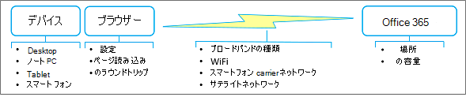

# 低速ネットワークでOffice 365を使用するためのベスト プラクティス

インターネット接続が常に高速でダウンしない場合は、いいと思いませんか? おそらく、その日が来るでしょう。 しかし、それまでの間は、手の届いたネットワークを回避し、日々の作業を完了するために実用的な操作を行うことができます。 Office 365はクラウドベースのサービスですが、コンテンツをオフラインで操作したり、変更をスムーズに同期したりするためのさまざまな方法も提供されます。 また、アプリケーションの実行速度が速く、ユーザー インターフェイスの応答性が高いからといって、コンテンツをオフラインで操作する方が効率的な場合もあります。 ポイントは次のとおりです。Office 365は両方の長所を提供します。 これを利用する方法を次に示します。

> [!TIP]
> ネットワーク接続の速度 (または速度) を確認しますか? [OOKLA 速度テスト](https://www.speedtest.net/)または[ネットワーク速度テスト アプリ](https://www.windowsphone.com/store/app/network-speed-test/9b9ae06b-2961-41ef-987d-b09567cffe70)を試します。

## ネットワークの速度が遅いのはなぜですか?

ネットワークパフォーマンス自体を制御することはできませんが、バックグラウンドで何が起こっているかを理解するのに役立ちます。 インターネットは非常に複雑ですが、状況をよりよく理解するのに役立ついくつかの概念があります。 この記事のベスト プラクティスに従うと、パフォーマンスの問題を回避し、フラストレーションを減らすことができます。

### ネットワーク のパフォーマンスに影響を与える主な要因

 **帯域幅と待機時間**: ネットワーク パフォーマンスの 2 つの最も重要な手段は、帯域幅と待機時間です。

- 帯域幅は、1 秒あたりのビット数で測定されるスループットの割合です。 大きい方が優れています。 帯域幅は水道管のようなものです。 パイプが大きいほど、"通す" 水が多くなります。

- 待機時間は、コンテンツがサーバーまたはサービスからデバイスに到達するまでにかかる時間であり、ミリ秒単位で測定されます。 高速の方が優れています。 待機時間は、低帯域幅、疎接続、転送時間など、さまざまな要因によって発生する可能性があります。

 **一般的な問題**: 帯域幅と待機時間に加えて、他の問題はネットワークパフォーマンスに影響を与え、予測できないことがよくあります。 ネットワークのパフォーマンスは、時刻または物理的な場所に基づいて変動する可能性があります。 自然災害や大規模なパブリック イベントなど、インターネットの使用が急増する特定のイベントが発生すると、ネットワークが詰まる可能性があります。 読み込まれるページのサイズと複雑さ、および転送されるファイルの数とサイズは、パフォーマンスに直接影響します。 WiFi 接続が一時的に低下する可能性があります。たとえば、すべてのユーザーに同時にツイートを要求することで、数千の大規模な会議を投票します。

 **サテライト ネットワークに関する考慮事項**: 衛星ネットワークは、バック 国、クルーズ船、リモート科学領域など、陸上ネットワークが実現できない場合に役立ちます。 これらのネットワークは、赤道から 22,000 マイル上の地理同期軌道に配置された衛星に依存しています。 ただし、伝送は実際には約 90,000 マイル移動するため、衛星ネットワークの待機時間は、地上ネットワーク (20 ~ 50 ミリ秒) よりも遅くなります (500 ミリ秒以上)。 最適な条件下では、この待機時間に気付かないかもしれませんが、大きなファイルのダウンロード、ビデオのストリーミング、ゲームのプレイでは、おそらくそうでしょう。 もう 1 つの問題は、雷雨やブリザードなどの悪天候が一時的に衛星送信を中断する可能性がある "雨のフェード" です。

## ネットワークだと確信していますか?

パフォーマンスの問題が発生するたびに、まずデバイスが問題の根本原因でないことを確認します。 次の 2 つの操作を実行すると、大きな改善が行われる可能性があります。

- デバイスが正常に動作していて、コンピューターにマルウェアがないことを確認します。

- 可能であれば、より多くのメモリを購入します。 メモリの追加は、デバイスのパフォーマンスを向上させる最も簡単で最も効果的な方法です。 これは、大きなファイルやビデオを操作する場合に特に役立ちます。

詳細については、「[Windowsパフォーマンスとメンテナンスと](https://windows.microsoft.com/windows/performance-maintenance-help#performance-maintenance-help)[ヒント」を参照して、Windows 10の PC パフォーマンスを向上させます](https://support.microsoft.com/help/4002019/windows-10-improve-pc-performance)。

## ブラウザーを使用するためのベスト プラクティス

ブラウザーはOffice 365へのゲートウェイであるため、特にページの読み込みに要する時間と、Office 365 サービスにラウンド トリップする頻度により、パフォーマンスに影響を与える可能性があります。

### ブラウザー全般

ブラウザーの一般的な推奨事項を次に示します。

- パフォーマンスに影響を与える可能性があるブラウザー アドオン、または実際には必要のないブラウザー アドオンを無効にします。

- 一時インターネット ファイルのキャッシュ サイズを大きくします。

- 職場または学校のアカウントにサインインしたら、ブラウザー ウィンドウを一日中開いたままにします。 もう一度サインインしなくても、他のタブとウィンドウを開くことができます。 別のアカウントにサインインする必要がある場合は、プライベート閲覧を使用します。

- 各ページがダウンロードされて開いたら、タブを使用して開いたままにします。 タブ間を移動し、その日の後半にページを使用するのは簡単です。 そのページに最新のデータが必要な場合にのみ、ページを更新します。

- ページを開くには時間がかかりすぎる場合は、ページのダウンロードを停止し (ESC キーを押して) ページを更新します (F5 キーを押します)。

- 可能であれば、Office 365へのラウンド トリップを減らします。 たとえば、リストやライブラリをページングするのではなく、検索を使用して大きなライブラリ内のファイルを検索し、リスト内でフィルター処理して目的の結果に直接アクセスします。 または、ページ読み込み時間を最小限に抑えるビューを作成します。 詳細については、「[Office 365での大規模なリストとライブラリの管理](https://support.office.com/article/b4038448-ec0e-49b7-b853-679d3d8fb784#BKMK_PAGES)」を参照してください。

- ビデオのパフォーマンスが低い場合は、ビデオをダウンロードしてデバイスで視聴できる場合があります。 ダウンロード リンクを使用できる場合や、ビデオ リンクを右クリックして [ **ターゲットを名前を付けて保存]** を選択することもできます。

### ブラウザー固有

特定のブラウザーの推奨事項を次に示します。

- **Internet Explorer**: 以前のバージョンよりも大幅にパフォーマンスを向上させるために、Internet Explorer バージョン 11 以降にアップグレードします。 詳細については、「 [Internet Explorer のトラブルシューティング ガイド」を参照してください](https://support.microsoft.com/help/2437121/troubleshooting-guide-for-internet-explorer-when-you-access-office-365)。
- **FireFox**: 詳しくは、 [Firefox の動作が遅い、または動作が停止する](https://support.mozilla.org/products/firefox/fix-problems/slowness-or-hanging)方法に関する記事をご覧ください。
- **Safari**: 詳細については、「 [Apple - Safari](https://www.apple.com/safari/)」を参照してください。
- **Chrome**: 詳細については、 [Chrome のヘルプ](https://support.google.com/chrome/?hl=en)を参照してください。

## OutlookとOutlook Web Appを使用するためのベスト プラクティス

メールの読み取り、書き込み、整理は、皆の一日の大きな部分です。 OutlookとOutlook Web App (OWA) の両方がオフライン サポートを提供します。 スマートフォンでメール アプリを使用する方法も便利です。 ニーズに最適な次のオプションを使用します。

- 最新バージョンのOutlookにアップグレードすると、以前のバージョンよりも大幅にパフォーマンスが向上します。

- Outlook Web Appでは、OWA が次にOffice 365に接続できるようになったときにアップロードされるオフライン メッセージ、連絡先、予定表イベントを作成できます。 オフライン モードでの OWA の設定と使用の詳細については、「オフラインでの[Outlook Web Appの使用](https://support.office.com/article/3214839c-0604-4162-8a97-6856b4c27b36)」を参照してください。

- Outlookでは、可能な限り自動的に接続するキャッシュ モードで作業できます。 メールボックス全体またはメールボックスの一部のみをダウンロードOutlook。 詳細については、「[キャッシュされたExchange モードを有効に](https://support.office.com/article/7885af08-9a60-4ec3-850a-e221c1ed0c1c)し、[Outlookでオフラインで作業する」を](https://support.office.com/article/f3a1251c-6dd5-4208-aef9-7c8c9522d633)参照してください。

- Outlookにはオフライン モードも用意されています。 これを使用するには、まず、アカウントの情報がコンピューターにコピーされるようにキャッシュ モードを設定する必要があります。 オフライン モードでは、Outlookは送受信設定を使用するか、手動でオンラインで動作するように設定したときに接続を試みます。 詳細については、「 [オフラインで作業してデータ接続料金を回避する](https://support.office.com/article/827fe51f-5609-4062-82b4-3578057f9282)」、オフラインで [作業するときに送受信設定を変更](https://support.office.com/article/f681ec10-cb14-40cb-8709-1909a13c304a)する、オフライン [からオンラインに切り替える方法に関するページを](https://support.office.com/article/2460e4a8-16c7-47fc-b204-b1549275aac9)参照してください。

- スマートフォンをお持ちであれば、それを使用して、携帯電話会社のネットワーク経由でメールと予定表をトリアージできます。

> [!NOTE]
> Outlookまたは OWA を使用するタイミングに関するいくつかのガイダンスを次に示します。 ディスク領域がデバイスの問題でない場合は、Outlook機能の完全なセットがあり、最適な場合があります。 ディスク領域がデバイスの問題である場合は、機能のサブセットを持つ OWA の使用を検討してください。また、オンラインの状況でも最適に動作します。 もちろん、どちらも一緒に動作するので、どちらも使用できます。

## OneDrive for Businessを使用するためのベスト プラクティス

OneDrive for Businessは、オンラインおよびオフラインでファイルを操作するようにゼロから設計されています。 設定すると、変更の同期は、変更を行う場所とタイミングを問わず自動的かつ確実に行われます。 ネットワークが低速の場合は、オフライン バージョンのファイルを操作できます。

OneDrive for Business同期アプリには、SharePoint Online とOffice 365ビジネス サブスクリプションが付属しているか、OneDrive for Business同期アプリを無料で[ダウンロード](https://support.microsoft.com/kb/2903984)できます。 このアプリは、**エクスプローラーで開くか****、アップロード** コマンドを使用するよりも高速です。 詳細については、「[Office 365でOneDrive for Business ファイルを同期するようにコンピューターをセットアップ](https://support.office.com/article/23e1f12b-d896-4cb1-a238-f91d19827a16)する」を参照してください。

OneDrive for Business同期アプリを使用するための追加のガイダンスを次に示します。

- 大規模なライブラリを初めて同期する場合は、夜間など、オフの時間に同期を開始します。
- [OneDrive for Business アプリ機能でライブラリの同期を停止](https://support.office.com/article/a7e41f1f-3a98-4ca7-9443-f10250688330)する機能を使用すると、更新プログラムの同期を一時的に停止できます。 ただし、この機能は、一度に数時間など、短時間使用して、大量の更新プログラムのキューを回避し、複数のユーザーが同じドキュメントで作業する場合にマージ競合のリスクを最小限に抑えます。

## OneNoteを使用するためのベスト プラクティス

すべてのSharePointチーム サイトに組み込みのOneNote ノートブックがあり、独自のノートブックを簡単に作成できます。 OneNoteは、タスクを完了するために毎日必要なタイムリーな情報を収集するのに最適な方法です。 たとえば、多くのチームでは、毎週の会議、プロジェクト ノート、アイデア、計画、状態レポートの収集ポイントとしてOneNoteを使用しています。 この異なる情報は、ページ、セクション、タブを使用して整理できます。

OneNoteの美しさは、デスクトップ、ノート PC、タブレット、スマートフォンなど、ほぼすべてのデバイスからコンテンツにアクセスできる点です。 また、OneNoteが自動的に行うため、保存や同期について心配する必要はありません。

詳細については、「[Microsoft OneNote](https://office.microsoft.com/onenote)」を参照してください。

## Skype for Businessと Lync Online を使用するためのベスト プラクティス

ネットワークが低速な場合にSkype for Businessまたは Lync Online を使用するための一般的なガイドラインを次に示します。

- 低速のネットワークで正常に動作するため、可能な場合はいつでもインスタント メッセージングを使用します。

- 仮想プライベート ネットワーク (VPN) またはリモート アクセス サービス (RAS) 接続経由で電話をかけるのは避けてください。

- オーディオ デバイスが承認されていることを確認します。 詳細については、「 [Microsoft Lync の対象となる電話とデバイス」を](/skypeforbusiness/lync-cert/ip-phones)参照してください。

- オンライン プレゼンテーションでPowerPointを使用する場合は、スライドのサイズと複雑さを減らします。 詳細については、[プレゼンテーションのパフォーマンスを向上させるヒントを参照してください](https://support.office.com/article/34c82835-5f23-4bf0-98cc-72235bbd2949)。

- ビデオのパフォーマンスは、ネットワーク パフォーマンスに大きく依存します。 ネットワークが低速の場合は、ビデオを使用しないでください。

詳細については、「[Lync Online の低音質またはビデオ品質](https://support.microsoft.com/kb/2386655)」または「[Skype for Businessでの接続の問題のトラブルシューティング](https://support.office.com/article/troubleshoot-connection-issues-in-skype-for-business-ca302828-783f-425c-bbe2-356348583771)方法」を参照してください。

## SharePoint リストを使用するためのベスト プラクティス

リスト データをオフラインで操作して、データを "スクラブ"、分析、またはレポートすることは、低速ネットワークの影響を最小限に抑える優れた方法です。 Microsoft Access 2019 と Microsoft Access 2016からほとんどのリストを読み書きするには、それらのリストにリンクします。 リストをExcel テーブルにエクスポートすることもできます。これにより、Excel テーブルとリストの間に一方向のデータ接続が作成されます。 [SharePoint リストにリンクされているテーブルをオフラインで作業する](https://support.office.com/article/work-offline-with-tables-that-are-linked-to-sharepoint-lists-5d66594a-6176-4a25-a198-320f13ccf41e)方法について説明します。

詳細については、「Office 365での大規模なリストとライブラリの管理」の「[大規模なリストの管理の](https://support.office.com/article/b4038448-ec0e-49b7-b853-679d3d8fb784)詳細」セクションを参照してください。

## Web ページをカスタマイズするためのベスト プラクティス

Web ページをカスタマイズすると、誤ってページのパフォーマンスが低下する可能性があります。 ページの複雑さとサイズ、追加される Web パーツの数、最初に表示されるリストまたはライブラリアイテムの数、ページのコーディング方法など、さまざまな要因が影響を与える可能性があります。

詳細については、「[Tune SharePoint Online パフォーマンス](tune-sharepoint-online-performance.md)」を参照してください。

## Project Onlineを使用するためのベスト プラクティス

次のガイドラインは、ネットワーク パフォーマンスの向上に役立ちます。

- Project OnlineとSharePoint Online では同期が必要です。時間がかかる場合があります。 プロジェクト チームの離職率が低い場合は、サイト同期Project無効にして、Projectの発行と詳細ページのProjectのパフォーマンスを向上させます。 Active Directory 同期を、実際にシステムを使用する必要があるリソースのグループに制限し、大規模なグループの同期後に潜在的なアクセス許可の問題を監視します。

- 組織でプロジェクト サイトを使用している場合は、自動的に作成するのではなく、オンデマンドで作成します。 これにより、最初の発行エクスペリエンスが高速化され、不要なサイトやコンテンツの作成が回避されます。

- Project詳細ページ (PDP) では、プロジェクト全体の再計算をトリガーし、ワークフロー アクションを開始できます。どちらもパフォーマンスを重視する操作になります。 同じ PDP で 2 つの更新プロセスを同時にトリガーしないようにするには、予定表フィールド (開始日、終了日、状態の日付、および現在の日付) とスケジュールされていないフィールド (プロジェクト名、説明、所有者) を更新しないでください。

- 各 PDP に表示されるWeb パーツフィールドとユーザー設定フィールドの数を減らします。 読み込みを改善し、時間を節約するために更新が必要な唯一のフィールドを使用して、専用の PDP を作成します。

- レポートに OData を使用する場合は、サーバー側のフィルター処理を使用して実行時にクエリを実行するデータの量を制限します。

詳細については、「[Project Onlineパフォーマンスのチューニング](https://support.office.com/article/12ba0ebd-c616-42e5-b9b6-cad570e8409c)」を参照してください。

## 問題を報告する最善の方法は何ですか?

Microsoft では、ネットワークの監視、帯域幅と待機時間の測定、ページ読み込み時間の短縮、ディスク I/O の削減、最小ダウンロード戦略を使用するためのページの再設計、データ センターへのハードウェアの追加、データ センターの追加など、Office 365の全体的なパフォーマンスを継続的に向上させます。 現在の状態とレポートの問題を確認する方法の詳細については、「[Office 365サービスの正常性を確認する方法](view-service-health.md)」を参照してください。

## 関連項目

[Office 365 のネットワーク計画とパフォーマンス チューニング](network-planning-and-performance.md)

[Office 365 ネットワーク接続の原則](microsoft-365-network-connectivity-principles.md)

[Office 365 エンドポイントの管理](https://support.office.com/article/99cab9d4-ef59-4207-9f2b-3728eb46bf9a)

[Office 365 エンドポイントの FAQ](https://support.office.com/article/d4088321-1c89-4b96-9c99-54c75cae2e6d)
