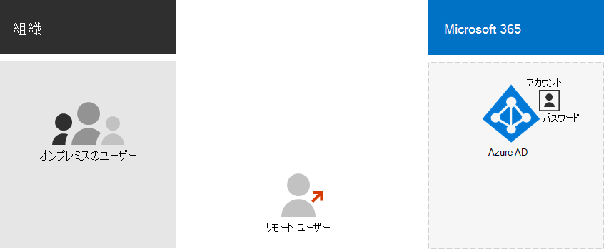

# クラウド専用 ID をMicrosoft 365する

*この記事は、Microsoft 365 Enterprise および Office 365 Enterprise の両方に適用されます。*

クラウド専用 ID モデルを選択した場合は、Microsoft 365 サブスクリプションのすべてのユーザー、グループ、連絡先を格納するためのAzure Active Directory (Azure AD) テナントが既にあります。 [手順 2](protect-your-global-administrator-accounts.md) の管理者アカウントと、このソリューションの[手順 3](microsoft-365-secure-sign-in.md) のユーザー アカウントの保護を設定したら、組織が必要とする新しいアカウントとグループの作成を開始する準備が整いました。

クラウドのみの ID の基本的なコンポーネントを次に示します。
 

組織内のユーザーとそのユーザー アカウントは、さまざまな方法で分類できます。 たとえば、一部は従業員であり、永続的な状態です。 一部のベンダー、請負業者、または一時的な状態のパートナーです。 ユーザー アカウントを持たないが、対話とコラボレーションをサポートするために、特定のサービスとリソースへのアクセス権を引き続き付与する必要がある外部ユーザーもいます。 次に例を示します。

- テナント アカウントは、組織内でクラウド サービスのライセンスを付与したユーザーを表します。

- B2B (Business to Busines) アカウントは、コラボレーションへの参加のために招待された組織外部のユーザーを表します。

組織内のユーザーの種類の在庫を取得します。 グループ化とは何ですか? たとえば、高レベルの機能または目的でユーザーを組織にグループ化できます。

また、一部のクラウド サービスを、ユーザー アカウントを持たない組織外のユーザーと共有できます。この場合、このような外部ユーザーのグループも指定する必要があります。

クラウド環境の管理を簡素化するいくつかの目的で、Azure ADでグループを使用できます。 たとえば、Azure AD グループでは、次のことができます。

- グループ ベースのライセンスを使用して、Microsoft 365のライセンスをメンバーとして追加するとすぐに自動的にユーザー アカウントに割り当てます。
- 部門名などのユーザー アカウント属性に基づいて、ユーザー アカウントを特定のグループに動的に追加します。
- Software as a Service (SaaS) アプリケーションのユーザーを自動的にプロビジョニングし、多要素認証 (MFA) およびその他の条件付きアクセス ポリシーを使用してそれらのアプリケーションへのアクセスを保護します。
- チームと SharePoint Online チーム サイトのアクセス許可とアクセス レベルをプロビジョニングします。

## クラウド専用 ID の次の手順

- [ユーザー アカウントを管理する](manage-microsoft-365-accounts.md)
- [ユーザー アカウントにライセンスを割り当てる](assign-licenses-to-user-accounts.md)
- [グループとグループ メンバーシップを管理する](manage-microsoft-365-groups.md)
- [ユーザー アカウントのパスワードを管理する](manage-microsoft-365-passwords.md)
