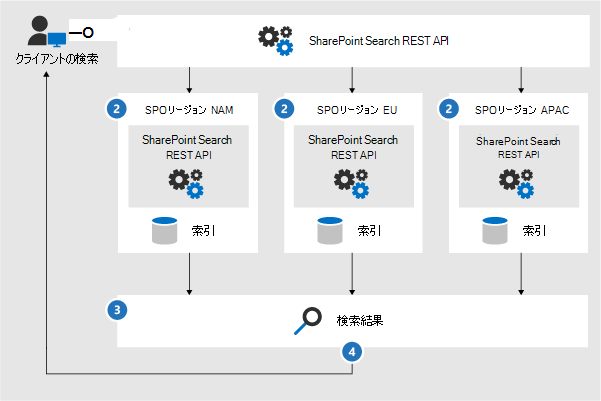
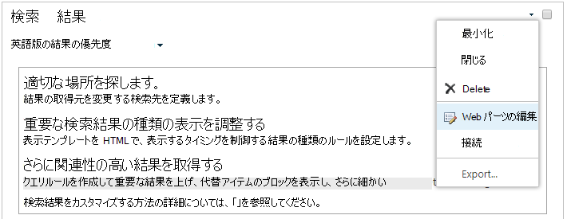

# <a name="configure-search-for-microsoft-365-multi-geo"></a>Office 365 Multi-Geo ために検索を構成する

Multi-Geo 環境では、それぞれの地域の場所にはその場所固有の検索インデックスと検索センターがあります。 ユーザーが検索すると、クエリはすべてのインデックスに対して展開され、返された結果は結合されます。

たとえば、ある地域の場所にいるユーザーが、別の地域の場所に格納されているコンテンツを検索したり、別の地域の場所に限定された SharePoint サイトのコンテンツを検索したりすることができます。 ユーザーにそのコンテンツへのアクセス権がある場合は、検索結果が表示されます。

## <a name="which-search-clients-work-in-a-multi-geo-environment"></a>Multi-Geo 環境で動作する検索クライアントについて

次のクライアントは、すべての地域の場所からの結果を返します。

- OneDrive
- Delve
- SharePoint ホーム ページ
- 検索センター
- SharePoint 検索 API を使用するカスタムの検索アプリケーション

### <a name="onedrive"></a>OneDrive

Multi-Geo 環境の設定が完了した直後に、OneDrive で検索を実行するユーザーには、すべての地域の場所からの結果が返されます。

### <a name="delve"></a>Delve

Multi-Geo 環境の設定が完了した直後に、Delve で検索するユーザーには、すべての地域の場所からの結果が返されます。

Delve フィードとプロファイル カードには、中央の場所に保存されているファイルのプレビューのみが表示されます。その一方で、サテライトの場所に保存されているファイルについては、ファイルの種類に応じたアイコンが表示されます。

### <a name="the-sharepoint-home-page"></a>SharePoint ホーム ページ

Multi-Geo 環境の設定が完了した直後に、ユーザーには、複数地域の場所からのニュース、最近のサイトおよびフォローしているサイトが示された SharePoint ホーム ページが表示されます。ユーザーが SharePoint ホーム ページの検索ボックスを使用すると、複数地域の場所からの結果がマージされて返されます。

### <a name="the-search-center"></a>検索センター

Multi-Geo 環境の設定完了後、それぞれの検索センターには、それらの地域の場所からの結果のみが引き続き表示されます。管理者は、[それぞれの検索センターの設定を変更](#_Set_up_a_1)して、すべての地域の場所からの結果が得られるようにする必要があります。その後、検索センターで検索したユーザーには、すべての地域の場所からの結果が表示されます。

### <a name="custom-search-applications"></a>カスタムの検索アプリケーション

通常のように、カスタムの検索アプリケーションは、検索インデックスとの対話型操作に既存の SharePoint 検索 REST API を使用します。すべてまたは一部の地域の場所からの結果を取得するために、アプリケーションでは、要求で [API を呼び出して新しい複数地域クエリ パラメーターを含める](#_Get_custom_search)必要があります。これにより、すべての地域の場所へのクエリのファンアウトがトリガーされます。

## <a name="whats-different-about-search-in-a-multi-geo-environment"></a>Multi-Geo 環境での検索の相違点について

Multi-Geo 環境では、従来の検索機能の一部の動作が異なります。

<table>
<thead>
<tr class="header">
<th align="left">特徴</th>
<th align="left">メカニズム</th>
<th align="left">回避策</th>
</tr>
</thead>
<tbody>
<tr class="odd">
<td align="left">昇格結果</td>
<td align="left">昇格結果を使用するクエリ ルールは、異なるレベル (テナント全体、サイト コレクション、またはサイト) ので作成できます。 Multi-Geo 環境では、すべての地域の場所の検索センターに結果を昇格する場合、テナント レベルで昇格結果を定義します。 サイト コレクションまたはサイトの地域の場所にある検索センターでのみ結果を昇格する場合は、サイト コレクションまたはサイト レベルで結果を定義します。 これらの検索結果は、他の地域の場所では昇格されません。</td>
<td align="left">地域の場所ごとに異なる昇格結果を必要としない場合は (出張の場合の異なるルールなど)、テナント レベルで昇格結果を定義することをお薦めします。</td>
</tr>
<tr class="even">
<td align="left">絞り込み検索</td>
<td align="left">検索は、テナントのすべての地域の場所からの絞り込み条件を返して、それらを集約します。この集約は、最善努力型であるため、絞り込み条件のカウントが 100% の精度にならないことがあります。ほとんどの検索型シナリオの場合は、この精度で十分です。 </td>
<td align="left">絞り込み条件の完全性に依存する検索型アプリケーションの場合は、それぞれの地域の場所を個別にクエリします。</td>
</tr>
<tr class="odd">
<td align="left"></td>
<td align="left">Multi-Geo 検索では、数値の絞り込み条件の動的バケットはサポートされません。</td>
<td align="left">数値絞 <a href="/sharepoint/dev/general-development/query-refinement-in-sharepoint">り込み条件には"Discretize"</a> パラメーターを使用します。</td>
</tr>
<tr class="even">
<td align="left">ドキュメント ID</td>
<td align="left">ドキュメント ID に依存する検索型アプリケーションを開発する場合、Multi-Geo 環境のドキュメント ID は地域の場所ごとに一意ですが、複数の地域の場所にわたって一意でない点に注意してください。</td>
<td align="left">地域の場所を示す列が追加されました。 この列を使用して、一意性を確保してください。 この列の名前は "GeoLocationSource" です。</td>
</tr>
<tr class="odd">
<td align="left">結果の数</td>
<td align="left">検索結果ページには、複数の地域の場所からの結果がまとめて表示されますが、500 件を超える結果をページにまとめることはできません。</td>
<td align="left"></td>
</tr>
<tr class="even">
<td align="left">ハイブリッド検索</td>
<td align="left"><a href="/sharepoint/hybrid/learn-about-cloud-hybrid-search-for-sharepoint">クラウド ハイブリッド検索</a>を使用するハイブリッド SharePoint 環境では、オンプレミス コンテンツが中央の場所の Office 365 インデックスに追加されます。</td>
<td align="left"></td>
</tr>
</tbody>
</table>

## <a name="whats-not-supported-for-search-in-a-multi-geo-environment"></a>Multi-Geo 環境の検索でサポートされない内容

Multi-Geo 環境では、従来の検索機能一部のがサポートされません。

<table>
<thead>
<tr class="header">
<th align="left">検索機能</th>
<th align="left">注</th>
</tr>
</thead>
<tbody>
<tr class="odd">
<td align="left">アプリ専用の認証</td>
<td align="left">Multi-Geo 検索では、アプリ専用の認証 (サービスからの特権アクセス) がサポートされません。</td>
</tr>
<tr class="even">
<td align="left">ゲスト</td>
<td align="left">ゲストは、検索する地域の場所からのみ結果を取得します。</td>
</tr>
</tbody>
</table>

## <a name="how-does-search-work-in-a-multi-geo-environment"></a>Multi-Geo 環境での検索の動作について

すべての検索クライアントは、既存の SharePoint 検索 REST API を使用して検索インデックスとやり取りします。



1. 検索クライアントは、クエリ プロパティ EnableMultiGeoSearch = true を設定して、検索 REST エンドポイントを呼び出します。
2. クエリは、テナント内のすべての地域の場所に送信されます。
3. それぞれの地域の場所からの検索結果はマージされ、ランク付けされます。
4. クライアントは、統一された検索結果を取得します。

<span id="_Set_up_a" class="anchor"><span id="_Ref501388384" class="anchor"></span></span>すべての地域の場所から結果を受け取るまでは、検索結果が結合されない点にご注意ください。 したがって、地域の場所が 1 つのみの環境での検索に比べ、複数地域検索では遅延が大きくなります。

<span id="_Set_up_a_1" class="anchor"><span id="_Ref505252370" class="anchor"></span></span>
## <a name="get-a-search-center-to-show-results-from-all-geo-locations"></a>検索センターにすべての地域の場所からの結果を表示する

それぞれの検索センターには、複数のバーティカルがあり、それぞれのバーティカルを個別に設定する必要があります。

1. ここに示す手順は、検索結果ページと検索結果 Web パーツを編集するためのアクセス許可があるアカウントで実行してください。

2. 検索結果ページに移動します (検索結果ページの[一覧](https://support.office.com/article/174d36e0-2f85-461a-ad9a-8b3f434a4213)を参照してください)

3. 設定するバーティカルを選択し、右上の **[設定]** ギア アイコンをクリックして、**[ページの編集]** をクリックします。編集モードで、検索結果ページが開きます。

   ![[ページ選択の編集] 設定](../media/configure-search-for-multi-geo-image2.png)

4. 検索結果 Web パーツで、マウス ポインターを Web パーツの右上に移動させ、矢印をクリックし、メニューから [**Web パーツの編集**] をクリックします。 ページの右上のリボンの下に検索結果 Web パーツのツール ウィンドウが開きます。

   

5. Web パーツ ツール ウィンドウの **[設定]** セクションで、**[結果コントロールの設定]** から **[複数地域の検索結果を表示する]** を選択して、検索結果 Web パーツに、すべての地域の場所からの結果が表示されるようにします。

6. **[OK]** をクリックして変更内容を保存して、Web パーツ ツール ウィンドウを閉じます。

7. 検索結果 Web パーツに対する変更内容を確認するには、メイン メニューの [ページ] タブで **[チェックイン]** をクリックします。

8. ページの上部にあるメモで示されるリンクを使用して、変更内容を公開します。

<span id="_Get_custom_search" class="anchor"><span id="_Ref501388387" class="anchor"></span></span>
## <a name="get-custom-search-applications-to-show-results-from-all-or-some-geo-locations"></a>カスタムの検索アプリケーションにすべてまたは一部の地域の場所からの結果を表示する

カスタムの検索アプリケーションは、SharePoint 検索 REST API への要求にクエリ パラメーターを指定することで、すべてまたは一部の地域の場所からの結果を取得するようになります。このクエリ パラメーターに応じて、すべてまたは一部の地域の場所にクエリがファンアウトされます。たとえば、一部の地域の場所に対して関連情報を取得するクエリを実行する必要がある場合は、対象の地域にのみファンアウトするように制御できます。この要求が成功すると、SharePoint 検索 REST API は応答データを返します。

### <a name="requirement"></a>要件

地域的位置ごとに、組織内のすべてのユーザーにルート Web サイトの **読み取り** アクセス許可レベルが付与されていることを確認する必要があります (たとえば、contoso **APAC**.sharepoint.com/ および contoso **EU**.sharepoint.com/)。[アクセス許可について](https://support.office.com/article/understanding-permission-levels-in-sharepoint-87ecbb0e-6550-491a-8826-c075e4859848)。

### <a name="query-parameters"></a>クエリ パラメーター

EnableMultiGeoSearch - Multi-Geo テナントの他の地域の場所のインデックスへクエリをファンアウトすべきかどうかを指定するブール値です。 クエリをファンアウトする場合は **true** と設定し、クエリをファンアウトしない場合は **false** と設定します。 このパラメータを含めない場合、既定値は **false** です。ただし、エンタープライズ検索センター テンプレートを使用するサイトに対して REST API 呼び出しを行う場合は、この既定値は **true** になります。 Multi-Geo ではない環境でこのパラメーターを使用する場合、パラメーターは無視されます。

ClientType - これは文字列です。 検索アプリケーションごとに一意のクライアント名を入力します。 このパラメーターを指定しない場合は、クエリは他の地域の場所へファンアウトされません。

MultiGeoSearchConfiguration - **EnableMultiGeoSearch** が **true** に設定されている場合に、Multi-Geo テナントの他の地域の場所へファンアウトに使用するリスト (省略可能) です。 このパラメーターを指定しない場合、または空白のままにする場合は、クエリはすべての地域の場所へファンアウトされます。 それぞれの地域の場所について、次の項目を JSON 形式で入力します。

<table>
<thead>
<tr class="header">
<th align="left">項目</th>
<th align="left">説明</th>
</tr>
</thead>
<tbody>
<tr class="odd">
<td align="left">DataLocation</td>
<td align="left">地域の場所 (例: NAM)。</td>
</tr>
<tr class="even">
<td align="left">EndPoint</td>
<td align="left">接続先のエンドポイント (例: https://contoso.sharepoint.com)。</td>
</tr>
<tr class="odd">
<td align="left">SourceId</td>
<td align="left">検索先の GUID (例: B81EAB55-3140-4312-B0F4-9459D1B4FFEE)。</td>
</tr>
</tbody>
</table>

DataLocation または EndPoint を省略した場合や DataLocation が重複している場合、要求は失敗します。[テナントの地域の場所のエンドポイントに関する情報は、Microsoft Graph を使用することで取得できます](/sharepoint/dev/solution-guidance/multigeo-discovery)。

### <a name="response-data"></a>応答データ

MultiGeoSearchStatus: 要求に対する応答で SharePoint 検索 API が返すプロパティです。このプロパティの値は文字列であり、SharePoint 検索 API が返す結果について次の情報が得られます。

<table>
<thead>
<tr class="header">
<th align="left">値</th>
<th align="left">説明</th>
</tr>
</thead>
<tbody>
<tr class="odd">
<td align="left">Full</td>
<td align="left"><strong>すべて</strong>の地域の場所からの完全な結果。</td>
</tr>
<tr class="even">
<td align="left">Partial</td>
<td align="left">1 つ以上の地域の場所からの部分的な結果。この結果は一時的なエラーによって不完全なものになります。</td>
</tr>
</tbody>
</table>

### <a name="query-using-the-rest-service"></a>REST サービスを使用したクエリ

GET 要求の場合は、URL でクエリ パラメーターを指定します。POST 要求の場合は、JavaScript Object Notation (JSON) 形式のクエリ パラメーターを本文で渡します。

#### <a name="request-headers"></a>要求ヘッダー

<table>
<thead>
<tr class="header">
<th align="left">名前</th>
<th align="left">値</th>
</tr>
</thead>
<tbody>
<tr class="odd">
<td align="left">Content-Type</td>
<td align="left">application/json;odata=verbose</td>
</tr>
</tbody>
</table>

#### <a name="sample-get-request-thats-fanned-out-to-all-geo-locations"></a>**すべて** の地域の場所にファンアウトされる GET 要求の例

```http
https:// \<tenant\>/\_api/search/query?querytext='sharepoint'&Properties='EnableMultiGeoSearch:true'&ClientType='my\_client\_id'
```

#### <a name="sample-get-request-to-fan-out-to-some-geo-locations"></a>**一部** の地域の場所にファンアウトする GET 要求の例

```http
https:// \<tenant\>/\_api/search/query?querytext='site'&ClientType='my_client_id'&Properties='EnableMultiGeoSearch:true, MultiGeoSearchConfiguration:[{DataLocation\\:"NAM"\\,Endpoint\\:"https\\://contosoNAM.sharepoint.com"\\,SourceId\\:"B81EAB55-3140-4312-B0F4-9459D1B4FFEE"}\\,{DataLocation\\:"CAN"\\,Endpoint\\:"https\\://contosoCAN.sharepoint-df.com"}]'
```

> [!NOTE]
> MultiGeoSearchConfiguration プロパティの地域の場所の一覧内のコンマとコロンの前に **バックスラッシュ** 記号が先行します。 これは、GET 要求では複数のプロパティの区切りにはコロンが、複数のプロパティの引数の区切りにはコンマが使用されるためです。 エスケープ文字としてバックスラッシュ記号を使わない場合、MultiGeoSearchConfiguration プロパティは正確に解釈されません。

#### <a name="sample-post-request-thats-fanned-out-to-all-geo-locations"></a>**すべて** の地域の場所にファンアウトされる POST 要求の例

```http
    {
    "request": {
            "__metadata": {
            "type": "Microsoft.Office.Server.Search.REST.SearchRequest"
        },
        "Querytext": "sharepoint",
        "Properties": {
            "results": [
                {
                    "Name": "EnableMultiGeoSearch",
                    "Value": {
                        "QueryPropertyValueTypeIndex": 3,
                        "BoolVal": true
                    }
                }
            ]
        },
        "ClientType": "my_client_id"
        }
    }
```

#### <a name="sample-post-request-thats-fanned-out-to-some-geo-locations"></a>**一部** の地域の場所にファンアウトされる POST 要求の例

```http
    {
        "request": {
            "Querytext": "SharePoint",
            "ClientType": "my_client_id",
            "Properties": {
                "results": [
                    {
                        "Name": "EnableMultiGeoSearch",
                        "Value": {
                            "QueryPropertyValueTypeIndex": 3,
                            "BoolVal": true
                        }
                    },
                    {
                        "Name": "MultiGeoSearchConfiguration",
                        "Value": {
                        "StrVal": "[{\"DataLocation\":\"NAM\",\"Endpoint\":\"https://contoso.sharepoint.com\",\"SourceId\":\"B81EAB55-3140-4312-B0F4-9459D1B4FFEE\"},{\"DataLocation\":\"CAN\",\"Endpoint\":\"https://contosoCAN.sharepoint.com\"}]",
                            "QueryPropertyValueTypeIndex": 1
                        }
                    }
                ]
            }
        }
    }
```

### <a name="query-using-csom"></a>CSOM を使用したクエリ

次に、**すべて** の地域の場所にファアウトされる CSOM クエリの例を示します。

```CSOM
var keywordQuery = new KeywordQuery(ctx);
keywordQuery.QueryText = query.SearchQueryText;
keywordQuery.ClientType = <enter a string here>;
keywordQuery.Properties["EnableMultiGeoSearch"] = true;
```
