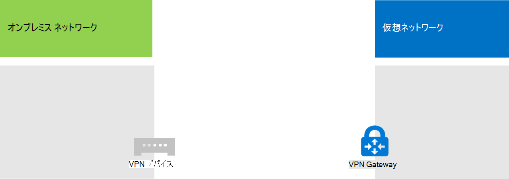

# <a name="connect-an-on-premises-network-to-a-microsoft-azure-virtual-network"></a>オンプレミス ネットワークを Microsoft Azure 仮想ネットワークに接続する

クロスプレミス Azure Virtual Network をオンプレミス ネットワークに接続することで、Azure インフラストラクチャ サービスにホストされているサブネットや仮想マシンを追加してネットワークを拡張します。この接続により、オンプレミス ネットワークにあるコンピューターと Azure の仮想マシンが相互に直接アクセスできるようになります。 

たとえば、Azure 仮想マシン上で実行されているディレクトリ同期サーバーでは、アカウントに対する変更についてオンプレミス ドメイン コントローラーにクエリを実行し、それらの変更をMicrosoft 365 サブスクリプションと同期する必要があります。 この記事では、Azure 仮想マシンをホストする準備ができているサイト間仮想プライベート ネットワーク (VPN) 接続を使用して、クロスプレミス Azure 仮想ネットワークを設定する方法について説明します。

## <a name="configure-a-cross-premises-azure-virtual-network"></a>クロスプレミス Azure 仮想ネットワークを構成する

Azure の仮想マシンをオンプレミス環境から分離する必要はありません。Azure の仮想マシンをオンプレミスのネットワークリソースに接続するには、クロスプレミス Azure 仮想ネットワークを構成する必要があります。次の図は、Azure において仮想マシンが含まれるクロスプレミスの Azure 仮想ネットワークを展開するために必要なコンポーネントを示しています。
  

 
この図では、サイト間 VPN 接続によって、2 つのネットワーク (オンプレミス ネットワークと Azure 仮想ネットワーク) が接続されています。このサイト間 VPN 接続は、次のようになります。

- アドレス指定可能なパブリック インターネットに配置された 2 つのエンドポイント間で接続されます。
- オンプレミス ネットワークの VPN デバイスと Azure 仮想ネットワークの Azure VPN ゲートウェイで終端されます。

Azure 仮想ネットワークでは、仮想マシンがホストされます。Azure 仮想ネットワーク上の仮想マシンから発信されるネットワーク トラフィックは、VPN ゲートウェイに転送されます。このゲートウェイによって、トラフィックがサイト間 VPN 接続を通じてオンプレミス ネットワーク上の VPN デバイスに転送されます。さらに、オンプレミス ネットワークのルーティング インフラストラクチャによって、トラフィックが宛先に転送されます。

>[!Note]
>[ExpressRoute](https://azure.microsoft.com/services/expressroute/) を使用することもできます。これは、組織と Microsoft ネットワークの間を直接接続するものです。ExpressRoute を経由するトラフィックは、パブリック インターネットを経由して移動しません。この記事では、ExpressRoute の使用については説明していません。
>
  
Azure Virtual Network とオンプレミス ネットワークの間の VPN 接続を設定するには、次の手順に従って操作します。 
  
1. **オンプレミス:** オンプレミスの VPN デバイスをポイントするオンプレミス ネットワーク ルートを、Azure 仮想ネットワークのアドレス空間上で定義して作成します。
    
2. **Microsoft Azure:** サイト間 VPN 接続を使用して Azure 仮想ネットワークを作成します。 
    
3. **オンプレミス:** VPN 接続を終端するようにオンプレミスのハードウェアまたはソフトウェア VPN デバイスを構成します。これには、インターネット プロトコル セキュリティ (IPsec) が使用されます。
    
サイト間 VPN 接続を確立した後、仮想ネットワークのサブネットに Azure 仮想マシンを追加します。
  
## <a name="plan-your-azure-virtual-network"></a>Azure 仮想ネットワークの計画
<a name="PlanningVirtual"></a>

### <a name="prerequisites"></a>前提条件
<a name="Prerequisites"></a>

- Azure サブスクリプション。Azure サブスクリプションの詳細については、[Azure の購入方法のページ](https://azure.microsoft.com/pricing/purchase-options/)にアクセスしてください。
    
- 仮想ネットワークとサブネットに割り当て可能なプライベート IPv4 アドレス空間。現在、および将来の拡大で必要となる仮想マシン数に対応できる十分な空き領域が必要です。
    
- IPsec の要件に対応するサイト間 VPN 接続を終端するための VPN デバイスがオンプレミス ネットワークで利用可能なこと。詳しくは、「[サイト間 VPN Gateway 接続の VPN デバイスについて](/azure/vpn-gateway/vpn-gateway-about-vpn-devices)」をご覧ください。
    
- ルーティング インフラストラクチャを変更し、Azure Virtual Network のアドレス空間にルーティングされるトラフィックが、サイト間 VPN 接続をホストする VPN デバイスに送られること。
    
- オンプレミス ネットワークと Azure Virtual Network に接続するコンピューターにインターネットへのアクセスを提供する Web プロキシ。
    
### <a name="solution-architecture-design-assumptions"></a>ソリューション アーキテクチャ設計の前提条件

次の一覧に、このソリューション アーキテクチャ用に作られた設計の方針を示します。 
  
- このソリューションでは、サイト間 VPN 接続を伴う 1 つの Azure Virtual Network を使用します。Azure Virtual Network は、任意の数の仮想マシンを接続できる単一のサブネットをホストします。 
    
- Windows Server 2016 または Windows Server 2012 でルーティングとリモート アクセス サービス (RRAS) を使用してオンプレミス ネットワークと Azure 仮想ネットワーク間の IPsec サイト間 VPN 接続を確立できます。また、Cisco または Juniper Networks などの VPN デバイスも使用できます。
    
- オンプレミス ネットワークには、引き続き Active Directory Domain Services (AD DS)、ドメイン ネーム システム (DNS)、プロキシ サーバーなどのネットワーク サービスを配置することもできます。要件によっては、そうしたネットワーク リソースの一部を Azure Virtual Network に配置する方がよい場合があります。
    
1 つ以上のサブネットを使用している既存の Azure 仮想ネットワークの場合、要件に基づいて、必要な仮想マシンをホストするための追加のサブネットのためのアドレス空間が残っているかどうかを判断します。追加のサブネット用のアドレス空間が残っていない場合には、独自のサイト間 VPN 接続を使用した仮想ネットワークを追加作成します。
  
### <a name="plan-the-routing-infrastructure-changes-for-the-azure-virtual-network"></a>Azure Virtual Network 用のルーティング インフラストラクチャの変更計画

オンプレミス ルーティング インフラストラクチャを構成し、Azure Virtual Network のアドレス空間宛てのトラフィックを、サイト間 VPN 接続をホストするオンプレミス VPN デバイスに送るようにする必要があります。
  
ルーティング インフラストラクチャを更新する詳細な方法は、ルーティング情報を管理する方法によって異なります。次の方法があります。
  
- ルーティング テーブルを手動構成で更新します。
    
- ルーティング テーブルを、ルーティング情報プロトコル (RIP) または Open Shortest Path First (OSPF) などのルーティング プロトコルに基づいて更新します。
    
ルーティングの専門家に相談し、Azure 仮想ネットワーク宛てのトラフィックがオンプレミス VPN デバイスに確実に送信されるようにしてください。
  
### <a name="plan-for-firewall-rules-for-traffic-to-and-from-the-on-premises-vpn-device"></a>オンプレミス VPN デバイスとの間のトラフィックに関するファイアウォール規則の計画

VPN デバイスが境界ネットワーク上にあり、境界ネットワークとインターネット間にファイルウォールが存在する場合、サイト間 VPN 接続を行えるようにするため、以下の規則でファイアウォールを構成しなければならないことがあります。
  
- VPN デバイスへのトラフィック (インターネットからの受信):
    
  - VPN デバイスと IP プロトコル 50 の宛先 IP アドレス
    
  - VPN デバイスと UDP 宛先ポート 500 の宛先 IP アドレス
    
  - VPN デバイスと UDP 宛先ポート 4500 の宛先 IP アドレス
    
- VPN デバイスからのトラフィック (インターネットへの発信):
    
  - VPN デバイスと IP プロトコル 50 の発信元 IP アドレス
    
  - VPN デバイスと UDP 発信元ポート 500 の発信元 IP アドレス
    
  - VPN デバイスと UDP 発信元ポート 4500 の発信元 IP アドレス
    
### <a name="plan-for-the-private-ip-address-space-of-the-azure-virtual-network"></a>Azure Virtual Network 用のプライベート IP アドレス空間の計画

Azure Virtual Network のプライベート IP アドレス空間は、仮想ネットワークをホストするために Azure が使用するアドレスに対応できるとともに、Azure 仮想マシン用の十分なアドレスが含まれるサブネットが少なくとも 1 つ含まれていなければなりません。
  
サブネットに必要なアドレス数を判別するには、現在必要な仮想マシン数、および今後の拡張で必要となる推定数を数え、次の表を使用してサブネットのサイズを決定します。
  
|**必要な仮想マシンの数**|**必要なホスト ビット数**|**サブネットのサイズ**|
|:-----|:-----|:-----|
|1-3  <br/> |3  <br/> |/29  <br/> |
|4-11  <br/> |4  <br/> |/28  <br/> |
|12-27  <br/> |5  <br/> |/27  <br/> |
|28-59  <br/> |6   <br/> |/26  <br/> |
|60-123  <br/> |7   <br/> |/25  <br/> |
   
### <a name="planning-worksheet-for-configuring-your-azure-virtual-network"></a>Azure Virtual Network を構成するための計画ワークシート
<a name="worksheet"> </a>

仮想マシンをホストする Azure 仮想ネットワークを作成する前に、次の表で必要な設定を判別する必要があります。
  
仮想ネットワークの設定を表 V に記入してください。
  
 **表 V:クロスプレミスの仮想ネットワーク構成**
  
|**アイテム**|**構成要素**|**説明**|**値**|
|:-----|:-----|:-----|:-----|
|1.  <br/> |仮想ネットワーク名  <br/> |Azure 仮想ネットワークに割り当てる名前 (DirSyncNet など)。  <br/> | |
|2.  <br/> |仮想ネットワークの場所  <br/> |仮想ネットワークが含まれる Azure データセンター (米国西部など)。  <br/> |  <br/> |
|3.  <br/> |VPN デバイスの IP アドレス  <br/> |インターネット上の VPN デバイスのインターフェイスのパブリック IPv4 アドレス。IT 部門に問い合わせてこのアドレスを特定してください。  <br/> |  <br/> |
|4.  <br/> |仮想ネットワークのアドレス スペース  <br/> |仮想ネットワークのアドレス スペース (1 つのプライベート アドレス プレフィックスで定義されます)。IT 部門に尋ねてこのアドレス スペースを特定してください。アドレス スペースは、クラスレス ドメイン間ルーティング (CIDR) 形式 (別名、ネットワーク プレフィックス形式) でなければなりません。10.24.64.0/20 などです。  <br/> | <br/> |
|5.  <br/> |IPsec 共有キー  <br/> |32 文字のランダムな英数字文字列。サイト間 VPN 接続の両側を認証するために使用されます。IT 部門またはセキュリティ部門に尋ねて、このキー値を決定してからそれを安全な場所に格納します。または、「[IPsec 事前共有キーのランダム文字列を作成する](https://social.technet.microsoft.com/wiki/contents/articles/32330.create-a-random-string-for-an-ipsec-preshared-key.aspx)」をご覧ください。<br/> | <br/> |
   
このソリューションのサブネットに関しては表 S に記入してください。
  
- 最初のサブネットについて、Azure ゲートウェイ サブネットの 28 ビットのアドレス空間 (プレフィックスの長さ /28) を決定します。このアドレス空間の計算方法については「[Azure 仮想ネットワークのゲートウェイ サブネット アドレス空間の計算](/archive/blogs/solutions_advisory_board/calculating-the-gateway-subnet-address-space-for-azure-virtual-networks)」を参照してください。
    
- 2 番目のサブネットには、フレンドリ名、仮想ネットワークのアドレス スペースに基づく 1 つの IP アドレス スペース、わかりやすい目的を指定します。
    
IT 部門に尋ねて、仮想ネットワークのアドレス スペースに基づきこれらのアドレス スペースを決定してください。どちらのアドレス スペースも CIDR 形式でなければなりません。
  
 **表 S:仮想ネットワーク内のサブネット**
  
|**アイテム**|**サブネット名**|**サブネット アドレス スペース**|**用途**|
|:-----|:-----|:-----|:-----|
|1.  <br/> |GatewaySubnet  <br/> |  <br/> |Azure ゲートウェイが使用するサブネット。  <br/> |
|2.  <br/> |  <br/> |  <br/> |  <br/> |
   
仮想ネットワーク内で仮想マシンを使用するオンプレミスの DNS サーバーに関して、表 D に記入してください。各 DNS サーバーにフレンドリ名と 1 つの IP アドレスを指定します。このフレンドリ名は、DNS サーバーのホスト名またはコンピューター名と同じでなくても構いません。空白のエントリが 2 つ表示されていますが、項目は追加できます。IT 部門に尋ねてこの一覧を特定してください。
  
 **表 D:オンプレミスの DNS サーバー**
  
|**アイテム**|**DNS サーバーのフレンドリ名**|**DNS サーバーの IP アドレス**|
|:-----|:-----|:-----|
|1.  <br/> |  <br/> |  <br/> |
|2.  <br/> |  <br/> |  <br/> |
   
Azure Virtual Network から組織のネットワークにサイト間 VPN 接続を介してパケットをルーティングするには、ローカル ネットワークを使用して仮想ネットワークを構成する必要があります。このローカル ネットワークには、仮想ネットワーク内の仮想マシンが到達する必要がある組織のオンプレミス ネットワーク上のすべての場所に関するアドレス スペース (CIDR 形式) の一覧があります。オンプレミス ネットワークまたはサブネットのすべての場所になる可能性があります。ローカル ネットワークを定義するアドレス スペースの一覧は一意である必要があり、この仮想ネットワークや他のクロスプレミスの仮想ネットワークで使用するアドレス スペースと重複させることはできません。
  
一連のローカル ネットワークのアドレス スペースに関しては表 L に記入します。3 つの空白のエントリが記載されていますが、多くの場合さらに必要となります。IT 部門に尋ねてこの表を記入してください。
  
 **表 L:ローカル ネットワークのアドレス プレフィックス**
  
|**アイテム**|**ローカル ネットワークのアドレス スペース**|
|:-----|:-----|
|1.  <br/> |  <br/> |
|2.  <br/> |  <br/> |
|3.  <br/> |  <br/> |
   
## <a name="deployment-roadmap"></a>展開のロードマップ
<a name="DeploymentRoadmap"> </a>

クロスプレミス仮想ネットワークの作成と Azure への仮想マシンの追加には 3 つのフェーズがあります。
  
- フェーズ 1: オンプレミス ネットワークの準備
    
- フェーズ 2: Azure でのクロスプレミスの仮想ネットワークの作成
    
- フェーズ 3 (省略可能)：仮想コンピューターの追加
    
### <a name="phase-1-prepare-your-on-premises-network"></a>フェーズ 1: オンプレミス ネットワークの準備
<a name="Phase1"></a>

仮想ネットワークのアドレス空間に向けたトラフィックを最終的にオンプレミスネットワークの境界にあるルーターへ送信できるよう、オンプレミスネットワークを設定する必要があります。ネットワーク管理者に問い合わせ、オンプレミス ネットワークのルーティング インフラストラクチャにルートを追加する方法を決定してください。
  
最終的な構成をここに示します。
  

  
### <a name="phase-2-create-the-cross-premises-virtual-network-in-azure"></a>フェーズ 2: Azure でのクロスプレミスの仮想ネットワークの作成
<a name="Phase2"></a>

最初に、Azure PowerShell プロンプトを開きます。Azure PowerShell をインストールしていない場合は、「[Azure PowerShell を使用する](/powershell/azure/get-started-azureps)」を参照してください。

 
次に、このコマンドを使用して Azure アカウントにログインします。
  
```powershell
Connect-AzAccount
```

次のコマンドを使用して、サブスクリプションの名前を取得します。
  
```powershell
Get-AzSubscription | Sort SubscriptionName | Select SubscriptionName
```

これらのコマンドで Azure サブスクリプションを設定します。二重引用符内のすべて (< 文字と > 文字を含む) を正しいサブスクリプション名に置き換えます。
  
```powershell
$subscrName="<subscription name>"
Select-AzSubscription -SubscriptionName $subscrName
```

次に、仮想ネットワーク用の新しいリソース グループを作成します。一意のリソース グループ名を決定するには、このコマンドを使用して既存のリソース グループを一覧表示します。
  
```powershell
Get-AzResourceGroup | Sort ResourceGroupName | Select ResourceGroupName
```

これらのコマンドを使用して、新しいリソース グループを作成します。
  
```powershell
$rgName="<resource group name>"
$locName="<Table V - Item 2 - Value column>"
New-AzResourceGroup -Name $rgName -Location $locName
```

次に、Azure Virtual Network を作成します。
  
```powershell
# Fill in the variables from previous values and from Tables V, S, and D
$rgName="<name of your new resource group>"
$locName="<Azure location of your new resource group>"
$vnetName="<Table V - Item 1 - Value column>"
$vnetAddrPrefix="<Table V - Item 4 - Value column>"
$gwSubnetPrefix="<Table S - Item 1 - Subnet address space column>"
$SubnetName="<Table S - Item 2 - Subnet name column>"
$SubnetPrefix="<Table S - Item 2 - Subnet address space column>"
$dnsServers=@( "<Table D - Item 1 - DNS server IP address column>", "<Table D - Item 2 - DNS server IP address column>" )
$locShortName=(Get-AzResourceGroup -Name $rgName).Location

# Create the Azure virtual network and a network security group that allows incoming remote desktop connections to the subnet that is hosting virtual machines
$gatewaySubnet=New-AzVirtualNetworkSubnetConfig -Name "GatewaySubnet" -AddressPrefix $gwSubnetPrefix
$vmSubnet=New-AzVirtualNetworkSubnetConfig -Name $SubnetName -AddressPrefix $SubnetPrefix
New-AzVirtualNetwork -Name $vnetName -ResourceGroupName $rgName -Location $locName -AddressPrefix $vnetAddrPrefix -Subnet $gatewaySubnet,$vmSubnet -DNSServer $dnsServers
$rule1=New-AzNetworkSecurityRuleConfig -Name "RDPTraffic" -Description "Allow RDP to all VMs on the subnet" -Access Allow -Protocol Tcp -Direction Inbound -Priority 100 -SourceAddressPrefix Internet -SourcePortRange * -DestinationAddressPrefix * -DestinationPortRange 3389
New-AzNetworkSecurityGroup -Name $SubnetName -ResourceGroupName $rgName -Location $locShortName -SecurityRules $rule1
$vnet=Get-AzVirtualNetwork -ResourceGroupName $rgName -Name $vnetName
$nsg=Get-AzNetworkSecurityGroup -Name $SubnetName -ResourceGroupName $rgName
Set-AzVirtualNetworkSubnetConfig -VirtualNetwork $vnet -Name $SubnetName -AddressPrefix $SubnetPrefix -NetworkSecurityGroup $nsg
$vnet | Set-AzVirtualNetwork
```

最終的な構成をここに示します。
  

  
次に、これらのコマンドを使用して、サイト間 VPN 接続のゲートウェイを作成します。
  
```powershell
# Fill in the variables from previous values and from Tables V and L
$vnetName="<Table V - Item 1 - Value column>"
$localGatewayIP="<Table V - Item 3 - Value column>"
$localNetworkPrefix=@( <comma-separated, double-quote enclosed list of the local network address prefixes from Table L, example: "10.1.0.0/24", "10.2.0.0/24"> )
$vnetConnectionKey="<Table V - Item 5 - Value column>"
$vnet=Get-AzVirtualNetwork -Name $vnetName -ResourceGroupName $rgName
# Attach a virtual network gateway to a public IP address and the gateway subnet
$publicGatewayVipName="PublicIPAddress"
$vnetGatewayIpConfigName="PublicIPConfig"
New-AzPublicIpAddress -Name $vnetGatewayIpConfigName -ResourceGroupName $rgName -Location $locName -AllocationMethod Dynamic
$publicGatewayVip=Get-AzPublicIpAddress -Name $vnetGatewayIpConfigName -ResourceGroupName $rgName
$vnetGatewayIpConfig=New-AzVirtualNetworkGatewayIpConfig -Name $vnetGatewayIpConfigName -PublicIpAddressId $publicGatewayVip.Id -SubnetId $vnet.Subnets[0].Id
# Create the Azure gateway
$vnetGatewayName="AzureGateway"
$vnetGateway=New-AzVirtualNetworkGateway -Name $vnetGatewayName -ResourceGroupName $rgName -Location $locName -GatewayType Vpn -VpnType RouteBased -IpConfigurations $vnetGatewayIpConfig
# Create the gateway for the local network
$localGatewayName="LocalNetGateway"
$localGateway=New-AzLocalNetworkGateway -Name $localGatewayName -ResourceGroupName $rgName -Location $locName -GatewayIpAddress $localGatewayIP -AddressPrefix $localNetworkPrefix
# Create the Azure virtual network VPN connection
$vnetConnectionName="S2SConnection"
$vnetConnection=New-AzVirtualNetworkGatewayConnection -Name $vnetConnectionName -ResourceGroupName $rgName -Location $locName -ConnectionType IPsec -SharedKey $vnetConnectionKey -VirtualNetworkGateway1 $vnetGateway -LocalNetworkGateway2 $localGateway
```

最終的な構成をここに示します。
  

  
次に、Azure VPN gatewayに接続するためのオンプレミス VPN デバイスを構成します。詳しくは、「[サイト間 VPN Gateway 接続の VPN デバイスについて](/azure/vpn-gateway/vpn-gateway-about-vpn-devices)」をご覧ください。
  
VPN デバイスを構成するために必要なものを以下に記します。
  
- 仮想ネットワーク用の Azure VPN ゲートウェイのパブリック IPv4 アドレス。 **Get-AzPublicIpAddress -Name $vnetGatewayIpConfigName -ResourceGroupName $rgName** コマンドを使用して、このアドレスを表示します。
    
- サイト間 VPN 接続の IPsec 事前共有キー (表 V - 項目 5 - [値] 列)。
    
最終的な構成をここに示します。
  

  
### <a name="phase-3-optional-add-virtual-machines"></a>フェーズ 3 (省略可能): 仮想マシンの追加

Azure で必要な仮想マシンを作成します。詳細については、「[Azure Portal で Windows 仮想マシンを作成する](https://go.microsoft.com/fwlink/p/?LinkId=393098)」を参照してください。
  
次に示す設定を使用します。
  
- **[基本]** タブで、仮想ネットワークと同じサブスクリプションおよびリソース グループを選択します。後ほど、仮想マシンにサインインするときに必要になります。**[インスタンスの詳細]** セクションで、適切な仮想マシンのサイズを選択します。管理者アカウントのユーザー名とパスワードを安全な場所に記録します。 
    
- **[ネットワーク]** タブで、(ゲートウェイ サブネットではなく) 仮想マシンをホストするための仮想ネットワークの名前とサブネットを選択します。他のすべての設定は、既定値のままにします。
    
内部 DNS をチェックして A (Address) レコードが新しい仮想マシン用に追加されたことを確認し、仮想マシンが正しく DNS を使用していることを検証します。インターネットにアクセスするためには、Azure 仮想マシンを、オンプレミス ネットワークのプロキシ サーバーを使用するように構成する必要があります。サーバーで実行する追加の構成ステップについては、ネットワーク管理者にお尋ねください。
  
最終的な構成をここに示します。
  

  
## <a name="next-step"></a>次の手順
  
[Microsoft Azureでディレクトリ同期Microsoft 365展開する](deploy-microsoft-365-directory-synchronization-dirsync-in-microsoft-azure.md)