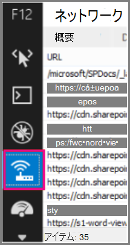

# <a name="content-delivery-networks-cdns"></a>コンテンツ配信ネットワーク (CDN)

*この記事は、Microsoft 365 Enterprise および Office 365 Enterprise の両方に適用されます。*

CDN は、エンド ユーザーにとって Office 365 の高速性と信頼性を維持するのに役立ちます。 Office 365 などのクラウド サービスは、CDN を使用して、静的アセットをブラウザーの近くにキャッシュし、ダウンロードを高速化し、エンド ユーザーの待ち時間を短縮するように要求します。 このトピックの情報は、コンテンツ配信ネットワーク (CDN) とそれらが Office 365 でどのように使用されるかについて学習するのに役立ちます。

## <a name="what-exactly-is-a-cdn"></a>CDN とは正確には何ですか?

CDN は、高速バックボーン ネットワークで接続されたデータセンター内のプロキシ サーバーとファイル サーバーで構成される地理的に分散したネットワークです。 CDN は、Web サイトまたはサービス内の指定されたファイルとオブジェクトのセットの遅延とロード時間を短縮するために使用されます。 CDN には、任意の場所からの着信リクエストを最適に処理するために、何千ものエンドポイントが含まれている場合があります。

一般的に、CDN は、Javascript ファイル、アイコン、イメージなどの Web サイトまたはサービスの汎用コンテンツのダウンロードを高速化するために使用され、SharePoint Online ドキュメント ライブラリ内のファイル、ストリーミング メディア ファイル、カスタム コードなどのユーザー コンテンツへのプライベート アクセスを提供することもできます。

ほとんどのエンタープライズ クラウド サービスで CDN が使用されています。 Office 365 などのクラウド サービスでは無数のユーザーが一度に、独自のコンテンツ (電子メールなど) と汎用コンテンツ (アイコンなど) が混在する状態でダウンロードを行います。 アイコンなどのすべてのユーザーが使用するイメージは、可能な限りユーザーのコンピューターに近いところに配置すると効率的です。 どのクラウド サービスにおいても、大都市地域ごとに、あるいは世界中の主要なインターネット ハブごとにこうした汎用コンテンツを格納する CDN データセンターを構築するというのは実際的ではありません。そこで CDN の一部は共有することになります。

## <a name="how-do-cdns-make-services-work-faster"></a>CDN はどのようにしてサービスの速度を速くするのですか?

サイトの画像やアイコンなどの共通オブジェクトを何度もダウンロードすると、本来は電子メールやドキュメントなどの重要な個人用コンテンツのダウンロードのために使用するネットワークの帯域幅を占有してしまい、妨げになる可能性があります。 Office 365 では CDN が組み込まれているアーキテクチャが使用されるため、アイコン、スクリプト、および他の汎用コンテンツはクライアント コンピューターに近いサーバーからダウンロードでき、ダウンロードの高速化を実現できます。 つまり、Office 365 データセンターに安全に格納されている個人用コンテンツに高速にアクセスできるということです。

CDN は、いくつかの方法でクラウド サービスのパフォーマンスを向上させるのに役立ちます。

- CDN は、ネットワークとファイルのダウンロードの負担の一部をクラウド サービスからシフトし、静的アセットのリクエストを処理する必要性を減らすことで、ユーザー コンテンツやその他のサービスを提供するためのクラウド サービス リソースを解放します。
- CDN は、高性能ネットワークとファイル サーバーを実装し、[HTTP/2](https://en.wikipedia.org/wiki/HTTP/2) などの更新されたネットワーク プロトコルを非常に効率的な圧縮と要求の多重化で活用することにより、低遅延のファイル アクセスを提供することを目的として構築されています。
- CDN ネットワークは、グローバルに分散された多くのエンドポイントを使用して、コンテンツをユーザーのできるだけ近くで利用できるようにします。

## <a name="the-office-365-cdn"></a>Office 365 CDN

組み込みの Office 365 コンテンツ配信ネットワーク (CDN) を使用すると、Office 365 管理者は、静的アセットを要求しているブラウザーの近くにキャッシュすることで、組織の SharePoint Online ページのパフォーマンスを向上させることができます。これにより、ダウンロードが高速化され、待ち時間が短縮されます。 Office 365 CDN では、圧縮速度とダウンロード速度の向上のために [HTTP/2 プロトコル](https://en.wikipedia.org/wiki/HTTP/2)を使用しています。

> [!NOTE]
> Office 365 CDN は、**本番** (ワールドワイド) クラウドのテナントのみが利用できます。 現在、米国政府、中国、ドイツのクラウドのテナントは Office 365 CDN をサポートしていません。

Office 365 CDN は静的資産を複数の場所 _(元の場所)_ でホストできる複数の CDN で構成されているため、静的資産をグローバルな高速ネットワークから提供することができます。 Office 365 CDN でホストするコンテンツの種類に応じて、**公開**、**非公開**、またはその両方の元の場所を追加できます。


Office 365 CDN 内で **公開されている** 元の場所のコンテンツは匿名でのアクセスが可能で、ホストされた資産への URL があれば誰でもアクセスできます。 パブリック オリジン内のコンテンツへのアクセスは匿名なので、Javascript ファイル、スクリプト、アイコン、画像などの機密性の高い汎用コンテンツをキャッシュするためにのみ使用する必要があります。 Office 365 CDN は、Office 365 クライアント アプリケーションのような一般リソースを、公開されている元の場所からダウンロードする際に既定で使用します。

Office 365 CDN 内の **非公開** の元の場所は、SharePoint Online ドキュメント ライブラリ、サイト、独自のイメージなど、ユーザー コンテンツへのプライベート アクセスを行う場合に使用します。 公開されている元のファイルのコンテンツへのアクセスは、動的に生成されたトークンで保護されているため、元のドキュメント ライブラリまたは保存場所へのアクセス許可を持つユーザーのみがアクセスできます。 Office 365 CDN で公開されている元の場所は SharePoint Online コンテンツに対してのみ使用することができ、SharePoint Online テナントからのリダイレクトによってのみ資産にアクセスすることができます。

Office 365 CDN サービスは、SharePoint Online サブスクリプションの一部として含まれます。

Office 365 CDN の使用方法の詳細については、「[SharePoint Online での Office 365 コンテンツ配信ネットワークの使用](use-microsoft-365-cdn-with-spo.md)」を参照してください。

Office 365 CDN の使用に関する概念情報と HOWTO 情報を提供する一連の短いビデオを見るには、「[SharePoint 開発者のパターンとプラクティスの YouTube チャンネル](https://aka.ms/sppnp-videos)」にアクセスしてください。

## <a name="other-microsoft-cdns"></a>その他の Microsoft CDN

Office 365 CDN の一部ではありませんが、Office 365 テナントでこれらの CDN を使用して、SharePoint 開発ライブラリ、カスタム コード、および Office 365 CDN の範囲外のその他の目的にアクセスできます。

### <a name="azure-cdn"></a>Azure CDN

>[!NOTE]
>2020 年の第 3 四半期から、SharePoint Online は Azure CDN でのビデオのキャッシュを開始し、ビデオの再生と信頼性の向上をサポートします。 人気のあるビデオは、ユーザーに最も近い CDN エンドポイントからストリーミングされます。 このデータは、Microsoft 365 コンプライアンスの境界内に残ります。 これはすべてのテナントにとって無料のサービスであり、構成するのにお客様のアクションは必要ありません。

**Azure CDN** を使用して、カスタム Web パーツ、ライブラリ、その他のリソース アセットをホストするための独自の CDN インスタンスを展開できます。これにより、アクセス キーを CDN ストレージに適用し、CDN 構成をより細かく制御できます。 Azure CDN の使用は無料ではなく、Azure サブスクリプションが必要です。

Azure CDN インスタンスを構成する方法の詳細については、「[クイックスタート: Azure ストレージ アカウントを Azure CDN と統合する](/azure/cdn/cdn-create-a-storage-account-with-cdn)」を参照してください。

Azure CDN を使用して SharePoint Web パーツをホストする方法の例については、「[SharePoint クライアント側 Web パーツを Azure CDN に展開する](/sharepoint/dev/spfx/web-parts/get-started/deploy-web-part-to-cdn)」を参照してください。

Azure CDN PowerShell モジュールの詳細については、「[PowerShell を使用した Azure CDN の管理](/azure/cdn/cdn-manage-powershell)」を参照してください。

### <a name="microsoft-ajax-cdn"></a>Microsoft Ajax CDN

Microsoft の **Ajax CDN** は読み取り専用 CDN であり、jQuery (およびその他すべてのライブラリ)、ASP.NET Ajax、Bootstrap、Knockout.js などの多くの一般的な開発ライブラリを提供します。
  
これらのスクリプトをプロジェクトに含めるには、CDN のアドレスをプロジェクト自体に含めるのではなく、一般的に利用可能なライブラリへの参照を CDN のアドレスへの参照に置き換えます。 たとえば、次のコードを使用して jQuery にリンクさせます。

``` html
<script src=https://ajax.aspnetcdn.com/ajax/jquery-2.1.1.js> </script>
```

Microsoft Ajax CDN の使用方法の詳細については、「[Microsoft Ajax CDN](/aspnet/ajax/cdn/overview)」を参照してください。

## <a name="how-does-office-365-use-content-from-a-cdn"></a>Office 365 は CDN のコンテンツをどのように使用しますか?

Office 365 テナントにどの CDN を構成できるかに関係なく、基本的なデータ取得プロセスは同じです。

1. クライアント (ブラウザーまたは Office クライアント アプリケーション) が Office 365 にデータを要求します。

2. Office 365 は、データをクライアントに直接返すか、データが CDN によってホストされているコンテンツのセットの一部である場合は、クライアントを CDN URL にリダイレクトします。

    a. データが既に _公開_ の元の場所にキャッシュされている場合、クライアントは最も近い CDN の場所からクライアントに直接データをダウンロードします。

    b. データが既に _非公開_ の元の場所にキャッシュされている場合、CDN サービスは元の場所に対する Office 365 ユーザー アカウントのアクセス許可を確認します。 アクセス許可がある場合、SharePoint Online は、CDN 内のアセットへのパスと 2 つのアクセス トークンで構成されるカスタム URL を動的に生成し、カスタム URL をクライアントに返します。 次に、クライアントは、カスタム URL を使用して、最も近い CDN の場所からクライアントに直接データをダウンロードします。

3. データが CDN にキャッシュされていない場合は、CDN ノードが Office 365 にデータを要求し、そのデータは、クライアントがデータをダウンロードした後も一定期間キャッシュされます。

CDN はユーザーのブラウザーに最も近いデータセンターを判別し、リダイレクトを使用して、そこから要求されたデータをダウンロードします。 CDN リダイレクトは高速で、ユーザーのダウンロードにかかる時間を大幅に削減します。

## <a name="how-should-i-set-up-my-network-so-that-cdns-work-best-with-office-365"></a>Office 365 で CDN が最高のパフォーマンスを発揮するにはどのようにネットワークをセットアップすればよいですか?

ネットワーク上のクライアントと CDN エンドポイント間の遅延を最小限に抑えることは、最適なパフォーマンスを確保するための重要な考慮事項です。 「[Office 365 エンドポイントの管理](managing-office-365-endpoints.md)」で概説されているベスト プラクティスを使用して、ネットワーク構成で、クライアント ブラウザーが中央プロキシを介して CDN トラフィックをルーティングするのではなく、CDN に直接アクセスできるようにして、不要な遅延の発生を回避できます。

また、「[Office 365 ネットワーク接続の原則](./microsoft-365-network-connectivity-principles.md)」を読んで、Office 365 ネットワーク パフォーマンスの最適化の背後にある概念を理解することもできます。

## <a name="is-there-a-list-of-all-the-cdns-that-office-365-uses"></a>Office 365 が使用しているすべての CDN の一覧はありますか?

Office 365 で使用されている CDN は常に変更される可能性があり、多くの場合、1 つが利用できない場合に備えて複数の CDN パートナーが構成されています。 Office 365 で使用される主な CDN は次のとおりです。

|CDN  |会社名  |使用法  |リンク  |
|---------|---------|---------|---------|
|Office 365 CDN     |Microsoft Azure         |公開の元の場所の汎用アセット、非公開の元の場所の SharePoint ユーザー コンテンツ         |[Microsoft Azure CDN](https://azure.microsoft.com/documentation/services/cdn/)         |
|Azure CDN     |Microsoft         |カスタム コード、SharePoint Framework ソリューション         |[Microsoft Azure CDN](https://azure.microsoft.com/documentation/services/cdn/)         |
|Microsoft Ajax CDN (読み取り専用)     |Microsoft         |Ajax、jQuery、ASP.NET、Bootstrap、Knockout.js などの一般的なライブラリ。         |[Microsoft Ajax CDN](/aspnet/ajax/cdn/overview)         |

## <a name="what-performance-gains-does-a-cdn-provide"></a>CDN はどのようなパフォーマンスの向上をもたらしますか?

Office 365 から直接ダウンロードされたデータと特定の CDN からダウンロードされたデータの間のパフォーマンスの特定の違いの測定には、テナントと最も近い CDN エンドポイントとの相対的な位置、ページ上のアセットの数など、多くの要因が関係します。CDN によって提供され、ネットワークの遅延と帯域幅が一時的に変化します。 ただし、単純な A/B テストは、特定のファイルのダウンロード時間の違いを示すのに役立ちます。

次のスクリーンショットは、Office 365 のネイティブ ファイルの場所と Microsoft Ajax サーバーでホストされている同じファイルのダウンロード速度の違いを[Content Delivery Network。](/aspnet/ajax/cdn/overview) これらのスクリーンショットは、11 の開発者 **ツールの** [ネットワーク] Internet Explorerから取得します。 次のスクリーンショットは、一般的なライブラリ jQuery の待機時間を示しています。 この画面を表示するには、Internet Explorer で **F12** キーを押してから、Wi-Fi アイコンの記号で表された **[ネットワーク]** タブを選択します。
  

  
次のスクリーンショットは、オンライン サイト自体のマスター ページ ギャラリーにアップロードSharePoint示しています。 ライブラリをアップロードするまでにかかった時間は、1.51 秒です。
  

  
2 番目のスクリーンショットは、Microsoft のユーザーが配信した同じファイルをCDN。 待ち時間は、約 496 ミリ秒です。 これは大きな向上であり、オブジェクトをダウンロードする合計時間が 1 秒短縮されたことを示しています。
  


## <a name="is-my-data-safe"></a>データは安全ですか?

お客様のビジネス上のデータを保護するために十分な注意を払っています。 Office 365 CDN に保存されているデータは、転送中と保存中の両方で暗号化され、Office 365 SharePoint CDN 内のデータへのアクセスは、Office 365 のユーザー アクセス許可とトークン認証によって保護されます。 Office 365 SharePoint CDN 内のデータの要求は、Office 365 テナントから参照 (リダイレクト) する必要があります。そうしないと、認証トークンが生成されません。

データの安全性を確保するために、ユーザー コンテンツやその他の機密データをパブリック CDN に保存しないことをお勧めします。 パブリック CDN のデータへのアクセスは匿名であるため、パブリック CDN は、Web スクリプト ファイル、アイコン、画像、その他の機密性の低いアセットなどの一般的なコンテンツをホストするためにのみ使用する必要があります。

> [!NOTE]
> サード パーティの CDN プロバイダーは、Office 365 トラスト センターによって概説されているコミットメントとは異なるプライバシーとコンプライアンスの基準を持っている場合があります。 CDN サービスを介してキャッシュされたデータは、Microsoft データ処理条件 (DPT) に準拠していない可能性があり、Office 365 トラスト センターのコンプライアンス境界外にある可能性があります。

Office 365 CDN プロバイダーのプライバシーとデータ保護の詳細については、次にアクセスしてください。  

- [Microsoft トラスト センター](https://www.microsoft.com/trustcenter)で Office 365 のプライバシーとデータ保護の詳細をご覧ください
- [Akamai プライバシー トラスト センター](https://www.akamai.com/us/en/about/compliance/data-protection-at-akamai.jsp)で Akamai のプライバシーとデータ保護の詳細をご覧ください
- [Azure トラスト センター](https://azure.microsoft.com/overview/trusted-cloud/)で Azure のプライバシーとデータ保護の詳細をご覧ください

## <a name="how-can-i-secure-my-network-with-all-these-3rd-party-services"></a>これらのすべてのサード パーティ サービスを使用して、自分のネットワークのセキュリティを保護することはできるでしょうか?

広範なパートナー サービスのセットを活用することで、Office 365 を拡張して可用性要件を満たすだけでなく、Office 365 を使用する際のユーザー エクスペリエンスを向上させることができます。 Office 365 が利用するサード パーティ サービスには、証明書失効リスト (crl.microsoft.com や sa.symcb.com など) と CDN (r3.res.outlook.com など) の両方が含まれます。 Office 365 によって生成されるすべての CDN FQDN は、Office 365 のカスタム FQDN です。 Office 365 の要求で FQDN に送信された場合、CDN プロバイダーがその場所の FQDN と基になるコンテンツを制御していることを確認できます。
  
Microsoft または Office 365 データセンター向けの要求をサード パーティ向けの要求と分離することを希望するユーザーのために、「[Office 365 エンドポイントを管理する](https://support.office.com/article/99cab9d4-ef59-4207-9f2b-3728eb46bf9a)」のガイダンスを作成しました。

## <a name="is-there-a-list-of-all-the-fqdns-that-leverage-cdns"></a>CDN を利用するすべての FQDN の一覧はありますか?

FQDN のリストと、それらが CDN をどのように活用するかは時間の経過とともに変化します。 CDN を活用する最新の FQDN の最新情報を入手するには、公開されている [Office 365 の URL と IP アドレスの範囲](./urls-and-ip-address-ranges.md)のページを参照してください。

[Office 365 IP アドレスと URL の Web サービス](microsoft-365-ip-web-service.md)を使用して、CSV または JSON としてフォーマットされた現在の Office 365 URL と IP アドレス範囲を要求することもできます。

## <a name="can-i-use-my-own-cdn-and-cache-content-on-my-local-network"></a>自分の CDN を使ってローカル ネットワークでコンテンツをキャッシュできますか?

Microsoft では、お客様のニーズに応えられる新しい方法を絶えず探しています。現在、キャッシング プロキシ ソリューションやその他のオンプレミス CDN ソリューションについて、その可能性を検討中です。

Office 365 CDN の一部ではありませんが、**Azure CDN** を使用して、カスタム Web パーツ、ライブラリ、その他のリソース アセットをホストすることもできます。これにより、アクセス キーを CDN ストレージに適用し、CDN 構成をより細かく制御できます。 Azure CDN の使用は無料ではなく、Azure サブスクリプションが必要です。 Azure CDN インスタンスを構成する方法の詳細については、「[クイックスタート: Azure ストレージ アカウントを Azure CDN と統合する](/azure/cdn/cdn-create-a-storage-account-with-cdn)」を参照してください。

## <a name="im-using-azure-expressroute-for-office-365-does-that-change-things"></a>Azure ExpressRoute for Office 365 を使っていますが、何か違いがありますか?

[Azure ExpressRoute for Office 365](azure-expressroute.md) は、パブリック インターネットから分離された Office 365 インフラストラクチャへの専用接続を提供します。 つまり、クライアントは、ExpressRoute でサポートされるサービスのリストに明示的に含まれていない CDN やその他の Microsoft インフラストラクチャに接続するために、ExpressRoute 以外の接続を介して接続する必要があります。 CDN 向けの要求など、特定のトラフィックをルーティングする方法の詳細については、「[Office 365 ネットワーク トラフィック管理](routing-with-expressroute.md)」を参照してください。

## <a name="can-i-use-cdns-with-sharepoint-server-on-premises"></a>オンプレミスの SharePoint Server で CDN を使用できますか?

CDN の使用は、SharePoint Online のコンテキストでのみ意味があり、SharePoint Server では避ける必要があります。 これは、サーバーがオンプレミスにある場合、または地理的に近い場合、地理的な場所に関するすべての利点が当てはまらないためです。 さらに、ホストされているサーバーへのネットワーク接続がある場合、サイトはインターネットに接続せずに使用することがあるため、CDN ファイルを取得できません。 それ以外の場合、使用可能な CDN があり、サイトに必要なライブラリまたはファイルで一定である場合は、CDN の使用をお勧めします。
  
ここに戻る場合は、次のショート リンクをご利用ください: [https://aka.ms/o365cdns]()
  
## <a name="see-also"></a>関連項目

[Office 365 ネットワーク接続の原則](./microsoft-365-network-connectivity-principles.md)

[Office 365 のネットワーク接続の評価](assessing-network-connectivity.md)

[Office 365 エンドポイントの管理](managing-office-365-endpoints.md)

[Office 365 の URL および IP アドレスの範囲](./urls-and-ip-address-ranges.md)

[SharePoint Online での Office 365 コンテンツ配信ネットワークの使用](use-microsoft-365-cdn-with-spo.md)

[Microsoft トラスト センター](https://www.microsoft.com/trustcenter)

[Office 365 のパフォーマンスをチューニングする](tune-microsoft-365-performance.md)
