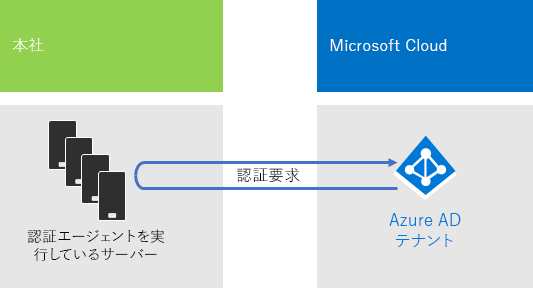

# Contoso 社の IDIdentity for the Contoso Corporation

**概要:** Contoso 社で、IDaaS (Identity as a Service) を活用して、従業員向けのクラウド ベース認証や、パートナーと顧客向けのフェデレーション認証を提供している方法を説明します。**Summary:** How Contoso takes advantage of Identity as a Service (IDaaS) and provides cloud-based authentication for its employees and federated authentication for its partners and customers.

Microsoft は、Azure Active Directory (AD) により、クラウド製品全体に IDaaS (Identity as a Service) を提供します。Microsoft 365 Enterprise を採用するため、Contoso 社の IDaaS ソリューションでは、オンプレミスの ID プロバイダーを活用しつつ、信頼できる既存のサードパーティ ID プロバイダーを使用したフェデレーション認証も含める必要がありました。Microsoft provides an Identity as a Service (IDaaS) across its cloud offerings with Azure Active Directory (AD). To adopt Microsoft 365 Enterprise, Contoso's IDaaS solution had to leverage their on-premises identity provider and still include federated authentication with their existing trusted, third-party identity providers.

## Contoso 社の Windows Server AD フォレストContoso's Windows Server AD forest

Contoso 社では contoso.com に対して、7 つのサブドメイン (世界の地域ごとに 1 つのサブドメイン) を持つ単一の Windows Server Active Directory (AD) フォレストを使用します。本社、地域ハブ オフィス、およびサテライト オフィスには、ローカルの認証と承認のためのドメイン コントローラーが含まれています。Contoso uses a single Windows Server Active Directory (AD) forest for contoso.com with seven sub-domains, one for each region of the world. The headquarters, regional hub offices, and satellite offices contain domain controllers for local authentication and authorization.

図 1 では、地域ハブを含む世界各地の地域ドメインを持つ Contoso 社のフォレストを示しています。Figure 1 shows the Contoso forest with regional domains for the different parts of the world that contain regional hubs.

 
**図 1: Contoso 社の世界的なフォレストとドメイン****Figure 1: Contoso's forest and domains worldwide**

Contoso 社では、クラウドベースのアプリおよびワークロードの認証と承認のために、contoso.com フォレストのアカウントとグループを使用することを望んでいます。Contoso wants to use the accounts and groups in the contoso.com forest for authentication and authorization for its cloud-based apps and workloads.

## Contoso 社のフェデレーション認証インフラストラクチャContoso's federated authentication infrastructure

Contoso 社では次のことが可能です。Contoso allows:

- 顧客は Microsoft、Facebook、または Google のメール アカウントを使用してパブリック Web サイトにサインインできます。Customers to use their Microsoft, Facebook, or Google Mail accounts to sign in to their public web site.
- ベンダーおよびパートナーは、LinkedIn、Salesforce、または Google のメール アカウントを使用してパートナー エクストラネットにサインインできます。Vendors and partners to use their LinkedIn, Salesforce, or Google Mail accounts to sign in to the partner extranet.

図 2 は、公開 Web サイト、パートナーのエクストラネット、および Active Directory フェデレーション サービス (AD FS) サーバーのセットを含む Contoso 社の DMZ を示しています。DMZ は、顧客、パートナー、およびインターネット サービスを含むインターネットに接続されています。Figure 2 shows the Contoso DMZ containing a public web site, a partner extranet, and a set of Active Directory Federation Services (AD FS) servers. The DMZ is connected to the Internet that contains customers, partners, and Internet services.

**図 2: Contoso 社の顧客とパートナーのフェデレーション認証のサポート****Figure 2: Contoso's support for federated authentication for customers and partners**
 
DMZ の AD FS サーバーは、パブリック Web サイトにアクセスするための顧客資格情報、およびパートナー エクストラネットにアクセスするためのパートナー資格情報を認証します。AD FS servers in the DMZ authenticate customer credentials for access to the public web site and partner credentials for access to the partner extranet.

Contoso 社は、このインフラストラクチャを維持し、顧客とパートナーの認証専用で使用することに決定しました。Contoso 社の ID エンジニアは、このインフラストラクチャから Azure AD [B2B](https://docs.microsoft.com/azure/active-directory/b2b/hybrid-organizations) および [B2C](https://docs.microsoft.com/azure/active-directory-b2c/solution-articles) ソリューションへの変換を調査中です。Contoso decided to keep this infrastructure and dedicate it to customer and partner authentications. Contoso identity engineers are investigating the conversion of this infrastructure to Azure AD [B2B](https://docs.microsoft.com/azure/active-directory/b2b/hybrid-organizations) and [B2C](https://docs.microsoft.com/azure/active-directory-b2c/solution-articles) solutions.

## クラウドベース認証にパススルー認証を使用したハイブリッド IDHybrid identity with pass-through authentication for cloud-based authentication

Contoso 社は、Microsoft 365 のクラウド リソースへの認証にオンプレミスの Windows Server AD フォレストを活用したいと考えており、パスワード ハッシュ同期 (PHS) によるパススルー認証 (PTA) を採用することに決定しました。Contoso wanted to leverage its on-premises Windows Server AD forest for authentication to Microsoft 365 cloud resources. It decided on pass-through authentication (PTA) with password hash synchronization (PHS).

### PTA 認証PTA authentication

ユーザー資格情報の認証については、Contoso 社は PTA を使用しています。Contoso 社のユーザーがクラウドベースのリソースにアクセスすると、送信された資格情報は Azure AD によって Contoso 社の本社データ センターでの認証エージェントを実行するサーバーに渡されます。これらの認証エージェント サーバーの 1 つが、Azure AD に代わってユーザー資格情報を検証します。For authentication of user credentials, Contoso is using PTA. When a Contoso user accesses a cloud-based resources, the credentials it sends are passed by Azure AD to a server running an Authentication Agent in the Contoso headquarters datacenter. One of these Authentication Agent servers validates the user credentials on behalf of Azure AD.

図 3 は、Contoso 社の本社で認証エージェントを実行するサーバー群を図示したもので、Azure AD から渡される認証要求をこれらが処理します。Figure 3 shows a set of servers in the Contoso headquarters running the Authentication Agent, which process authentication requests passed to it from Azure AD. 

 
**図 3: Contoso 社のパススルー認証インフラストラクチャ****Figure 3: Contoso's pass-through authentication infrastructure**

Contoso 社では、認証のためのすべての試行が、ユーザー アカウント状態、パスワード ポリシー、サインイン時間に関して、オンプレミスの Windows Server AD フォレストに加えられた直近の変更に照らして評価されることがセキュリティ要件となっており、これを満たす目的で PTA を選択しました。Contoso chose PTA to fulfill its security requirement that all authentication attempts be evaluated for immediate changes to user account states, password policies, and sign-in hours made to the on-premises Windows Server AD forest.

### PHSPHS

PHS は、ユーザー アカウントとグループ アカウント、およびハッシュされたバージョンのユーザー アカウント パスワードをコピーして、オンプレミスの Windows Server AD フォレストを Microsoft 365 Enterprise サブスクリプションの Azure AD テナントと同期します。Contoso 社は、PTA が使用できない場合に Azure AD テナントを使った認証の代替手段を直接提供できるように、PHS を採用することに決定しました。PHS synchronizes the on-premises Windows Server AD forest with the Azure AD tenant of their Microsoft 365 Enterprise subscription, copying user and group accounts and a hashed version of user account passwords. Contoso decided on PHS to provide an alternate method of authentication directly with the Azure AD tenant in the event that PTA is not available.

ディレクトリ同期を継続的に実行するため、Contoso 社は、パリにある自社のデータ センターのサーバー上に Azure AD Connect ツールを展開しました。図 4 は、変更に関して Contoso 社の Windows Server AD フォレストをポーリングし、それらの変更を Azure AD テナントと同期する、Azure AD Connect を実行中のサーバーを図示したものです。To perform the ongoing directory synchronization, Contoso has deployed the Azure AD Connect tool on a server in its Paris datacenter. Figure 4 shows the server running Azure AD Connect polling the Contoso Windows Server AD forest for changes and then synchronizing those changes with the Azure AD tenant.

 
**図 4: Contoso 社の PHH ディレクトリ同期インフラストラクチャ****Figure 4: Contoso's PHS directory synchronization infrastructure**

## ID 用の条件付きアクセスポリシーConditional access policies for identity

Contoso 社では、ある認証要求に関連して Azure AD がサインイン リスクがあると判断した場合に、多要素認証とパスワード変更が確実に適用されるようにするために、一連の Azure AD [条件付きアクセス ポリシー](identity-access-policies.md)を作成しています。Contoso created a set of Azure AD [conditional access policies](identity-access-policies.md) to ensure that multi-factor authentication and password changes are enforced when Azure AD determines there is sign-in risk for an authentication request.

図 5 は、ID 用の条件付きアクセスポリシーの結果セットを図示したものです。Figure 5 shows their resulting set of conditional access policies for identity.

 
**図 5: Contoso 社の ID ベース条件付きアクセスポリシー****Figure 5: Contoso’s identity-based conditional access policies**

## 次の手順Next step

Contoso 社が System Center Configuration Manager インフラストラクチャを利用して、現在の Windows 10 Enterprise を組織全体に展開し、維持する方法について[説明](contoso-win10.md)します。[Learn](contoso-win10.md) how Contoso is leveraging its System Center Configuration Manager infrastructure to deploy and keep current Windows 10 Enterprise across its organization.

## 関連項目See also

[Microsoft 365 Enterprise の IDIdentity for Microsoft 365 Enterprise](identity-infrastructure.md)

[展開ガイドDeployment guide](deploy-microsoft-365-enterprise.md)

[テスト ラボ ガイドTest lab guides](m365-enterprise-test-lab-guides.md)
