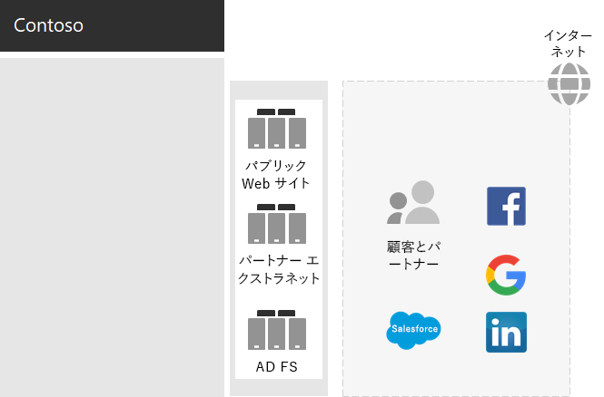
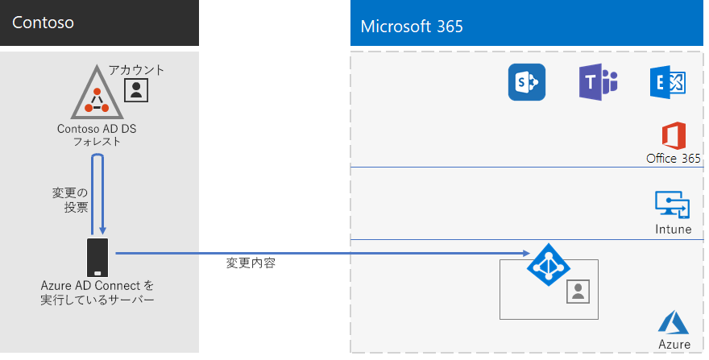

# Contoso 社の ID

Microsoft は、クラウド サービス全体で Id as a Service (IDaaS) を提供Azure Active Directory (Azure AD)。 エンタープライズ向Microsoft 365を採用するには、Contoso IDaaS ソリューションでオンプレミス ID プロバイダーを使用し、既存の信頼できるサード パーティ ID プロバイダーとのフェデレーション認証を含める必要がありました。

## Contoso Active Directory ドメイン サービス フォレスト

Contoso は、7 つのサブドメインを持つ contosocom\. の単一の Active Directory ドメイン サービス (AD DS) フォレストを使用します。1 つは世界の各地域に 1 つです。 本社、地域ハブ オフィス、サテライト オフィスには、ローカルの認証と承認のためのドメイン コントローラーが含まれています。

地域ハブを含む世界の各地域の地域ドメインを持つ Contoso フォレストを次に示します。

:::image type="content" alt-text="Contoso 社のフォレストと世界中のドメイン。" source="../media/contoso-identity/contoso-identity-fig1.png" lightbox="../media/contoso-identity/contoso-identity-fig1.png":::
 
Contoso 社は、\.contosocom フォレスト内のアカウントとグループを、そのワークロードとサービスの認証と承認Microsoft 365使用することを決定しました。

## Contoso フェデレーション認証インフラストラクチャ

Contoso 社では次のことが可能です。

- お客様は、Microsoft、Facebook、または Google メール アカウントを使用して、会社のパブリック Web サイトにサインインします。
- ベンダーとパートナーは、LinkedIn、Salesforce、または Google メール アカウントを使用して、会社のパートナーエクストラネットにサインインします。

パブリック Web サイト、パートナー エクストラネット、および Active Directory フェデレーション サービス (FS) サーバーのセットを含む Contoso DMZ をADします。 DMZ は、顧客、パートナー、およびインターネット サービスを含むインターネットに接続されています。

 
AD FS サーバーを使用すると、パブリック Web サイトにアクセスするための ID プロバイダーによる顧客資格情報の認証と、パートナーエクストラネットへのアクセスのためのパートナー資格情報の認証が容易になります。

Contoso 社は、このインフラストラクチャを維持し、顧客とパートナー認証に使用することを決定しました。 Contoso 社の ID アーキテクトは、このインフラストラクチャから Azure AD [B2B](/azure/active-directory/b2b/hybrid-organizations) および [B2C](/azure/active-directory-b2c/solution-articles) ソリューションへの変換を調査しています。

## クラウドベース認証のためのパスワードハッシュ同期によるハイブリッドID

Contoso 社は、オンプレミスの DS フォレストを使用ADクラウド リソースの認証にMicrosoft 365しました。 パスワード ハッシュ同期 (PHS) の使用を決定しました。

PHS は、オンプレミスの AD DS フォレストを、エンタープライズ サブスクリプション用の Microsoft 365 の Azure AD テナントと同期し、ユーザー アカウントとグループ アカウント、およびハッシュ化されたバージョンのユーザー アカウント パスワードをコピーします。

ディレクトリ同期を行うには、Contoso 社はパリのデータセンター Azure AD Connectにこのツールを展開しました。

Contoso Azure AD Connect DS フォレストをポーリングして、ADテナントとそれらの変更を同期するサーバーをAzure ADします。

 
## ゼロ信頼 ID とデバイス アクセスの条件付きアクセス ポリシー

Contosoは、3 つの保護レベルに対して Azure AD と Intune の[条件付きアクセス ポリシー](../security/office-365-security/identity-access-policies.md)セットを作成しました。

- *開始点の保護* は、すべてのユーザー アカウントに適用されます。
- *Enterprise* の保護は、上級リーダーシップおよびエグゼクティブ スタッフに適用されます。
- *高度に規制された* データにアクセスできる財務部門、法務部門、研究部門の特定のユーザーには、特殊なセキュリティ保護が適用されます。

Contoso ID ポリシーとデバイス条件付きアクセス ポリシーのセットを次に示します。

:::image type="content" alt-text="Contoso の ID とデバイスの条件付きアクセス ポリシー。" source="../media/contoso-identity/contoso-identity-fig5.png" lightbox="../media/contoso-identity/contoso-identity-fig5.png":::
 
## 次のステップ

Contoso 社が組織全体にMicrosoft Endpoint Configuration Managerインフラストラクチャを使用して現在の[Windows 10 Enterprise維持する](contoso-win10.md)方法について説明します。

## 関連項目

[ユーザーの ID を展開Microsoft 365](deploy-identity-solution-overview.md)

[Microsoft 365 for enterprise の概要](microsoft-365-overview.md)

[テスト ラボ ガイド](m365-enterprise-test-lab-guides.md)