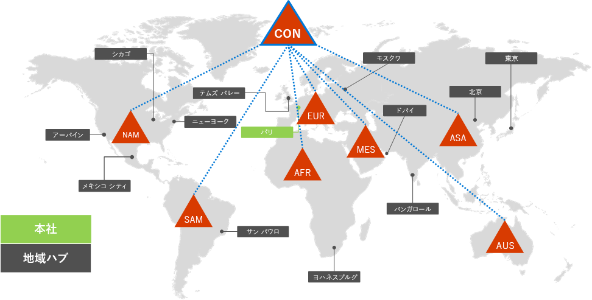
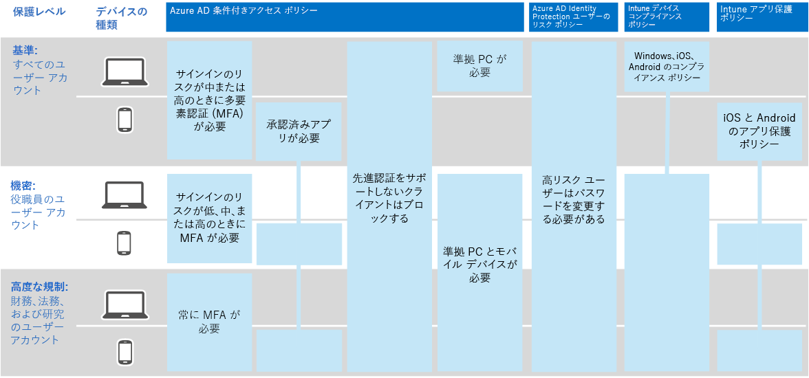

# Contoso 社の IDIdentity for the Contoso Corporation

Microsoft は、Azure Active Directory (Azure Active Directory) を通じてクラウド サービス全体で Identity as a Service (IDaaS) をAD。Microsoft provides Identity as a Service (IDaaS) across its cloud offerings through Azure Active Directory (Azure AD). Microsoft 365 for enterprise を採用するには、Contoso IDaaS ソリューションでオンプレミス ID プロバイダーを使用し、既存の信頼できるサード パーティ ID プロバイダーとのフェデレーション認証を含める必要がありました。To adopt Microsoft 365 for enterprise, the Contoso IDaaS solution had to use their on-premises identity provider and include federated authentication with their existing trusted, third-party identity providers.

## Contoso Active Directory ドメイン サービス フォレストThe Contoso Active Directory Domain Services forest

Contoso は、7 つのサブドメインを持つ contoso com の単一の Active Directory ドメイン サービス (DS) フォレスト (AD DS) を使用します。1 つは世界の各地域に \. 1 つです。Contoso uses a single Active Directory Domain Services (AD DS) forest for contoso\.com with seven subdomains, one for each region of the world. 本社、地域ハブ オフィス、サテライト オフィスには、ローカルの認証と承認のためのドメイン コントローラーが含まれています。The headquarters, regional hub offices, and satellite offices contain domain controllers for local authentication and authorization.

地域ハブを含む世界の各地域の地域ドメインを持つ Contoso フォレストを次に示します。Here's the Contoso forest with regional domains for the different parts of the world that contain regional hubs.

 
Contoso 社は、Microsoft 365 ワークロードとサービスの認証と承認に contoso com フォレスト内のアカウントとグループ \. を使用することを決定しました。Contoso decided to use the accounts and groups in the contoso\.com forest for authentication and authorization for its Microsoft 365 workloads and services.

## Contoso フェデレーション認証インフラストラクチャThe Contoso federated authentication infrastructure

Contoso 社では次のことが可能です。Contoso allows:

- お客様は、Microsoft、Facebook、または Google メール アカウントを使用して、会社のパブリック Web サイトにサインインします。Customers to use their Microsoft, Facebook, or Google Mail accounts to sign in to the company's public web site.
- ベンダーとパートナーは、LinkedIn、Salesforce、または Google メール アカウントを使用して、会社のパートナーエクストラネットにサインインします。Vendors and partners to use their LinkedIn, Salesforce, or Google Mail accounts to sign in to the company's partner extranet.

パブリック Web サイト、パートナー エクストラネット、および Active Directory フェデレーション サービス (FS) サーバーのセットを含む Contoso DMZ をADします。Here's the Contoso DMZ containing a public web site, a partner extranet, and a set of Active Directory Federation Services (AD FS) servers. DMZ は、顧客、パートナー、およびインターネット サービスを含むインターネットに接続されています。The DMZ is connected to the internet that contains customers, partners, and internet services.

 
AD FS サーバーを使用すると、パブリック Web サイトにアクセスするための ID プロバイダーによる顧客資格情報の認証と、パートナーエクストラネットへのアクセスのためのパートナー資格情報の認証が容易になります。AD FS servers in the DMZ facilitate authentication of customer credentials by their identity providers for access to the public web site and partner credentials for access to the partner extranet.

Contoso 社は、このインフラストラクチャを維持し、顧客とパートナー認証に使用することを決定しました。Contoso decided to keep this infrastructure and dedicate it to customer and partner authentication. Contoso 社の ID アーキテクトは、このインフラストラクチャから Azure AD [B2B](/azure/active-directory/b2b/hybrid-organizations) および [B2C](/azure/active-directory-b2c/solution-articles) ソリューションへの変換を調査しています。Contoso identity architects are investigating the conversion of this infrastructure to Azure AD [B2B](/azure/active-directory/b2b/hybrid-organizations) and [B2C](/azure/active-directory-b2c/solution-articles) solutions.

## クラウドベース認証のためのパスワードハッシュ同期によるハイブリッドIDHybrid identity with password hash synchronization for cloud-based authentication

Contoso 社は、Microsoft 365 クラウド リソースADにオンプレミスの DS フォレストを使用したいと考えた。Contoso wanted to use its on-premises AD DS forest for authentication to Microsoft 365 cloud resources. パスワード ハッシュ同期 (PHS) の使用を決定しました。It decided to use password hash synchronization (PHS).

PHS は、エンタープライズ サブスクリプションの Microsoft 365 の Azure AD テナントとオンプレミスの AD DS フォレストを同期し、ユーザー アカウントとグループ アカウント、およびハッシュ化されたバージョンのユーザー アカウント パスワードをコピーします。PHS synchronizes the on-premises AD DS forest with the Azure AD tenant of their Microsoft 365 for enterprise subscription, copying user and group accounts and a hashed version of user account passwords.

ディレクトリ同期を行うには、Contoso 社は Azure AD Connect ツールをパリ データセンター内のサーバーに展開しました。To do directory synchronization, Contoso deployed the Azure AD Connect tool on a server in its Paris datacenter.

Azure AD Connect を実行しているサーバーは、Contoso AD DS フォレストをポーリングして変更を Azure AD テナントと同期します。Here's the server running Azure AD Connect polling the Contoso AD DS forest for changes and then synchronizing those changes with the Azure AD tenant.

 
## ID およびデバイス アクセスの条件付きアクセス ポリシーConditional Access policies for identity and device access

Contosoは、3 つの保護レベルに対して Azure AD と Intune の[条件付きアクセス ポリシー](../security/office-365-security/identity-access-policies.md)セットを作成しました。Contoso created a set of Azure AD and Intune [Conditional Access policies](../security/office-365-security/identity-access-policies.md) for three protection levels:

- *ベースライン* 保護は、すべてのユーザー アカウントに適用されます。*Baseline* protections apply to all user accounts.
- *機密性の* 高い保護は、上級リーダーシップとエグゼクティブ スタッフに適用されます。*Sensitive* protections apply to senior leadership and executive staff.
- *規制の厳* しい保護は、規制の厳しいデータにアクセスできる財務部門、法務部門、研究部門の特定のユーザーに適用されます。*Highly Regulated* protections apply to specific users in the finance, legal, and research departments who have access to highly regulated data.

Contoso ID ポリシーとデバイス条件付きアクセス ポリシーのセットを次に示します。Here's the resulting set of Contoso identity and device Conditional Access policies.

 
## 次の手順Next step

Contoso 社が Microsoft Endpoint Configuration Manager インフラストラクチャを使用して、組織全体に [現在の Windows 10 Enterprise](contoso-win10.md) を展開して維持する方法について説明します。Learn how Contoso uses its Microsoft Endpoint Configuration Manager infrastructure to [deploy and keep current Windows 10 Enterprise](contoso-win10.md) across its organization.

## 関連項目See also

[Microsoft 365 の ID ロードマップIdentity roadmap for Microsoft 365](identity-roadmap-microsoft-365.md)

[Microsoft 365 for enterprise の概要Microsoft 365 for enterprise overview](microsoft-365-overview.md)

[テスト ラボ ガイドTest lab guides](m365-enterprise-test-lab-guides.md)