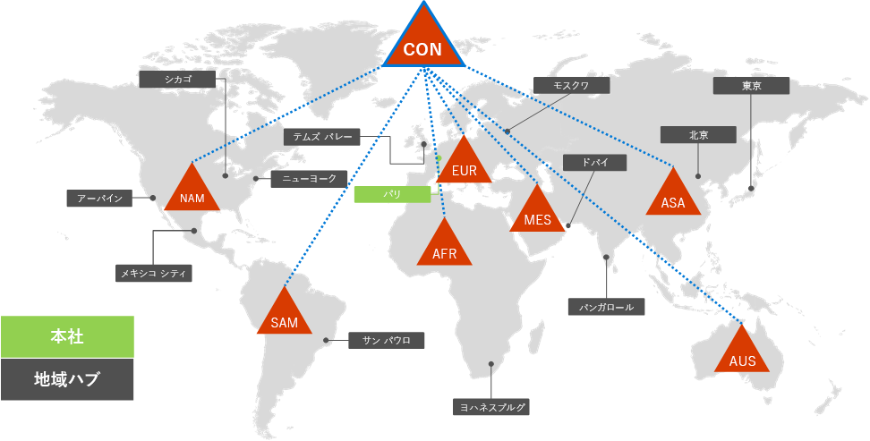
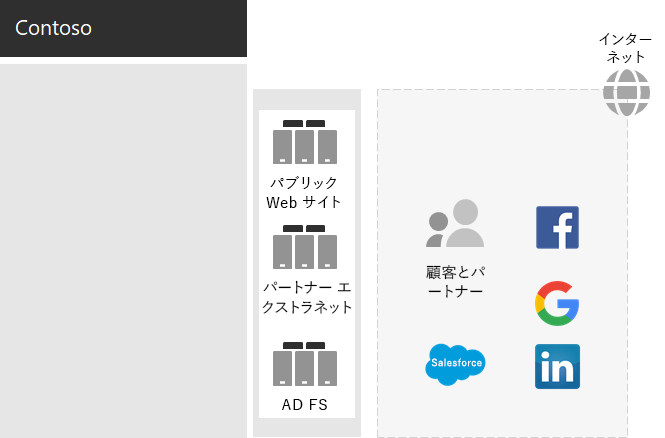
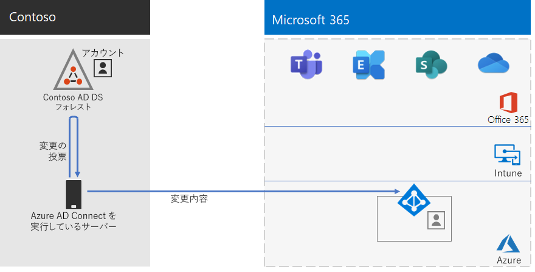
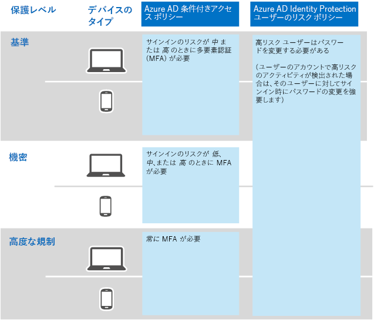

# Contoso 社の IDIdentity for the Contoso Corporation

Microsoftは、Azure Active Directory（Azure AD）を使用して、自社のクラウド製品にIDaaS (Identity as a Service)を提供します。Microsoft provides an Identity as a Service (IDaaS) across its cloud offerings with Azure Active Directory (Azure AD). Microsoft 365 EnterpriseEnterprise導入のため、ContosoのIDaaSソリューションは、自社運用のIDプロバイダーを利用しながら、既存の信頼できるサードパーティのIDプロバイダーと連携した認証方法を一体化させる必要がありました。To adopt Microsoft 365 Enterprise, Contoso's IDaaS solution had to leverage their on-premises identity provider and still include federated authentication with their existing trusted, third-party identity providers.

## ContosoのActive Directoryドメイン　サービス フォレストContoso's Active Directory Domain Services forest

Contosoは、contoso.comに1つのActive Directoryドメインサービス（AD DS）フォレストを使用し、7つのサブドメイン（世界中の各地域に1つ）を使用します。Contoso uses a single Active Directory Domain Services (AD DS) forest for contoso.com with seven sub-domains, one for each region of the world. 本社、地域ハブ オフィス、サテライト オフィスには、ローカルの認証と承認のためのドメイン コントローラーが含まれています。The headquarters, regional hub offices, and satellite offices contain domain controllers for local authentication and authorization.

これは、地域ハブを含む世界のさまざまな地域の地域ドメインを持つ Contoso フォレストです。Here is the Contoso forest with regional domains for the different parts of the world that contain regional hubs.

 
Contosoは、contoso.comフォレストのアカウントとグループをMicrosoft 365の作業とサービスの認証・承認に使用したいと考えていました。Contoso wanted to use the accounts and groups in the contoso.com forest for authentication and authorization for its Microsoft 365 workloads and services.

## Contoso 社のフェデレーション認証インフラストラクチャContoso's federated authentication infrastructure

Contoso 社では次のことが可能です。Contoso allows:

- 顧客は Microsoft、Facebook、または Google のメール アカウントを使用してパブリック Web サイトにサインインできます。Customers to use their Microsoft, Facebook, or Google Mail accounts to sign in to their public web site.
- ベンダーおよびパートナーは、LinkedIn、Salesforce、または Google のメール アカウントを使用してパートナー エクストラネットにサインインできます。Vendors and partners to use their LinkedIn, Salesforce, or Google Mail accounts to sign in to the partner extranet.

これは、公開 Web サイト、パートナーのエクストラネット、および Active Directory フェデレーション サービス (AD FS) サーバーのセットを含む Contoso 社の DMZ です。DMZ は、顧客、パートナー、およびインターネット サービスを含むインターネットに接続されています。Here is the Contoso DMZ containing a public web site, a partner extranet, and a set of Active Directory Federation Services (AD FS) servers. The DMZ is connected to the Internet that contains customers, partners, and Internet services.

 
DMZ の AD FS サーバーは、ID のプロバイダーが提供しパブリック Web サイトにアクセスするための顧客資格情報、およびパートナー エクストラネットにアクセスするためのパートナー資格情報の認証を容易にします。AD FS servers in the DMZ facilitate the authentication of customer credentials by their identity providers for access to the public web site and partner credentials for access to the partner extranet.

Contoso 社は、このインフラストラクチャを維持し、顧客とパートナーの認証専用で使用することに決定しました。Contoso 社の ID 設計者は、このインフラストラクチャから Azure AD [B2B](https://docs.microsoft.com/azure/active-directory/b2b/hybrid-organizations) および [B2C](https://docs.microsoft.com/azure/active-directory-b2c/solution-articles) ソリューションへの変換を調査中です。Contoso decided to keep this infrastructure and dedicate it to customer and partner authentications. Contoso identity architects are investigating the conversion of this infrastructure to Azure AD [B2B](https://docs.microsoft.com/azure/active-directory/b2b/hybrid-organizations) and [B2C](https://docs.microsoft.com/azure/active-directory-b2c/solution-articles) solutions.

## クラウドベース認証のためのパスワードハッシュ同期によるハイブリッドIDHybrid identity with password hash synchronization for cloud-based authentication

Contosoは、自社運用のAD DSフォレストをMicrosoft 365クラウドリソースへの認証に活用したいと考えていました。Contoso wanted to leverage its on-premises AD DS forest for authentication to Microsoft 365 cloud resources. ここから、パスワードハッシュ同期（PHS）が誕生しました。It decided on password hash synchronization (PHS).

PHSは、自社運用のAD DSフォレストをMicrosoft 365 Enterpriseの登録のあるAzure ADテナントと同期し、ユーザーアカウントとグループアカウント、およびハッシュ化されたバージョンのユーザーアカウントパスワードをコピーします。PHS synchronizes the on-premises AD DS forest with the Azure AD tenant of their Microsoft 365 Enterprise subscription, copying user and group accounts and a hashed version of user account passwords. 

継続的なディレクトリ同期を実行するために、ContosoはAzure AD 連携ツールをパリのデータセンター内のサーバーに展開しました。To perform the ongoing directory synchronization, Contoso has deployed the Azure AD Connect tool on a server in its Paris datacenter. 

これは、変更のために Contoso AD DS フォレストをポーリングし、それらの変更を Azure AD テナントと同期する Azure AD Connect を実行しているサーバーです。Here is the server running Azure AD Connect polling the Contoso AD DS forest for changes and then synchronizing those changes with the Azure AD tenant.

 
## ID およびデバイス アクセスの条件付きアクセス ポリシーConditional Access policies for identity and device access

Contosoは、3 つの保護レベルに対して Azure AD と Intune の[条件付きアクセス ポリシー](identity-access-policies.md)セットを作成しました。Contoso created a set of Azure AD and Intune [Conditional Access policies](identity-access-policies.md) for three protection levels:

- **ベースライン**保護はすべてのユーザーアカウントに適用されます。**Baseline** protections apply to all user accounts
- **選定**保護が上級幹部および幹部職員に適用されます。**Sensitive** protections apply to senior leadership and executive staff
- **高規制**保護は、高度に規制されたデータにアクセスできる財務、法務、および研究部門の特定のユーザーに適用されます。**Highly Regulated** protections apply to specific users in the finance, legal, and research departments that have access to highly regulated data

これが、Contoso 社が結果として得られる ID およびデバイスの条件付きアクセス ポリシーのセットです。Here is Contoso's resulting set of identity and device Conditional Access policies.

 
## 次の手順Next step

Contoso 社が Configuration Manager インフラストラクチャを利用して、現在の Windows 10 Enterprise を組織全体に展開し、維持する方法について[説明](contoso-win10.md)します。[Learn](contoso-win10.md) how Contoso is leveraging its System Center Configuration Manager infrastructure to deploy and keep current Windows 10 Enterprise across its organization.

## 関連項目See also

[Microsoft 365 Enterprise の IDIdentity for Microsoft 365 Enterprise](identity-infrastructure.md)

[展開ガイドDeployment guide](deploy-microsoft-365-enterprise.md)

[テスト ラボ ガイドTest lab guides](m365-enterprise-test-lab-guides.md)
